# Section 1: Core Java — Exhaustive Interview Deep Dive

> **Target Audience:** 3–5 year Java Full Stack Developers interviewing at Amazon, Walmart, Adobe, Oracle, Goldman Sachs, and top product companies.
>
> **Format:** Each topic follows a 20-point exhaustive structure covering definitions, JVM internals, code, interview traps, production scenarios, and senior-level perspectives.

---

## Table of Contents

1. [JVM Architecture](#1-jvm-architecture)
2. [JDK vs JRE vs JVM](#2-jdk-vs-jre-vs-jvm)
3. [Memory Management — Heap, Stack, Metaspace](#3-memory-management--heap-stack-metaspace)
4. [Garbage Collection & GC Algorithms](#4-garbage-collection--gc-algorithms)
5. [Java Collections Framework & Interfaces](#5-java-collections-framework--interfaces)
6. [HashMap Deep Dive](#6-hashmap-deep-dive)
7. [HashSet Internals](#7-hashset-internals)
8. [Concurrency & Multithreading](#8-concurrency--multithreading)
9. [volatile Keyword Deep Dive](#9-volatile-keyword-deep-dive)
10. [synchronized Keyword Deep Dive](#10-synchronized-keyword-deep-dive)
11. [Locks — ReentrantLock, ReadWriteLock, StampedLock](#11-locks--reentrantlock-readwritelock-stampedlock)
12. [Classes and Interfaces](#12-classes-and-interfaces)
13. [Access Modifiers](#13-access-modifiers)
14. [Java 8 Features](#14-java-8-features)
15. [Streams Coding Deep Dive](#15-streams-coding-deep-dive)
16. [Java 11, 17, and 21 Features](#16-java-11-17-and-21-features)
17. [Design Principles — SOLID, DRY, KISS, YAGNI](#17-design-principles--solid-dry-kiss-yagni)

---

## 1. JVM Architecture

### 1.1 Core Definition

The **Java Virtual Machine (JVM)** is an abstract computing machine that provides a runtime environment to execute Java bytecode. It is a specification (JSR) with multiple implementations (HotSpot, OpenJ9, GraalVM, Azul Zing). The JVM is responsible for loading classes, verifying bytecode, executing instructions, managing memory, and garbage collection. It is the engine behind Java's **"Write Once, Run Anywhere" (WORA)** promise.

> **Key Distinction:** The JVM does NOT compile Java source code. `javac` compiles `.java` → `.class` (bytecode). The JVM **executes** bytecode.

---

### 1.2 Mental Model / Real World Analogy

Think of the JVM as a **universal translator at the United Nations**:

- **Your Java code** = the speaker's script (written in a universal language — bytecode)
- **The JVM** = the translator who converts the universal script into the native language of each country (OS/hardware)
- **Each country** = a different operating system (Windows, Linux, macOS)
- **The translator is different for each country** (JVM is platform-specific), but the **script never changes** (bytecode is platform-independent)

Another analogy: The JVM is like a **music player**. The `.class` file is an MP3. Different players (JVM implementations) run on different devices (OS), but the MP3 format is universal.

---

### 1.3 Internal Working (JVM Level)

#### JVM Architecture — Component Breakdown


**Reference Diagram:** [Oracle JVM Architecture](https://docs.oracle.com/javase/specs/jvms/se21/html/jvms-2.html)

The JVM consists of three major subsystems:

**1. Class Loader Subsystem**

| Phase | Description |
|-------|-------------|
| **Loading** | Reads `.class` file bytes from disk/network, creates `java.lang.Class` object in Metaspace |
| **Linking — Verification** | Validates bytecode format (magic number `0xCAFEBABE`), structural constraints, type checking |
| **Linking — Preparation** | Allocates memory for static variables, assigns **default values** (0, null, false) — NOT initial values |
| **Linking — Resolution** | Replaces symbolic references (class names as strings) with direct memory references |
| **Initialization** | Executes `<clinit>` — static blocks and static variable initializers, in textual order |

> **Tricky Detail:** Preparation sets `static int x` to `0`. Initialization sets it to whatever value you assigned. These are two distinct phases.

**2. Runtime Data Areas**

| Area | Scope | Stores | Error |
|------|-------|--------|-------|
| **Heap** | Shared (all threads) | Object instances, arrays | `OutOfMemoryError: Java heap space` |
| **Method Area / Metaspace** | Shared (all threads) | Class metadata, method bytecode, constant pool | `OutOfMemoryError: Metaspace` |
| **Java Stack** | Per thread | Stack frames (local vars, operand stack, frame data) | `StackOverflowError` |
| **PC Register** | Per thread | Address of current instruction being executed | — |
| **Native Method Stack** | Per thread | Native method (JNI) call frames | `StackOverflowError` |

**3. Execution Engine**

- **Interpreter:** Reads bytecode instruction-by-instruction and executes. Fast startup, slow throughput.
- **JIT Compiler:** Identifies "hot" methods (invocation count > threshold ~10,000), compiles them to native machine code, caches in Code Cache.
  - **C1 (Client Compiler):** Quick compilation, limited optimization. Good for short-lived apps.
  - **C2 (Server Compiler):** Aggressive optimization (inlining, escape analysis, loop unrolling). Slower compilation, faster execution.
  - **Tiered Compilation (default since Java 8):** Starts with C1, promotes hot methods to C2.
- **Garbage Collector:** Automatic memory reclamation (covered in Section 4).

**4. JNI (Java Native Interface):** Bridge to native code (C/C++ libraries via `.so`/`.dll`).

---

### 1.4 Architecture Diagram (Mermaid)

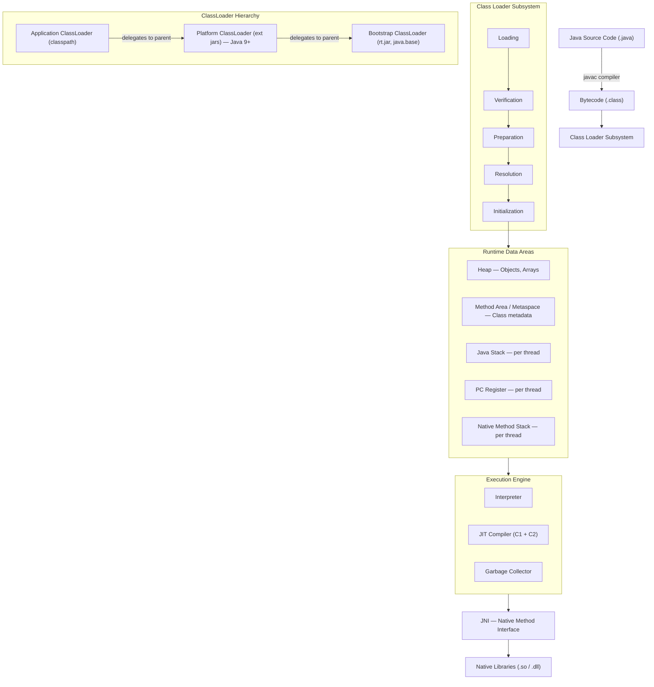
```mermaid
flowchart TD
    A["Java Source Code (.java)"] -->|javac compiler| B["Bytecode (.class)"]
    B --> C[Class Loader Subsystem]

    subgraph CLS[Class Loader Subsystem]
        C1[Loading] --> C2[Verification]
        C2 --> C3[Preparation]
        C3 --> C4[Resolution]
        C4 --> C5[Initialization]
    end

    subgraph LOADERS[ClassLoader Hierarchy]
        L1["Bootstrap ClassLoader (rt.jar, java.base)"]
        L2["Platform ClassLoader (ext jars) — Java 9+"]
        L3["Application ClassLoader (classpath)"]
        L3 -->|delegates to parent| L2
        L2 -->|delegates to parent| L1
    end

    C5 --> RDA

    subgraph RDA[Runtime Data Areas]
        H[Heap — Objects, Arrays]
        MA["Method Area / Metaspace — Class metadata"]
        JS["Java Stack — per thread"]
        PC["PC Register — per thread"]
        NMS["Native Method Stack — per thread"]
    end

    RDA --> EE

    subgraph EE[Execution Engine]
        INT[Interpreter]
        JIT["JIT Compiler (C1 + C2)"]
        GC[Garbage Collector]
    end

    EE --> JNI[JNI — Native Method Interface]
    JNI --> NL["Native Libraries (.so / .dll)"]
```

#### Class Loader Delegation Model (Parent-First)

```
Bootstrap ClassLoader (java.base module — Object, String, System)
    ↑ delegates to parent first
Platform ClassLoader (java.sql, java.xml — was Extension ClassLoader pre-Java 9)
    ↑ delegates to parent first
Application ClassLoader (your classpath — your code, third-party JARs)
    ↑ your code
```

> **Interview Point:** Custom ClassLoaders break the delegation model intentionally — this is how **Tomcat isolates webapps** (child-first loading), **OSGi** achieves modularity, and **Spring Boot DevTools** enables hot-reloading.

---

### 1.5 Code Examples

```java
// 1. Viewing which ClassLoader loaded a class
public class ClassLoaderDemo {
    public static void main(String[] args) {
        // Bootstrap ClassLoader (returns null — implemented in native code)
        System.out.println("String ClassLoader: " + String.class.getClassLoader()); // null

        // Application ClassLoader
        System.out.println("This class loaded by: " + ClassLoaderDemo.class.getClassLoader());
        // sun.misc.Launcher$AppClassLoader@...

        // Parent of Application ClassLoader
        System.out.println("Parent: " + ClassLoaderDemo.class.getClassLoader().getParent());
        // sun.misc.Launcher$ExtClassLoader@... (or PlatformClassLoader in Java 9+)
    }
}

// 2. Custom ClassLoader example
public class HotReloadClassLoader extends ClassLoader {
    private final String classPath;

    public HotReloadClassLoader(String classPath) {
        super(null); // bypass parent delegation — child-first!
        this.classPath = classPath;
    }

    @Override
    protected Class<?> findClass(String name) throws ClassNotFoundException {
        byte[] bytes = loadClassBytes(name);
        return defineClass(name, bytes, 0, bytes.length);
    }

    private byte[] loadClassBytes(String name) {
        String fileName = classPath + "/" + name.replace('.', '/') + ".class";
        try (InputStream is = new FileInputStream(fileName)) {
            return is.readAllBytes();
        } catch (IOException e) {
            throw new RuntimeException(e);
        }
    }
}

// 3. Checking JIT compilation
// Run with: java -XX:+PrintCompilation ClassLoaderDemo
// Output shows which methods get JIT compiled and at what tier (C1/C2)
```

---

### 1.6 Java 8, 11, 17, 21 Relevance

| Version | JVM Change |
|---------|-----------|
| **Java 8** | Metaspace replaces PermGen. Tiered compilation (C1+C2) enabled by default. Lambda metafactory uses `invokedynamic`. |
| **Java 9** | Module system (JPMS) — `java.base`, `java.sql` etc. Extension ClassLoader renamed to Platform ClassLoader. `jlink` for custom runtime images. |
| **Java 11** | Epsilon GC (no-op GC for testing). ZGC introduced (experimental). `java` can run single-file source programs directly. Flight Recorder open-sourced. |
| **Java 17** | Strongly encapsulated JDK internals (`--illegal-access=deny` default). Sealed classes affect class loading. Deprecation of Security Manager. |
| **Java 21** | Virtual Threads (Project Loom) — fundamentally changes thread-stack model. Generational ZGC. Key Encapsulation API. |

---

### 1.7 Frequently Asked Interview Questions

1. What is the JVM and what role does it play in Java's platform independence?
2. Explain the three phases of class loading (Loading, Linking, Initialization).
3. What are the three default ClassLoaders in Java? What is their hierarchy?
4. What is the difference between the Interpreter and JIT Compiler?
5. What is bytecode? How is it different from native machine code?
6. What is the Method Area and what does it store?
7. What is the PC Register used for?
8. What happens internally when you run `java MyApp`?

---

### 1.8 Tricky Interview Questions with Answers

**Q1: Can a class be loaded by two different ClassLoaders? What happens?**

**A:** Yes. When two ClassLoaders load the same `.class` file, the JVM treats them as **two different classes**. You cannot cast an object of one to the other — you'll get `ClassCastException`. This is the basis of **ClassLoader isolation** in application servers.

```java
// Two different ClassLoaders load com.example.User
ClassLoader cl1 = new URLClassLoader(urls);
ClassLoader cl2 = new URLClassLoader(urls);
Class<?> class1 = cl1.loadClass("com.example.User");
Class<?> class2 = cl2.loadClass("com.example.User");
System.out.println(class1 == class2); // false!
System.out.println(class1.equals(class2)); // false!
// class1.cast(class2Instance) → ClassCastException
```

**Q2: What is the difference between `ClassNotFoundException` and `NoClassDefFoundError`?**

| | ClassNotFoundException | NoClassDefFoundError |
|---|---|---|
| **Type** | Checked Exception | Error (unchecked) |
| **When** | Runtime — class not found on classpath | Class existed at compile time, missing at runtime |
| **Cause** | Wrong classpath, missing JAR | Failed static initializer, missing transitive dependency |
| **Triggered By** | `Class.forName()`, `ClassLoader.loadClass()` | JVM internally during linking |
| **Fix** | Check classpath, add missing JAR | Check static blocks, transitive deps |

**Q3: What is deoptimization in JIT?**

**A:** JIT compiles code based on assumptions (e.g., "this method is never overridden"). If the assumption is later violated (e.g., a new class is loaded that overrides the method), the JIT must **deoptimize** — discard the compiled native code and fall back to interpreted execution. This causes a temporary performance dip.

**Q4: What is escape analysis?**

**A:** JIT optimization where the compiler determines if an object's reference "escapes" the method scope. If it doesn't escape:
- **Stack allocation:** Object allocated on stack instead of heap (no GC needed)
- **Scalar replacement:** Object broken into individual fields on stack
- **Lock elision:** Synchronization removed if object never escapes to other threads

```java
public int computeSum() {
    Point p = new Point(3, 4); // does NOT escape this method
    return p.x + p.y;
    // JIT may replace this with: return 3 + 4; (scalar replacement)
    // No heap allocation, no GC overhead
}
```

---

### 1.9 Common Misconceptions

| Misconception | Reality |
|---------------|---------|
| "JVM compiles Java code" | `javac` compiles Java → bytecode. JVM **executes** bytecode (via interpreter/JIT). |
| "JVM is platform-independent" | JVM is platform-**specific**. Bytecode is platform-independent. Each OS needs its own JVM. |
| "JIT always makes code faster" | JIT has warmup cost. Short-lived apps may be slower with JIT than interpreted. GraalVM AOT fixes this. |
| "Bootstrap ClassLoader is a Java class" | It's implemented in **native code** (C/C++). `String.class.getClassLoader()` returns `null`. |
| "Class loading = initialization" | Loading, Linking, and Initialization are separate phases. A class can be loaded but not yet initialized. |
| "All static variables are initialized during Preparation" | Preparation sets **default values** (0, null). Actual values are assigned during **Initialization**. |

---

### 1.10 Edge Cases

1. **Circular class dependencies:** Class A's static initializer references Class B, and B's references A → `ClassCircularityError` or deadlock in `<clinit>`.

2. **Static initializer exception:** If a `static {}` block throws an exception, the class is marked as **unusable**. Any future attempt to use it throws `NoClassDefFoundError` (not the original exception).

```java
class Broken {
    static {
        if (true) throw new RuntimeException("init failed");
    }
}
// First access: ExceptionInInitializerError (wrapping RuntimeException)
// Second access: NoClassDefFoundError (class permanently broken)
```

3. **ClassLoader deadlock:** Two threads loading classes from different ClassLoaders that depend on each other can deadlock. Fixed in JDK 7 with parallel-capable ClassLoaders.

4. **`Class.forName()` vs `ClassLoader.loadClass()`:** `forName()` initializes the class (runs static blocks). `loadClass()` only loads — does NOT initialize.

---

### 1.11 Performance Considerations

| Aspect | Impact | Optimization |
|--------|--------|-------------|
| JIT warmup | First ~10,000 invocations are interpreted (slow) | Use AOT (GraalVM native image), AppCDS, CRaC |
| Class loading | I/O-bound, especially with large classpaths | AppCDS (Class Data Sharing), modular JARs |
| Tiered compilation | C1 compiles fast but code is suboptimal; C2 compiles slow but highly optimized | Use `-XX:+TieredCompilation` (default). Tune `-XX:Tier4CompileThreshold` |
| Code Cache full | JIT stops compiling → falls back to interpreter | `-XX:ReservedCodeCacheSize=256m` (default 240MB in Java 11+) |
| Deoptimization | JIT-compiled code invalidated, performance drops temporarily | Avoid patterns that cause polymorphic dispatch after warmup |

**Startup time optimization checklist:**
1. Profile with `-XX:+PrintCompilation` and `-Xlog:class+load`
2. Use **AppCDS** (Application Class Data Sharing) — `java -Xshare:dump`
3. Consider **GraalVM native image** for microservices (sub-100ms startup)
4. Use **CRaC** (Coordinated Restore at Checkpoint) for instant startup from snapshot
5. Minimize classpath scanning (avoid `@ComponentScan` over huge packages)

---

### 1.12 Memory Implications

| Component | Memory Region | Typical Size | Tuning Flag |
|-----------|--------------|-------------|-------------|
| Loaded classes metadata | Metaspace (native) | 50–200MB | `-XX:MaxMetaspaceSize=256m` |
| JIT compiled code | Code Cache (native) | 48–240MB | `-XX:ReservedCodeCacheSize=256m` |
| Thread stacks | Native memory | 1MB per thread × N threads | `-Xss512k` (reduce for many threads) |
| Internal JVM structures | Native memory | Variable | — |
| Direct ByteBuffers | Native memory | Variable | `-XX:MaxDirectMemorySize=512m` |

> **Production Gotcha:** With 500 threads × 1MB stack = 500MB just for stacks. This is **off-heap** — not counted in `-Xmx`. Total process memory = Heap + Metaspace + Code Cache + Thread Stacks + Direct Memory + Native.

---

### 1.13 Thread Safety Considerations

- **Class loading is thread-safe** by default — `ClassLoader.loadClass()` is synchronized (uses a per-class lock since JDK 7).
- **Static initialization** is guaranteed to run exactly once, even under concurrent access. The JVM uses an internal lock per class.
- **`<clinit>` deadlock risk:** If two classes have circular static dependencies and are loaded by different threads simultaneously, deadlock can occur.
- The **ForkJoinPool.commonPool()** shares threads with `CompletableFuture` and parallel streams — resource contention possible.

---

### 1.14 Production Scenarios

**Scenario 1:**
> "We are seeing **10-second startup times** in production under **Kubernetes with 200+ microservices**. How would you solve it using **JVM optimization techniques**?"

**Answer:**
1. **AppCDS (Application Class Data Sharing):** Create a shared archive of pre-loaded classes. Reduces class loading time by 30–50%.
   ```bash
   # Step 1: Create class list
   java -Xshare:off -XX:DumpLoadedClassList=classes.lst -jar app.jar
   # Step 2: Create shared archive
   java -Xshare:dump -XX:SharedClassListFile=classes.lst -XX:SharedArchiveFile=app.jsa -jar app.jar
   # Step 3: Use shared archive
   java -Xshare:on -XX:SharedArchiveFile=app.jsa -jar app.jar
   ```
2. **GraalVM Native Image:** Compile to native binary. Startup drops from 10s to <100ms. Trade-off: longer build, no JIT warmup optimization.
3. **CRaC (Coordinated Restore at Checkpoint):** Snapshot a warmed-up JVM and restore instantly.
4. **Reduce classpath:** Use `jlink` to build custom minimal JRE. Use Spring Boot's lazy initialization (`spring.main.lazy-initialization=true`).

**Scenario 2:**
> "We are seeing **`NoClassDefFoundError` intermittently** in production under **high traffic after deployment**. How would you diagnose it?"

**Answer:**
1. Check if a `static {}` block is failing under certain conditions (e.g., missing config file, DB connection timeout during init).
2. Add `-verbose:class` or `-Xlog:class+load=info` to see which ClassLoader is loading/failing.
3. Check for **ClassLoader leaks** in application servers (Tomcat/JBoss) — old ClassLoaders not garbage collected.
4. Verify fat JAR packaging — ensure no duplicate classes or shaded conflicts.
5. Check if the class is loaded by a different ClassLoader than expected (ClassLoader isolation issue).

---

### 1.15 Follow-up Questions Interviewers Ask

**Q: "You mentioned JIT compilation. How does the JVM decide which methods to compile?"**

**A:** The JVM maintains invocation counters per method and back-edge counters per loop. When the count exceeds a threshold (default ~10,000 for C2 in server mode), the method is queued for JIT compilation. With tiered compilation:
- **Tier 0:** Interpreter (all methods start here)
- **Tier 1:** C1 with no profiling (simple methods)
- **Tier 2:** C1 with limited profiling
- **Tier 3:** C1 with full profiling (collecting type info, branch probabilities)
- **Tier 4:** C2 (aggressive optimization using profiles from Tier 3)

**Q: "What optimizations does the C2 compiler perform?"**

**A:**
- **Method inlining:** Small methods are copied into the caller (eliminates call overhead)
- **Escape analysis:** Stack-allocate objects that don't escape (no GC needed)
- **Loop unrolling:** Reduces loop overhead by duplicating loop body
- **Dead code elimination:** Removes unreachable code
- **Null check elimination:** Removes redundant null checks based on dominance analysis
- **Lock coarsening:** Merges adjacent synchronized blocks on the same object
- **Lock elision:** Removes locks on objects that don't escape the thread (via escape analysis)
- **Intrinsics:** Replaces known method calls (e.g., `Math.sqrt()`, `System.arraycopy()`) with optimized CPU instructions

**Q: "What is the difference between AOT compilation and JIT compilation?"**

| | JIT | AOT (GraalVM Native Image) |
|---|---|---|
| When | At runtime, during execution | At build time, before execution |
| Startup | Slow (warmup needed) | Fast (sub-100ms) |
| Peak throughput | Higher (profile-guided optimization) | Lower (no runtime profiling) |
| Memory | Higher (JVM overhead + Code Cache) | Lower (no JVM overhead) |
| Reflection | Full support | Requires configuration (reflect-config.json) |
| Dynamic class loading | Supported | Not supported |
| Best for | Long-running server apps | Serverless, CLI tools, microservices |

---

### 1.16 Comparison Tables

#### JVM Implementations Comparison

| JVM | Vendor | Key Feature | Best For |
|-----|--------|-------------|----------|
| **HotSpot** | Oracle/OpenJDK | Tiered compilation (C1+C2), mature | General purpose (default) |
| **GraalVM** | Oracle | Polyglot, Native Image, advanced JIT (Graal compiler) | Microservices, polyglot apps |
| **OpenJ9** | Eclipse/IBM | Low memory footprint, fast startup | Cloud/container environments |
| **Azul Zing** | Azul Systems | C4 GC (pauseless), ReadyNow (warmup) | Ultra-low latency (trading, gaming) |
| **Azul Zulu** | Azul Systems | Certified OpenJDK build | Enterprise (free, supported) |

#### Interpreter vs JIT vs AOT

| Aspect | Interpreter | JIT (C1) | JIT (C2) | AOT (GraalVM) |
|--------|-------------|----------|----------|---------------|
| Startup speed | ⚡ Fast | ⚡ Fast | 🐢 Slow (warmup) | ⚡⚡ Instant |
| Peak performance | 🐢 Slow | ⚡ Good | ⚡⚡ Best | ⚡ Good |
| Memory usage | Low | Medium | High | Low |
| Optimization level | None | Basic | Aggressive | Build-time only |

---

### 1.17 Internal JVM Details

#### Bytecode Execution Example

```java
public int add(int a, int b) {
    return a + b;
}
```

Compiled bytecode (view with `javap -c`):
```
0: iload_1        // push 'a' from local variable slot 1
1: iload_2        // push 'b' from local variable slot 2
2: iadd           // pop two ints, add, push result
3: ireturn        // return int from top of operand stack
```

#### Class File Structure

```
ClassFile {
    u4             magic;              // 0xCAFEBABE
    u2             minor_version;
    u2             major_version;      // 65 = Java 21, 61 = Java 17
    u2             constant_pool_count;
    cp_info        constant_pool[];    // strings, class refs, method refs
    u2             access_flags;       // public, final, abstract, etc.
    u2             this_class;
    u2             super_class;
    u2             interfaces_count;
    u2             interfaces[];
    u2             fields_count;
    field_info     fields[];
    u2             methods_count;
    method_info    methods[];           // contains bytecode in Code attribute
    u2             attributes_count;
    attribute_info attributes[];
}
```

#### JVM Memory Layout of an Object (64-bit HotSpot with compressed oops)

```
┌──────────────────────────────────────────────┐
│           Object Header (12 bytes)            │
│  ┌────────────────────────────────────────┐   │
│  │ Mark Word (8 bytes)                    │   │
│  │  - hashCode (31 bits)                  │   │
│  │  - GC age (4 bits)                     │   │
│  │  - lock state (2 bits)                 │   │
│  │  - biased lock flag (1 bit)            │   │
│  └────────────────────────────────────────┘   │
│  ┌────────────────────────────────────────┐   │
│  │ Klass Pointer (4 bytes, compressed)    │   │
│  │  → points to Class metadata in         │   │
│  │    Metaspace                            │   │
│  └────────────────────────────────────────┘   │
├──────────────────────────────────────────────┤
│           Instance Data                       │
│  Fields ordered by type for alignment:        │
│  longs/doubles → ints/floats → shorts/chars  │
│  → bytes/booleans → references               │
├──────────────────────────────────────────────┤
│           Padding (to 8-byte boundary)        │
└──────────────────────────────────────────────┘
```

> **Interview Fact:** An empty `new Object()` occupies **16 bytes** on 64-bit HotSpot (12 bytes header + 4 bytes padding).

---

### 1.18 Best Practices

1. **Always set `-Xms` = `-Xmx` in production** — avoids heap resize pauses.
2. **Use `-XX:+HeapDumpOnOutOfMemoryError`** in every production JVM — ensures you can diagnose OOM.
3. **Enable GC logging** (`-Xlog:gc*:file=gc.log:time,level,tags`) — essential for performance analysis.
4. **Don't fight the JIT** — avoid overly clever code that prevents inlining (keep methods < 325 bytecodes for inlining).
5. **Use AppCDS** for faster startup in containerized environments.
6. **Monitor JVM with JFR (Java Flight Recorder)** — zero-overhead profiling in production.
7. **Size thread pools, not threads** — use `ThreadPoolExecutor`, not `new Thread()`.
8. **Profile before optimizing** — use JFR, async-profiler, or VisualVM before changing JVM flags.

---

### 1.19 Anti-Patterns

| Anti-Pattern | Problem | Solution |
|-------------|---------|----------|
| Ignoring JVM flags in production | Default settings rarely optimal for production loads | Profile and tune: `-Xmx`, GC algorithm, GC logging |
| Using `System.gc()` | Triggers Full GC (STW), unpredictable timing | Let the JVM manage GC. Use `-XX:+DisableExplicitGC` |
| Not setting `-XX:+HeapDumpOnOutOfMemoryError` | OOM in production with no diagnostic data | Always set this flag |
| Huge classpath with `*` wildcards | Slow class loading, potential conflicts | Use modular JARs, minimize dependencies |
| Creating threads without pools | Unbounded thread creation → `OutOfMemoryError` | Use `ThreadPoolExecutor` with bounded queue |
| Relying on `finalize()` | Deprecated (Java 9), unpredictable, causes GC delays | Use `try-with-resources`, `Cleaner` (Java 9+) |

---

### 1.20 Senior Developer Interview Perspective

**What distinguishes a senior answer on JVM Architecture:**

A junior will say: *"JVM runs Java programs."*

A senior will explain:
- The **class loading delegation model** and when/why to break it (Tomcat, OSGi)
- The **tiered compilation** strategy and how to diagnose JIT issues with `-XX:+PrintCompilation`
- How **escape analysis** affects object allocation decisions
- The trade-offs between **JIT (HotSpot) vs AOT (GraalVM)** for different deployment models
- How **virtual threads (Java 21)** change the JVM's thread-stack model — 1M+ virtual threads vs kernel threads
- How to diagnose production issues: `jstack`, `jmap`, `jstat`, `async-profiler`, JFR
- How the **module system (JPMS)** affects class visibility and access
- Memory accounting beyond `-Xmx`: native memory tracking with `-XX:NativeMemoryTracking=summary`

**Senior-level question:**
> *"If your application performs well in a benchmark but degrades in production after 2 hours, what JVM-level issues would you investigate?"*

**Answer:** This pattern suggests JIT deoptimization or GC issues:
1. Check GC logs — is Full GC frequency increasing? (memory leak → GC thrashing)
2. Check `-XX:+PrintCompilation` — are methods being deoptimized? (new class loading invalidating assumptions)
3. Check Code Cache — is it full? (`jstat -compiler` shows stopped compilation)
4. Check for ClassLoader leaks — are old ClassLoaders not being GC'd? (common in hot-deploy scenarios)
5. Profile with JFR — look for lock contention, allocation hot spots, or I/O bottlenecks that surface under sustained load

---
---

## 2. JDK vs JRE vs JVM

### 2.1 Core Definition

| Component | Full Form | Definition |
|-----------|-----------|-----------|
| **JVM** | Java Virtual Machine | Abstract specification for a bytecode execution engine. Responsible for loading, verifying, and executing bytecode, managing memory, and garbage collection. |
| **JRE** | Java Runtime Environment | JVM + core class libraries (`java.lang`, `java.util`, `java.io`) + supporting files needed to **run** Java applications. No development tools. |
| **JDK** | Java Development Kit | JRE + development tools (`javac`, `javap`, `javadoc`, `jshell`, `jlink`, `jcmd`, `jfr`) needed to **develop and debug** Java applications. |

> **Critical Change (Java 11+):** JRE is no longer distributed as a separate download. Oracle provides only the JDK. You can create custom minimal runtimes using `jlink`.

---

### 2.2 Mental Model / Real World Analogy

- **JVM** = Engine of a car — the core component that makes things run
- **JRE** = A fully assembled car — engine + body + wheels — you can drive it, but can't build new cars
- **JDK** = An entire automobile factory — assembly line, tools, testing equipment + the car itself

Another way:
- **JVM** = A kitchen oven (executes the recipe/bytecode)
- **JRE** = A complete kitchen (oven + utensils + ingredients — you can cook/run programs)
- **JDK** = A culinary school (kitchen + textbooks + testing labs — you can develop new recipes)

---

### 2.3 Internal Working (JVM Level)


**Directory structure (pre-Java 9):**
```
jdk/
├── bin/           ← Development tools (javac, javap, jdb, jshell)
├── lib/           ← Development libraries (tools.jar, dt.jar)
├── jre/           ← Embedded JRE
│   ├── bin/       ← java executable, keytool
│   ├── lib/       ← rt.jar (core libraries), charsets.jar
│   │   ├── ext/   ← Extension JARs
│   │   └── security/
│   └── lib/amd64/
│       └── server/
│           └── libjvm.so  ← THE JVM (native library)
```

**Directory structure (Java 9+ with modules):**
```
jdk/
├── bin/           ← All tools (javac, java, jshell, jlink, jfr)
├── conf/          ← Configuration files
├── lib/           ← Platform libraries
│   ├── modules    ← Module definitions (replaces rt.jar)
│   └── server/
│       └── libjvm.so  ← THE JVM
├── jmods/         ← JMOD files for jlink
└── include/       ← JNI header files (for native development)
```

> **Key Insight:** The JVM itself (`libjvm.so` / `jvm.dll`) is a **native shared library** — written in C/C++. When you run `java MyApp`, the `java` launcher loads `libjvm.so`, creates the JVM, and calls your `main()` method.

---

### 2.4 Architecture Diagram (Mermaid)

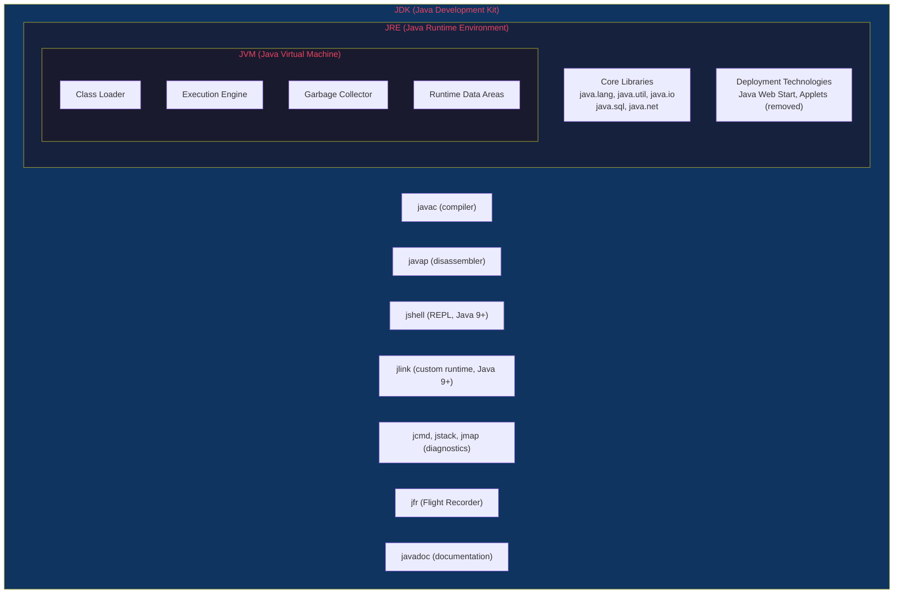
```mermaid
graph TB
    subgraph JDK["JDK (Java Development Kit)"]
        subgraph JRE["JRE (Java Runtime Environment)"]
            subgraph JVM["JVM (Java Virtual Machine)"]
                CL[Class Loader]
                EE[Execution Engine]
                GC[Garbage Collector]
                RDA[Runtime Data Areas]
            end
            LIBS["Core Libraries<br/>java.lang, java.util, java.io<br/>java.sql, java.net"]
            DEPLOY["Deployment Technologies<br/>Java Web Start, Applets (removed)"]
        end
        JAVAC["javac (compiler)"]
        JAVAP["javap (disassembler)"]
        JSHELL["jshell (REPL, Java 9+)"]
        JLINK["jlink (custom runtime, Java 9+)"]
        JCMD["jcmd, jstack, jmap (diagnostics)"]
        JFR["jfr (Flight Recorder)"]
        JAVADOC["javadoc (documentation)"]
    end

    style JVM fill:#1a1a2e,color:#e94560
    style JRE fill:#16213e,color:#e94560
    style JDK fill:#0f3460,color:#e94560
```

---

### 2.5 Code Examples

```java
// Check JDK version programmatically
public class VersionCheck {
    public static void main(String[] args) {
        // Java version
        System.out.println("Java Version: " + System.getProperty("java.version"));
        // Output: 21.0.2

        // Runtime version (Java 9+)
        Runtime.Version version = Runtime.version();
        System.out.println("Feature: " + version.feature());  // 21
        System.out.println("Interim: " + version.interim());  // 0
        System.out.println("Update: " + version.update());    // 2

        // JVM info
        System.out.println("JVM: " + System.getProperty("java.vm.name"));
        // Output: OpenJDK 64-Bit Server VM

        System.out.println("JVM Vendor: " + System.getProperty("java.vm.vendor"));
        // Output: Eclipse Adoptium

        // Check if running JDK or JRE (pre-Java 11 relevance)
        String javaHome = System.getProperty("java.home");
        System.out.println("Java Home: " + javaHome);
    }
}

// Using jshell (JDK tool, Java 9+)
// $ jshell
// jshell> "Hello".chars().filter(c -> c == 'l').count()
// $1 ==> 2

// Using jlink to create custom runtime (Java 9+)
// $ jlink --module-path $JAVA_HOME/jmods \
//         --add-modules java.base,java.sql \
//         --output custom-jre \
//         --compress=2
// Creates a minimal ~30MB runtime vs ~300MB full JDK
```

---

### 2.6 Java 8, 11, 17, 21 Relevance

| Version | Change |
|---------|--------|
| **Java 8** | Last version with separate JRE download. `PermGen` replaced by Metaspace. |
| **Java 9** | Module system (JPMS). `jlink` for custom runtimes. `jshell` REPL. `rt.jar` replaced by modules. No more `jre/lib/ext/`. |
| **Java 11** | **JRE no longer distributed separately.** LTS. Single-file source execution (`java Hello.java`). `javafx` removed from JDK. |
| **Java 17** | LTS. Strong encapsulation of internal APIs. No more `--illegal-access=permit`. `jpackage` for native installers. |
| **Java 21** | LTS. Virtual threads. Pattern matching. `jwebserver` (simple HTTP server tool). |

---

### 2.7–2.20 (Condensed for this topic — less complex than others)

#### Frequently Asked Interview Questions

1. What is the difference between JDK, JRE, and JVM?
2. Can you run Java programs with just the JRE? Can you compile?
3. What changed in Java 11 regarding JRE distribution?
4. What is `jlink` and when would you use it?
5. What is `jshell`? How is it useful for developers?

#### Tricky Interview Questions

**Q: "If I install JDK, do I still need to install JRE separately?"**
**A:** No. JDK includes JRE. Since Java 11, JRE isn't even available separately. The JDK is the single distribution.

**Q: "What is the smallest Java runtime you can create?"**
**A:** Using `jlink` with only `java.base` module — approximately 25–30MB. This includes only essential classes (Object, String, System, etc.) and the JVM itself. Ideal for Docker containers.

**Q: "Where is the JVM physically on disk?"**
**A:** It's a native shared library: `$JAVA_HOME/lib/server/libjvm.so` (Linux), `jvm.dll` (Windows), `libjvm.dylib` (macOS).

#### Common Misconceptions

| Misconception | Reality |
|---------------|---------|
| "JRE and JDK are the same thing now" | JDK **contains** what JRE had, but JDK adds development tools. They're not "the same." |
| "You need JDK on production servers" | Technically you only need the JVM + libraries (JRE subset). Use `jlink` for minimal runtime. But many teams deploy JDK for diagnostics (`jcmd`, `jstack`). |
| "All JDKs are the same" | Different vendors (Oracle, Adoptium, Amazon Corretto, Azul, Microsoft) have different licensing, support, and sometimes performance characteristics. |

#### Senior Developer Interview Perspective

A senior developer will discuss:
- Using `jlink` to create **minimal container images** (Alpine + custom JRE = ~50MB vs ~350MB with full JDK)
- Why you might still deploy JDK in production (access to `jcmd`, `jfr`, `jmap` for diagnostics)
- The **licensing differences** between Oracle JDK (commercial license for production since Java 11, changed again in Java 17) and OpenJDK-based distributions (Adoptium, Corretto, Zulu)
- How `jpackage` (Java 16+) creates native installers (.msi, .deb, .dmg)

---
---

## 3. Memory Management — Heap, Stack, Metaspace

### 3.1 Core Definition

Java's memory model divides memory into distinct regions, each serving a specific purpose. The JVM manages these regions automatically, with the **Garbage Collector** responsible for reclaiming heap memory. Understanding memory regions is critical for diagnosing `OutOfMemoryError`, `StackOverflowError`, and memory leaks.

| Region | Description | Scope | Error |
|--------|-------------|-------|-------|
| **Heap** | Object instances and arrays | All threads (shared) | `OutOfMemoryError: Java heap space` |
| **Stack** | Method call frames, local variables, operand stack | Per thread | `StackOverflowError` |
| **Metaspace** | Class metadata, method bytecode, constant pool | All threads (shared) | `OutOfMemoryError: Metaspace` |
| **Code Cache** | JIT-compiled native code | All threads (shared) | JIT stops compiling (performance degradation) |
| **Native Memory** | Direct ByteBuffers, JNI allocations, thread stacks | Process-level | `OutOfMemoryError: Direct buffer memory` |

---

### 3.2 Mental Model / Real World Analogy

Think of JVM memory as an **office building**:

- **Heap** = The shared warehouse — everyone stores their products (objects) here. A janitor (GC) periodically cleans unused products.
- **Stack** = Each employee's personal desk — their current work papers (method frames). When they finish a task (method returns), papers are discarded. Desk space is limited (recursion too deep → stack overflow).
- **Metaspace** = The building's blueprint room — stores architectural plans (class definitions). Uses the building's land (native OS memory), not warehouse space.
- **Code Cache** = A fast-access cabinet — frequently used blueprints (JIT-compiled code) are photocopied here for quick access.
- **Native Memory** = External storage units rented from the landlord (OS).

---

### 3.3 Internal Working (JVM Level)

#### Heap Structure (Generational GC Model)


```
┌──────────────────────────────────────────────────────────────────────┐
│                            JVM HEAP (-Xmx)                           │
│  ┌──────────────────────────────────────┐  ┌──────────────────────┐  │
│  │         Young Generation             │  │   Old Generation     │  │
│  │  ┌──────────┐  ┌──────┐  ┌──────┐   │  │   (Tenured Space)    │  │
│  │  │   Eden   │  │  S0  │  │  S1  │   │  │                      │  │
│  │  │  (new    │  │(from)│  │ (to) │   │  │  Long-lived objects  │  │
│  │  │  allocs) │  │      │  │      │   │  │  promoted from Young │  │
│  │  │  ~80%    │  │ ~10% │  │ ~10% │   │  │  Gen after N cycles  │  │
│  │  └──────────┘  └──────┘  └──────┘   │  │  (default N=15)      │  │
│  └──────────────────────────────────────┘  └──────────────────────┘  │
│             ~1/3 of heap                       ~2/3 of heap          │
└──────────────────────────────────────────────────────────────────────┘
```

#### Object Allocation Flow

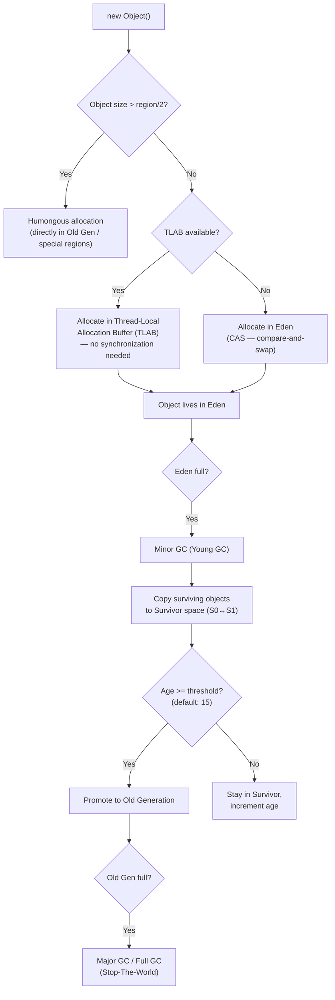
```mermaid
flowchart TD
    A["new Object()"] --> B{Object size > region/2?}
    B -->|Yes| C["Humongous allocation<br/>(directly in Old Gen / special regions)"]
    B -->|No| D{TLAB available?}
    D -->|Yes| E["Allocate in Thread-Local<br/>Allocation Buffer (TLAB)<br/>— no synchronization needed"]
    D -->|No| F["Allocate in Eden<br/>(CAS — compare-and-swap)"]
    E --> G["Object lives in Eden"]
    F --> G
    G --> H{Eden full?}
    H -->|Yes| I["Minor GC (Young GC)"]
    I --> J["Copy surviving objects<br/>to Survivor space (S0↔S1)"]
    J --> K{"Age >= threshold?<br/>(default: 15)"}
    K -->|Yes| L["Promote to Old Generation"]
    K -->|No| M["Stay in Survivor,<br/>increment age"]
    L --> N{Old Gen full?}
    N -->|Yes| O["Major GC / Full GC<br/>(Stop-The-World)"]
```

#### TLAB (Thread-Local Allocation Buffer)

Each thread gets a private chunk of Eden called a **TLAB**. Object allocation within TLAB is a simple **pointer bump** (no synchronization needed) — this is why `new Object()` is extremely fast (~10 nanoseconds).

```
Eden Space:
┌──────────────────────────────────────────────────────┐
│  TLAB-T1  │  TLAB-T2  │  TLAB-T3  │  free space    │
│ [obj][obj]│ [obj]     │ [obj][obj]│                  │
└──────────────────────────────────────────────────────┘
Each thread bumps its own pointer — no locks!
```

---

### 3.4 Architecture Diagram (Mermaid)

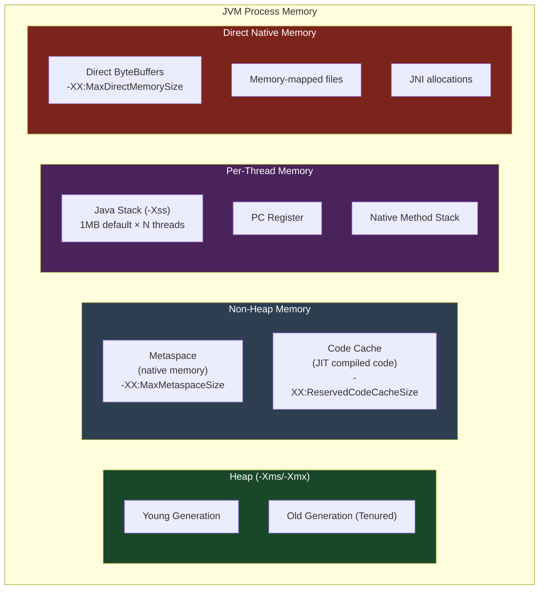
```mermaid
graph TB
    subgraph PROCESS["JVM Process Memory"]
        subgraph HEAP["Heap (-Xms/-Xmx)"]
            YOUNG["Young Generation"]
            OLD["Old Generation (Tenured)"]
        end

        subgraph NONHEAP["Non-Heap Memory"]
            META["Metaspace<br/>(native memory)<br/>-XX:MaxMetaspaceSize"]
            CC["Code Cache<br/>(JIT compiled code)<br/>-XX:ReservedCodeCacheSize"]
        end

        subgraph PERTHREAD["Per-Thread Memory"]
            STACK["Java Stack (-Xss)<br/>1MB default × N threads"]
            PC["PC Register"]
            NMS["Native Method Stack"]
        end

        subgraph NATIVE["Direct Native Memory"]
            DBB["Direct ByteBuffers<br/>-XX:MaxDirectMemorySize"]
            MMAP["Memory-mapped files"]
            JNI_MEM["JNI allocations"]
        end
    end

    style HEAP fill:#1a472a,color:#ffffff
    style NONHEAP fill:#2c3e50,color:#ffffff
    style PERTHREAD fill:#4a235a,color:#ffffff
    style NATIVE fill:#7b241c,color:#ffffff
```

> **Critical Formula:** `Total Process Memory = Heap + Metaspace + Code Cache + (Thread Stack × Thread Count) + Direct Memory + Native Overhead`

---

### 3.5 Code Examples

```java
// 1. Querying memory at runtime
public class MemoryInfo {
    public static void main(String[] args) {
        Runtime rt = Runtime.getRuntime();

        long maxMemory = rt.maxMemory();          // -Xmx (max heap)
        long totalMemory = rt.totalMemory();      // current heap size
        long freeMemory = rt.freeMemory();         // free within current heap
        long usedMemory = totalMemory - freeMemory;

        System.out.printf("Max Heap:   %d MB%n", maxMemory / (1024 * 1024));
        System.out.printf("Total Heap: %d MB%n", totalMemory / (1024 * 1024));
        System.out.printf("Used Heap:  %d MB%n", usedMemory / (1024 * 1024));
        System.out.printf("Free Heap:  %d MB%n", freeMemory / (1024 * 1024));

        // MXBean for detailed info
        MemoryMXBean memBean = ManagementFactory.getMemoryMXBean();
        System.out.println("Heap: " + memBean.getHeapMemoryUsage());
        System.out.println("Non-Heap: " + memBean.getNonHeapMemoryUsage());
    }
}

// 2. Demonstrating StackOverflowError
public class StackOverflowDemo {
    static int depth = 0;

    public static void recursive() {
        depth++;
        recursive(); // infinite recursion
    }

    public static void main(String[] args) {
        try {
            recursive();
        } catch (StackOverflowError e) {
            System.out.println("Stack depth reached: " + depth);
            // Typically ~5000-15000 with default -Xss (1MB)
        }
    }
}

// 3. Direct ByteBuffer (off-heap memory)
public class DirectMemoryDemo {
    public static void main(String[] args) {
        // Allocates memory OUTSIDE the heap — not subject to GC
        ByteBuffer directBuffer = ByteBuffer.allocateDirect(1024 * 1024); // 1MB off-heap

        // Heap buffer for comparison
        ByteBuffer heapBuffer = ByteBuffer.allocate(1024 * 1024); // 1MB on heap

        // Direct buffers: faster I/O (no copy to/from native), but:
        // - Slower to allocate/deallocate
        // - Not GC'd immediately — relies on Cleaner
        // - Can cause OutOfMemoryError: Direct buffer memory
    }
}

// 4. Detecting memory leak pattern
public class MemoryLeakDemo {
    // LEAK: static collection grows forever
    private static final List<byte[]> leak = new ArrayList<>();

    public void processRequest() {
        byte[] data = new byte[1024 * 1024]; // 1MB per request
        leak.add(data); // never removed → OOM eventually
        // Fix: use bounded cache (Caffeine, Guava) or WeakReference
    }
}

// 5. WeakReference usage
public class WeakRefDemo {
    public static void main(String[] args) {
        Object strong = new Object();
        WeakReference<Object> weak = new WeakReference<>(strong);

        System.out.println(weak.get()); // Object@...

        strong = null; // remove strong reference
        System.gc();   // suggest GC

        System.out.println(weak.get()); // likely null — object was collected
    }
}
```

---

### 3.6 Java 8, 11, 17, 21 Relevance

| Version | Memory Change |
|---------|--------------|
| **Java 7** | `PermGen` (fixed size, part of heap). String pool in PermGen. |
| **Java 8** | **PermGen removed → Metaspace** (native memory, auto-grows). String pool moved to Heap. |
| **Java 9** | Compact Strings — `String` uses `byte[]` instead of `char[]` (saves ~50% memory for Latin-1 strings). |
| **Java 11** | Epsilon GC (no-op, for testing). ZGC (experimental). |
| **Java 14** | `NullPointerException` messages now show which variable was null (helpful NPE). |
| **Java 16** | `Stream.toList()` returns unmodifiable list. |
| **Java 21** | Virtual threads — each virtual thread has a **much smaller stack** (few KB vs 1MB for platform threads). Generational ZGC. |

---

### 3.7 Frequently Asked Interview Questions

1. What is stored on the Heap vs the Stack?
2. Can two threads share the same Stack? Can they share the Heap?
3. What replaced PermGen in Java 8? Why was it replaced?
4. What is the Young Generation and why does it exist?
5. What is TLAB and why is it important?
6. What happens when the heap is full?
7. What is the difference between `-Xms` and `-Xmx`?
8. Where are String literals stored?

---

### 3.8 Tricky Interview Questions with Answers

**Q1: "Is it possible to get `OutOfMemoryError` even when the heap has free space?"**

**A:** Yes, multiple ways:
- **Metaspace full:** Dynamic class generation exhausts Metaspace → `OutOfMemoryError: Metaspace`
- **Direct buffer memory full:** Too many `ByteBuffer.allocateDirect()` → `OutOfMemoryError: Direct buffer memory`
- **Too many threads:** Each thread needs ~1MB stack (native memory) → `OutOfMemoryError: unable to create new native thread`
- **GC overhead limit:** GC spending >98% of time with <2% heap reclaimed → `OutOfMemoryError: GC overhead limit exceeded`
- **Fragmentation:** Enough total free space, but no contiguous block large enough for the allocation (rare with modern GCs)

**Q2: "What is the difference between `OutOfMemoryError: Java heap space` and `OutOfMemoryError: GC overhead limit exceeded`?"**

| | Java heap space | GC overhead limit exceeded |
|---|---|---|
| **Meaning** | Heap is literally full | GC is running constantly but reclaiming almost nothing |
| **Cause** | Memory leak, heap too small | Slow memory leak near heap limit |
| **GC behavior** | GC tried but couldn't free enough | GC spending >98% of CPU time, freeing <2% heap per cycle |
| **Disable check** | N/A | `-XX:-UseGCOverheadLimit` (not recommended) |

**Q3: "Where are String literals stored? What about `new String("hello")`?"**

**A:**
- `"hello"` (literal) → stored in the **String Pool** (a `Hashtable` on the heap, since Java 7)
- `new String("hello")` → creates a **new object on the heap** (separate from the pool)
- `"hello".intern()` → returns the pooled instance (or adds it to the pool if not present)

```java
String s1 = "hello";           // String pool
String s2 = "hello";           // Same reference from pool
String s3 = new String("hello"); // New heap object

System.out.println(s1 == s2);  // true (same pool reference)
System.out.println(s1 == s3);  // false (different objects)
System.out.println(s1 == s3.intern()); // true (intern returns pool ref)
```

**Q4: "A `static final` field — where is it stored?"**

**A:** The **reference** to the `static final` field is in **Metaspace** (as part of the class metadata). If the field value is an **object** (e.g., `static final List<String> LIST = new ArrayList<>()`), the object itself is on the **Heap**. If it's a **compile-time constant** (e.g., `static final int X = 42`), it's inlined by the compiler — the value is embedded directly in the bytecode of callers.

---

### 3.9 Common Misconceptions

| Misconception | Reality |
|---------------|---------|
| "Stack is faster than Heap" | Allocation on stack is faster (pointer bump), but access speed is the same (both in RAM). The real advantage is no GC overhead for stack-allocated data. |
| "Java has no memory leaks" | Java has no **pointer-based** leaks, but logical leaks are common (static collections, listeners not deregistered, ThreadLocal not cleaned). |
| "Increasing heap always helps" | Larger heap = longer GC pauses (especially Full GC). Right-size the heap and fix the leak. |
| "Metaspace grows without limit" | It grows up to available native memory. Always set `-XX:MaxMetaspaceSize` to prevent runaway growth. |
| "Primitives are always on the stack" | Primitive **local variables** are on the stack. Primitive **fields** of an object are on the heap (part of the object). |
| "`-Xmx` is total JVM memory" | `-Xmx` is only Heap. Total memory includes Metaspace + Code Cache + Thread stacks + Direct memory + Native overhead. |

---

### 3.10 Edge Cases

1. **Humongous objects (G1GC):** Objects larger than half a region are allocated directly in Old Gen as "humongous" objects. These can cause premature Full GC.

2. **`-Xss` too small:** Setting thread stack size too low (e.g., `-Xss128k`) causes `StackOverflowError` with even modest recursion. But too large wastes native memory.

3. **String pool overflow:** Excessive `String.intern()` calls can fill the String pool hashtable. Pre-Java 7, this was in PermGen (fixed size). Post-Java 7, it's on heap but still uses a fixed-size hashtable (tune with `-XX:StringTableSize`).

4. **Native memory tracking:**
```bash
# Enable native memory tracking
java -XX:NativeMemoryTracking=summary -jar app.jar

# Query current native memory usage
jcmd <pid> VM.native_memory summary
# Shows: Heap, Class (Metaspace), Thread, Code, GC, Internal, Symbol, etc.
```

5. **Zero-length arrays:** `new byte[0]` still allocates 16 bytes (object header + array length field + padding).

---

### 3.11 Performance Considerations

| Aspect | Impact | Optimization |
|--------|--------|-------------|
| Object allocation | ~10ns with TLAB | JIT escape analysis can eliminate allocation entirely |
| Minor GC | ~5–50ms (proportional to live objects in Young Gen) | Size Eden correctly; more Eden = less frequent Minor GC |
| Full GC | ~100ms–10s (proportional to heap size) | Avoid Full GC: tune GC, fix leaks, use G1/ZGC |
| Stack frame creation | Near-zero cost (pointer adjustment) | N/A — already optimized |
| Direct ByteBuffer allocation | ~100μs (OS syscall: `mmap`) | Pool/reuse direct buffers (e.g., Netty's `PooledByteBufAllocator`) |

**Sizing guidelines:**
- **Heap:** Start with 2× expected live data set. Monitor and adjust.
- **Young Gen:** Default is ~1/3 of heap. Increase for high-allocation-rate apps.
- **Metaspace:** Start with `-XX:MaxMetaspaceSize=256m`. Increase if using dynamic proxies, Groovy, or many classes.
- **Thread stacks:** Default 1MB. Reduce to 512k or 256k if running 1000+ threads.

---

### 3.12 Memory Implications

**Actual object sizes in 64-bit HotSpot (compressed oops enabled, default for heap < 32GB):**

| Object | Header | Data | Padding | Total |
|--------|--------|------|---------|-------|
| `new Object()` | 12 bytes | 0 | 4 | **16 bytes** |
| `new Integer(42)` | 12 bytes | 4 | 0 | **16 bytes** |
| `new Long(42L)` | 12 bytes | 8 | 4 | **24 bytes** |
| `"hello"` (String) | 12 + 12 | 4 (coder) + 4 (hash) + 5 (byte[]) | padding | **~56 bytes** |
| `new int[10]` | 16 bytes | 40 | 0 | **56 bytes** |
| `new Integer[10]` | 16 bytes | 40 (refs) + 10×16 (objects) | — | **~216 bytes** |

> **Key Insight:** `Integer[]` uses **~4× more memory** than `int[]` due to object overhead per element. This is why primitive collections (Eclipse Collections, HPPC) exist for performance-critical code.

---

### 3.13 Thread Safety Considerations

- **Heap:** Shared across all threads → objects on heap need synchronization for concurrent access.
- **Stack:** Private to each thread → local variables are inherently thread-safe.
- **Metaspace:** Thread-safe internally (JVM manages class loading with locks).
- **TLAB:** Thread-private chunk of Eden → no synchronization for allocation within TLAB.
- **Direct ByteBuffers:** NOT thread-safe — need external synchronization if shared.

> **Pattern:** Prefer **stack-confined** variables (local to a method) for thread safety. Heap objects shared across threads need `volatile`, `synchronized`, or concurrent collections.

---

### 3.14 Production Scenarios

**Scenario 1:**
> "We are seeing **`OutOfMemoryError: Java heap space`** in production under **sustained high traffic for 4+ hours**. How would you solve it using **heap dump analysis**?"

**Answer:**
1. **Capture heap dump** (ensure this flag is set BEFORE the incident):
```bash
-XX:+HeapDumpOnOutOfMemoryError
-XX:HeapDumpPath=/var/logs/heapdump.hprof
```
2. **Analyze with Eclipse MAT:**
   - Open the heap dump → "Leak Suspects Report"
   - Look at the **Dominator Tree** — the largest objects retaining memory
   - Check **Shortest Paths to GC Roots** for the largest objects
3. **Common culprits:**
   - `static Map` growing without eviction (cache without TTL)
   - `ThreadLocal` not cleaned up → memory retained per thread
   - `InputStream`/`Connection` not closed → resources held indefinitely
   - `StringBuilder` in hot loops without size limits
4. **Monitor with `jstat`:**
```bash
jstat -gcutil <pid> 5000
# Watch: Old Gen usage climbing steadily = leak
# Watch: FGC (Full GC count) increasing = trouble
```

**Scenario 2:**
> "We are seeing **`OutOfMemoryError: Metaspace`** in production under **repeated hot deployments in Tomcat**. How would you solve it using **ClassLoader analysis**?"

**Answer:**
This is a classic **ClassLoader leak**. Each hot deployment creates a new ClassLoader. The old ClassLoader should be GC'd, but if any object holds a reference to a class from the old ClassLoader, the entire ClassLoader (and all its classes) is retained.

1. Add `-XX:MaxMetaspaceSize=512m` to fail fast (instead of consuming all native memory)
2. Analyze with `jmap -clstats <pid>` to see class counts per ClassLoader
3. Common leak sources:
   - JDBC drivers registered in `DriverManager` (static reference)
   - `ThreadLocal` values referencing webapp classes
   - Logging frameworks holding webapp ClassLoader references
4. Fix: Use `ServletContextListener.contextDestroyed()` to clean up resources

---

### 3.15 Follow-up Questions Interviewers Ask

**Q: "How does the JVM decide when to perform Minor GC vs Full GC?"**

**A:**
- **Minor GC (Young GC):** Triggered when Eden space is full. Only collects Young Generation. Usually fast (STW but short).
- **Major GC (Old Gen only):** Triggered by old-gen-specific thresholds (varies by GC algorithm).
- **Full GC:** Collects entire heap (Young + Old + Metaspace). Triggered when:
  - Old Gen is full and promotion from Young Gen fails
  - Metaspace is full
  - `System.gc()` is called (unless `-XX:+DisableExplicitGC`)
  - CMS/G1 concurrent collection fails ("concurrent mode failure")

**Q: "What is the difference between `WeakReference`, `SoftReference`, and `PhantomReference`?"**

| Type | GC Behavior | Use Case |
|------|-------------|----------|
| **Strong** | Never collected while reachable | Normal references |
| **Soft** | Collected when memory is low (before OOM) | Memory-sensitive caches |
| **Weak** | Collected at next GC cycle | `WeakHashMap`, canonicalizing mappings |
| **Phantom** | Never accessible (`get()` returns null). Enqueued after finalization | Resource cleanup, tracking object deallocation |

```java
// SoftReference — stays alive until memory pressure
SoftReference<BigObject> softCache = new SoftReference<>(loadFromDB());

// WeakReference — collected at next GC
WeakReference<BigObject> weakRef = new WeakReference<>(expensiveObject);

// PhantomReference — for cleanup notification
ReferenceQueue<BigObject> queue = new ReferenceQueue<>();
PhantomReference<BigObject> phantom = new PhantomReference<>(obj, queue);
// When 'obj' is phantom-reachable, reference is enqueued in 'queue'
```

**Q: "How would you size the heap for a production application?"**

**A:**
1. **Measure live data set:** Run with representative load, force Full GC, measure Old Gen occupancy.
2. **Heap = 3–4× live data set** (rule of thumb).
3. Set **`-Xms` = `-Xmx`** to avoid resize overhead.
4. Monitor with `jstat -gcutil` and GC logs — adjust based on:
   - GC frequency (Minor GC every few seconds is OK, Full GC should be rare)
   - GC pause duration (target < 200ms for latency-sensitive apps)
   - Old Gen growth rate (should plateau, not climb indefinitely)

---

### 3.16 Comparison Tables

#### Heap vs Stack

| Attribute | Heap | Stack |
|-----------|------|-------|
| Scope | Shared (all threads) | Per thread (private) |
| Stores | Objects, arrays | Method frames, local variables, references |
| Allocation speed | ~10ns (TLAB) | ~1ns (pointer bump) |
| Deallocation | Garbage Collector | Automatic on method return |
| Size control | `-Xms`, `-Xmx` | `-Xss` |
| Error | `OutOfMemoryError: Java heap space` | `StackOverflowError` |
| Thread safety | Needs synchronization | Inherently thread-safe |
| Fragmentation | Possible (GC compacts) | No fragmentation |

#### PermGen vs Metaspace

| Attribute | PermGen (Java ≤ 7) | Metaspace (Java 8+) |
|-----------|---------------------|---------------------|
| Location | JVM heap (part of `-Xmx`) | Native OS memory |
| Default size | 64MB (fixed) | Unlimited (grows dynamically) |
| Max size | `-XX:MaxPermSize=256m` | `-XX:MaxMetaspaceSize=512m` |
| Stores | Class metadata, interned Strings | Class metadata only (Strings moved to heap) |
| GC behavior | Collected during Full GC | Collected when class/ClassLoader is unreachable |
| Common error | `OutOfMemoryError: PermGen space` | `OutOfMemoryError: Metaspace` |
| Why replaced | Fixed size too restrictive, caused frequent OOM in app servers | Auto-sizing, leverages native memory, better for dynamic class loading |

---

### 3.17 Internal JVM Details

#### Stack Frame Structure

```
┌─────────────────────────────────────────┐
│          Stack Frame for methodA()       │
├─────────────────────────────────────────┤
│  Local Variable Array                    │
│  [0] = this (for instance methods)       │
│  [1] = param1                            │
│  [2] = param2                            │
│  [3] = localVar1                         │
├─────────────────────────────────────────┤
│  Operand Stack                           │
│  (working space for bytecode operations) │
│  e.g., iload_1, iload_2, iadd           │
├─────────────────────────────────────────┤
│  Frame Data                              │
│  - Reference to Constant Pool            │
│  - Return address                        │
│  - Exception table reference             │
└─────────────────────────────────────────┘
```

#### Object Memory Layout (JOL — Java Object Layout)

```java
// Use JOL library to inspect actual layout
// org.openjdk.jol:jol-core:0.17
import org.openjdk.jol.info.ClassLayout;

public class ObjectLayoutDemo {
    int x;      // 4 bytes
    long y;     // 8 bytes
    boolean z;  // 1 byte

    public static void main(String[] args) {
        System.out.println(ClassLayout.parseClass(ObjectLayoutDemo.class).toPrintable());
        // Output shows exact byte layout with padding
    }
}
```

---

### 3.18 Best Practices

1. **Always set `-Xms` = `-Xmx`** in production to avoid heap resize pauses.
2. **Always set `-XX:+HeapDumpOnOutOfMemoryError`** — you WILL need heap dumps.
3. **Set `-XX:MaxMetaspaceSize`** to prevent unbounded native memory growth.
4. **Close resources** with try-with-resources — prevent resource-related memory leaks.
5. **Use bounded caches** (Caffeine, Guava) instead of unbounded `HashMap` for caching.
6. **Clean ThreadLocals** in `finally` blocks or use `InheritableThreadLocal` carefully.
7. **Monitor with `jstat` and GC logs** continuously in production.
8. **Avoid autoboxing in hot paths** — `Integer[]` uses 4× memory of `int[]`.
9. **Pool expensive objects** (database connections, Direct ByteBuffers, threads).
10. **Use Compact Strings (Java 9+)** — enabled by default, saves ~50% String memory.

---

### 3.19 Anti-Patterns

| Anti-Pattern | Problem | Solution |
|-------------|---------|----------|
| `static Map` without size limit | Memory leak — grows until OOM | Use Caffeine/Guava cache with `maximumSize` and `expireAfterWrite` |
| Ignoring `ThreadLocal.remove()` | Memory retained per thread in pools | Always clean in `finally` block |
| `String.intern()` in hot path | Fills String table, locks on hashtable | Use application-level deduplication |
| Not closing `InputStream`/`Connection` | Native resource leak + potential OOM | Use try-with-resources |
| Using `finalize()` for cleanup | Unpredictable, delays GC, deprecated | Use `Cleaner` (Java 9+) or try-with-resources |
| Ignoring direct memory (`-XX:MaxDirectMemorySize`) | Netty/NIO can exhaust native memory | Set explicit limit, monitor with NMT |
| Over-sizing heap | Longer GC pauses, wasted memory in containers | Right-size based on live data set measurement |

---

### 3.20 Senior Developer Interview Perspective

**What distinguishes a senior answer on Memory Management:**

A junior says: *"Heap stores objects, stack stores local variables."*

A senior explains:
- **Total memory accounting:** JVM uses far more memory than `-Xmx` — Metaspace, Code Cache, thread stacks, direct buffers, GC overhead. In containers, set memory limits at 75% of container limit to account for non-heap.
- **Container-aware JVM:** Since Java 10, JVM respects container memory limits (`-XX:+UseContainerSupport`, on by default). Pre-Java 10, JVM saw host memory, leading to OOM kills by cgroup.
- **Heap dump analysis workflow:** Knows how to use Eclipse MAT's Dominator Tree, Leak Suspects, and OQL queries.
- **Native Memory Tracking (NMT):** Uses `-XX:NativeMemoryTracking=summary` and `jcmd VM.native_memory` to track all memory regions.
- **TLAB tuning:** Understands that TLAB makes allocation nearly lock-free and when to tune TLAB size.
- **Reference types:** Knows when to use `SoftReference` (caches), `WeakReference` (canonicalizing maps), `PhantomReference` (cleanup tracking).
- **Virtual threads (Java 21):** Virtual threads use much smaller stacks (~few KB) and are stored on heap, fundamentally changing the memory model for high-concurrency apps.

**Senior-level question:**
> *"Your Java microservice in Kubernetes is being OOM-killed by the container, but heap dumps show only 60% heap usage. What's happening?"*

**Answer:** The container OOM killer acts on **total process memory**, not just heap. The remaining 40% is non-heap memory:
1. Check Metaspace usage: `jcmd <pid> VM.native_memory summary`
2. Check thread count: `jstack <pid> | grep -c "nid="` — each thread ≈ 1MB stack
3. Check direct buffers: `jcmd <pid> VM.native_memory | grep Internal`
4. Check Code Cache: may be up to 240MB
5. **Fix:** Set container memory = `-Xmx` + estimated non-heap (typically +30-50%). Or reduce `-Xmx` to leave room. Use `-XX:MaxMetaspaceSize`, `-Xss512k`, `-XX:MaxDirectMemorySize`.

---
---

## 4. Garbage Collection & GC Algorithms

### 4.1 Core Definition

**Garbage Collection (GC)** is the automatic process of identifying and reclaiming memory occupied by objects that are no longer reachable from any **GC Root**. The GC eliminates the need for manual memory management (`malloc`/`free`), preventing memory leaks and dangling pointer bugs at the cost of occasional **Stop-The-World (STW)** pauses.

**GC Roots** — the starting points for reachability analysis:
- Local variables on active thread stacks
- Active thread objects themselves
- Static variables of loaded classes
- JNI references
- Internal JVM references (class objects, system ClassLoader)

> **Key Principle:** An object is eligible for GC if and only if it is **not reachable** from any GC root through any chain of references.

---

### 4.2 Mental Model / Real World Analogy

GC is like a **municipal waste collection system**:

- **Objects** = items in your house (some useful, some garbage)
- **GC Roots** = things you're currently using (wearing, sitting on, cooking with)
- **References** = chains connecting items (your keys on a keychain on your belt = reachable)
- **Mark phase** = the inspector walks through your house, starting from what you're using, marking everything connected as "in use"
- **Sweep phase** = everything NOT marked is thrown away
- **Compaction** = remaining items are rearranged to eliminate gaps
- **STW pause** = you must freeze while the inspector works (can't create new items or move existing ones)

**Generational hypothesis:** Most objects die young (like disposable napkins). Long-lived objects (like furniture) should be checked less frequently. This is why the heap is divided into **Young** and **Old** generations.

---

### 4.3 Internal Working (JVM Level)


#### Mark-and-Sweep Algorithm (Foundation of all GCs)

```
Phase 1: MARK
  Start from GC Roots → traverse all references → mark reachable objects as "alive"

Phase 2: SWEEP
  Scan entire heap → reclaim memory of unmarked (unreachable) objects

Phase 3: COMPACT (optional)
  Move surviving objects together → eliminate memory fragmentation
  Update all references to point to new locations
```

#### Minor GC (Young Generation Collection)

```
BEFORE Minor GC:
Eden:     [A][B][C][D][E]  (A,C,E are live; B,D are garbage)
Survivor0: [X][Y]          (both live)
Survivor1: (empty — "to" space)

DURING Minor GC (copy collector):
1. Mark live objects in Eden + Survivor0
2. Copy live objects to Survivor1 (incrementing age)
3. Clear Eden + Survivor0 entirely

AFTER Minor GC:
Eden:      (empty — ready for new allocations)
Survivor0: (empty — becomes "to" space next time)
Survivor1: [A(age+1)][C(age+1)][E(age+1)][X(age+1)][Y(age+1)]

Objects with age >= MaxTenuringThreshold → promoted to Old Gen
```

> **Key:** Minor GC is a **copy collector** — it copies live objects, not garbage. If most objects are dead (which they usually are in Young Gen), Minor GC is very fast.

---

### 4.4 Architecture Diagram (Mermaid)

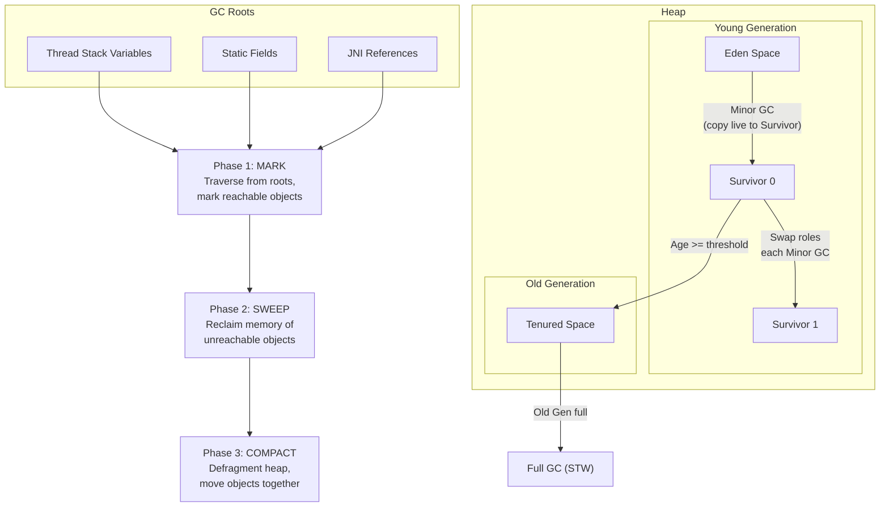
```mermaid
flowchart TD
    subgraph GC_ROOTS["GC Roots"]
        R1["Thread Stack Variables"]
        R2["Static Fields"]
        R3["JNI References"]
    end

    R1 --> MARK
    R2 --> MARK
    R3 --> MARK

    MARK["Phase 1: MARK<br/>Traverse from roots,<br/>mark reachable objects"] --> SWEEP

    SWEEP["Phase 2: SWEEP<br/>Reclaim memory of<br/>unreachable objects"] --> COMPACT

    COMPACT["Phase 3: COMPACT<br/>Defragment heap,<br/>move objects together"]

    subgraph HEAP["Heap"]
        subgraph YOUNG["Young Generation"]
            EDEN["Eden Space"]
            S0["Survivor 0"]
            S1["Survivor 1"]
        end
        subgraph OLD_GEN["Old Generation"]
            TENURED["Tenured Space"]
        end
    end

    EDEN -->|"Minor GC<br/>(copy live to Survivor)"| S0
    S0 -->|"Swap roles<br/>each Minor GC"| S1
    S0 -->|"Age >= threshold"| TENURED
    TENURED -->|"Old Gen full"| FGC["Full GC (STW)"]
```

#### G1GC Region-Based Architecture

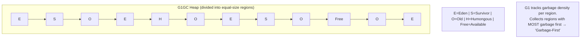
```mermaid
graph TB
    subgraph G1HEAP["G1GC Heap (divided into equal-size regions)"]
        direction LR
        R1["E"] --> R2["S"]
        R2 --> R3["O"]
        R3 --> R4["E"]
        R4 --> R5["H"]
        R5 --> R6["O"]
        R6 --> R7["E"]
        R7 --> R8["S"]
        R8 --> R9["O"]
        R9 --> R10["Free"]
        R10 --> R11["O"]
        R11 --> R12["E"]
    end

    LEGEND["E=Eden | S=Survivor | O=Old | H=Humongous | Free=Available"]
    NOTE["G1 tracks garbage density per region.<br/>Collects regions with MOST garbage first → 'Garbage-First'"]
```

---

### 4.5 Code Examples

```java
// 1. Demonstrating GC behavior
public class GCDemo {
    public static void main(String[] args) {
        List<byte[]> retained = new ArrayList<>();

        for (int i = 0; i < 100; i++) {
            byte[] temp = new byte[1024 * 1024]; // 1MB — short-lived (garbage)
            if (i % 10 == 0) {
                retained.add(new byte[1024 * 1024]); // 1MB — long-lived (retained)
            }
        }
        // Run with: java -verbose:gc -Xmx256m GCDemo
        // You'll see Minor GC as Eden fills, and eventually Full GC
    }
}

// 2. Reference types affecting GC
import java.lang.ref.*;

public class ReferenceDemo {
    public static void main(String[] args) {
        // Strong — never collected while reachable
        Object strong = new Object();

        // Weak — collected at next GC
        WeakReference<Object> weak = new WeakReference<>(new Object());

        // Soft — collected only when memory is low
        SoftReference<byte[]> soft = new SoftReference<>(new byte[1024 * 1024]);

        // Phantom — for post-mortem cleanup
        ReferenceQueue<Object> queue = new ReferenceQueue<>();
        PhantomReference<Object> phantom = new PhantomReference<>(new Object(), queue);

        System.gc();

        System.out.println("Weak: " + weak.get());     // likely null
        System.out.println("Soft: " + soft.get());      // likely non-null (enough memory)
        System.out.println("Phantom: " + phantom.get()); // ALWAYS null
    }
}

// 3. Monitoring GC programmatically
import java.lang.management.*;

public class GCMonitor {
    public static void main(String[] args) {
        for (GarbageCollectorMXBean gcBean : ManagementFactory.getGarbageCollectorMXBeans()) {
            System.out.printf("GC: %s | Collections: %d | Time: %dms%n",
                gcBean.getName(),
                gcBean.getCollectionCount(),
                gcBean.getCollectionTime());
        }
    }
}

// 4. Forcing GC (for testing only — NEVER in production)
System.gc(); // SUGGESTION only — JVM may ignore
Runtime.getRuntime().gc(); // Same as above
// Use -XX:+DisableExplicitGC in production to ignore these calls
```

---

### 4.6 Java 8, 11, 17, 21 Relevance

| Version | GC Change |
|---------|-----------|
| **Java 8** | Parallel GC is default. G1GC available but not default. PermGen → Metaspace. |
| **Java 9** | **G1GC becomes default.** `-XX:+UseG1GC` is now the default. String deduplication in G1. |
| **Java 11** | **ZGC introduced** (experimental). **Epsilon GC** (no-op, for benchmarking). `G1` improvements. |
| **Java 12** | **Shenandoah GC** (experimental, OpenJDK only). Abortable mixed collections in G1. |
| **Java 15** | ZGC and Shenandoah become **production-ready** (non-experimental). |
| **Java 17** | ZGC performance improvements. Deprecation of and-sweep aspects. |
| **Java 21** | **Generational ZGC** — ZGC gets generational support (Young/Old), improving throughput significantly. Enabled with `-XX:+UseZGC -XX:+ZGenerational`. |

---

### 4.7 Frequently Asked Interview Questions

1. What is garbage collection in Java?
2. What is Stop-The-World (STW)? Why does it happen?
3. What is the difference between Minor GC and Major/Full GC?
4. What are GC Roots?
5. What is the default GC in Java 8? Java 11? Java 17?
6. What is the generational hypothesis and why does the heap have Young/Old generations?
7. What is object promotion?
8. How do you trigger garbage collection? Should you?

---

### 4.8 Tricky Interview Questions with Answers

**Q1: "Can you guarantee that an object will be garbage collected?"**

**A:** No. You can make it eligible (remove all references), but GC timing is non-deterministic. `System.gc()` is only a suggestion. Even `finalize()` is not guaranteed to run. The only guarantee: GC will run before `OutOfMemoryError` is thrown.

**Q2: "Can an object resurrect itself during garbage collection?"**

**A:** Yes! In the `finalize()` method, the object can assign `this` to a static field, making itself reachable again:

```java
class Zombie {
    static Zombie savedRef;

    @Override
    protected void finalize() {
        savedRef = this; // resurrection! Object is reachable again
    }
}
// finalize() is called only ONCE per object — second time, it cannot resurrect
```

> **Note:** `finalize()` is deprecated since Java 9. Use `Cleaner` instead.

**Q3: "What causes a Full GC? How do you prevent it?"**

**A:** Full GC causes:
1. Old Gen is full (promotion failure)
2. Metaspace is full
3. `System.gc()` called
4. Concurrent collection failure (CMS/G1 can't keep up with allocation rate)
5. Humongous allocation failure (G1)

Prevention:
- Size heap correctly (`-Xms` = `-Xmx`)
- Use G1/ZGC (avoid Parallel GC for large heaps)
- Fix memory leaks
- Avoid humongous allocations (objects > region/2 in G1)
- Add `-XX:+DisableExplicitGC`

**Q4: "What is the difference between `finalize()`, `Cleaner`, and `try-with-resources`?"**

| | `finalize()` | `Cleaner` (Java 9+) | `try-with-resources` |
|---|---|---|---|
| Timing | Non-deterministic | Non-deterministic (but more reliable) | Deterministic (at block exit) |
| Thread | Finalizer thread (single, can bottleneck) | Dedicated cleaner thread(s) | Current thread |
| Resurrection | Possible (anti-pattern) | Not possible | N/A |
| Use case | ❌ Deprecated | Last-resort native cleanup | ✅ Always preferred for resources |
| Performance | GC delayed by 1+ cycles | Minimal impact | Zero GC impact |

---

### 4.9 Common Misconceptions

| Misconception | Reality |
|---------------|---------|
| "`System.gc()` always triggers GC" | It's a **suggestion** — JVM can ignore it. Use `-XX:+DisableExplicitGC` in production. |
| "Setting `obj = null` speeds up GC" | Usually unnecessary — local vars go out of scope naturally. Only helpful for long-lived references in large methods. |
| "GC only runs when heap is full" | Minor GC runs when Eden is full. Full GC may run at other times (Metaspace, explicit call, proactive scheduling). |
| "More heap = better performance" | Larger heap = longer GC pauses (especially Full GC). Optimal heap = 3-4× live data set. |
| "GC pauses are unavoidable" | ZGC and Shenandoah achieve <1ms pauses regardless of heap size. |
| "Young Gen size doesn't matter" | Too small → frequent Minor GC. Too large → longer Minor GC pauses. |
| "`finalize()` is a reliable cleanup mechanism" | Deprecated, unpredictable, creates GC overhead, single-threaded bottleneck. |

---

### 4.10 Edge Cases

1. **Humongous allocations in G1:** Objects > half a region are "humongous" and allocated in contiguous Old Gen regions. Many humongous objects trigger Full GC.
```java
// If G1 region = 16MB, any allocation > 8MB is humongous
byte[] huge = new byte[10 * 1024 * 1024]; // 10MB → humongous with 16MB regions
// Fix: increase region size with -XX:G1HeapRegionSize=32m
```

2. **Promotion failure:** Survivor space is too small → objects promoted directly to Old Gen without aging → premature Old Gen fill.

3. **Concurrent mode failure (CMS/G1):** Allocation rate exceeds concurrent collection rate → falls back to Full GC (STW).

4. **String deduplication (G1):** `-XX:+UseStringDeduplication` — G1 can deduplicate `String` values (the `byte[]` backing data). Saves memory for apps with many duplicate strings but adds GC overhead.

5. **Pinned regions (G1/ZGC):** JNI critical regions can "pin" memory, preventing compaction → fragmentation.

---

### 4.11 Performance Considerations

#### GC Algorithm Selection Guide

| Scenario | Recommended GC | Why |
|----------|----------------|-----|
| Small heap (<256MB), single CPU | Serial GC | Lowest overhead |
| Batch processing, throughput priority | Parallel GC | Maximum CPU utilization |
| General production (>4GB heap) | G1GC | Balanced latency/throughput |
| Ultra-low latency (<1ms) | ZGC | Sub-ms pauses regardless of heap size |
| Low latency, OpenJDK | Shenandoah | Similar to ZGC, different implementation |
| Benchmarking/testing | Epsilon GC | No GC overhead (for measuring allocation rates) |

#### GC Tuning Flags

```bash
# Heap sizing (set equal in production)
-Xms4g -Xmx4g

# G1GC tuning
-XX:+UseG1GC
-XX:MaxGCPauseMillis=200          # soft pause target (default 200ms)
-XX:G1HeapRegionSize=16m          # region size (1MB to 32MB, power of 2)
-XX:G1NewSizePercent=20           # min Young Gen percentage
-XX:G1MaxNewSizePercent=40        # max Young Gen percentage
-XX:InitiatingHeapOccupancyPercent=45  # start concurrent marking at 45% Old Gen
-XX:ConcGCThreads=4               # concurrent GC threads

# ZGC (Java 21+)
-XX:+UseZGC
-XX:+ZGenerational                # generational ZGC (Java 21)

# GC logging (Java 11+)
-Xlog:gc*:file=gc.log:time,uptime,level,tags:filecount=10,filesize=10m

# Diagnostics
-XX:+HeapDumpOnOutOfMemoryError
-XX:HeapDumpPath=/var/logs/
-XX:+DisableExplicitGC            # ignore System.gc()
```

---

### 4.12 Memory Implications

| GC | Memory Overhead | Reason |
|----|----------------|--------|
| Serial | Minimal | Single-threaded, simple data structures |
| Parallel | Low | Thread-local mark stacks only |
| G1 | ~10-20% | Remembered sets (tracking cross-region references), region metadata |
| ZGC | ~15-20% | Colored pointers, forwarding tables, multi-mapping |
| Shenandoah | ~10-15% | Brooks pointers (forwarding pointer per object) |

> **G1 Remembered Sets:** G1 tracks which regions have pointers TO each other. For large heaps with many cross-region references, remembered sets can consume significant memory (up to 20% of heap).

---

### 4.13 Thread Safety Considerations

- **GC is STW for certain phases:** All mutator threads (your application threads) are paused at a **safepoint** during STW phases.
- **Safepoints:** JVM waits for all threads to reach a safepoint (checked at loop back-edges and method returns). A thread in a **counted loop** (`for (int i = 0; i < n; i++)`) may delay safepoint entry — the JVM doesn't insert safepoint checks in counted loops (fixed by `-XX:+UseCountedLoopSafepoints` in newer JVMs).
- **GC threads vs application threads:** Concurrent GCs (G1 concurrent marking, ZGC) run GC work on separate threads while application continues. But some phases still require STW.
- **Finalizer thread:** Single thread executing `finalize()` methods — can become a bottleneck if objects have expensive finalizers.

---

### 4.14 Production Scenarios

**Scenario 1:**
> "We are seeing **2-3 second latency spikes every 30 minutes** in production under **high traffic on an e-commerce platform with 8GB heap**. How would you solve it using **GC tuning**?"

**Answer:**
1. **Diagnose:** Check GC logs — likely Full GC on Parallel GC (default Java 8) with large Old Gen.
   ```bash
   grep "Full GC" gc.log  # look for pause times > 2s
   jstat -gcutil <pid> 5000  # watch Old Gen occupancy
   ```
2. **Root cause:** Large heap + Parallel GC = long Full GC STW pauses. Session objects with 30-min TTL fill Old Gen.
3. **Fix:**
   - Switch to G1GC: `-XX:+UseG1GC -XX:MaxGCPauseMillis=200`
   - Reduce session TTL to 10 minutes
   - Set `-Xms8g -Xmx8g` (equal to avoid resize)
   - Consider ZGC if latency requirements are strict: `-XX:+UseZGC`
4. **Validate:** Monitor gc.log for pause times < 200ms after change.

**Scenario 2:**
> "We are seeing **gradual memory increase** in production under **sustained load for 48+ hours**, followed by OOM. How would you solve it using **heap dump analysis and GC log correlation**?"

**Answer:**
1. **Enable diagnostics proactively:**
   ```bash
   -XX:+HeapDumpOnOutOfMemoryError
   -XX:HeapDumpPath=/var/dumps/
   -Xlog:gc*:file=gc.log:time,level,tags
   ```
2. **Correlation:** In GC logs, look for Old Gen usage never decreasing after Full GC — this confirms a **memory leak** (not just high allocation rate).
3. **Heap dump analysis (Eclipse MAT):**
   - Leak Suspects → identify the object type growing unboundedly
   - Dominator Tree → find what's retaining the leaked objects
   - Shortest Path to GC Root → find the root reference preventing collection
4. **Common causes:** `static ConcurrentHashMap` without eviction, `ThreadLocal` not cleaned, event listener accumulation, unclosed connections.

---

### 4.15 Follow-up Questions Interviewers Ask

**Q: "How does G1GC differ from Parallel GC in its approach?"**

**A:**
| Aspect | Parallel GC | G1GC |
|--------|------------|------|
| Heap model | Contiguous Young/Old regions | Equal-sized regions (~1-32MB) dynamically assigned |
| Collection strategy | Collect entire generation | Collect regions with most garbage first |
| Pause control | No explicit pause target | `-XX:MaxGCPauseMillis` (soft target) |
| Concurrent marking | No | Yes (reduces STW for Old Gen) |
| Compaction | Full GC only (expensive) | Incremental (mixed collections compact subset of Old regions) |
| Best for | Throughput (batch jobs) | Balance of throughput + latency |

**Q: "How does ZGC achieve sub-millisecond pauses?"**

**A:** ZGC uses three key innovations:
1. **Colored pointers:** Uses unused bits in 64-bit object references to store GC metadata (marked, remapped, etc.). No separate mark bitmap needed.
2. **Load barriers:** Every time an object reference is loaded from the heap, a small barrier checks if the pointer needs updating. This allows relocation to happen concurrently.
3. **Concurrent relocation:** Objects are moved (compacted) while the application runs. The load barrier ensures any access to a moved object is redirected to the new location.

Result: Only very brief STW pauses for root scanning (~microseconds). All heavy work (marking, relocation) is concurrent.

**Q: "What is the GC overhead limit and when does it trigger?"**

**A:** If GC is consuming >98% of total CPU time and recovering <2% of heap per Full GC cycle, the JVM throws `OutOfMemoryError: GC overhead limit exceeded`. This prevents the application from running indefinitely at near-zero throughput. Can be disabled (not recommended) with `-XX:-UseGCOverheadLimit`.

---

### 4.16 Comparison Tables

#### GC Algorithm Comprehensive Comparison

| GC | Pause Time | Throughput | Heap Size | CPU Overhead | Default Since | Best For |
|----|-----------|-----------|-----------|-------------|--------------|----------|
| **Serial** | High (100ms-10s) | Low | <256MB | Minimal | Java 1.0 | Embedded, dev, tiny containers |
| **Parallel** | Medium (50ms-5s) | Highest | 256MB-8GB | Low | Java 8 | Batch jobs, throughput apps |
| **G1** | Low (10-200ms) | High | 4GB-64GB | Medium (~5%) | Java 9 | Most production apps |
| **ZGC** | Ultra-low (<1ms) | Medium-High | 8MB-16TB | Higher (~15%) | Java 15+ | Ultra-low latency, huge heaps |
| **Shenandoah** | Ultra-low (<10ms) | Medium-High | 256MB-1TB | Higher (~10%) | Java 15+ (OpenJDK) | Low latency, OpenJDK |
| **Epsilon** | None (no GC) | Maximum | Any | Zero | Java 11+ | Benchmarking, short-lived processes |

---

### 4.17 Internal JVM Details

#### GC Safepoint Mechanism

```
Application Thread:              GC Thread:
    │                                │
    ▼                                │
  [code]                             │
    │                                │
  [safepoint poll]  ◄── "Time for GC!"
    │                                │
  PAUSE ──────────────────────► [START GC WORK]
    │                               │
    │                          [Mark-Sweep-Compact]
    │                               │
  RESUME ◄─────────────────── [GC DONE]
    │
  [code continues]
```

**Where are safepoints inserted?**
- At method return/entry
- At loop back-edges (but NOT in counted loops like `for(int i=0; i<n; i++)` — this can cause "time to safepoint" issues)
- At allocation points

**Diagnosing long safepoint times:**
```bash
-XX:+PrintSafepointStatistics
-Xlog:safepoint=info  # Java 11+
```

#### Concurrent Marking (G1/ZGC) — SATB (Snapshot-At-The-Beginning)

G1 uses **SATB (Snapshot-At-The-Beginning)** marking: takes a logical snapshot of all references at the start of concurrent marking. Any new references created during marking are assumed live (conservative — may retain some garbage for one cycle).

---

### 4.18 Best Practices

1. **Use G1GC as baseline** for heap > 4GB. Switch to ZGC for sub-ms latency requirements.
2. **Set `-Xms` = `-Xmx`** — avoid heap resize during runtime.
3. **Always enable GC logging:** `-Xlog:gc*:file=gc.log:time,uptime,level,tags`
4. **Never call `System.gc()`** in production. Use `-XX:+DisableExplicitGC`.
5. **Pre-size collections** when capacity is known: `new HashMap<>(expectedSize * 4 / 3 + 1)`.
6. **Avoid humongous allocations** in G1 — keep objects smaller than region/2.
7. **Monitor Old Gen occupancy** — steady climb = memory leak.
8. **Use `-XX:+HeapDumpOnOutOfMemoryError`** always.
9. **Avoid `finalize()`** — use `try-with-resources` or `Cleaner`.
10. **Tune `-XX:MaxGCPauseMillis`** for G1 based on your SLA (200ms is default).

---

### 4.19 Anti-Patterns

| Anti-Pattern | Problem | Solution |
|-------------|---------|----------|
| Calling `System.gc()` | Unpredictable Full GC pauses | Let JVM manage GC, use `-XX:+DisableExplicitGC` |
| Using `finalize()` for resource cleanup | Delays GC by 1+ cycles, single-threaded bottleneck | Use `try-with-resources` or `Cleaner` |
| Using Parallel GC for large heaps (>8GB) | Long Full GC pauses (seconds) | Switch to G1GC or ZGC |
| Not monitoring GC | Invisible performance degradation | Enable GC logging, alert on pause > threshold |
| Unbounded caches | Old Gen fills → constant Full GC | Use Caffeine/Guava with `maximumSize` |
| Ignoring Humongous allocations | G1 Full GC trigger | Monitor with `-Xlog:gc+humongous` |
| Using `-XX:+UseConcMarkSweepGC` (CMS) | Deprecated since Java 9, removed in Java 14 | Migrate to G1GC |

---

### 4.20 Senior Developer Interview Perspective

**What distinguishes a senior answer on GC:**

A junior says: *"Garbage collection frees unused memory."*

A senior discusses:
- **Choosing the right GC** based on application profile (throughput vs latency vs memory footprint)
- **GC log analysis** — can read and interpret GC logs, identify allocation rate, promotion rate, pause times
- **Generational ZGC (Java 21)** — combines generational collection with ZGC's concurrent approach for best of both worlds
- **Container-aware GC tuning** — JVM in containers should use `-XX:+UseContainerSupport` and set heap to 50-75% of container memory
- **Safepoint issues** — knows that counted loops can delay safepoints and how to diagnose with `-Xlog:safepoint`
- **GC as SLI** — treats GC pause time as a Service Level Indicator, alerts on p99 GC pause exceeding SLA
- **Correlation:** Knows how to correlate application latency spikes with GC pauses using timestamps

**Senior-level question:**
> *"Your trading platform requires p99 latency under 5ms. Which GC do you choose and how do you validate it meets the SLA?"*

**Answer:**
1. **Choose ZGC** — only GC guaranteeing sub-ms pauses regardless of heap size
2. **Configure:** `-XX:+UseZGC -XX:+ZGenerational` (Java 21 for best performance)
3. **Validate:**
   - Run load test with production-representative traffic
   - Parse GC log: `grep "Pause" gc.log | awk '{print $NF}'` — verify all pauses < 1ms
   - Correlate with application latency metrics — verify p99 < 5ms
   - Monitor allocation rate — high allocation rate can stress any GC
4. **Trade-off awareness:** ZGC uses ~15% more CPU than G1 — ensure CPU headroom exists

---
---

## 5. Java Collections Framework & Interfaces

### 5.1 Core Definition

The **Java Collections Framework (JCF)** is a unified architecture for representing and manipulating collections of objects. It provides interfaces (`Collection`, `List`, `Set`, `Queue`, `Map`), implementations (`ArrayList`, `HashMap`, `ConcurrentHashMap`), and algorithms (`Collections.sort()`, `Collections.unmodifiableList()`).

**Two root hierarchies:**
- `java.util.Collection` → `List`, `Set`, `Queue`, `Deque`
- `java.util.Map` → NOT a subinterface of `Collection` (maps key-value pairs, not single elements)

> **Key Interview Point:** `Map` is NOT part of the `Collection` hierarchy. This is a frequently asked trap question.

---

### 5.2 Mental Model / Real World Analogy

| Interface | Analogy | Key Property |
|-----------|---------|-------------|
| **List** | A numbered todo list | Ordered, indexed, allows duplicates |
| **Set** | A bag of unique marbles | No duplicates, unordered (unless TreeSet/LinkedHashSet) |
| **Queue** | A line at a ticket counter | FIFO, elements processed in order |
| **Deque** | A deck of cards | Insert/remove from both ends |
| **Map** | A dictionary | Key-value pairs, unique keys |

---

### 5.3 Internal Working (JVM Level)


#### Collection Interface Hierarchy

```
Iterable<T>
  └── Collection<T>
        ├── List<T>
        │     ├── ArrayList       (dynamic array)
        │     ├── LinkedList      (doubly-linked list, also Deque)
        │     ├── Vector          (synchronized, legacy)
        │     │     └── Stack     (LIFO, legacy — use ArrayDeque)
        │     └── CopyOnWriteArrayList (concurrent)
        │
        ├── Set<T>
        │     ├── HashSet         (backed by HashMap)
        │     ├── LinkedHashSet   (insertion-ordered HashSet)
        │     ├── TreeSet         (sorted, Red-Black Tree)
        │     ├── EnumSet         (bit-vector for enums)
        │     └── CopyOnWriteArraySet (concurrent)
        │
        └── Queue<T>
              ├── PriorityQueue   (min-heap)
              ├── ArrayDeque      (resizable array-based deque)
              ├── LinkedList      (also Queue/Deque)
              └── BlockingQueue<T>
                    ├── LinkedBlockingQueue
                    ├── ArrayBlockingQueue
                    ├── PriorityBlockingQueue
                    ├── SynchronousQueue
                    └── DelayQueue

Map<K,V>  (separate hierarchy — NOT Collection)
  ├── HashMap
  ├── LinkedHashMap  (insertion/access-ordered)
  ├── TreeMap        (sorted by key, Red-Black Tree)
  ├── Hashtable      (legacy, synchronized)
  ├── ConcurrentHashMap (concurrent)
  ├── WeakHashMap    (weak-key references)
  ├── EnumMap        (enum keys, array-based)
  └── IdentityHashMap (reference equality, not equals())
```

---

### 5.4 Architecture Diagram (Mermaid)

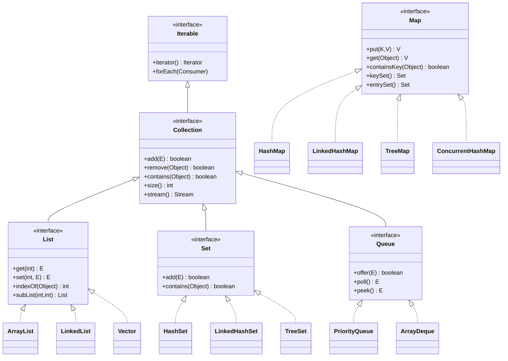
```mermaid
classDiagram
    class Iterable {
        <<interface>>
        +iterator() Iterator
        +forEach(Consumer)
    }
    class Collection {
        <<interface>>
        +add(E) boolean
        +remove(Object) boolean
        +contains(Object) boolean
        +size() int
        +stream() Stream
    }
    class List {
        <<interface>>
        +get(int) E
        +set(int, E) E
        +indexOf(Object) int
        +subList(int,int) List
    }
    class Set {
        <<interface>>
        +add(E) boolean
        +contains(Object) boolean
    }
    class Queue {
        <<interface>>
        +offer(E) boolean
        +poll() E
        +peek() E
    }
    class Map {
        <<interface>>
        +put(K,V) V
        +get(Object) V
        +containsKey(Object) boolean
        +keySet() Set
        +entrySet() Set
    }

    Iterable <|-- Collection
    Collection <|-- List
    Collection <|-- Set
    Collection <|-- Queue

    List <|.. ArrayList
    List <|.. LinkedList
    List <|.. Vector
    Set <|.. HashSet
    Set <|.. LinkedHashSet
    Set <|.. TreeSet
    Queue <|.. PriorityQueue
    Queue <|.. ArrayDeque
    Map <|.. HashMap
    Map <|.. LinkedHashMap
    Map <|.. TreeMap
    Map <|.. ConcurrentHashMap
```

---

### 5.5 Code Examples

```java
// 1. List operations — ArrayList vs LinkedList
List<String> arrayList = new ArrayList<>();  // prefer for most use cases
List<String> linkedList = new LinkedList<>(); // rarely needed

// Java 9+ factory methods (immutable)
List<String> immutable = List.of("A", "B", "C"); // throws UnsupportedOperationException on modify
List<String> copy = List.copyOf(mutableList);     // immutable copy

// Java 10+
var mutable = new ArrayList<>(List.of("A", "B", "C")); // mutable from immutable

// 2. Set operations
Set<String> hashSet = new HashSet<>();
hashSet.add("Java");
hashSet.add("Java"); // duplicate — ignored, returns false

Set<String> sorted = new TreeSet<>(hashSet); // sorted natural order
Set<String> ordered = new LinkedHashSet<>(hashSet); // insertion order

// Java 9+
Set<String> immutableSet = Set.of("A", "B", "C"); // immutable, no duplicates allowed

// 3. Queue / Deque
Queue<String> queue = new ArrayDeque<>(); // prefer over LinkedList for Queue/Stack
queue.offer("first");
queue.offer("second");
queue.poll(); // "first" (FIFO)

Deque<String> stack = new ArrayDeque<>(); // use as Stack (NOT java.util.Stack)
stack.push("bottom");
stack.push("top");
stack.pop(); // "top" (LIFO)

// 4. Map operations
Map<String, Integer> map = new HashMap<>();
map.put("Java", 1);
map.putIfAbsent("Python", 2);            // Java 8
map.computeIfAbsent("Go", k -> k.length()); // Java 8 — lazy computation
map.merge("Java", 1, Integer::sum);       // Java 8 — merge with function

// Java 9+
Map<String, Integer> immutableMap = Map.of("Java", 1, "Python", 2);
Map<String, Integer> entries = Map.ofEntries(
    Map.entry("Java", 1),
    Map.entry("Python", 2)
);

// 5. Streams integration (Java 8+)
List<String> filtered = arrayList.stream()
    .filter(s -> s.startsWith("J"))
    .sorted()
    .collect(Collectors.toList()); // or .toList() in Java 16+

// 6. Unmodifiable wrappers
List<String> unmod = Collections.unmodifiableList(mutableList);
// unmod.add("X"); // throws UnsupportedOperationException
// BUT: changes to mutableList ARE reflected in unmod! (it's a VIEW)

// Java 10 — truly immutable copy
List<String> immCopy = List.copyOf(mutableList); // NOT a view — independent copy
```

---

### 5.6 Java 8, 11, 17, 21 Relevance

| Version | Collections Change |
|---------|-------------------|
| **Java 8** | `forEach()`, `removeIf()`, `replaceAll()`, `sort()` on List. `Map.merge()`, `computeIfAbsent()`, `getOrDefault()`. Streams API. |
| **Java 9** | `List.of()`, `Set.of()`, `Map.of()`, `Map.ofEntries()` — immutable factory methods. |
| **Java 10** | `List.copyOf()`, `Set.copyOf()`, `Map.copyOf()` — immutable copies. `Collectors.toUnmodifiableList()`. |
| **Java 11** | `Collection.toArray(IntFunction)` — better array conversion. |
| **Java 16** | `Stream.toList()` — returns unmodifiable list (no Collector needed). |
| **Java 21** | Sequenced Collections — `SequencedCollection`, `SequencedSet`, `SequencedMap` with `getFirst()`, `getLast()`, `reversed()`. |

#### Java 21 Sequenced Collections (Important!)

```java
// Before Java 21: getting first/last element was inconsistent
List<String> list = List.of("A", "B", "C");
list.get(0);                    // first — easy
list.get(list.size() - 1);     // last — ugly

LinkedHashSet<String> set = new LinkedHashSet<>(List.of("A", "B", "C"));
set.iterator().next();          // first — okay
// last? — no direct method!

// Java 21: SequencedCollection
list.getFirst();    // "A"
list.getLast();     // "C"
list.reversed();    // reversed view: ["C", "B", "A"]

set.getFirst();     // "A"
set.getLast();      // "C"

// SequencedMap
LinkedHashMap<String, Integer> seqMap = new LinkedHashMap<>();
seqMap.put("A", 1);
seqMap.put("B", 2);
seqMap.firstEntry(); // A=1
seqMap.lastEntry();  // B=2
seqMap.reversed();   // reversed view
```

---

### 5.7 Frequently Asked Interview Questions

1. What is the difference between `Collection` and `Collections`?
2. What is the difference between `List`, `Set`, and `Map`?
3. When would you use `ArrayList` vs `LinkedList`?
4. What is the difference between `HashSet` and `TreeSet`?
5. Why is `Map` not part of the `Collection` interface?
6. What is the difference between `Iterator` and `ListIterator`?
7. What is `fail-fast` vs `fail-safe` iterator?
8. What are the Java 9 factory methods for collections?

---

### 5.8 Tricky Interview Questions with Answers

**Q1: "What happens if you modify a collection while iterating over it with a for-each loop?"**

**A:** You get `ConcurrentModificationException` — this is the **fail-fast** behavior. The iterator checks the `modCount` of the collection against its expected count.

```java
List<String> list = new ArrayList<>(List.of("A", "B", "C"));
for (String s : list) {
    if (s.equals("B")) {
        list.remove(s); // ConcurrentModificationException!
    }
}

// Fix 1: Use Iterator.remove()
Iterator<String> it = list.iterator();
while (it.hasNext()) {
    if (it.next().equals("B")) {
        it.remove(); // safe
    }
}

// Fix 2: Use removeIf (Java 8+)
list.removeIf(s -> s.equals("B")); // best approach
```

**Q2: "What is the difference between `Collections.unmodifiableList()` and `List.of()`?"**

| | `Collections.unmodifiableList(list)` | `List.of("A", "B")` |
|---|---|---|
| Returns | Unmodifiable **view** of the original list | Truly **immutable** list |
| Original mutation reflected? | Yes — it's a wrapper | N/A — no original |
| Null elements | Allowed (if original has nulls) | NOT allowed — throws NPE |
| Serializable | Yes | Yes |
| Backed by | Original list (shared reference) | Internal implementation |

**Q3: "Can you add `null` to a `TreeSet`?"**

**A:** No — `TreeSet` uses `compareTo()` (or `Comparator`) for ordering, which throws `NullPointerException` when comparing with null. `HashSet` allows one null. `LinkedHashSet` allows one null.

**Q4: "`ArrayList` vs `Vector` — which is thread-safe?"**

**A:** `Vector` is synchronized (every method), but it's **legacy** and slow. Don't use it. For thread safety, use:
- `Collections.synchronizedList(new ArrayList<>())` — synchronized wrapper
- `CopyOnWriteArrayList` — best for read-heavy, write-rare scenarios
- External synchronization with `ReentrantLock`

---

### 5.9 Common Misconceptions

| Misconception | Reality |
|---------------|---------|
| "`LinkedList` is faster for insertions" | Only for insert at **head/tail**. `ArrayList` is faster for insertions at known index due to CPU cache locality. Always benchmark. |
| "`Map` extends `Collection`" | No. `Map` is a separate hierarchy. `Map.values()` returns a `Collection`, but `Map` itself is not one. |
| "`HashSet` maintains insertion order" | No — use `LinkedHashSet` for insertion order, `TreeSet` for sorted order. |
| "`ConcurrentHashMap` allows null keys/values" | No — unlike `HashMap`, `ConcurrentHashMap` does NOT allow null keys or values. |
| "`List.of()` returns an `ArrayList`" | No — it returns an internal immutable implementation. You cannot add/remove elements. |
| "`Collections.sort()` is the only way to sort" | `List.sort(Comparator)` was added in Java 8 and is preferred (modifies in-place). |

---

### 5.10–5.20 (Condensed — detailed coverage in HashMap/HashSet sections)

#### Performance Comparison Table

| Implementation | `get` | `add`/`put` | `remove` | `contains` | Ordered | Thread-safe |
|---------------|-------|-------------|----------|-----------|---------|------------|
| **ArrayList** | O(1) | O(1)* / O(n) | O(n) | O(n) | Insertion | No |
| **LinkedList** | O(n) | O(1) ends | O(1) at iterator | O(n) | Insertion | No |
| **HashSet** | — | O(1) | O(1) | O(1) | No | No |
| **TreeSet** | — | O(log n) | O(log n) | O(log n) | Sorted | No |
| **HashMap** | O(1) | O(1) | O(1) | O(1) key | No | No |
| **TreeMap** | O(log n) | O(log n) | O(log n) | O(log n) | Sorted | No |
| **ConcurrentHashMap** | O(1) | O(1) | O(1) | O(1) | No | Yes |
| **ArrayDeque** | O(1) ends | O(1) | O(1) ends | O(n) | Insertion | No |
| **PriorityQueue** | O(1) peek | O(log n) | O(log n) | O(n) | Priority | No |

*O(1) amortized for ArrayList.add() at end

#### Best Practices

1. **Program to interfaces:** `List<String> list = new ArrayList<>()` — not `ArrayList<String> list = ...`
2. **Pre-size collections:** `new ArrayList<>(expectedSize)`, `new HashMap<>(capacity, 0.75f)`
3. **Prefer `ArrayDeque` over `Stack` and `LinkedList`** for stack/queue use cases
4. **Use `EnumSet` and `EnumMap`** for enum keys — faster than `HashSet`/`HashMap` (bit-vector / array-based)
5. **Use `List.of()`, `Set.of()`, `Map.of()`** for small immutable collections (Java 9+)
6. **Use `CopyOnWriteArrayList`** for read-heavy, write-rare concurrent lists
7. **Never use `Hashtable` or `Vector`** — they are legacy

#### Anti-Patterns

| Anti-Pattern | Fix |
|-------------|-----|
| Using `LinkedList` as a general-purpose List | Use `ArrayList` (better cache locality) |
| Using `Stack` class | Use `ArrayDeque` as a stack |
| Using raw types (`List list = new ArrayList()`) | Use generics (`List<String> list = new ArrayList<>()`) |
| `list.contains()` in a loop (O(n²)) | Convert to `Set` first for O(1) lookups |
| Not specifying initial capacity for large collections | Pre-size: `new ArrayList<>(10000)` |

---
---

## 6. HashMap Deep Dive

### 6.1 Core Definition

`HashMap<K,V>` is a hash table-based implementation of the `Map` interface. It stores key-value pairs using **hashing** to compute the bucket index for each key, providing **O(1) average** time complexity for `get()`, `put()`, and `remove()` operations.

**Key properties:**
- Allows ONE `null` key and multiple `null` values
- NOT synchronized (not thread-safe)
- Does NOT guarantee insertion order (use `LinkedHashMap` for order)
- Default initial capacity: **16**, default load factor: **0.75**
- Java 8: Buckets convert from linked list to **Red-Black Tree** when chain length > 8

---

### 6.2 Mental Model / Real World Analogy

Think of `HashMap` as a **library with numbered shelves (buckets)**:

1. **Key** = book title
2. **hashCode()** = a formula that converts the title into a shelf number
3. **Bucket** = the shelf where the book is placed
4. **Collision** = two books assigned to the same shelf (they're stacked in a list on that shelf)
5. **Treeification** = if too many books stack on one shelf (>8), we reorganize them into a sorted binary search structure for faster finding
6. **Resize** = when 75% of shelves are occupied, we double the number of shelves and redistribute all books

---

### 6.3 Internal Working (JVM Level)


#### Internal Data Structure

```java
// Simplified view of HashMap internals
public class HashMap<K,V> {
    // The hash table — array of Node (buckets)
    transient Node<K,V>[] table;

    // Number of key-value pairs
    transient int size;

    // Resize threshold = capacity * loadFactor
    int threshold;

    // Load factor (default 0.75)
    final float loadFactor;

    // Structural modification counter (for fail-fast iterators)
    transient int modCount;

    // Node — each bucket entry
    static class Node<K,V> implements Map.Entry<K,V> {
        final int hash;      // cached hash value
        final K key;
        V value;
        Node<K,V> next;      // linked list for collisions
    }

    // TreeNode — used when bucket chain > 8 (Java 8+)
    static final class TreeNode<K,V> extends LinkedHashMap.Entry<K,V> {
        TreeNode<K,V> parent;
        TreeNode<K,V> left;
        TreeNode<K,V> right;
        TreeNode<K,V> prev;
        boolean red;          // Red-Black tree color
    }
}
```

#### Hash Computation — The Spread Function

```java
static final int hash(Object key) {
    int h;
    return (key == null) ? 0 : (h = key.hashCode()) ^ (h >>> 16);
}
// Why XOR with upper 16 bits?
// Table index = hash & (capacity - 1)
// For capacity 16, index uses only lower 4 bits
// XOR spreads information from upper bits into lower bits
// This reduces collisions when hashCode() has patterns in upper bits
```

#### `put(key, value)` — Step by Step

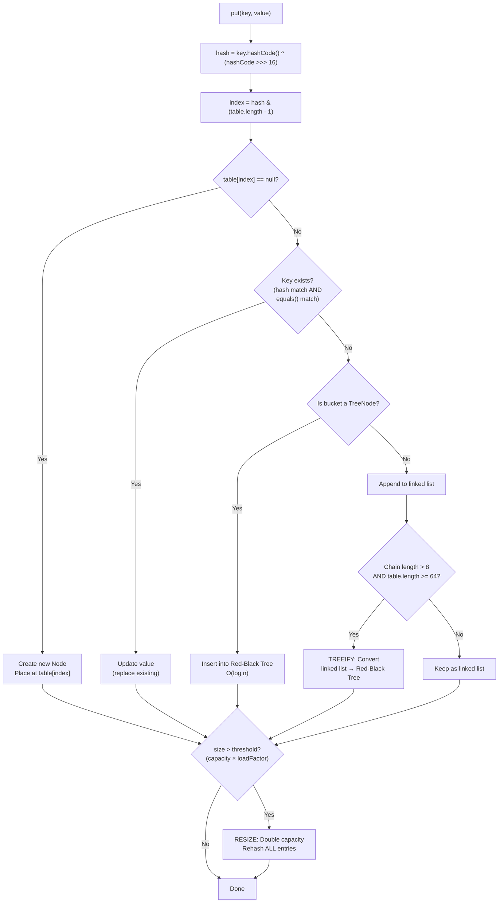
```mermaid
flowchart TD
    A["put(key, value)"] --> B["hash = key.hashCode() ^ (hashCode >>> 16)"]
    B --> C["index = hash & (table.length - 1)"]
    C --> D{"table[index] == null?"}
    D -->|Yes| E["Create new Node<br/>Place at table[index]"]
    D -->|No| F{"Key exists?<br/>(hash match AND<br/>equals() match)"}
    F -->|Yes| G["Update value<br/>(replace existing)"]
    F -->|No| H{"Is bucket a TreeNode?"}
    H -->|Yes| I["Insert into Red-Black Tree<br/>O(log n)"]
    H -->|No| J["Append to linked list"]
    J --> K{"Chain length > 8<br/>AND table.length >= 64?"}
    K -->|Yes| L["TREEIFY: Convert<br/>linked list → Red-Black Tree"]
    K -->|No| M["Keep as linked list"]
    E --> N{"size > threshold?<br/>(capacity × loadFactor)"}
    G --> N
    I --> N
    L --> N
    M --> N
    N -->|Yes| O["RESIZE: Double capacity<br/>Rehash ALL entries"]
    N -->|No| P["Done"]
    O --> P
```

#### `get(key)` — Step by Step

```java
// Pseudocode for get(key)
public V get(Object key) {
    int hash = hash(key);                    // compute hash
    int index = hash & (table.length - 1);   // compute bucket index
    Node<K,V> node = table[index];           // go to bucket

    if (node == null) return null;           // empty bucket

    // Check first node (most common case — no collision)
    if (node.hash == hash && (node.key == key || key.equals(node.key)))
        return node.value;

    // Traverse chain (linked list or tree)
    if (node instanceof TreeNode)
        return ((TreeNode<K,V>)node).getTreeNode(hash, key).value; // O(log n)
    else
        // Linear search through linked list — O(n)
        while ((node = node.next) != null) {
            if (node.hash == hash && (node.key == key || key.equals(node.key)))
                return node.value;
        }
    return null;
}
```

---

### 6.4 Architecture Diagram (Mermaid)

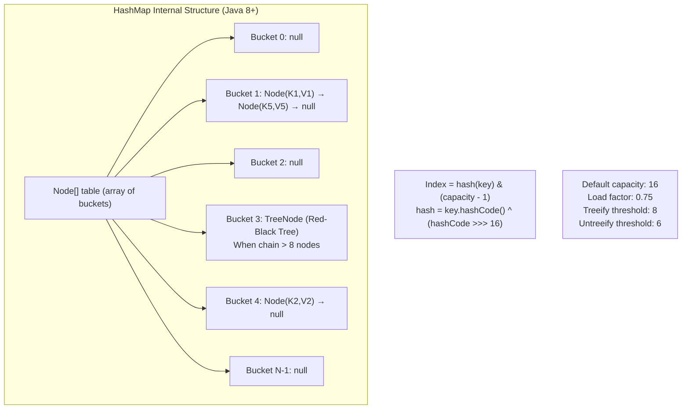
```mermaid
graph TB
    subgraph HASHMAP["HashMap Internal Structure (Java 8+)"]
        TABLE["Node[] table (array of buckets)"]

        B0["Bucket 0: null"]
        B1["Bucket 1: Node(K1,V1) → Node(K5,V5) → null"]
        B2["Bucket 2: null"]
        B3["Bucket 3: TreeNode (Red-Black Tree)<br/>When chain > 8 nodes"]
        B4["Bucket 4: Node(K2,V2) → null"]
        BN["Bucket N-1: null"]

        TABLE --> B0
        TABLE --> B1
        TABLE --> B2
        TABLE --> B3
        TABLE --> B4
        TABLE --> BN
    end

    FORMULA["Index = hash(key) & (capacity - 1)<br/>hash = key.hashCode() ^ (hashCode >>> 16)"]
    CONSTANTS["Default capacity: 16<br/>Load factor: 0.75<br/>Treeify threshold: 8<br/>Untreeify threshold: 6"]
```

---

### 6.5 Code Examples

```java
// 1. Basic HashMap operations
Map<String, Integer> map = new HashMap<>();
map.put("Alice", 30);
map.put("Bob", 25);
map.get("Alice");          // 30
map.containsKey("Bob");    // true
map.getOrDefault("Eve", 0); // 0 (Java 8)

// 2. Pre-sizing for known capacity (AVOID multiple resizes)
int expectedSize = 10000;
Map<String, Integer> presized = new HashMap<>(expectedSize * 4 / 3 + 1);
// Formula: capacity = expectedSize / loadFactor + 1

// 3. Java 8 Map methods
map.putIfAbsent("Alice", 99);           // no-op — Alice exists
map.computeIfAbsent("Eve", k -> 28);    // adds Eve=28 (lazy compute)
map.computeIfPresent("Alice", (k, v) -> v + 1); // Alice=31
map.merge("Bob", 5, Integer::sum);      // Bob=30 (25+5)
map.replaceAll((k, v) -> v * 2);        // double all values

// 4. Iterating HashMap — multiple ways
// Method 1: entrySet (most efficient)
for (Map.Entry<String, Integer> entry : map.entrySet()) {
    System.out.println(entry.getKey() + "=" + entry.getValue());
}

// Method 2: forEach (Java 8)
map.forEach((key, value) -> System.out.println(key + "=" + value));

// Method 3: keySet — AVOID if you also need values (extra lookup)
for (String key : map.keySet()) {
    map.get(key); // unnecessary extra hash lookup
}

// 5. Demonstrating equals/hashCode contract
class Employee {
    private int id;
    private String name;

    @Override
    public boolean equals(Object o) {
        if (this == o) return true;
        if (o == null || getClass() != o.getClass()) return false;
        Employee e = (Employee) o;
        return id == e.id && Objects.equals(name, e.name);
    }

    @Override
    public int hashCode() {
        return Objects.hash(id, name); // MUST override both!
    }
}

// 6. Mutable key problem
List<String> key = new ArrayList<>(List.of("A"));
Map<List<String>, String> badMap = new HashMap<>();
badMap.put(key, "value");
key.add("B");                    // mutates the key → changes hashCode!
badMap.get(key);                 // null! Key moved to wrong bucket
badMap.get(List.of("A"));       // null! Original bucket has wrong hash
// LESSON: Never use mutable objects as HashMap keys
```

---

### 6.6 Java 8, 11, 17, 21 Relevance

| Version | HashMap Change |
|---------|---------------|
| **Java 7** | Linked list for all collisions. Head insertion (new → front). Resize causes **infinite loop** bug under concurrency. |
| **Java 8** | **Treeification** (linked list → Red-Black Tree at 8 nodes). Tail insertion. Spread function `hash ^ (hash >>> 16)`. New methods: `computeIfAbsent`, `merge`, `forEach`. |
| **Java 9** | Immutable `Map.of()`, `Map.ofEntries()` factory methods. |
| **Java 10** | `Map.copyOf()` — immutable copy. |
| **Java 16** | Internal improvements to `HashMap` for compact record keys. |
| **Java 21** | Sequenced Maps — `LinkedHashMap` now implements `SequencedMap` with `firstEntry()`, `lastEntry()`, `reversed()`. |

---

### 6.7 Frequently Asked Interview Questions

1. How does `HashMap` work internally?
2. What is the default initial capacity and load factor?
3. What happens when two keys have the same `hashCode()`?
4. What is treeification and when does it happen?
5. Explain the `HashMap` resize process.
6. Why is `hashCode()` and `equals()` contract important for `HashMap`?
7. What is the time complexity of `get()` and `put()` in `HashMap`?
8. Can `HashMap` have `null` keys? How many?

---

### 6.8 Tricky Interview Questions with Answers

**Q1: "What is the difference between `HashMap` in Java 7 and Java 8?"**

| Aspect | Java 7 | Java 8 |
|--------|--------|--------|
| Collision handling | Linked list only | Linked list → Red-Black Tree (at 8 nodes) |
| Insertion order in chain | Head insertion (newest first) | Tail insertion (order preserved) |
| Worst-case `get()` | O(n) — all keys in one bucket | O(log n) — tree search |
| Concurrency bug | Infinite loop during resize (head insertion causes cycle) | No infinite loop (tail insertion) |
| Hash function | Multiple rounds of shifting/XOR | Simple `hash ^ (hash >>> 16)` |

**Q2: "What happens if you use a mutable object as a HashMap key?"**

**A:** If the object's state changes after insertion (affecting `hashCode()`), the entry becomes **unreachable**: `get()` looks in the wrong bucket (based on new hashCode), but the entry is stored in the old bucket. The entry leaks memory — it's there but can never be found or removed.

**Q3: "Why is the capacity always a power of 2?"**

**A:** So that `index = hash & (capacity - 1)` works as a fast modulo operation. For capacity 16: `hash & 15` is equivalent to `hash % 16` but faster (bitwise AND vs integer division). Powers of 2 make `capacity - 1` a bit mask of all 1s.

**Q4: "What is the treeify threshold and untreeify threshold? Why are they different?"**

**A:** Treeify threshold = **8** (convert list → tree). Untreeify threshold = **6** (convert tree → list during resize). They're different to prevent **thrashing** — if both were 8, a bucket oscillating between 7 and 8 nodes would constantly convert between list and tree.

**Q5: "Why does HashMap NOT allow null keys in ConcurrentHashMap?"**

**A:** Ambiguity: `get(key)` returning `null` could mean key doesn't exist OR value is `null`. In single-threaded `HashMap`, you can check `containsKey()` after `get()`. In concurrent code, another thread could modify between these two calls — making the check unreliable. Disallowing `null` eliminates this ambiguity.

---

### 6.9 Common Misconceptions

| Misconception | Reality |
|---------------|---------|
| "`HashMap` is ordered" | No. Use `LinkedHashMap` for insertion order, `TreeMap` for sorted order. |
| "Good `hashCode()` eliminates all collisions" | Impossible — infinite keys mapped to finite buckets. Good hash minimizes collisions. |
| "`hashCode()` must return unique values" | No — collisions are expected and handled. Only rule: equal objects must have equal hashCodes. |
| "Resize only happens when capacity is full" | Resize at `size > capacity × loadFactor` — so at 75% capacity (12/16), not 100%. |
| "`HashMap.get()` is always O(1)" | O(1) average. O(log n) worst case in Java 8+ (tree). O(n) worst in Java 7 (list). |

---

### 6.10 Edge Cases

1. **All keys hash to same bucket:** Worst case — all entries in one chain. Java 8: O(log n) due to treeification. Java 7: O(n).

2. **`null` key handling:** `null` key always goes to bucket 0 (`hash(null)` returns 0).

3. **`hashCode()` returns constant value:** All entries collide — O(log n) get/put with treeification, effectively a tree.

4. **HashMap with `Float.NaN` as key:**
```java
Map<Float, String> map = new HashMap<>();
map.put(Float.NaN, "NaN");
map.get(Float.NaN); // "NaN" — works because Float.hashCode(NaN) is consistent
// BUT: Float.NaN != Float.NaN in Java, so equals() uses Float.compare() internally
```

5. **Treeification requires `Comparable` keys:** If keys don't implement `Comparable`, tree falls back to comparing `hashCode()` and `System.identityHashCode()` for ordering.

---

### 6.11 Performance Considerations

| Operation | Average | Worst (Java 8+) | With pre-sizing |
|-----------|---------|-----------------|----------------|
| `put()` | O(1) | O(log n) | Avoids resize overhead |
| `get()` | O(1) | O(log n) | N/A |
| `remove()` | O(1) | O(log n) | N/A |
| `containsKey()` | O(1) | O(log n) | N/A |
| `containsValue()` | O(n) | O(n) | N/A — always linear scan |
| Resize | O(n) | O(n) | Eliminated with correct initial capacity |

**Pre-sizing formula:**
```java
// To avoid ANY resize for N entries:
int initialCapacity = (int)(expectedSize / 0.75) + 1;
// Or simpler: HashMap already rounds up to next power of 2
Map<K,V> map = new HashMap<>(expectedSize * 2);
```

---

### 6.12 Memory Implications

**Memory per entry in HashMap (64-bit, compressed oops):**

| Component | Size |
|-----------|------|
| `Node` object header | 12 bytes |
| `hash` (int) | 4 bytes |
| `key` (reference) | 4 bytes |
| `value` (reference) | 4 bytes |
| `next` (reference) | 4 bytes |
| Padding | 4 bytes |
| **Total per Node** | **32 bytes** |
| + Key object overhead | Variable |
| + Value object overhead | Variable |

**Empty HashMap:** ~128 bytes (HashMap object + empty Node[16] array)

> **Tip:** For very large maps, consider off-heap solutions (Chronicle Map, MapDB) or primitive-specialized maps (Eclipse Collections `IntIntHashMap`).

---

### 6.13 Thread Safety Considerations

| Scenario | Safe? | Solution |
|----------|-------|----------|
| Read-only after construction | Safe | No synchronization needed |
| Concurrent reads + writes | **UNSAFE** | Use `ConcurrentHashMap` |
| Multiple writers | **UNSAFE** | Use `ConcurrentHashMap` |
| Iteration during modification | `ConcurrentModificationException` | Use `ConcurrentHashMap` (weakly consistent iterator) |

**The Java 7 Infinite Loop Bug:**
```
// Thread 1 and Thread 2 both resize simultaneously
// Java 7 uses head insertion during transfer:
// Before: A → B → C
// After resize (Thread 1): C → B → A  (reversed)
// If Thread 2 also reverses: can create A → B → A (cycle!)
// Result: get() on this bucket → infinite loop → CPU 100%

// Java 8 fixed this with tail insertion (preserves order)
// BUT: HashMap is still not thread-safe! Use ConcurrentHashMap.
```

---

### 6.14 Production Scenarios

**Scenario 1:**
> "We are seeing **CPU spikes to 100% on one thread** in production under **high concurrent traffic**. How would you solve it using **HashMap analysis**?"

**Answer:**
1. Take a thread dump: `jstack <pid>` — look for a thread stuck in `HashMap.get()` or `HashMap.resize()`
2. This is the classic **Java 7 infinite loop** or race condition in Java 8 HashMap
3. Fix: Replace `HashMap` with `ConcurrentHashMap` for any map shared between threads
4. Validate with `-XX:+PrintFlagsFinal | grep Use` to confirm Java version
5. Add monitoring for threads stuck in `HashMap.*` methods

**Scenario 2:**
> "We are seeing **high GC pressure** in production under **high request volume creating many HashMaps**. How would you solve it using **HashMap optimization**?"

**Answer:**
1. Pre-size HashMaps to avoid resize: `new HashMap<>(expectedSize * 4 / 3 + 1)`
2. Reuse maps with `clear()` instead of creating new ones (pooling pattern)
3. Use `Map.of()` for small immutable maps (lower overhead)
4. Consider `EnumMap` if keys are enums (array-based, zero hashing overhead)
5. Profile allocation with JFR to find hot allocation sites

---

### 6.15 Follow-up Questions Interviewers Ask

**Q: "Why does HashMap use a Red-Black Tree instead of AVL Tree?"**

**A:** Red-Black Trees offer **faster insertions/deletions** than AVL trees (fewer rotations — at most 2 per insert vs O(log n) for AVL). AVL trees are more strictly balanced (faster lookups), but HashMap inserts more frequently than it searches within a single bucket. The Red-Black Tree is a better trade-off for HashMap's use case.

**Q: "How does ConcurrentHashMap achieve thread safety in Java 8?"**

**A:** Java 8 `ConcurrentHashMap` uses:
1. **CAS (Compare-And-Swap)** for the first node in each bucket (lock-free)
2. **`synchronized` on the first node** when the bucket already has entries (per-bucket lock, not global)
3. **No segment locks** (unlike Java 7 which used 16 Segment locks)
4. Result: Multiple threads can write to different buckets concurrently with zero contention

**Q: "What happens if `equals()` is overridden but `hashCode()` is not?"**

**A:** Objects that are `equal()` may have different `hashCode()`s → they go to different buckets → `get()` cannot find them. You can insert "duplicate" equal keys because they're in different buckets. The `hashCode`/`equals` contract is broken.

---

### 6.16 Comparison Tables

#### HashMap vs LinkedHashMap vs TreeMap

| Feature | HashMap | LinkedHashMap | TreeMap |
|---------|---------|--------------|---------|
| Order | None | Insertion/Access order | Sorted (natural/comparator) |
| `get()`/`put()` | O(1) | O(1) | O(log n) |
| Null keys | 1 allowed | 1 allowed | Not allowed |
| Backing structure | Hash table | Hash table + doubly-linked list | Red-Black Tree |
| Memory overhead | Lowest | Medium (prev/next pointers) | Higher (tree pointers + color) |
| Use case | General purpose | LRU cache, ordered iteration | Range queries, sorted data |
| Thread-safe | No | No | No |
| Java 21 | Map | SequencedMap | NavigableMap, SequencedMap |

#### HashMap vs ConcurrentHashMap

| Feature | HashMap | ConcurrentHashMap |
|---------|---------|------------------|
| Thread safety | No | Yes (lock-free reads, per-bucket locks for writes) |
| Null key | 1 allowed | NOT allowed |
| Null values | Allowed | NOT allowed |
| Iterator | Fail-fast (`ConcurrentModificationException`) | Weakly consistent (no exception) |
| Performance (single-thread) | Fastest | ~10-15% slower |
| Performance (multi-thread) | UNSAFE | Excellent (fine-grained locking) |
| `size()` accuracy | Exact | Approximate (eventually consistent) |
| Atomic operations | No | Yes (`computeIfAbsent`, `merge`, etc. are atomic) |

---

### 6.17 Internal JVM Details

#### Object Memory Layout of a HashMap.Node

```
┌────────────────────────────────────────────────┐
│ Node<K,V> Object (32 bytes with compressed oops)│
├────────────────────────────────────────────────┤
│ [Object Header]     12 bytes (mark + klass)    │
│ [hash: int]          4 bytes                   │
│ [key: reference]     4 bytes → Key object      │
│ [value: reference]   4 bytes → Value object    │
│ [next: reference]    4 bytes → next Node/null  │
│ [padding]            4 bytes                   │
├────────────────────────────────────────────────┤
│ Total: 32 bytes per entry (excluding key/value)│
└────────────────────────────────────────────────┘
```

#### Treeification Constants

```java
static final int TREEIFY_THRESHOLD = 8;    // list → tree
static final int UNTREEIFY_THRESHOLD = 6;  // tree → list (during resize)
static final int MIN_TREEIFY_CAPACITY = 64; // min table size for treeification
// If table.length < 64 AND chain > 8 → RESIZE instead of treeify
```

---

### 6.18 Best Practices

1. **Always override `hashCode()` when you override `equals()`** — use `Objects.hash()`.
2. **Use immutable objects as keys** — `String`, `Integer`, enums, Records.
3. **Pre-size for known capacity:** `new HashMap<>((int)(expected / 0.75) + 1)`.
4. **Use `computeIfAbsent()` for lazy initialization:**
   ```java
   map.computeIfAbsent("key", k -> expensiveComputation(k)); // atomic in ConcurrentHashMap
   ```
5. **Iterate with `entrySet()`** — not `keySet()` + `get()` (avoids double hash lookup).
6. **Use `Map.of()` for small constant maps** (Java 9+) — immutable, lower overhead.
7. **Use `ConcurrentHashMap` for concurrent access** — never synchronize a `HashMap` externally.
8. **Use `EnumMap` for enum keys** — O(1) array-based, no hashing.

---

### 6.19 Anti-Patterns

| Anti-Pattern | Problem | Fix |
|-------------|---------|-----|
| Mutable keys | Entry becomes unreachable after mutation | Use immutable keys (String, Integer, Record) |
| Missing `hashCode()` override | Duplicate "equal" keys, memory leak | Always override both `hashCode()` + `equals()` |
| Sharing HashMap across threads | Data corruption, infinite loops (Java 7), lost updates | Use `ConcurrentHashMap` |
| Iterating with `keySet()` + `get()` | Double hash lookup per entry | Use `entrySet()` or `forEach()` |
| Not pre-sizing | Multiple resizes (O(n) each) | Pre-size: `(int)(expected / 0.75) + 1` |
| Using `containsKey()` + `get()` | Double lookup | Use `getOrDefault()` or `computeIfAbsent()` |

---

### 6.20 Senior Developer Interview Perspective

**What distinguishes a senior answer on HashMap:**

A junior says: *"HashMap stores key-value pairs using hashing."*

A senior discusses:
- The **hash spreading function** `hash ^ (hash >>> 16)` and why it matters for reducing collisions
- **Treeification thresholds** (8 to treeify, 6 to untreeify) and the hysteresis to prevent thrashing
- The **Java 7 infinite loop bug** and why tail insertion in Java 8 prevents it (but still isn't thread-safe)
- **ConcurrentHashMap internals:** CAS for first node, synchronized per-bucket for subsequent nodes
- **Memory overhead per entry** (~32 bytes for Node + key/value objects) and when to use primitive-specialized maps
- How `LinkedHashMap` can implement an **LRU cache** by overriding `removeEldestEntry()`
- **WeakHashMap** for canonicalizing maps where entries should be GC'd when keys are no longer referenced

---
---

## 7. HashSet Internals

### 7.1 Core Definition

`HashSet<E>` is a `Set` implementation backed entirely by a `HashMap`. It stores elements as **keys** in an internal `HashMap`, with a shared dummy `Object` (`PRESENT`) as the value for all entries. This means all of `HashMap`'s properties (hashing, treeification, resize) apply to `HashSet`.

```java
// Actual source code (simplified)
public class HashSet<E> implements Set<E> {
    private transient HashMap<E, Object> map;
    private static final Object PRESENT = new Object(); // dummy value

    public HashSet() {
        map = new HashMap<>();
    }

    public boolean add(E e) {
        return map.put(e, PRESENT) == null; // returns true if new
    }

    public boolean contains(Object o) {
        return map.containsKey(o);
    }

    public boolean remove(Object o) {
        return map.remove(o) == PRESENT;
    }

    public int size() {
        return map.size();
    }
}
```

> **Interview Insight:** Understanding `HashSet` = understanding `HashMap`. The question "How does HashSet work internally?" is really asking "Do you know that it delegates to HashMap?"

---

### 7.2 Mental Model / Real World Analogy

`HashSet` is like a **guest list at an exclusive party**:
- You can add names (elements) to the list
- No duplicates allowed — if "Alice" is already on the list, adding "Alice" again has no effect
- Checking if someone is on the list is instant (O(1)) — like looking up a name in a hash-indexed guest book
- The order names appear on the list is unpredictable (no guaranteed order)
- Behind the scenes, each name is stored in a filing cabinet (HashMap) where the name is the label (key) and each drawer contains a generic "check mark" (the PRESENT dummy object)

---

### 7.3 Internal Working (JVM Level)


#### How `add(element)` Works

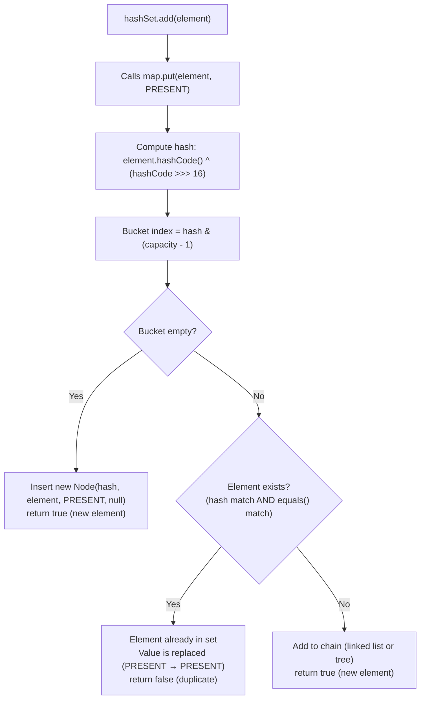
```mermaid
flowchart TD
    A["hashSet.add(element)"] --> B["Calls map.put(element, PRESENT)"]
    B --> C["Compute hash: element.hashCode() ^ (hashCode >>> 16)"]
    C --> D["Bucket index = hash & (capacity - 1)"]
    D --> E{"Bucket empty?"}
    E -->|Yes| F["Insert new Node(hash, element, PRESENT, null)<br/>return true (new element)"]
    E -->|No| G{"Element exists?<br/>(hash match AND equals() match)"}
    G -->|Yes| H["Element already in set<br/>Value is replaced (PRESENT → PRESENT)<br/>return false (duplicate)"]
    G -->|No| I["Add to chain (linked list or tree)<br/>return true (new element)"]
```

#### Memory Layout

```
HashSet<String> containing {"Java", "Python", "Go"}

HashSet object:
  └── HashMap<String, Object> map
        └── Node[] table (16 buckets, default)
              ├── Bucket 3: Node("Java", PRESENT) → null
              ├── Bucket 7: Node("Python", PRESENT) → null
              ├── Bucket 11: Node("Go", PRESENT) → null
              └── Other buckets: null

PRESENT = single static Object instance shared by ALL entries
```

---

### 7.4 Architecture Diagram (Mermaid)

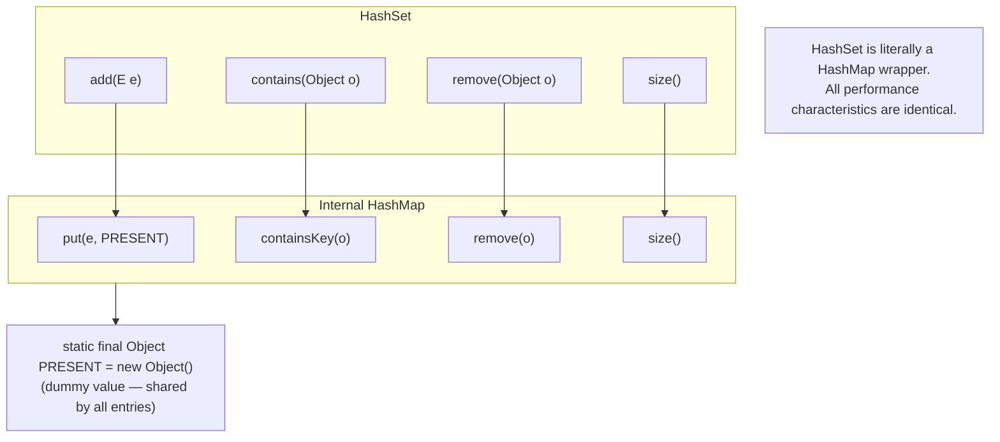
```mermaid
graph TB
    subgraph HASHSET["HashSet<E>"]
        ADD["add(E e)"]
        CONTAINS["contains(Object o)"]
        REMOVE["remove(Object o)"]
        SIZE["size()"]
    end

    subgraph HASHMAP["Internal HashMap<E, Object>"]
        PUT["put(e, PRESENT)"]
        CKEY["containsKey(o)"]
        REM["remove(o)"]
        SZ["size()"]
    end

    ADD --> PUT
    CONTAINS --> CKEY
    REMOVE --> REM
    SIZE --> SZ

    PRESENT_OBJ["static final Object PRESENT = new Object()<br/>(dummy value — shared by all entries)"]
    HASHMAP --> PRESENT_OBJ

    NOTE["HashSet is literally a HashMap wrapper.<br/>All performance characteristics are identical."]
```

---

### 7.5 Code Examples

```java
// 1. Basic HashSet operations
Set<String> set = new HashSet<>();
set.add("Java");     // true (new)
set.add("Python");   // true (new)
set.add("Java");     // false (duplicate)
set.contains("Java"); // true — O(1)
set.remove("Python"); // true
set.size();           // 1

// 2. HashSet with custom objects — MUST override equals() and hashCode()
class Employee {
    private int id;
    private String name;

    public Employee(int id, String name) {
        this.id = id;
        this.name = name;
    }

    @Override
    public boolean equals(Object o) {
        if (this == o) return true;
        if (o == null || getClass() != o.getClass()) return false;
        Employee e = (Employee) o;
        return id == e.id && Objects.equals(name, e.name);
    }

    @Override
    public int hashCode() {
        return Objects.hash(id, name);
    }
}

Set<Employee> employees = new HashSet<>();
employees.add(new Employee(1, "Alice"));
employees.add(new Employee(1, "Alice")); // duplicate — ignored
employees.size(); // 1

// 3. Converting between List and Set (removing duplicates)
List<String> withDuplicates = List.of("A", "B", "A", "C", "B");
Set<String> unique = new LinkedHashSet<>(withDuplicates); // preserves insertion order
// unique = {A, B, C}
List<String> deduplicated = new ArrayList<>(unique);
// deduplicated = [A, B, C]

// 4. Set operations (union, intersection, difference)
Set<Integer> setA = new HashSet<>(Set.of(1, 2, 3, 4));
Set<Integer> setB = new HashSet<>(Set.of(3, 4, 5, 6));

// Union
Set<Integer> union = new HashSet<>(setA);
union.addAll(setB); // {1, 2, 3, 4, 5, 6}

// Intersection
Set<Integer> intersection = new HashSet<>(setA);
intersection.retainAll(setB); // {3, 4}

// Difference (A - B)
Set<Integer> difference = new HashSet<>(setA);
difference.removeAll(setB); // {1, 2}

// 5. Using Set with Streams (Java 8+)
Set<String> filtered = set.stream()
    .filter(s -> s.length() > 3)
    .collect(Collectors.toSet()); // returns HashSet

// Unmodifiable Set (Java 10+)
Set<String> immutable = Set.copyOf(set);
```

---

### 7.6 Java 8, 11, 17, 21 Relevance

| Version | HashSet/Set Change |
|---------|-------------------|
| **Java 8** | HashSet inherits HashMap's treeification (bucket chains > 8 → Red-Black Tree). Streams: `Collectors.toSet()`. |
| **Java 9** | `Set.of()` factory methods — immutable sets. No nulls allowed, no duplicates allowed (throws `IllegalArgumentException`). |
| **Java 10** | `Set.copyOf(collection)` — immutable copy. `Collectors.toUnmodifiableSet()`. |
| **Java 16** | `stream.toList()` (not `toSet()` though — still need `Collectors.toSet()`). |
| **Java 21** | `LinkedHashSet` implements `SequencedSet` with `getFirst()`, `getLast()`, `reversed()`. |

---

### 7.7 Frequently Asked Interview Questions

1. How does `HashSet` work internally?
2. How does `HashSet` ensure uniqueness?
3. What is the role of `equals()` and `hashCode()` in `HashSet`?
4. What is the default capacity and load factor of `HashSet`?
5. Can `HashSet` contain `null`?
6. What is the difference between `HashSet`, `LinkedHashSet`, and `TreeSet`?

---

### 7.8 Tricky Interview Questions with Answers

**Q1: "What is the PRESENT object in HashSet?"**

**A:** `PRESENT` is a `private static final Object PRESENT = new Object()` — a singleton dummy object used as the value for all entries in the internal HashMap. Since HashSet only cares about keys (not values), all entries share this same object to minimize memory overhead.

**Q2: "What happens if you override `equals()` but not `hashCode()` and add objects to a HashSet?"**

**A:** You can add "duplicate" objects that are logically equal (via `equals()`) because they may have different `hashCode()`s (inherited from `Object` — based on memory address). They'll be placed in different buckets, so `contains()` won't find them either.

```java
class BadKey {
    int id;
    BadKey(int id) { this.id = id; }

    @Override
    public boolean equals(Object o) {
        return o instanceof BadKey && ((BadKey)o).id == this.id;
    }
    // hashCode() NOT overridden — uses Object.hashCode() (memory address)
}

Set<BadKey> set = new HashSet<>();
set.add(new BadKey(1));
set.add(new BadKey(1)); // different hashCode → different bucket → added!
set.size(); // 2 — BUG! Should be 1
```

**Q3: "Is HashSet faster than TreeSet? Always?"**

| Operation | HashSet | TreeSet |
|-----------|---------|---------|
| `add()` | O(1) avg | O(log n) |
| `contains()` | O(1) avg | O(log n) |
| `remove()` | O(1) avg | O(log n) |
| Sorted iteration | O(n log n) (must sort separately) | O(n) (already sorted) |
| Range queries (`headSet`, `tailSet`) | Not supported | O(log n) |

**Answer:** HashSet is faster for add/contains/remove. TreeSet is better when you need sorted iteration or range queries.

**Q4: "How much memory does a HashSet use per element?"**

**A:** ~36 bytes per element overhead:
- HashMap.Node: 32 bytes (header + hash + key ref + value ref + next ref + padding)
- PRESENT object: shared (one-time 16 bytes for the singleton)
- Plus the element object itself (e.g., String "Hello" ≈ 56 bytes)

Total for `HashSet<String>` with "Hello": ~88 bytes per entry. For large sets, consider specialized collections (Eclipse Collections `ObjectHashSet`, Koloboke).

---

### 7.9 Common Misconceptions

| Misconception | Reality |
|---------------|---------|
| "HashSet maintains insertion order" | No — use `LinkedHashSet` for insertion order |
| "HashSet creates a new HashMap for each element" | No — one internal HashMap, elements are keys |
| "HashSet.add() returns the old element" | No — returns `boolean` (true=new, false=duplicate) |
| "Two different HashSets can share the same internal HashMap" | No — each HashSet has its own HashMap instance |
| "HashSet and HashMap have different performance" | Same performance — HashSet delegates to HashMap |

---

### 7.10 Edge Cases

1. **`null` element:** `HashSet` allows ONE `null` element (HashMap allows one `null` key).
2. **`Set.of()` does NOT allow `null`:**
```java
Set.of("A", null); // NullPointerException at creation time!
```
3. **`Set.of()` does NOT allow duplicates:**
```java
Set.of("A", "A"); // IllegalArgumentException: duplicate element!
```
4. **Mutating an element after adding to HashSet:**
```java
List<String> list = new ArrayList<>(List.of("A"));
Set<List<String>> set = new HashSet<>();
set.add(list);
list.add("B"); // mutates the element → hashCode changes
set.contains(list); // false! Element is "lost"
```

---

### 7.11–7.16 Performance, Memory, Thread Safety, Production Scenarios

(Same as HashMap — HashSet delegates entirely to HashMap. All HashMap considerations apply.)

**Thread-safe alternatives to HashSet:**
- `Collections.synchronizedSet(new HashSet<>())` — coarse-grained lock
- `ConcurrentHashMap.newKeySet()` — backed by ConcurrentHashMap (Java 8+, recommended)
- `CopyOnWriteArraySet` — good for small, read-heavy sets

```java
// Best concurrent Set (Java 8+)
Set<String> concurrentSet = ConcurrentHashMap.newKeySet();
concurrentSet.add("Thread-safe!");
```

---

### 7.17–7.18 Best Practices

1. **Always override both `equals()` AND `hashCode()`** for custom objects in HashSet.
2. **Use immutable objects as elements** — mutating elements after insertion breaks the set.
3. **Use `LinkedHashSet` when order matters** — negligible performance overhead.
4. **Use `EnumSet` for enum sets** — uses bit-vector internally, extremely fast and memory-efficient.
5. **Use `Set.of()` for small constant sets** (Java 9+).
6. **Use `ConcurrentHashMap.newKeySet()` for concurrent sets** — not `Collections.synchronizedSet()`.
7. **Pre-size:** `new HashSet<>((int)(expectedSize / 0.75) + 1)`.

---

### 7.19 Anti-Patterns

| Anti-Pattern | Problem | Fix |
|-------------|---------|-----|
| Missing `hashCode()` override | Duplicates allowed, `contains()` fails | Override both `hashCode()` + `equals()` |
| Using mutable objects as elements | Elements become "lost" after mutation | Use immutable objects |
| Using `Collections.synchronizedSet()` | Coarse lock, poor concurrency | Use `ConcurrentHashMap.newKeySet()` |
| Using `set.contains()` in a loop on a List | Already O(1) in Set | Correct — but build the Set first, then loop |
| Using `TreeSet` when order doesn't matter | O(log n) vs O(1) overhead | Use `HashSet` |

---

### 7.20 Senior Developer Interview Perspective

A senior knows:
- HashSet **is** a HashMap — the `PRESENT` constant is the value for all entries
- The real cost is in `hashCode()` quality — poor hash functions cause O(n) degradation
- `ConcurrentHashMap.newKeySet()` is the correct concurrent Set in modern Java
- `EnumSet` is orders of magnitude faster than `HashSet<Enum>` — uses a single `long` bit-vector for up to 64 enum constants
- For massive sets (millions of elements), consider off-heap or specialized libraries (Eclipse Collections, HPPC)

---
---

## 8. Concurrency & Multithreading

### 8.1 Core Definition

**Multithreading** in Java is the ability to execute multiple threads concurrently within a single process. A **thread** is the smallest unit of execution within a process. Java provides built-in support for multithreading through the `Thread` class, `Runnable`/`Callable` interfaces, and the `java.util.concurrent` package.

**Key Concepts:**
- **Process:** An independent program with its own memory space
- **Thread:** A lightweight sub-process sharing the parent process's memory (heap)
- **Concurrency:** Multiple tasks making progress (may interleave on single core)
- **Parallelism:** Multiple tasks executing simultaneously (requires multi-core)

---

### 8.2 Mental Model / Real World Analogy

Think of a **restaurant kitchen**:
- **Process** = the entire restaurant
- **Thread** = an individual chef
- **Shared heap** = the shared kitchen counter (all chefs access it)
- **Thread stack** = each chef's personal cutting board (private workspace)
- **Race condition** = two chefs grabbing the same ingredient simultaneously
- **Deadlock** = Chef A has the pan and needs the spatula; Chef B has the spatula and needs the pan — both wait forever
- **Thread pool** = a fixed number of chefs — new orders go to a queue, not new hires

---

### 8.3 Internal Working (JVM Level)


#### Thread Lifecycle (State Machine)

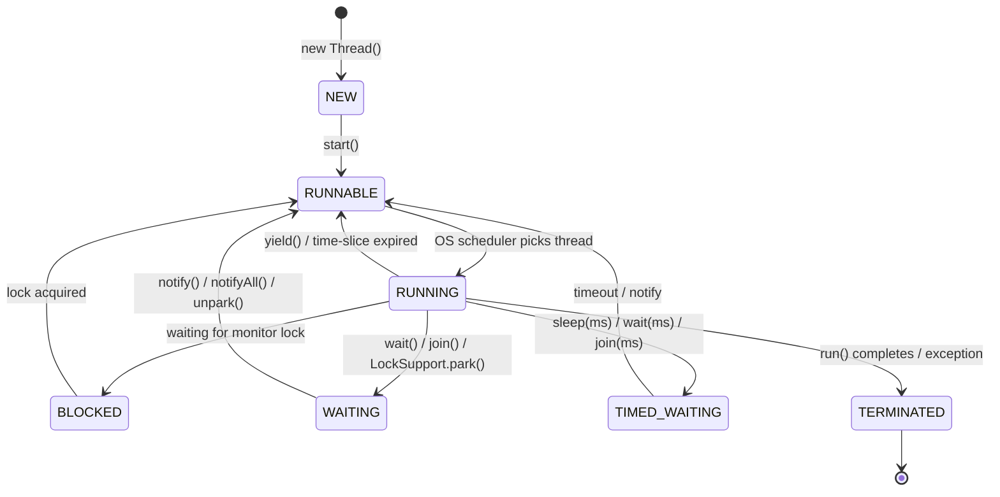
```mermaid
stateDiagram-v2
    [*] --> NEW: new Thread()
    NEW --> RUNNABLE: start()
    RUNNABLE --> RUNNING: OS scheduler picks thread
    RUNNING --> RUNNABLE: yield() / time-slice expired
    RUNNING --> BLOCKED: waiting for monitor lock
    RUNNING --> WAITING: wait() / join() / LockSupport.park()
    RUNNING --> TIMED_WAITING: sleep(ms) / wait(ms) / join(ms)
    BLOCKED --> RUNNABLE: lock acquired
    WAITING --> RUNNABLE: notify() / notifyAll() / unpark()
    TIMED_WAITING --> RUNNABLE: timeout / notify
    RUNNING --> TERMINATED: run() completes / exception
    TERMINATED --> [*]
```

#### How Threads Map to OS

Java threads are **1:1 mapped to OS (kernel) threads** in HotSpot JVM. Each `new Thread()` creates an OS thread with:
- ~1MB native stack (`-Xss`)
- Kernel data structures
- Context switch cost (~1-10μs)

> **Java 21 Virtual Threads:** Many-to-many mapping. Millions of virtual threads multiplexed onto a few OS carrier threads. Stack is heap-allocated and grows dynamically (~few KB initially).

---

### 8.4 Architecture Diagram (Mermaid)

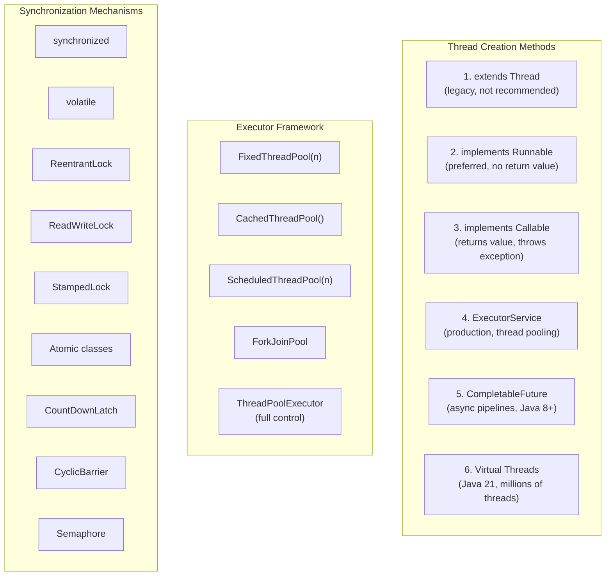
```mermaid
flowchart TB
    subgraph THREAD_CREATION["Thread Creation Methods"]
        T1["1. extends Thread<br/>(legacy, not recommended)"]
        T2["2. implements Runnable<br/>(preferred, no return value)"]
        T3["3. implements Callable<K><br/>(returns value, throws exception)"]
        T4["4. ExecutorService<br/>(production, thread pooling)"]
        T5["5. CompletableFuture<br/>(async pipelines, Java 8+)"]
        T6["6. Virtual Threads<br/>(Java 21, millions of threads)"]
    end

    subgraph EXECUTOR["Executor Framework"]
        FTP["FixedThreadPool(n)"]
        CTP["CachedThreadPool()"]
        STP["ScheduledThreadPool(n)"]
        FJP["ForkJoinPool"]
        TPE["ThreadPoolExecutor<br/>(full control)"]
    end

    subgraph SYNC["Synchronization Mechanisms"]
        SYN["synchronized"]
        VOL["volatile"]
        RL["ReentrantLock"]
        RWL["ReadWriteLock"]
        SL["StampedLock"]
        ATM["Atomic classes"]
        CD["CountDownLatch"]
        CB["CyclicBarrier"]
        SEM["Semaphore"]
    end
```

---

### 8.5 Code Examples

```java
// 1. Thread creation — 3 ways
// Way 1: Extend Thread (not recommended — uses up inheritance)
class MyThread extends Thread {
    @Override
    public void run() { System.out.println("Thread: " + getName()); }
}

// Way 2: Implement Runnable (preferred — composition over inheritance)
Runnable task = () -> System.out.println("Runnable: " + Thread.currentThread().getName());
new Thread(task, "worker-1").start();

// Way 3: Callable + Future (returns value)
Callable<Integer> callable = () -> { return 42; };
ExecutorService exec = Executors.newSingleThreadExecutor();
Future<Integer> future = exec.submit(callable);
int result = future.get(); // blocks until complete — 42

// 2. ThreadPoolExecutor — PRODUCTION CONFIGURATION
ThreadPoolExecutor executor = new ThreadPoolExecutor(
    10,                                      // corePoolSize
    50,                                      // maximumPoolSize
    60L, TimeUnit.SECONDS,                   // keepAliveTime for idle threads
    new LinkedBlockingQueue<>(1000),          // workQueue — BOUNDED!
    new ThreadFactory() {                    // named threads for debugging
        private final AtomicInteger count = new AtomicInteger();
        @Override
        public Thread newThread(Runnable r) {
            Thread t = new Thread(r, "order-processor-" + count.incrementAndGet());
            t.setDaemon(false);
            return t;
        }
    },
    new ThreadPoolExecutor.CallerRunsPolicy() // rejection → caller executes
);

// 3. CompletableFuture — Async pipelines (Java 8+)
CompletableFuture<String> pipeline = CompletableFuture
    .supplyAsync(() -> fetchUser(userId), executor)          // async fetch
    .thenApply(user -> enrichUser(user))                     // sync transform
    .thenCompose(user -> fetchOrdersAsync(user.getId()))     // async flatMap
    .thenApply(orders -> formatResponse(orders))             // transform
    .exceptionally(ex -> {                                   // error handling
        log.error("Pipeline failed", ex);
        return "fallback response";
    });

String result = pipeline.join(); // block for result (unchecked exception)

// Combine multiple futures
CompletableFuture<String> userFuture = CompletableFuture.supplyAsync(() -> fetchUser());
CompletableFuture<List<Order>> orderFuture = CompletableFuture.supplyAsync(() -> fetchOrders());

CompletableFuture<String> combined = userFuture
    .thenCombine(orderFuture, (user, orders) -> buildResponse(user, orders));

// Wait for all
CompletableFuture.allOf(future1, future2, future3)
    .thenRun(() -> System.out.println("All done!"));

// 4. Virtual Threads (Java 21)
// Create millions of threads — each uses only a few KB
try (var executor = Executors.newVirtualThreadPerTaskExecutor()) {
    for (int i = 0; i < 1_000_000; i++) {
        executor.submit(() -> {
            Thread.sleep(Duration.ofSeconds(1));
            return "done";
        });
    }
} // executor.close() waits for all tasks

// 5. Structured Concurrency (Java 21 Preview)
try (var scope = new StructuredTaskScope.ShutdownOnFailure()) {
    Subtask<String> user = scope.fork(() -> fetchUser());
    Subtask<List<Order>> orders = scope.fork(() -> fetchOrders());

    scope.join();           // wait for both
    scope.throwIfFailed();  // propagate exceptions

    return new Response(user.get(), orders.get());
}
```

---

### 8.6 Java 8, 11, 17, 21 Relevance

| Version | Concurrency Change |
|---------|-------------------|
| **Java 5** | `java.util.concurrent` package. `ExecutorService`, `Future`, `ConcurrentHashMap`, `ReentrantLock`, atomic classes. |
| **Java 7** | `ForkJoinPool`, `Phaser`, `TransferQueue`. |
| **Java 8** | `CompletableFuture`, `StampedLock`, parallel streams, `LongAdder`/`LongAccumulator`. |
| **Java 9** | `CompletableFuture` enhancements: `orTimeout()`, `completeOnTimeout()`, `copy()`. Reactive Streams (`Flow` API). |
| **Java 11** | `HttpClient` with async support. |
| **Java 19** | Virtual Threads (preview). Structured Concurrency (incubator). |
| **Java 21** | **Virtual Threads (GA)**. Structured Concurrency (preview). Scoped Values (preview, replaces ThreadLocal for virtual threads). |

---

### 8.7 Frequently Asked Interview Questions

1. What is the difference between a process and a thread?
2. How do you create a thread in Java? Which way is preferred?
3. What is the difference between `Runnable` and `Callable`?
4. What is a thread pool and why should you use one?
5. What is `CompletableFuture` and how is it better than `Future`?
6. What is the difference between `submit()` and `execute()` in ExecutorService?
7. What are virtual threads in Java 21?
8. What is a daemon thread?

---

### 8.8 Tricky Interview Questions with Answers

**Q1: "What is the difference between `t.start()` and `t.run()`?"**

| | `start()` | `run()` |
|---|---|---|
| Thread creation | Creates new OS thread | Runs on **current** thread (no new thread!) |
| Execution | Asynchronous (new thread) | Synchronous (same thread) |
| Can call twice? | No — `IllegalThreadStateException` | Yes — it's just a method call |
| Thread state | NEW → RUNNABLE | No state change |

```java
Thread t = new Thread(() -> System.out.println(Thread.currentThread().getName()));
t.run();    // Prints "main" — runs on calling thread!
t.start();  // Prints "Thread-0" — runs on new thread
```

**Q2: "What happens if `Executors.newFixedThreadPool(10)` receives 1000 tasks?"**

**A:** 10 tasks execute immediately. The remaining 990 queue in `LinkedBlockingQueue` (unbounded by default — capacity `Integer.MAX_VALUE`). Under sustained load, this is a **memory bomb** — millions of queued tasks = OOM.

**Fix:** Use `ThreadPoolExecutor` with a **bounded queue**:
```java
new ThreadPoolExecutor(10, 10, 0L, TimeUnit.MILLISECONDS,
    new LinkedBlockingQueue<>(100),      // bounded!
    new ThreadPoolExecutor.CallerRunsPolicy()); // back-pressure
```

**Q3: "What is a race condition? Give a real example."**

**A:** A race condition occurs when the outcome depends on the unpredictable timing of thread execution.

```java
class Counter {
    private int count = 0;

    public void increment() {
        count++; // NOT atomic! This is: read → increment → write (3 steps)
    }
}

// Two threads calling increment() 1000 times each:
// Expected: count = 2000
// Actual: count < 2000 (lost updates due to race condition)

// Fix 1: synchronized
public synchronized void increment() { count++; }

// Fix 2: AtomicInteger (lock-free, better performance)
private AtomicInteger count = new AtomicInteger(0);
public void increment() { count.incrementAndGet(); }
```

**Q4: "Explain deadlock and how to prevent it."**

```java
// DEADLOCK: Thread 1 locks A then B. Thread 2 locks B then A.
Object lockA = new Object();
Object lockB = new Object();

// Thread 1
synchronized(lockA) {
    Thread.sleep(100);
    synchronized(lockB) { /* ... */ }  // waits for Thread 2 to release B
}

// Thread 2
synchronized(lockB) {
    Thread.sleep(100);
    synchronized(lockA) { /* ... */ }  // waits for Thread 1 to release A
}
// Both wait forever → DEADLOCK
```

**Prevention strategies:**
1. **Lock ordering:** Always acquire locks in the same order (A → B, never B → A)
2. **Lock timeout:** Use `tryLock(timeout)` with `ReentrantLock`
3. **Avoid nested locks:** Minimize lock scope
4. **Use concurrent collections:** `ConcurrentHashMap` eliminates need for explicit locks

---

### 8.9–8.13 Common Misconceptions, Edge Cases, Performance, Memory, Thread Safety

#### Common Misconceptions

| Misconception | Reality |
|---------------|---------|
| "`Thread.sleep()` releases locks" | No — `sleep()` keeps all locks. Only `wait()` releases the monitor lock. |
| "Parallel streams are always faster" | Only for CPU-bound tasks on large data. For I/O-bound or small data, sequential is faster. |
| "`volatile` makes operations atomic" | `volatile` ensures visibility, not atomicity. `count++` on volatile is still not atomic. |
| "Daemon threads always complete before JVM shuts down" | JVM exits when only daemon threads remain — they may be terminated mid-execution. |
| "`CompletableFuture` runs on a separate thread" | By default, `thenApply()` runs on the completing thread. Use `thenApplyAsync()` for separate thread. |

#### Thread Pool Sizing Guidelines

| Task Type | Formula | Example (8-core machine) |
|-----------|---------|-------------------------|
| **CPU-bound** | `cores + 1` | 9 threads |
| **I/O-bound** | `cores × (1 + wait_time/compute_time)` | 8 × (1 + 10/1) = 88 threads |
| **Mixed** | Profile and tune | Start with `cores × 2`, measure |

---

### 8.14 Production Scenarios

**Scenario 1:**
> "We are seeing **thread exhaustion** in production under **high concurrent API calls to external services**. How would you solve it using **virtual threads**?"

**Answer:**
1. **Problem:** 200 platform threads × 1MB stack = 200MB. External API calls block for 500ms each. Thread pool is saturated.
2. **Java 21 solution:** Replace platform thread pool with virtual threads:
   ```java
   // Before (limited by thread pool size)
   ExecutorService exec = Executors.newFixedThreadPool(200);

   // After (millions of concurrent I/O tasks)
   ExecutorService exec = Executors.newVirtualThreadPerTaskExecutor();
   ```
3. **Key:** Virtual threads are cheap (~few KB). Blocking I/O on virtual threads is fine — the carrier thread is released to run other virtual threads.
4. **Caveat:** Don't use virtual threads for CPU-bound tasks — they share the common ForkJoinPool.

**Scenario 2:**
> "We are seeing **`RejectedExecutionException`** in production under **traffic spikes**. How would you solve it using **thread pool configuration**?"

**Answer:**
1. Check current pool configuration — likely unbounded `newFixedThreadPool` with default rejection
2. Switch to `ThreadPoolExecutor` with:
   - Bounded queue (e.g., 1000)
   - `CallerRunsPolicy` for back-pressure (caller thread executes the task, slowing down producers)
   - Monitor queue depth as a metric
3. Add circuit breaker (Resilience4j) for external service calls
4. Consider adaptive pool sizing based on load

---

### 8.15–8.20 Condensed

#### Comparison: Future vs CompletableFuture

| Feature | Future | CompletableFuture |
|---------|--------|-------------------|
| Blocking | `get()` blocks | `thenApply()`, `thenCompose()` non-blocking |
| Chaining | Not possible | Full pipeline support |
| Combining | Not possible | `allOf()`, `anyOf()`, `thenCombine()` |
| Error handling | `try-catch` on `get()` | `exceptionally()`, `handle()` |
| Manual completion | No | `complete()`, `completeExceptionally()` |
| Timeout | No (Java 5-8) | `orTimeout()`, `completeOnTimeout()` (Java 9+) |

#### Platform Threads vs Virtual Threads (Java 21)

| Aspect | Platform Thread | Virtual Thread |
|--------|----------------|----------------|
| Creation cost | ~1ms, ~1MB stack | ~1μs, ~few KB stack |
| Max count | ~thousands (limited by OS/memory) | Millions |
| Scheduling | OS kernel scheduler | JVM (ForkJoinPool carrier threads) |
| Blocking I/O | Thread blocked (wasted) | Carrier thread released (efficient) |
| CPU-bound work | Ideal | Not ideal (shares carrier threads) |
| ThreadLocal | Works (but uses 1MB per thread) | Works but Scoped Values preferred |
| Best for | CPU-bound, legacy code | I/O-bound, high-concurrency |

#### Best Practices

1. **Never create raw threads in production** — use `ExecutorService` or virtual threads
2. **Always use bounded queues** in thread pools
3. **Name your threads** — essential for debugging (`thread-pool-name-N`)
4. **Shut down executors gracefully:** `executor.shutdown()` then `awaitTermination()`
5. **Use `CompletableFuture` for async pipelines** — not raw `Future`
6. **Use virtual threads (Java 21)** for I/O-bound workloads
7. **Avoid `synchronized` in virtual threads** — use `ReentrantLock` instead (synchronized pins the carrier thread)

---
---

## 9. volatile Keyword Deep Dive

### 9.1 Core Definition

`volatile` is a Java keyword that guarantees **visibility** and **ordering** of a variable across threads. When a variable is declared `volatile`:

1. **Visibility:** Every read of the variable sees the most recently written value by any thread (no stale cached copies)
2. **Happens-Before:** A write to a volatile variable **happens-before** every subsequent read of that variable by any thread
3. **Prevents reordering:** Compiler and CPU cannot reorder instructions across volatile reads/writes

> **Critical:** `volatile` does NOT provide **atomicity**. `volatile int count; count++` is still NOT atomic (read-increment-write are 3 separate operations).

---

### 9.2 Mental Model / Real World Analogy

Think of `volatile` as a **shared whiteboard** in an office:

- Without `volatile`: Each employee (thread) has their own **notebook copy** (CPU cache). Changes are written to the notebook first and may not be visible to others.
- With `volatile`: There's a **central whiteboard** (main memory). Every write goes directly to the whiteboard. Every read comes directly from the whiteboard. No private notebook copies.

Another analogy: `volatile` is like the **"published"** flag. When you mark a document as published (volatile write), everyone sees the latest version (volatile read). Without it, each person may see a different draft.

---

### 9.3 Internal Working (JVM Level)


#### Java Memory Model (JMM)

```
Thread 1 (CPU Core 1)          Thread 2 (CPU Core 2)
┌──────────────────┐          ┌──────────────────┐
│  CPU Registers   │          │  CPU Registers   │
│  L1 Cache        │          │  L1 Cache        │
│  L2 Cache        │          │  L2 Cache        │
└────────┬─────────┘          └────────┬─────────┘
         │                              │
         ▼                              ▼
    ┌────────────────────────────────────────┐
    │           Main Memory (RAM)            │
    │    volatile variable lives HERE        │
    │    (always read/written from main mem) │
    └────────────────────────────────────────┘
```

#### What volatile Does at Hardware Level

1. **Store barrier (write):** After writing a volatile variable, a **memory barrier** (CPU fence instruction) ensures the write is flushed to main memory and all previous writes are also flushed.
2. **Load barrier (read):** Before reading a volatile variable, a memory barrier invalidates the CPU cache, forcing a fresh read from main memory.

```
volatile write:
  StoreStore barrier  ← flush all previous stores
  [volatile write]
  StoreLoad barrier   ← prevent reordering with subsequent loads

volatile read:
  [volatile read]
  LoadLoad barrier    ← prevent reordering with subsequent reads
  LoadStore barrier   ← prevent reordering with subsequent stores
```

---

### 9.4 Architecture Diagram (Mermaid)

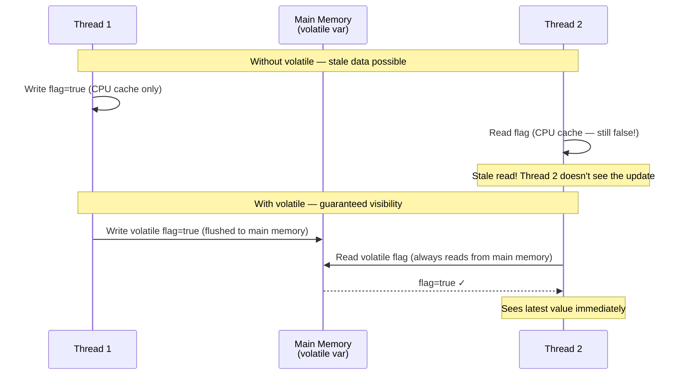
```mermaid
sequenceDiagram
    participant T1 as Thread 1
    participant MC as Main Memory<br/>(volatile var)
    participant T2 as Thread 2

    Note over T1,T2: Without volatile — stale data possible
    T1->>T1: Write flag=true (CPU cache only)
    T2->>T2: Read flag (CPU cache — still false!)
    Note over T2: Stale read! Thread 2 doesn't see the update

    Note over T1,T2: With volatile — guaranteed visibility
    T1->>MC: Write volatile flag=true (flushed to main memory)
    T2->>MC: Read volatile flag (always reads from main memory)
    MC-->>T2: flag=true ✓
    Note over T2: Sees latest value immediately
```

---

### 9.5 Code Examples

```java
// 1. Classic use case: shutdown flag
class Worker implements Runnable {
    private volatile boolean running = true; // MUST be volatile

    @Override
    public void run() {
        while (running) { // without volatile, this loop may NEVER see running=false
            doWork();
        }
        System.out.println("Worker stopped");
    }

    public void stop() {
        running = false; // visible to the worker thread immediately
    }
}

// Without volatile, the JIT compiler may optimize while(running) to while(true)
// because it sees running is never modified WITHIN the loop (in this thread's view)

// 2. Double-Checked Locking (DCL) — REQUIRES volatile
class Singleton {
    private static volatile Singleton instance; // MUST be volatile!

    public static Singleton getInstance() {
        if (instance == null) {                     // 1st check (no lock)
            synchronized (Singleton.class) {
                if (instance == null) {              // 2nd check (with lock)
                    instance = new Singleton();      // Without volatile:
                    // Constructor may not finish before reference is published
                    // Another thread may see a partially constructed object!
                }
            }
        }
        return instance;
    }
}
// Why volatile? Without it, CPU may reorder:
// 1. Allocate memory
// 2. Assign reference to instance ← another thread sees non-null here!
// 3. Call constructor ← but object is not fully constructed yet!
// volatile prevents this reordering.

// 3. volatile is NOT enough for compound operations
class UnsafeCounter {
    private volatile int count = 0;

    public void increment() {
        count++; // NOT ATOMIC even with volatile!
        // Read count (volatile read) → increment → write count (volatile write)
        // Two threads can read the same value, increment, and write the same result
    }
}

// Fix: Use AtomicInteger
class SafeCounter {
    private final AtomicInteger count = new AtomicInteger(0);

    public void increment() {
        count.incrementAndGet(); // atomic via CAS (Compare-And-Swap)
    }
}

// 4. volatile for publication safety
class Config {
    private volatile Map<String, String> config;

    // Safely publish entire config map
    public void updateConfig(Map<String, String> newConfig) {
        config = Collections.unmodifiableMap(new HashMap<>(newConfig));
        // volatile write ensures the entire map contents are visible
    }

    public String get(String key) {
        return config.get(key); // volatile read — sees latest config
    }
}
```

---

### 9.6 Java 8, 11, 17, 21 Relevance

| Version | volatile / Memory Model Change |
|---------|-------------------------------|
| **Java 5** | JMM (JSR-133) formalized. `volatile` got happens-before semantics. DCL with volatile became safe. |
| **Java 8** | `LongAdder`, `LongAccumulator` — better than volatile for counters under high contention. |
| **Java 9** | `VarHandle` — low-level alternative to volatile with finer-grained memory ordering (`getAcquire`, `setRelease`, `getOpaque`). |
| **Java 21** | Virtual threads don't change volatile semantics, but `Scoped Values` may replace some ThreadLocal+volatile patterns. |

---

### 9.7 Frequently Asked Interview Questions

1. What does `volatile` do in Java?
2. What is the difference between `volatile` and `synchronized`?
3. Does `volatile` make operations atomic?
4. Why is `volatile` needed in Double-Checked Locking?
5. What is the Java Memory Model?
6. What is a happens-before relationship?

---

### 9.8 Tricky Interview Questions with Answers

**Q1: "Is `volatile int count; count++` thread-safe?"**

**A:** **No.** `count++` is three operations: read → increment → write. Even with `volatile`, two threads can:
1. Both read `count = 5` (volatile read)
2. Both increment to 6
3. Both write 6 (volatile write)
Result: count = 6 instead of 7. Use `AtomicInteger.incrementAndGet()` or `synchronized`.

**Q2: "Can `volatile` replace `synchronized`?"**

| | `volatile` | `synchronized` |
|---|---|---|
| Visibility | ✅ Yes | ✅ Yes |
| Atomicity | ❌ No | ✅ Yes |
| Mutual exclusion | ❌ No | ✅ Yes |
| Blocking | ❌ No (non-blocking) | ✅ Yes (can block) |
| Use case | Flags, single-write/multi-read | Compound operations, critical sections |

**Answer:** Only when you have a single writer and the operation is a simple read or write (not compound like `count++`).

**Q3: "What happens without volatile in the boolean flag pattern?"**

**A:** The JIT compiler may hoist the read out of the loop (optimization: since `running` is never modified within the thread, it's treated as a constant). The loop becomes `while(true)` — the thread never stops, even after another thread sets `running = false`.

**Q4: "Explain the happens-before relationship."**

**A:** If action A **happens-before** action B, then:
1. A's effects are **visible** to B
2. A is **ordered before** B (no reordering across the boundary)

Key happens-before rules:
- `volatile write` → `volatile read` (of the same variable)
- `synchronized block exit` → `synchronized block entry` (on same monitor)
- `Thread.start()` → first action in the started thread
- Final action in thread → `Thread.join()` return
- `thread.interrupt()` → detection by interrupted thread

---

### 9.9 Common Misconceptions

| Misconception | Reality |
|---------------|---------|
| "`volatile` makes code thread-safe" | Only provides visibility, not atomicity or mutual exclusion |
| "`volatile` is slower than non-volatile" | ~10-50ns overhead per access (memory barrier). Negligible for most cases. |
| "You don't need volatile if using `System.out.println()`" | `println()` is synchronized, which creates a happens-before. But relying on this is fragile and wrong. |
| "`volatile` prevents all reordering" | It prevents reordering across the volatile access, but non-volatile accesses can still be reordered among themselves. |
| "`volatile long` is atomic on 32-bit JVM" | `long`/`double` writes are NOT atomic on 32-bit JVM (two 32-bit writes). `volatile` makes them atomic. |

---

### 9.10–9.16 Edge Cases, Performance, Comparison

#### Edge Cases

1. **32-bit JVM and `long`/`double`:** Without `volatile`, a `long` or `double` write is **not atomic** on 32-bit JVMs (split into two 32-bit writes). Another thread may see half-written value. `volatile` fixes this.

2. **volatile array:** `volatile int[] arr` makes the **reference** volatile, NOT the elements. `arr[0] = 5` is NOT a volatile write. Use `AtomicIntegerArray` for volatile array elements.

3. **volatile + immutable object pattern:** Safe publication of immutable objects via volatile reference:
```java
volatile ImmutableConfig config; // reference is volatile
// All fields of ImmutableConfig are final
// → when config reference is read (volatile read), all fields are guaranteed visible
```

#### volatile vs synchronized vs AtomicInteger

| Feature | `volatile` | `synchronized` | `AtomicInteger` |
|---------|-----------|---------------|----------------|
| Visibility | ✅ | ✅ | ✅ |
| Atomicity | ❌ | ✅ | ✅ |
| Lock-free | ✅ | ❌ | ✅ (CAS) |
| Blocking | No | Yes | No |
| Deadlock possible | No | Yes | No |
| Performance (low contention) | Best | Medium | Good |
| Performance (high contention) | N/A (not for compound ops) | Degrades | Degrades (CAS retries) |
| Use case | Flags, single-write publish | Critical sections | Counters, accumulators |

---

### 9.17–9.20 Best Practices, Anti-Patterns, Senior Perspective

#### Best Practices
1. Use `volatile` for **boolean flags** (stop flags, state flags)
2. Use `volatile` for **safe publication** of immutable objects
3. Use `volatile` in **Double-Checked Locking** for singletons
4. **Never use volatile for compound operations** (count++, check-then-act)
5. Prefer `AtomicInteger`/`AtomicReference` over volatile for counters

#### Anti-Patterns
| Anti-Pattern | Problem | Fix |
|-------------|---------|-----|
| `volatile int count; count++` | Not atomic — race condition | `AtomicInteger` or `synchronized` |
| `volatile` on all fields "just in case" | Unnecessary barriers, no benefit | Only use where needed |
| Relying on `volatile` for mutual exclusion | No mutual exclusion | Use `synchronized` or `Lock` |

#### Senior Perspective

A senior knows:
- `volatile` costs ~10-50ns per access due to memory barriers (vs ~1ns for cached read)
- `VarHandle` (Java 9+) provides finer-grained ordering: `getOpaque`, `getAcquire`, `setRelease` — for advanced lock-free algorithms
- In most cases, `AtomicXxx` classes or concurrent collections are better than raw `volatile`
- The **JIT compiler** respects volatile semantics — it won't hoist volatile reads out of loops

---
---

## 10. synchronized Keyword Deep Dive

### 10.1 Core Definition

`synchronized` is a Java keyword that provides **mutual exclusion** (only one thread can execute the synchronized block at a time) and **visibility** (changes made within a synchronized block are visible to subsequent threads entering the same monitor). It is the most basic synchronization mechanism in Java.

**Three forms:**
1. **Synchronized instance method:** Locks on `this` (the instance)
2. **Synchronized static method:** Locks on the `Class` object
3. **Synchronized block:** Locks on a specified object (most granular)

---

### 10.2 Mental Model / Real World Analogy

`synchronized` is like a **bathroom with a lock**:
- Only one person (thread) can enter at a time
- The person **locks the door** (acquires the monitor) upon entry
- Others must **wait outside** (BLOCKED state) until the person exits
- When the person exits, they **unlock the door** (release the monitor)
- **Reentrant:** If you're already inside, you can re-enter (e.g., calling another synchronized method on the same object)

---

### 10.3 Internal Working (JVM Level)


#### Monitor Lock Mechanism

Every Java object has an associated **monitor** (intrinsic lock). The monitor has:
- An **owner** (the thread holding the lock)
- An **entry set** (threads waiting to acquire the lock)
- A **wait set** (threads that called `wait()`)

```
Object Monitor:
┌──────────────────────────────────────┐
│  Monitor Lock (Intrinsic Lock)       │
│                                      │
│  Owner: Thread-1 (currently holding) │
│                                      │
│  Entry Set (BLOCKED threads):        │
│    [Thread-2] [Thread-3]             │
│    (waiting to acquire lock)         │
│                                      │
│  Wait Set (WAITING threads):         │
│    [Thread-4] [Thread-5]             │
│    (called wait(), released lock)    │
└──────────────────────────────────────┘
```

#### Lock Escalation (JVM Optimization)

The JVM uses **lock coarsening** and **biased locking** to optimize synchronized:

```
Lock States (from cheapest to most expensive):

1. No Lock           → Object just created, no contention
2. Biased Lock        → Only one thread ever accesses (CAS once, then free)
                        Removed in Java 15+ (-XX:-UseBiasedLocking)
3. Thin Lock (CAS)    → Low contention — CAS-based spinlock
4. Fat Lock (OS)      → High contention — OS mutex (context switch)

Mark Word in Object Header (encodes lock state):
┌─────────────────────────────────────────────────┐
│ Mark Word (64 bits on 64-bit JVM)               │
│                                                  │
│ Unlocked:  [hashCode(31)][age(4)][0][01]        │
│ Biased:    [threadID(54)][epoch(2)][age(4)][1][01]│
│ Thin Lock: [ptr to lock record on stack]   [00]  │
│ Fat Lock:  [ptr to Monitor object]         [10]  │
│ GC marked: [forwarding address]            [11]  │
└─────────────────────────────────────────────────┘
```

---

### 10.4 Architecture Diagram (Mermaid)

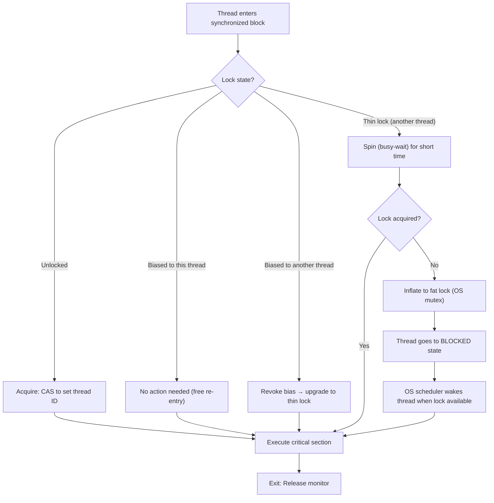
```mermaid
flowchart TD
    A["Thread enters synchronized block"] --> B{"Lock state?"}
    B -->|"Unlocked"| C["Acquire: CAS to set thread ID"]
    B -->|"Biased to this thread"| D["No action needed (free re-entry)"]
    B -->|"Biased to another thread"| E["Revoke bias → upgrade to thin lock"]
    B -->|"Thin lock (another thread)"| F["Spin (busy-wait) for short time"]
    F --> G{"Lock acquired?"}
    G -->|Yes| H["Execute critical section"]
    G -->|No| I["Inflate to fat lock (OS mutex)"]
    I --> J["Thread goes to BLOCKED state"]
    J --> K["OS scheduler wakes thread when lock available"]
    C --> H
    D --> H
    E --> H
    K --> H
    H --> L["Exit: Release monitor"]
```

---

### 10.5 Code Examples

```java
// 1. Synchronized instance method — locks on 'this'
public class BankAccount {
    private double balance;

    public synchronized void deposit(double amount) {
        balance += amount; // only one thread can execute at a time
    }

    public synchronized void withdraw(double amount) {
        if (balance >= amount) {
            balance -= amount;
        }
    }

    public synchronized double getBalance() {
        return balance; // synchronized read for visibility
    }
}

// 2. Synchronized block — more granular (preferred)
public class BankAccount {
    private double balance;
    private final Object lock = new Object(); // dedicated lock object

    public void deposit(double amount) {
        synchronized (lock) { // lock on specific object, not 'this'
            balance += amount;
        }
    }

    public void transfer(BankAccount target, double amount) {
        // DANGER: potential deadlock if two accounts transfer to each other!
        synchronized (this) {
            synchronized (target) {
                this.balance -= amount;
                target.balance += amount;
            }
        }
    }

    // FIX deadlock: always lock in consistent order
    public void transferSafe(BankAccount target, double amount) {
        BankAccount first = System.identityHashCode(this) < System.identityHashCode(target) ? this : target;
        BankAccount second = first == this ? target : this;
        synchronized (first) {
            synchronized (second) {
                this.balance -= amount;
                target.balance += amount;
            }
        }
    }
}

// 3. Synchronized static method — locks on Class object
public class Counter {
    private static int globalCount = 0;

    public static synchronized void increment() {
        globalCount++; // locks on Counter.class
    }
    // Equivalent to:
    public static void incrementExplicit() {
        synchronized (Counter.class) {
            globalCount++;
        }
    }
}

// 4. wait() and notify() — producer-consumer
public class BlockingQueue<T> {
    private final Queue<T> queue = new LinkedList<>();
    private final int capacity;

    public BlockingQueue(int capacity) { this.capacity = capacity; }

    public synchronized void put(T item) throws InterruptedException {
        while (queue.size() == capacity) {
            wait(); // releases lock, enters wait set
        }
        queue.add(item);
        notifyAll(); // wake up consumers
    }

    public synchronized T take() throws InterruptedException {
        while (queue.isEmpty()) {
            wait(); // releases lock, enters wait set
        }
        T item = queue.poll();
        notifyAll(); // wake up producers
        return item;
    }
}
```

---

### 10.6 Java 8, 11, 17, 21 Relevance

| Version | synchronized Change |
|---------|-------------------|
| **Java 6** | Lock coarsening, lock elision (escape analysis), adaptive spinning, biased locking optimizations |
| **Java 9** | Warnings about locking on deprecated `Boolean`/`Integer` cache instances |
| **Java 15** | **Biased locking deprecated** (`-XX:-UseBiasedLocking` now default false in Java 18+) — modern CAS is fast enough |
| **Java 21** | **Virtual threads:** `synchronized` **pins** the virtual thread to the carrier thread. Use `ReentrantLock` instead for virtual thread compatibility. |

> **Critical Java 21 Note:** If a virtual thread enters a `synchronized` block and blocks (e.g., I/O), the carrier thread is **pinned** and cannot run other virtual threads. This defeats the purpose of virtual threads. Use `ReentrantLock` instead.

```java
// Bad with virtual threads (Java 21)
public synchronized String fetchData() {
    return httpClient.send(request); // pins carrier thread!
}

// Good with virtual threads (Java 21)
private final ReentrantLock lock = new ReentrantLock();
public String fetchData() {
    lock.lock();
    try {
        return httpClient.send(request); // carrier thread released during I/O
    } finally {
        lock.unlock();
    }
}
```

---

### 10.7 Frequently Asked Interview Questions

1. What does `synchronized` do?
2. What is the difference between synchronized method and synchronized block?
3. Can two threads enter two different synchronized methods on the same object simultaneously?
4. What is the difference between `wait()` and `sleep()`?
5. What is a monitor in Java?
6. Can a `synchronized` method and a non-synchronized method run concurrently on the same object?

---

### 10.8 Tricky Interview Questions with Answers

**Q1: "Can two threads enter two different synchronized methods on the same object?"**

**A:** **No** — both synchronized methods lock on `this` (the same object's monitor). Only one thread can hold the monitor at a time.

```java
class MyClass {
    public synchronized void methodA() { /* locks on this */ }
    public synchronized void methodB() { /* locks on this — same monitor! */ }
}
// Thread 1 in methodA → Thread 2 BLOCKED trying to enter methodB
```

**But:** A synchronized static method and a synchronized instance method CAN run concurrently — they lock on different monitors (`Class` object vs `this`).

**Q2: "What is the difference between `wait()` and `sleep()`?"**

| | `wait()` | `sleep()` |
|---|---|---|
| Releases lock? | **Yes** — releases monitor | **No** — holds all locks |
| Belongs to | `Object` class | `Thread` class |
| Must be in synchronized? | **Yes** — otherwise `IllegalMonitorStateException` | No |
| Wakeup | `notify()` / `notifyAll()` | Timeout |
| Purpose | Inter-thread communication | Timed pause |

**Q3: "What happens if you call `wait()` outside a synchronized block?"**

**A:** `IllegalMonitorStateException` — you must own the monitor (lock) to call `wait()`, `notify()`, or `notifyAll()`.

**Q4: "Why should you always use `while` instead of `if` with `wait()`?"**

**A:** **Spurious wakeups** — `wait()` can return without `notify()` being called (JVM/OS implementation detail). Also, the condition may have changed between `notifyAll()` and the thread re-acquiring the lock:

```java
// WRONG — if (condition check, not loop)
synchronized (lock) {
    if (queue.isEmpty()) wait(); // may proceed when queue is still empty!
    process(queue.poll());
}

// RIGHT — while loop (re-check condition after wakeup)
synchronized (lock) {
    while (queue.isEmpty()) wait(); // re-checks after wakeup
    process(queue.poll());
}
```

**Q5: "What is the difference between locking on `this` vs a private lock object?"**

| | `synchronized(this)` | `synchronized(privateLock)` |
|---|---|---|
| Exposure | Anyone with reference to `this` can lock on it | Only your class can lock on it |
| Risk | External code can accidentally/maliciously lock on your object | Fully encapsulated |
| Contention | Multiple methods share one monitor | Can have multiple independent monitors |
| Best practice | ❌ Not recommended | ✅ Preferred |

---

### 10.9–10.16 Common Misconceptions, Edge Cases, Performance

#### Common Misconceptions

| Misconception | Reality |
|---------------|---------|
| "`synchronized` is always slow" | Modern JVM optimizes heavily: biased locking, thin locks, lock elision. Uncontended `synchronized` is ~20-50ns. |
| "`synchronized` blocks the entire object" | It locks the **monitor** of the object, not the object itself. Non-synchronized methods can still run. |
| "`wait()` and `sleep()` are the same" | `wait()` releases the lock; `sleep()` does NOT. Completely different semantics. |
| "You can call `notify()` without `synchronized`" | No — `IllegalMonitorStateException`. You must own the monitor. |
| "`synchronized` on String literal is safe" | **Dangerous** — String literals are interned (shared). Two unrelated classes synchronizing on `"lock"` share the same monitor! |

#### Performance of Lock Types

| Lock Type | Uncontended Cost | Contended Cost | Scalability |
|-----------|-----------------|----------------|------------|
| `synchronized` (biased) | ~5ns | ~1-10μs | Poor under high contention |
| `synchronized` (thin) | ~20-50ns | ~1-10μs | Moderate |
| `synchronized` (fat/inflated) | ~50-100ns | ~10-100μs (OS mutex) | Poor |
| `ReentrantLock` | ~30-50ns | ~1-10μs | Better (fair mode, tryLock) |
| `AtomicInteger` (CAS) | ~10-20ns | ~100ns-1μs (CAS retries) | Best |
| `volatile` read | ~10ns | ~10ns | Best (no lock) |

---

### 10.17–10.20 Best Practices, Anti-Patterns, Senior Perspective

#### Best Practices

1. **Use synchronized blocks, not methods** — more granular, less contention
2. **Lock on private final objects, not `this`** — prevents external interference
3. **Keep synchronized blocks small** — minimize time spent holding the lock
4. **Always use `while` loop with `wait()`** — prevent spurious wakeups
5. **Prefer `ReentrantLock` for advanced use cases** (tryLock, fairness, interruptible)
6. **Use `ReentrantLock` instead of `synchronized` with virtual threads (Java 21)**
7. **Avoid nested synchronized blocks** — deadlock risk

#### Anti-Patterns

| Anti-Pattern | Problem | Fix |
|-------------|---------|-----|
| `synchronized` on String literal | Shared intern pool → unrelated code shares locks | Use `private final Object lock = new Object()` |
| `synchronized` on boxed type (`Integer`, `Boolean`) | Cached instances shared across JVM | Use `private final Object lock = new Object()` |
| Synchronizing entire method when only a few lines need protection | Excessive contention, poor throughput | Use synchronized block on minimum critical section |
| Using `if` instead of `while` with `wait()` | Spurious wakeups, race conditions | Always use `while (condition) wait()` |
| `synchronized` with virtual threads (Java 21) | Pins carrier thread | Use `ReentrantLock` |

#### Senior Perspective

A senior knows:
- The **lock escalation path**: no lock → biased → thin (CAS) → fat (OS mutex)
- **Biased locking deprecation** (Java 15+) and why (modern CAS is fast, bias revocation cost was high)
- When to use `synchronized` vs `ReentrantLock` vs `AtomicXxx` vs lock-free algorithms
- The **virtual thread pinning** problem with `synchronized` in Java 21
- How to diagnose contention: `jstack` shows BLOCKED threads, `jcmd Thread.print` shows lock owners
- **Lock striping** pattern for better concurrency (like ConcurrentHashMap's per-bucket locks)

---
---

## 11. Locks — ReentrantLock, ReadWriteLock, StampedLock

#### 1. Core Definition
Explicit locks in Java, provided by the `java.util.concurrent.locks` package, offer more flexible, powerful, and granular locking operations than implicit monitor locks (`synchronized`). They support fair/unfair scheduling policies, interruptible lock acquisition, non-blocking lock attempts (`tryLock`), timeouts, and separate read/write access controls.

#### 2. Mental Model & Real World Analogy
- **`ReentrantLock`**: Like a private conference room with a keycard. If you already hold the keycard and are inside, you can exit and re-enter multiple times (reentrancy count increases), but you must swipe out the same number of times to fully unlock the room for others.
- **`ReentrantReadWriteLock`**: Like a public bulletin board. Multiple people can read the board simultaneously (Shared Lock). However, if someone wants to write or post a new notice (Exclusive Lock), everyone must step back, and no one can read or write until they finish.
- **`StampedLock`**: Like a museum guide. A visitor reads a display without holding a lock (Optimistic Read). Before leaving, they verify if the exhibit was updated (validate stamp) while they were looking. If updated, they acquire a full read lock to reread it. This avoids blocking writers.

#### 3. Internal Working (JVM & AQS Level)
Most explicit locks are built on top of **AbstractQueuedSynchronizer (AQS)**. AQS manages:
- **`state`**: A `volatile int` representing lock acquisition status. For `ReentrantLock`, `0` = unlocked, `1` or more = locked (nested lock count).
- **CLH Queue**: A FIFO doubly linked wait queue of `Node` objects. Blocked threads are parked using `LockSupport.park()` and wait in this queue.
- **CAS (Compare-And-Swap)**: Atomic operations to transition state and enqueue nodes.

##### Internet Diagram:


#### 4. Architecture Diagram (Mermaid)
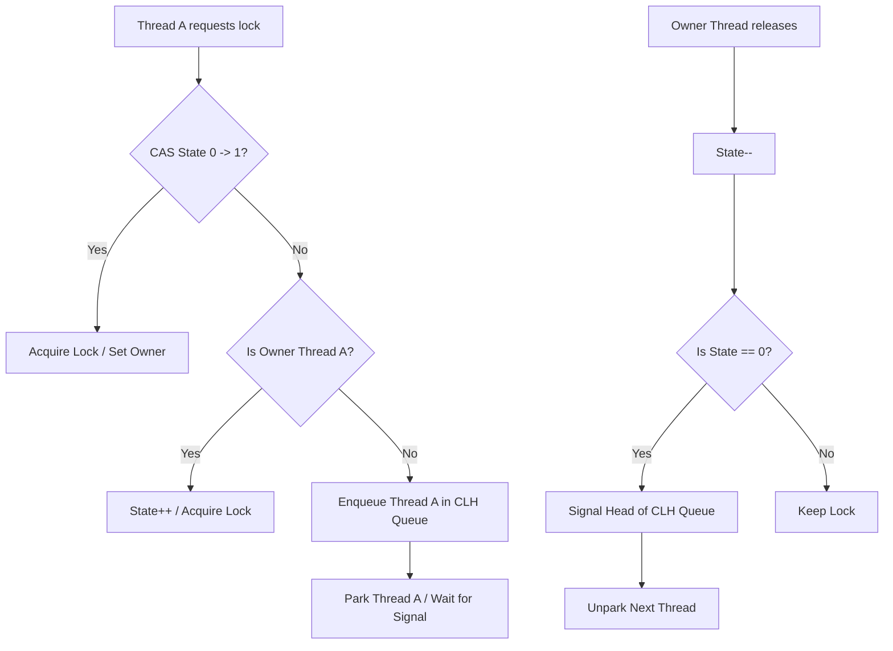
```mermaid
flowchart TD
    ThreadA[Thread A requests lock] --> CAS{CAS State 0 -> 1?}
    CAS -- Yes --> Acquire[Acquire Lock / Set Owner]
    CAS -- No --> ReentrantCheck{Is Owner Thread A?}
    ReentrantCheck -- Yes --> Increment[State++ / Acquire Lock]
    ReentrantCheck -- No --> Enqueue[Enqueue Thread A in CLH Queue]
    Enqueue --> Park[Park Thread A / Wait for Signal]
    Owner[Owner Thread releases] --> DecState[State--]
    DecState --> StateZero{Is State == 0?}
    StateZero -- Yes --> Signal[Signal Head of CLH Queue]
    StateZero -- No --> Retain[Keep Lock]
    Signal --> Unpark[Unpark Next Thread]
```

#### 5. Code Examples
##### ReentrantLock Usage:
```java
public class SafeCounter {
    private final ReentrantLock lock = new ReentrantLock(true); // Fair lock
    private int count = 0;

    public void increment() {
        lock.lock();
        try {
            count++;
        } finally {
            lock.unlock(); // Crucial: unlock in finally block
        }
    }
}
```

##### StampedLock Optimistic Read:
```java
public class Point {
    private double x, y;
    private final StampedLock sl = new StampedLock();

    public double distanceFromOrigin() {
        long stamp = sl.tryOptimisticRead(); // Non-blocking
        double curX = x, curY = y;
        if (!sl.validate(stamp)) { // Check if a write occurred
            stamp = sl.readLock(); // Fallback to pessimistic read lock
            try {
                curX = x;
                curY = y;
            } finally {
                sl.unlockRead(stamp);
            }
        }
        return Math.sqrt(curX * curX + curY * curY);
    }
}
```

#### 6. Java Version Relevance
- **Java 8**: Introduced `StampedLock` to provide highly optimized reader-writer lock interfaces without reentrancy overhead.
- **Java 9-17**: JIT optimizations for lock-elision on local thread-safe constructs.
- **Java 21**: Virtual threads support. Standard locks (`ReentrantLock`, `ReadWriteLock`) do **not** pin virtual threads to their carrier threads, unlike `synchronized` when it encounters blocking operations.

#### 7. Frequently Asked Interview Questions
- *What is AQS in Java?* It's the skeleton class (`AbstractQueuedSynchronizer`) used to implement locks and synchronizers using a FIFO wait queue and a state variable.
- *How does StampedLock improve upon ReentrantReadWriteLock?* `StampedLock` offers optimistic reading which doesn't block writers, preventing writer starvation.
- *What is lock downgrading?* Acquiring a write lock, then acquiring the read lock, and then releasing the write lock. Upgrading (read -> write) is not supported in `ReentrantReadWriteLock` as it causes deadlocks.

#### 8. Tricky Interview Questions with Answers
- *Q: Can a thread holding a Read lock upgrade it directly to a Write lock in `ReentrantReadWriteLock`?*
  - **A:** No. If two threads try to upgrade, they will deadlock waiting for each other to release the read lock. You must release the read lock first, then acquire the write lock.
- *Q: Why is `StampedLock` not reentrant?*
  - **A:** Because it does not track ownership using thread IDs to keep overhead to an absolute minimum. If a thread holding a write lock attempts to acquire a write lock again, it will deadlock.

#### 9. Common Misconceptions
- *Misconception: ReentrantLock is always faster than synchronized.*
  - **Fact:** Since Java 6/8, JVM heavily optimizes `synchronized`. `ReentrantLock` should be used for its advanced features (fairness, timeouts, conditions), not purely for performance.
- *Misconception: StampedLock's optimistic read holds a shared lock.*
  - **Fact:** Optimistic read does *not* lock anything. It merely retrieves a stamp and reads volatile-like state, verifying it afterwards.

#### 10. Edge Cases
- **Forgot to unlock**: If `unlock()` is not inside a `finally` block, an exception during execution will leave the lock acquired forever, deadlocking the system.
- **Lock Interruption**: If a thread is blocked in `lock()`, it cannot be interrupted. Use `lockInterruptibly()` to allow thread recovery.

#### 11. Performance Considerations
- Under extreme contention, `ReentrantLock` performs better than `synchronized` because it doesn't inflate to a fat OS-level monitor immediately, and uses adaptive spinning on AQS.
- `StampedLock` completely outperforms standard read-write locks when writes are sparse.

#### 12. Memory Implications
Each explicit lock instance allocates memory on the heap (Node structures, AQS state). Creating too many lock instances can increase garbage collection overhead compared to primitive monitor locks.

#### 13. Thread Safety Considerations
Lock objects themselves are thread-safe and designed to be shared. However, ensure the shared lock reference is immutable (`private final ReentrantLock lock = new ReentrantLock();`).

#### 14. Production Scenarios
*We are seeing transaction timeouts and database connection pools exhaustion under heavy read-write traffic on our catalogue system. Thread dumps show 100+ threads blocked waiting on a ReentrantReadWriteLock write lock. How would you solve this?*
- **A:** Switch to `StampedLock` with optimistic reading for the catalogue reads. Since catalogue updates are rare, optimistic reads will pass without blocking writers or acquiring heavy read locks, reducing throughput bottlenecks.

#### 15. Follow-up Questions Interviewers Ask
- *How does Condition object work in ReentrantLock?*
  - **A:** It provides `await()` and `signal()` functionality, acting as multiple wait-sets per lock, replacing `wait()` and `notify()`.
- *What happens when a thread is unparked in AQS?*
  - **A:** It wakes up inside its acquisition loop, attempts to CAS the state variable again. If successful, it becomes the owner; otherwise, it reparks.

#### 16. Comparison Table
| Feature | `synchronized` | `ReentrantLock` | `StampedLock` |
|---------|----------------|-----------------|---------------|
| **Reentrancy** | Yes | Yes | No |
| **Fairness Option**| No | Yes | No |
| **Optimistic Read**| No | No | Yes |
| **Timeout Support**| No | Yes | Yes |
| **Virtual Thread Safe**| May pin carrier thread | Safe | Safe |

#### 17. Internal JVM Details
When using virtual threads, `synchronized` pins the carrier thread because monitor locks are tied to native thread frames. Explicit locks rely on `LockSupport.park()`, which yielding virtual threads can intercept to unmount from their carrier threads.

#### 18. Best Practices
1. **Always** invoke `unlock()` in a `finally` block immediately after `try` block.
2. Use the narrowest lock scope possible.
3. Prefer implicit `synchronized` unless explicit lock features are required.

#### 19. Anti-Patterns
- Calling `lock()` inside the `try` block: if `lock()` fails, the `finally` block will try to call `unlock()`, throwing `IllegalMonitorStateException`.
- Using `StampedLock` for recursive/reentrant logic.

#### 20. Senior Perspective
A senior architect chooses StampedLock for caching layers to avoid writer starvation, uses fair locks only when strict order is legally or business-operationally critical (due to significant performance throughput penalties), and monitors lock contention with tools like JFR (Java Flight Recorder).

---

## 12. Classes and Interfaces

#### 1. Core Definition
Classes are blueprints for creating objects, defining state (fields) and behavior (methods). Interfaces are contract specifications defining behavior that implementing classes must fulfill.

#### 2. Mental Model & Real World Analogy
- **Class**: Like a physical factory blueprint for a specific car model (e.g., Tesla Model 3). It specifies the materials (fields) and the exact steps to build/run it (methods).
- **Interface**: Like the USB standard interface. Anything can implement USB (mouse, keyboard, drive) as long as it fits the connector specifications.

#### 3. Internal Working (Classloading, constant pool, method tables)
- **vtable (Virtual Method Table)**: Used by JVM to resolve dynamic method dispatch for classes.
- **itable (Interface Method Table)**: Used to resolve interface method invocations. Since a class can implement multiple interfaces, itable offsets can vary, making interface calls slightly slower than virtual class calls.

##### Internet Diagram:


#### 4. Architecture Diagram (Mermaid)
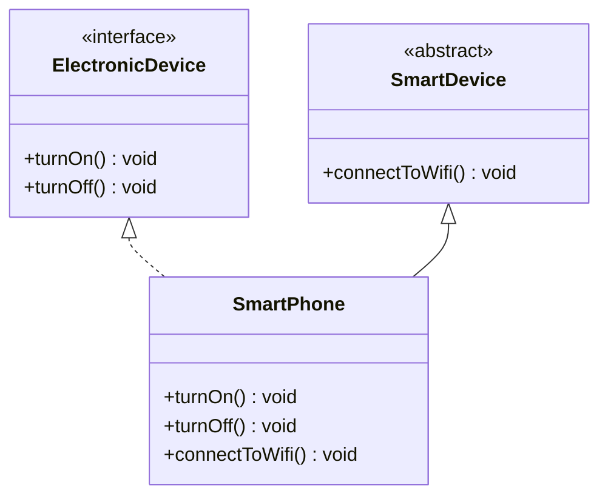
```mermaid
classDiagram
    class ElectronicDevice {
        <<interface>>
        +turnOn() void
        +turnOff() void
    }
    class SmartDevice {
        <<abstract>>
        +connectToWifi() void
    }
    class SmartPhone {
        +turnOn() void
        +turnOff() void
        +connectToWifi() void
    }
    ElectronicDevice <|.. SmartPhone
    SmartDevice <|-- SmartPhone
```

#### 5. Code Examples
```java
public interface RemoteControl {
    void pressPower(); // Abstract

    default void setup() { // Default (Java 8)
        log("Running standard setup");
    }

    static boolean isBatteryLow(int level) { // Static (Java 8)
        return level < 10;
    }

    private void log(String message) { // Private (Java 9)
        System.out.println("[Remote] " + message);
    }
}
```

#### 6. Java Version Relevance
- **Java 8**: Added `default` and `static` methods in interfaces.
- **Java 9**: Added `private` methods in interfaces.
- **Java 17**: Introduced `sealed` classes and interfaces to control inheritance hierarchies.
- **Java 21**: Introduced Record Patterns and improved pattern matching with sealed classes.

#### 7. Frequently Asked Interview Questions
- *What is the difference between Abstract Class and Interface after Java 8?* Abstract classes can maintain state (non-final instance variables) and constructor methods; interfaces cannot.
- *How does Java resolve the diamond problem with default methods?* Class implementation wins. If no class implementation, the implementing class must override and explicitly call the specific interface default method (e.g., `InterfaceA.super.method()`).

#### 8. Tricky Interview Questions with Answers
- *Q: Can an interface define public final methods?*
  - **A:** No. Interface methods are implicitly abstract or final can't be abstract. Default methods cannot be final because they are designed to be overridden.
- *Q: Why can't interfaces have constructors?*
  - **A:** Interfaces define behavior contract, not state management. Constructors initialize state, which interfaces do not have (except static final constants).

#### 9. Common Misconceptions
- *Misconception: Interfaces are fully abstract.*
  - **Fact:** Since Java 8, interfaces can contain implementation code via default and static methods.

#### 10. Edge Cases
- Re-declaring `Object` methods (`toString`, `equals`) as default methods in interfaces is **compilation error**. Interfaces cannot override Object class methods.

#### 11. Performance Considerations
Interface method calls (`invokeinterface`) are historically slightly slower than class virtual method calls (`invokevirtual`) because JVM needs to search the itable. However, modern JVMs (HotSpot) optimize this using Inline Caches.

#### 12. Memory Implications
Classes carry structural metadata stored in the Metaspace. Creating custom classloaders dynamically without unloading them can lead to Metaspace OutOfMemoryError.

#### 13. Thread Safety Considerations
Interfaces themselves define no state, making them inherently stateless and thread-safe. Implementing classes must manage thread safety of their state.

#### 14. Production Scenarios
*We are designing a payment gateway integration library that supports Stripe, PayPal, and Adyen. How do we ensure that clients of our library can only use our authorized payment gateways without extending them?*
- **A:** Define a `sealed interface PaymentGateway` and permit only `StripeGateway`, `PayPalGateway`, and `AdyenGateway`. Compile-time checks will prevent unauthorized extensions.

#### 15. Follow-up Questions Interviewers Ask
- *What is the difference between static methods in interfaces and static methods in classes?*
  - **A:** Interface static methods are not inherited by implementing classes. They must be called directly via the interface name.

#### 16. Comparison Table
| Feature | Abstract Class | Interface |
|---------|----------------|-----------|
| **Multiple Inheritance** | No (Single extends) | Yes (Multiple implements) |
| **Instance Variables** | Yes | No (Only `public static final`) |
| **Constructors** | Yes | No |
| **Private Methods** | Yes | Yes (Java 9+) |

#### 17. Internal JVM Details
Class layouts include the Klass pointer in the object header, pointing to the Class metadata in Metaspace, containing vtable pointers for fast method lookup.

#### 18. Best Practices
- Program to interfaces, not implementations.
- Use sealed classes to restrict design hierarchy.
- Use record classes for data transfer objects (DTOs).

#### 19. Anti-Patterns
- The **Constant Interface** anti-pattern: using an interface solely to store constants. Use a utility class or enums instead.

#### 20. Senior Perspective
A senior engineer uses interfaces to decouple architectural layers, leveraging default methods to evolve APIs without breaking backward compatibility, and uses sealed interfaces to design domain models for pattern matching.

---
---

## 13. Access Modifiers

#### 1. Core Definition
Access modifiers in Java determine the scope of visibility for classes, interfaces, constructors, variables, methods, and data members. The four access levels are: `private`, default (package-private), `protected`, and `public`.

#### 2. Mental Model & Real World Analogy
- **`private`**: A diary with a lock. Only you (the containing class) can read or write in it.
- **Default (no modifier)**: Family discussions. Anyone living in the same house (package) can participate, but neighbors cannot.
- **`protected`**: Family heirloom. Family members (package) and your children/descendants (subclasses in other packages) inherit and can access it.
- **`public`**: A public billboard on the street. Anyone in the world (any package/module) can read it.

#### 3. Internal Working (JVM & Access Flags Level)
The JVM enforces access control at runtime using class file flags. In a compiled `.class` file, classes, methods, and fields have associated bitmasks of **Access Flags** (e.g., `ACC_PUBLIC`, `ACC_PRIVATE`, `ACC_PROTECTED`). When resolving field references or method calls, the JVM checks these flags and throws `IllegalAccessError` if access is violated.

##### Internet Diagram:


#### 4. Architecture Diagram (Mermaid)
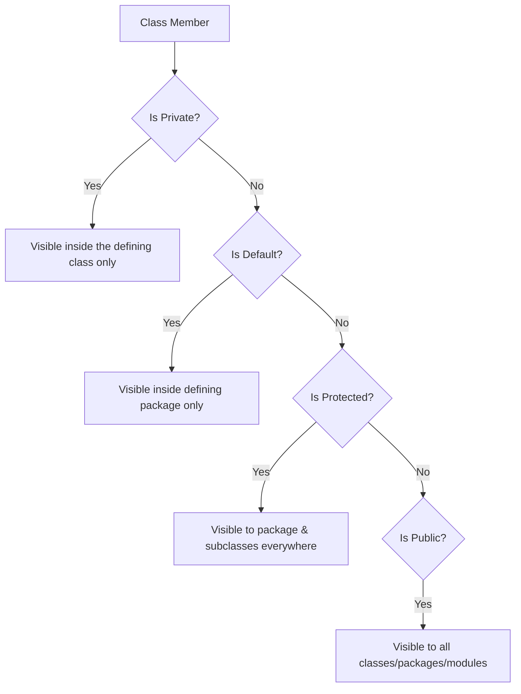
```mermaid
graph TD
    classMember[Class Member] --> isPrivate{Is Private?}
    isPrivate -- Yes --> ClassOnly[Visible inside the defining class only]
    isPrivate -- No --> isDefault{Is Default?}
    isDefault -- Yes --> PackageOnly[Visible inside defining package only]
    isDefault -- No --> isProtected{Is Protected?}
    isProtected -- Yes --> SubclassesPackage[Visible to package & subclasses everywhere]
    isProtected -- No --> isPublic{Is Public?}
    isPublic -- Yes --> Everywhere[Visible to all classes/packages/modules]
```

#### 5. Code Examples
```java
package com.example.company;

public class Employee {
    private String socialSecurityNumber; // Only accessible inside Employee
    String department;                  // Default: package-private
    protected double baseSalary;         // Subclasses and package
    public String name;                  // Everywhere

    private void calculateTax() {}
}
```

#### 6. Java Version Relevance
- **Java 9 (Modules)**: Introduced modular access control. Even if a class is `public`, it cannot be accessed outside its module unless the package is explicitly `exports` in `module-info.java`.
- **Java 17/21**: Strong encapsulation of JVM internals by default (`--illegal-access` option disabled/removed).

#### 7. Frequently Asked Interview Questions
- *What is the difference between default and protected modifiers?* Protected allows access from subclasses in different packages; default does not.
- *Can we override a protected method with a default or private method?* No, overriding methods cannot restrict visibility (Liskov Substitution Principle). You can only make it more visible (e.g., change protected to public).

#### 8. Tricky Interview Questions with Answers
- *Q: If a subclass overrides a protected method of a parent in a different package, can the subclass instances access the parent's protected method from another class in the subclass package?*
  - **A:** No. A subclass can access inherited protected members from its parent inside its own class body, but it cannot access protected members directly on instances of the parent class from outside.
- *Q: Can a top-level class be declared private or protected?*
  - **A:** No. Top-level classes can only be `public` or package-private (default) because they reside at the package level. Declaring them private or protected would prevent compilation.

#### 9. Common Misconceptions
- *Misconception: Declaring a class public means anyone can access it.*
  - **Fact:** Since Java 9, the enclosing module must export the package containing the public class, and the client module must require the exporting module.

#### 10. Edge Cases
- **Reflection Bypass**: `private` modifiers can be bypassed using reflection: `field.setAccessible(true)`, though this is limited under strong modular encapsulation in Java 17+.

#### 11. Performance Considerations
Access modifiers have zero performance overhead at runtime. Access checks are compiled into bytecode and validated during classloading and JIT compilation.

#### 12. Memory Implications
No memory implications. Visibility modifiers are metadata flags stored in the constant pool and do not impact object footprint on the heap.

#### 13. Thread Safety Considerations
Access modifiers do not provide thread safety. However, declaring state fields `private` protects them from unsafe external modifications, facilitating encapsulation of synchronized access.

#### 14. Production Scenarios
*We are migrating a legacy Spring Boot monolithic application to a modular architecture to prevent team boundary pollution. How do we prevent other teams from instantiating our internal service implementation classes while keeping them public for Spring DI?*
- **A:** Place the service implementation in a separate package (e.g., `com.company.module.internal`) and do **not** export it in `module-info.java`. Use interfaces in the exported packages for public consumption.

#### 15. Follow-up Questions Interviewers Ask
- *What is the role of ACC_SYNTHETIC flags?*
  - **A:** They mark elements generated by the compiler (e.g., bridge methods, inner class constructor accessors) to bypass regular access checks.

#### 16. Comparison Table
| Modifier | Class | Package | Subclass (diff package) | World |
|----------|-------|---------|-------------------------|-------|
| **`public`** | Yes | Yes | Yes | Yes |
| **`protected`** | Yes | Yes | Yes | No |
| **Default** | Yes | Yes | No | No |
| **`private`** | Yes | No | No | No |

#### 17. Internal JVM Details
JVM throws `java.lang.IllegalAccessError` if a compiled class attempts to reference a member without sufficient access privileges, which typically happens when dependencies are compiled separately and modified incompatibly.

#### 18. Best Practices
- Keep variables `private` by default.
- Minimize API surface area.
- Use `protected` strictly for extension hook methods.

#### 19. Anti-Patterns
- Exposing mutable fields as `public` or package-private.
- Excessive use of `protected` which breaks inheritance encapsulation.

#### 20. Senior Perspective
A senior engineer respects the Principal of Least Privilege, uses package-private visibility to keep package-internal components cohesive, and structures modules so internal implementations do not leak into the public API.

---

## 14. Java 8 Features

#### 1. Core Definition
Java 8 introduced functional programming paradigms to the language, including Lambda expressions, Functional Interfaces, the Stream API, Method References, the `Optional` class, and Default/Static methods in interfaces.

#### 2. Mental Model & Real World Analogy
- **Lambda Expressions**: Like hiring an on-demand freelancer to do a specific task right now without making them fill out a full employment contract (anonymous class).
- **Streams API**: Like a conveyor belt in a factory. Objects pass through, get inspected (filter), packaged (map), and consolidated (collect) sequentially or in parallel.
- **Optional**: Like a delivery box. You open it, and it either contains your package (value) or is empty (null), forcing you to handle the empty state safely.

#### 3. Internal Working (invokedynamic, LambdaMetafactory)
Lambdas are *not* anonymous classes under the hood. They do not generate separate `.class` files. Instead, Java 8 compiles lambdas using the **`invokedynamic` (Indy)** bytecode instruction. At runtime, the JVM uses `LambdaMetafactory.metafactory` to dynamically construct a call site, generating a highly optimized lightweight class definition in memory.

##### Internet Diagram:


#### 4. Architecture Diagram (Mermaid)
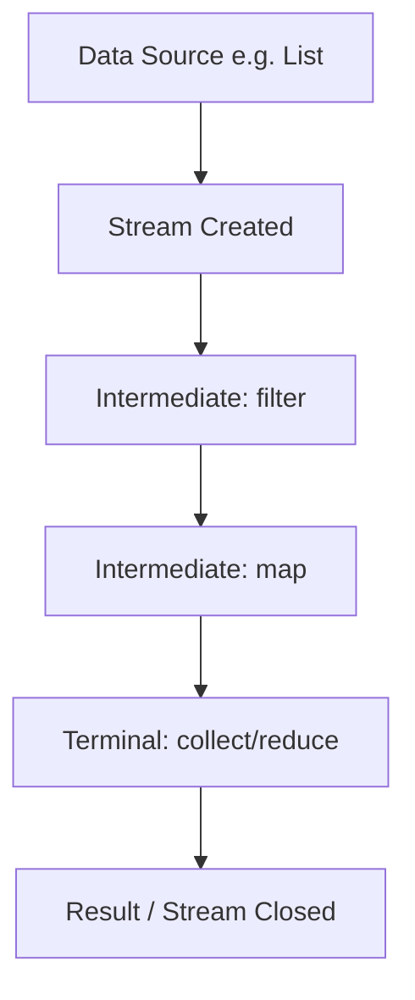
```mermaid
flowchart TD
    DataSource[Data Source e.g. List] --> StreamInit[Stream Created]
    StreamInit --> Filter[Intermediate: filter]
    Filter --> Map[Intermediate: map]
    Map --> Terminal[Terminal: collect/reduce]
    Terminal --> Result[Result / Stream Closed]
```

#### 5. Code Examples
```java
public class StreamDemo {
    public static void main(String[] args) {
        List<String> names = Arrays.asList("Alice", "Bob", "Charlie", "David");

        List<String> processed = names.stream()
                .filter(name -> name.startsWith("C")) // Lambda
                .map(String::toUpperCase)            // Method Reference
                .collect(Collectors.toList());        // Terminal Action

        System.out.println(processed);
    }
}
```

#### 6. Java Version Relevance
- **Java 9**: Added `Stream.ofNullable()`, `takeWhile()`, and `dropWhile()`.
- **Java 11**: Support for `var` in lambda parameters.
- **Java 16**: Added `Stream.toList()` directly (no collector needed).
- **Java 17/21**: Record patterns can be integrated with Stream map transformations.

#### 7. Frequently Asked Interview Questions
- *What is the difference between intermediate and terminal operations in Streams?* Intermediate operations return a new Stream and are lazy; terminal operations trigger execution and produce a result/side-effect, consuming the stream.
- *What is a Functional Interface?* An interface containing exactly one abstract method (SAM), annotated optionally with `@FunctionalInterface`.

#### 8. Tricky Interview Questions with Answers
- *Q: What is the output of `Stream.of(1,2,3).peek(System.out::println).findFirst()`?*
  - **A:** It prints `1` only. Because streams are lazy, intermediate operations are evaluated only as much as required by the terminal operation (`findFirst()` needs only the first element).
- *Q: Why must variables captured in a lambda be final or effectively final?*
  - **A:** Because local variables live on the stack, which is destroyed when the method exits. Lambdas run on different threads or stack contexts; they copy these variables. If they changed, consistency between threads could not be guaranteed.

#### 9. Common Misconceptions
- *Misconception: Parallel streams are always faster than sequential streams.*
  - **Fact:** Parallel streams have splitting and merging overhead (ForkJoinPool). They are slower for small collections or cheap operations (like simple math). Use parallel streams only for $N \times Q$ calculations where $N$ and computation time are large.

#### 10. Edge Cases
- **Null values in Streams**: `Stream.of(null)` throws NullPointerException. Use `Stream.ofNullable(val)`.
- **Modifying source inside Stream pipeline**: Modifying the underlying collection while streaming it throws `ConcurrentModificationException`.

#### 11. Performance Considerations
Lambda execution via `invokedynamic` has low startup and memory footprint compared to anonymous inner classes since JVM avoids writing class files on disk and performs runtime link optimization.

#### 12. Memory Implications
`Optional` is wrapper object. Do **not** use `Optional` as class fields or method arguments; it increases heap allocation. Use it strictly for method return types.

#### 13. Thread Safety Considerations
Functional pipelines are thread-safe as long as the functions passed (lambdas) are stateless and do not modify shared mutable variables outside the stream scope.

#### 14. Production Scenarios
*We are experiencing high CPU usage and thread context-switching overhead in our microservice. Profiling shows it occurs inside a Stream processing pipeline that fetches user metadata using a parallel stream.*
- **A:** Parallel streams use the common `ForkJoinPool`, which is shared globally across the JVM. Blocking operations (like I/O metadata calls) inside parallel streams starve the common pool. Refactor to a dedicated ThreadPool or virtual threads.

#### 15. Follow-up Questions Interviewers Ask
- *Can you explain how flatMap differs from map?*
  - **A:** `map` performs 1-to-1 mapping (returns value). `flatMap` performs 1-to-many mapping, turning each element into a stream and flattening all generated streams into a single stream.

#### 16. Comparison Table
| Feature | Lambda Expression | Anonymous Inner Class |
|---------|-------------------|----------------------|
| **Compilation** | Compiled using `invokedynamic` | Generates a separate `.class` file |
| **`this` reference** | Points to enclosing class | Points to the inner class itself |
| **State** | Cannot have instance variables | Can maintain state (fields) |

#### 17. Internal JVM Details
The first time a lambda is invoked, the `Bootstrap Method` dynamically creates an instance of `MethodHandle` which directly executes the body code, bypassing reflective lookup overhead.

#### 18. Best Practices
- Write short, single-line lambda expressions.
- Never use `Optional.get()` without checking `isPresent()` (or use `orElse`/`orElseGet`).
- Keep streams side-effect-free.

#### 19. Anti-Patterns
- Using `peek()` for state-mutating side effects (e.g. adding elements to external lists).
- Boxing types unnecessarily (`Stream<Integer>` instead of `IntStream`).

#### 20. Senior Perspective
A senior architect ensures Stream pipelines are readable, avoids long multi-line lambda blocks by extracting them into helper methods, uses primitive streams (`IntStream`, `LongStream`) to avoid boxing GC churn, and is extremely selective when opting for parallel streams.

---
---

## 15. Streams Coding Deep Dive

#### 1. Core Definition
Streams Coding Deep Dive focuses on utilizing the declarative `java.util.stream` API to solve common algorithmic, data-transformation, and aggregation problems efficiently and concisely.

#### 2. Mental Model & Real World Analogy
Like an automated recycling sorting plant. Trash (source collection) goes onto a primary conveyor belt. It passes through optical sensors filtering plastic (filter), a crusher flattening cans (map), and is sorted into bins based on material types (groupingBy).

#### 3. Internal Working (Spliterators & Pipelines)
Streams are evaluated using lazy pipeline execution. Under the hood, a stream is backed by a **`Spliterator`** (Splitable Iterator), which traverses and partitions elements. The stream constructs a linked list of helper objects (stages) representing intermediate operations. No computation occurs until a terminal operation is called, which triggers a single traversal of the data source.

##### Internet Diagram:


#### 4. Architecture Diagram (Mermaid)
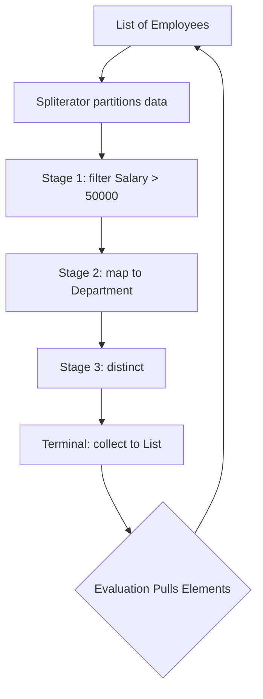
```mermaid
graph TD
    Source[List of Employees] --> Spliterator[Spliterator partitions data]
    Spliterator --> Op1[Stage 1: filter Salary > 50000]
    Op1 --> Op2[Stage 2: map to Department]
    Op2 --> Op3[Stage 3: distinct]
    Op3 --> Terminal[Terminal: collect to List]
    Terminal --> Pull{Evaluation Pulls Elements}
    Pull --> Source
```

#### 5. Code Examples (Top 5 Core Problems)
##### 1. Find character frequency in a String:
```java
String input = "interview";
Map<String, Long> frequency = Arrays.stream(input.split(""))
    .collect(Collectors.groupingBy(Function.identity(), Collectors.counting()));
```

##### 2. Group employees by department and find average salary:
```java
Map<String, Double> avgSalary = employees.stream()
    .collect(Collectors.groupingBy(Employee::getDepartment,
             Collectors.averagingDouble(Employee::getSalary)));
```

##### 3. Flatten list of lists:
```java
List<List<String>> nested = List.of(List.of("A", "B"), List.of("C", "D"));
List<String> flat = nested.stream()
    .flatMap(Collection::stream)
    .collect(Collectors.toList());
```

##### 4. Find the top 3 highest paid employees:
```java
List<Employee> topEmployees = employees.stream()
    .sorted(Comparator.comparingDouble(Employee::getSalary).reversed())
    .limit(3)
    .collect(Collectors.toList());
```

##### 5. Find duplicates in a list of integers:
```java
List<Integer> list = List.of(1, 2, 3, 2, 4, 3, 5);
Set<Integer> duplicates = list.stream()
    .filter(i -> Collections.frequency(list, i) > 1) // O(N^2) - see best practices for O(N)
    .collect(Collectors.toSet());
```

#### 6. Java Version Relevance
- **Java 9**: `takeWhile()` and `dropWhile()` for handling infinite streams or sorted streams cleanly.
- **Java 16**: Direct `stream.toList()` returning unmodifiable lists.
- **Java 21**: Pattern matching enhancements to simplify complex collector mapping.

#### 7. Frequently Asked Interview Questions
- *How does flatMap differ from map?* `map` transforms each element into another element. `flatMap` transforms each element into a stream and flattens all those streams into a single stream.
- *Can you traverse a stream twice?* No, a stream is consumed once a terminal operation is called. Trying to reuse it throws `IllegalStateException`.

#### 8. Tricky Coding Questions with Answers
- *Q: How do you find the second highest number in an array using streams?*
  - **A:**
    ```java
    Optional<Integer> secondHighest = Arrays.stream(array)
        .boxed()
        .distinct()
        .sorted(Comparator.reverseOrder())
        .skip(1)
        .findFirst();
    ```
- *Q: Write a stream pipeline to partition a list of numbers into even and odd.*
  - **A:**
    ```java
    Map<Boolean, List<Integer>> partitioned = numbers.stream()
        .collect(Collectors.partitioningBy(n -> n % 2 == 0));
    ```

#### 9. Common Misconceptions
- *Misconception: `filter` actually removes elements from the source.*
  - **Fact:** Streams are read-only views; they do not modify the original collection.

#### 10. Edge Cases
- **Null values**: Operations inside the stream (e.g. `map(Employee::getName)`) throw NPE if an element is null. Protect using `filter(Objects::nonNull)`.
- **Infinite Streams**: Creating `Stream.iterate(0, i -> i + 1)` without a `limit()` or condition in Java 9+ causes an infinite loop.

#### 11. Performance Considerations
- Using boxed streams like `Stream<Integer>` for large arrays of primitives leads to massive overhead due to autoboxing. Use `IntStream`, `DoubleStream`, or `LongStream` instead.
- For finding duplicates in $O(N)$ time, avoid `Collections.frequency`:
  ```java
  Set<Integer> items = new HashSet<>();
  Set<Integer> duplicates = list.stream()
      .filter(n -> !items.add(n))
      .collect(Collectors.toSet());
  ```

#### 12. Memory Implications
Large streaming operations with sorting (`sorted()`) are stateful intermediate operations. They must cache all elements in memory before processing downstream, which can trigger GC pauses or OOM.

#### 13. Thread Safety Considerations
When using `parallelStream()`, target collections must not be modified during stream execution. Avoid collecting to thread-unsafe external collections using side-effects; always collect using thread-safe collector aggregation.

#### 14. Production Scenarios
*Under peak load, our customer service is running out of memory. Heap analysis shows millions of Integer objects created during report generation. Code inspection reveals `List<Integer>` streams with heavy sorting and mapping.*
- **A:** Refactor the streams to use `IntStream` to fully bypass object boxing, and replace `Collectors.toList()` with primitive array collection where possible.

#### 15. Follow-up Questions Interviewers Ask
- *What is a collector under the hood?*
  - **A:** A collector is an implementation of `Collector<T, A, R>` defining a supplier (initial container), accumulator (adding element), combiner (merging two containers), and finisher (final transformation).

#### 16. Comparison Table
| Operation | Type | Stateful/Stateless | Short-circuiting |
|-----------|------|--------------------|------------------|
| **`filter`** | Intermediate | Stateless | No |
| **`map`** | Intermediate | Stateless | No |
| **`sorted`** | Intermediate | Stateful | No |
| **`limit`** | Intermediate | Stateful | Yes |
| **`findFirst`** | Terminal | - | Yes |

#### 17. Internal JVM Details
The JVM optimizes sequential stream pipelines by fusing operations. The JIT compiler can inline functional interface invocations, resulting in performance that is near the level of a hand-written `for` loop.

#### 18. Best Practices
- Keep stream pipelines readable; do not exceed 4-5 chained operations per stream.
- Prefer `Stream.toList()` (Java 16+) for read-only lists over `Collectors.toList()`.

#### 19. Anti-Patterns
- Using streams purely to replace simple loops: `list.stream().forEach(x -> doSomething(x))` is an anti-pattern. Use `list.forEach()` or standard loop for side-effects.

#### 20. Senior Perspective
A senior developer chooses streams for clean declarative code, uses primitive streams for numeric operations, avoids using parallel streams unless benchmarks justify it, and avoids passing mutating state lambdas into intermediate steps.

---

## 16. Java 11, 17, and 21 Features

#### 1. Core Definition
Java transitioned to a rapid 6-month release cadence, with major Long-Term Support (LTS) releases in Java 11, Java 17, and Java 21 bringing modern features like `var`, Text Blocks, Records, Sealed Classes, Pattern Matching, and Virtual Threads.

#### 2. Mental Model & Real World Analogy
- **Records**: Like a immutable pre-printed form. Once filled out (instantiated), you cannot change the fields, and it automatically contains signatures for comparison.
- **Sealed Classes**: Like a restricted access key list. Only specific locks (subclasses) are allowed to be opened using this key.
- **Virtual Threads**: Like digital avatars. A few real physical actors (carrier threads) can manage thousands of avatars (virtual threads) by swapping them out whenever an avatar has to wait.

#### 3. Internal Working (Virtual Threads Scheduler)
Virtual Threads (Project Loom, Java 21) are lightweight threads not tied 1-to-1 to OS threads. They are managed by the JVM. The JVM mounts a virtual thread onto a carrier thread (a platform thread from a ForkJoinPool). When the virtual thread performs a blocking I/O operation (like socket read/write), the JVM unmounts the virtual thread, saving its stack frame in the heap, and runs another virtual thread on the carrier thread.

##### Internet Diagram:


#### 4. Architecture Diagram (Mermaid)
```mermaid
graph TD
    VT1[Virtual Thread 1] -->|Mount| Carrier[Carrier Platform Thread]
    VT2[Virtual Thread 2] -->|Idle / Wait| Heap[Heap Stack Store]
    Carrier -->|Runs on| OSThread[OS Thread]
    VT1 -->|Blocks on I/O| Yield[Yield / Unmount]
    Yield -->|Save Frame| Heap
    Heap -->|Mount VT2| Carrier
```

#### 5. Code Examples
##### Records & Pattern Matching:
```java
public record User(String name, int age) {}

public String getGreeting(Object obj) {
    return switch (obj) {
        case User(String name, int age) when age >= 18 -> "Welcome, adult " + name;
        case User(String name, int age) -> "Hello, minor " + name;
        case String s -> "Hello, " + s;
        default -> "Unknown entity";
    };
}
```

##### Virtual Threads:
```java
try (var executor = Executors.newVirtualThreadPerTaskExecutor()) {
    executor.submit(() -> {
        // High concurrency blocking task
        Thread.sleep(1000);
        return "Task Completed";
    });
}
```

#### 6. Java Version Relevance
- **Java 11**: Standardized HTTP Client API, `var` in lambda parameters.
- **Java 17**: Sealed Classes, Pattern Matching for `switch` (Preview), Records.
- **Java 21**: Virtual Threads, Sequenced Collections, Record Patterns.

#### 7. Frequently Asked Interview Questions
- *What are Virtual Threads and how do they differ from Platform Threads?* Platform threads are thin wrappers around OS threads and are expensive. Virtual threads are cheap user-mode threads managed by JVM on the heap, allowing millions of concurrent threads.
- *What makes Record classes immutable?* All fields are implicitly `private final`, and the class is final. No setter methods are generated.

#### 8. Tricky Interview Questions with Answers
- *Q: What is Carrier Thread Pinning?*
  - **A:** If a virtual thread runs inside a `synchronized` block/method, or calls native code, it cannot unmount from its carrier platform thread. If it blocks on I/O while pinned, the carrier thread blocks too, defeating the performance benefits.
- *Q: Can a record class extend another class?*
  - **A:** No. All records implicitly extend `java.lang.Record`. Because Java does not support multiple class inheritance, records cannot extend any other class, but they can implement interfaces.

#### 9. Common Misconceptions
- *Misconception: Virtual Threads make CPU-bound execution faster.*
  - **Fact:** Virtual threads are designed for scale in I/O-bound tasks. For CPU-bound calculations, they introduce scheduling overhead and do not improve performance.

#### 10. Edge Cases
- **Bypassing Record Immutability**: If a record contains a reference to a mutable object (like a `List` or `Map`), the collection can still be modified. Senior devs wrap collections with `Collections.unmodifiableList()` in a custom constructor.

#### 11. Performance Considerations
Virtual threads eliminate thread creation and context-switch costs, reducing memory overhead per thread from 1MB (platform thread stack) to a few hundred bytes (virtual thread metadata).

#### 12. Memory Implications
Records generate less GC trash because of optimized memory layouts. Virtual threads store thread stack on the JVM heap, so millions of blocked virtual threads can compete with heap objects for GC.

#### 13. Thread Safety Considerations
Virtual threads run concurrently and need thread-safe resource controls. However, using thread pools (like `FixedThreadPool`) is a bad practice for virtual threads. Use semaphores (`Semaphore`) to limit concurrency instead.

#### 14. Production Scenarios
*Our Spring Boot WebMVC application is running out of threads under heavy database call spikes, causing latency to surge and dropping requests. How can we fix this without rewrite to WebFlux?*
- **A:** In Java 21 / Spring Boot 3.2+, enable virtual threads (`spring.threads.virtual.enabled=true`). Spring Boot will process incoming Tomcat requests using virtual threads, which easily scale during database blocking wait times.

#### 15. Follow-up Questions Interviewers Ask
- *What are Sequenced Collections?*
  - **A:** Introduced in Java 21, interfaces (`SequencedCollection`, `SequencedSet`, `SequencedMap`) that represent collections with a defined encounter order, offering direct methods like `addFirst()`, `removeLast()`, and `reversed()`.

#### 16. Comparison Table
| Feature | Platform Thread | Virtual Thread |
|---------|-----------------|----------------|
| **Creation Cost** | Expensive (System Call) | Extremely cheap |
| **Stack Memory** | ~1 MB (Reserved) | Dynamic (Starts at B/KB on Heap) |
| **Context Switch** | OS-level (Slow) | JVM-level (Fast) |
| **Task Limit** | Thousands | Millions |

#### 17. Internal JVM Details
Sealed classes are validated at load time by the JVM, which checks the `PermittedSubclasses` class file attribute. Subclasses must belong to the same module or package.

#### 18. Best Practices
- Do not pool virtual threads; spawn them per-task.
- Replace `synchronized` with `ReentrantLock` in virtual thread pathways to avoid carrier pinning.

#### 19. Anti-Patterns
- Using `var` everywhere when it compromises readability of the code.

#### 20. Senior Perspective
A senior developer designs clean APIs using records for data carriers, sealed classes to restrict domain options, and leverages Project Loom to scale services without adding reactive programming complexity.

---
---

## 17. Design Principles — SOLID, DRY, KISS, YAGNI

#### 1. Core Definition
Design principles are fundamental guidelines for software development:
- **SOLID**: Single Responsibility (SRP), Open/Closed (OCP), Liskov Substitution (LSP), Interface Segregation (ISP), Dependency Inversion (DIP).
- **DRY**: Don't Repeat Yourself (avoid duplication).
- **KISS**: Keep It Simple, Stupid (prefer simplicity).
- **YAGNI**: You Aren't Gonna Need It (do not implement features until required).

#### 2. Mental Model & Real World Analogy
- **SRP**: A Swiss Army knife is versatile, but a dedicated professional screwdriver does one job perfectly.
- **OCP**: A wall electrical outlet. You can plug in new appliances (extend) without rewiring the house power grid (modify).
- **LSP**: Standard double-A batteries. Any AA battery brand (subclass) can replace another in your remote control without breaking it.
- **ISP**: Separate wall switches for lights and fans. You do not need a single giant control panel interface that forces you to toggle everything at once.
- **DIP**: A lamp doesn't solder its wires directly into the wall's copper lines; it depends on a plug interface, which connects to the outlet.

#### 3. Internal Working (Polymorphism & Dynamic Dispatch)
Under the hood, these principles rely heavily on dynamic method dispatch (polymorphism). The JVM uses **`invokevirtual`** and **`invokeinterface`** instructions. When subclass methods override parents, the JVM resolves the target method using the object's runtime class vtable. High-level modules hold references to interfaces, and the JVM resolves the execution address at runtime, decoupling callers from implementations.

##### Internet Diagram:


#### 4. Architecture Diagram (Mermaid)
```mermaid
classDiagram
    class OrderService {
        -PaymentProcessor paymentProcessor
        +checkout() void
    }
    class PaymentProcessor {
        <<interface>>
        +processPayment(amount) void
    }
    class StripeProcessor {
        +processPayment(amount) void
    }
    class PayPalProcessor {
        +processPayment(amount) void
    }
    OrderService --> PaymentProcessor : Depend on Abstraction (DIP)
    PaymentProcessor <|.. StripeProcessor : Open for Extension (OCP/LSP)
    PaymentProcessor <|.. PayPalProcessor
```

#### 5. Code Examples
##### Violation of OCP & DIP:
```java
// Low-level component
class StripeGateway {
    public void payWithStripe(double amount) {}
}
// High-level component directly depends on concrete Stripe class (DIP Violation)
// To add PayPal, we must modify OrderProcessor code (OCP Violation)
class OrderProcessor {
    private StripeGateway stripe = new StripeGateway();

    public void process(double amount) {
        stripe.payWithStripe(amount);
    }
}
```

##### Adhering to OCP & DIP:
```java
// Abstraction Interface
interface PaymentGateway {
    void pay(double amount);
}

class StripeGateway implements PaymentGateway {
    public void pay(double amount) {}
}

class PayPalGateway implements PaymentGateway {
    public void pay(double amount) {}
}

// Depend on abstraction. Open to new gateways without modifying OrderProcessor
class OrderProcessor {
    private final PaymentGateway gateway;

    public OrderProcessor(PaymentGateway gateway) { // Constructor Injection
        this.gateway = gateway;
    }

    public void process(double amount) {
        gateway.pay(amount);
    }
}
```

#### 6. Java Version Relevance
- **Java 14/15/16/17 (Records)**: Records promote SRP by acting as clean, lightweight data carrier classes without polluting them with business logic.
- **Java 17 (Sealed Classes)**: Restrict hierarchies to enforce LSP and OCP by controlling exactly which classes can extend a parent.
- **Java 8 (Default Methods)**: Allow interface evolution (OCP) without breaking existing implementation classes.

#### 7. Frequently Asked Interview Questions
- *What is Liskov Substitution Principle?* Subclasses must be completely substitutable for their base types without changing the correctness of the program.
- *How does Dependency Inversion differ from Dependency Injection?* Dependency Inversion is the *design principle* (depend on abstractions, not concretions). Dependency Injection is the *technique* used to implement it (passing dependencies to a constructor or setter).

#### 8. Tricky Interview Questions with Answers
- *Q: If a class `Square` extends class `Rectangle`, why does it violate Liskov Substitution Principle (LSP)?*
  - **A:** A `Rectangle` allows setting width and height independently. A `Square` forces width and height to be equal. If client code modifies the width of a rectangle expecting the height to remain unchanged, but receives a square, the behavior violates correctness expectations.
- *Q: Can DRY and KISS conflict with each other?*
  - **A:** Yes. Over-engineering code to avoid duplication can lead to complex abstractions (violating KISS). Sometimes, minor code duplication is preferred over a complex, tightly-coupled abstraction (known as "Duplication is cheap; the wrong abstraction is expensive").

#### 9. Common Misconceptions
- *Misconception: More design patterns and interfaces mean better design.*
  - **Fact:** Over-engineering violates KISS and YAGNI. Introduce interfaces only when multiple implementations exist or are highly probable in near-future requirements.

#### 10. Edge Cases
- **Leaky Abstractions**: Creating an interface that leaks low-level database exceptions (e.g. `SQLException` in service interfaces) violates Dependency Inversion because it forces clients to know about the underlying persistence technology.

#### 11. Performance Considerations
Polymorphic method calls via interface dispatch (`invokeinterface`) are optimized by JVM inline caching. However, deep nested abstraction layers can sometimes hinder escape analysis and loop unrolling in extreme hot path loops.

#### 12. Memory Implications
Each abstract interface, class definition, and dependency injection proxy creates metadata stored in the Metaspace and adds object overhead to heap allocations.

#### 13. Thread Safety Considerations
Stateless, immutable design patterns (like SRP-focused service beans in Spring Boot) are inherently thread-safe because they maintain no instance state between requests.

#### 14. Production Scenarios
*We have a notification dispatch microservice. To add SMS sending to our existing Email service, developers copied the logic, creating separate controllers and service code paths. Now, bug fixes in Email must be manually synced to SMS.*
- **A:** This violates DRY and OCP. Introduce a `NotificationSender` interface, refactor the email and SMS dispatchers into separate implementations, and inject them dynamically using a strategy pattern.

#### 15. Follow-up Questions Interviewers Ask
- *How does the Interface Segregation Principle prevent fat interfaces?*
  - **A:** It breaks massive interfaces into smaller, cohesive interfaces, ensuring classes only implement methods they actually use (e.g., separating `Readable` and `Writable` instead of one `FileProcessor`).

#### 16. Comparison Table
| Principle | Core Focus | Primary Benefit |
|-----------|------------|-----------------|
| **SRP** | Cohesion | Easier to maintain, fewer merge conflicts |
| **OCP** | Flexibility | Add features without regression bugs |
| **LSP** | Correctness | Safe runtime substitution of types |
| **ISP** | Decoupling | Interfaces remain clean and small |
| **DIP** | Modularity | Loose coupling, mockable unit testing |

#### 17. Internal JVM Details
Spring DI uses dynamic proxies (`java.lang.reflect.Proxy` or CGLIB) at runtime to inject dependencies. These proxy classes intercept calls and dispatch them to the concrete target instances, enforcing runtime DIP.

#### 18. Best Practices
- Design interfaces for client needs, not implementation convenience (ISP).
- Program to interfaces, not implementations (DIP).
- Don't write speculative features (YAGNI).

#### 19. Anti-Patterns
- **Anemic Domain Model**: Having domain classes with only getters/setters and no behavior, coupled with massive manager classes that handle all logic.
- **Speculative Generality**: Creating interfaces and hierarchies "just in case" we need them later (violates YAGNI).

#### 20. Senior Perspective
A senior architect values readable and simple code (KISS) above pure architectural perfection. They avoid early abstractions, use sealed classes to restrict domain structures, and leverage Dependency Injection to keep software modular and fully testable.

---
