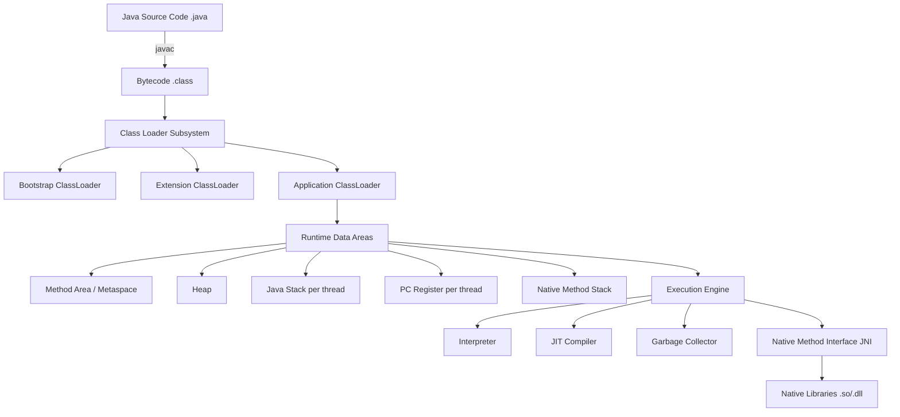
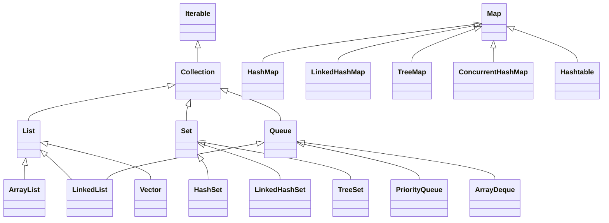
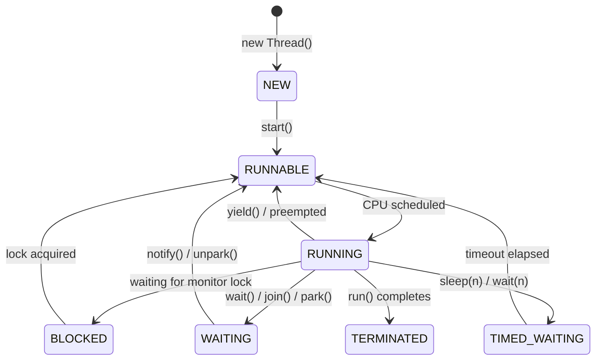

# Section 1: Core Java — Deep Dive


---

## Table of Contents

1. [JVM Architecture](#1-jvm-architecture)
2. [JDK vs JRE vs JVM](#2-jdk-vs-jre-vs-jvm)
3. [Memory Management — Heap, Stack, Metaspace](#3-memory-management)
4. [Garbage Collection & GC Algorithms](#4-garbage-collection)
5. [Java Collections Framework](#5-java-collections-framework)
6. [HashMap Deep Dive](#6-hashmap-deep-dive)
7. [Concurrency — Threads, Executors, CompletableFuture](#7-concurrency)
8. [Locks — synchronized, ReentrantLock, ReadWriteLock](#8-locks)
9. [Java 8+ Features](#9-java-8-features)
10. [Design Principles — SOLID, DRY, KISS, YAGNI](#10-design-principles)

---

# 1. JVM Architecture

## Definition

The **Java Virtual Machine (JVM)** is an abstract computing machine that provides a runtime environment to execute Java bytecode. It is the engine that drives Java's "Write Once, Run Anywhere" promise.

---

## Mental Model

Think of the JVM as a **translator at a live concert**. The performer (your Java code) speaks one language (bytecode), and the translator (JVM) converts it in real-time to the language the audience (your OS/hardware) understands. Each country (OS) has a different translator (JVM implementation), but the performer never changes their script.

---

## Why It Exists

**Problem:** C/C++ programs compiled for Windows cannot run on Linux — they produce OS-specific native binaries.

**Solution:** Java compiles to platform-neutral bytecode (`.class` files). The JVM (which IS platform-specific) then interprets/compiles that bytecode to native instructions at runtime.

---

## Internal Working — JVM Architecture Diagram



### Class Loader Subsystem

| Phase | Description |
|-------|-------------|
| **Loading** | Reads `.class` file bytes, creates `Class` object |
| **Linking — Verification** | Bytecode format validity check |
| **Linking — Preparation** | Allocates memory for static variables, sets default values |
| **Linking — Resolution** | Replaces symbolic references with direct references |
| **Initialization** | Executes `static` blocks and initializes static variables |

### Class Loader Delegation Model (Parent-First)

```
Bootstrap ClassLoader (rt.jar, core Java APIs)
    ↑ delegates to parent first
Extension ClassLoader (jre/lib/ext)
    ↑ delegates to parent first
Application ClassLoader (classpath)
    ↑ your code
```

> **Interview Point:** Custom ClassLoaders break the delegation model intentionally (e.g., OSGi, Tomcat isolation).

### Execution Engine

- **Interpreter:** Executes bytecode line-by-line. Fast startup, slow throughput.
- **JIT Compiler (C1/C2):** Detects "hot" methods (called frequently), compiles them to native code. C1 = fast compilation, C2 = aggressive optimization.
- **AOT (Ahead-of-Time):** GraalVM native image — compiles everything upfront. No JIT warmup, minimal memory (used in Spring Native / Quarkus).

---

## Interview Questions

### Basic
1. What is the JVM and what does it do?
2. What is bytecode?
3. What are the three class loaders in the JVM?
4. What is the difference between the Interpreter and JIT compiler?

### Intermediate
5. Explain the class loading delegation model. Can you break it?
6. What happens when two class loaders load the same class?
7. What is the difference between C1 and C2 JIT compiler?
8. What is method inlining and how does JIT use it?

### Advanced
9. How does GraalVM's native image work and what are its trade-offs?
10. Explain deoptimization in JIT compilation.
11. What is escape analysis and how does it affect heap allocation?
12. How does the JVM handle ClassCircularityError?

### Scenario-Based
13. *Your application has a 10-second startup time. How do you reduce it?*
   - Profile with `-XX:+PrintCompilation`
   - Use AOT / GraalVM native image for microservices
   - Use AppCDS (Class Data Sharing) to cache class loading
14. *Your application has a ClassNotFoundException in production after deployment. What do you check?*
   - Check classpath / fat jar structure
   - Check if JAR is excluded during packaging
   - Check ClassLoader isolation (Tomcat, OSGi)

---

## Common Interview Mistakes

- Confusing **ClassNotFoundException** (runtime, wrong classpath) with **NoClassDefFoundError** (class existed at compile time, missing at runtime — often due to a failed static initializer)
- Saying "JVM compiles Java code" — the JVM executes bytecode; `javac` compiles Java source
- Not knowing that JVM itself is platform-specific but bytecode is not

---

# 2. JDK vs JRE vs JVM

## Quick Comparison Table

| Component | Contains | Used For |
|-----------|----------|----------|
| **JVM** | Bytecode executor, GC, JIT | Running `.class` files |
| **JRE** | JVM + standard libraries (rt.jar) | Running Java applications |
| **JDK** | JRE + `javac`, `javap`, `jshell`, profilers | Developing Java applications |

> **Note:** Since Java 11, JRE is no longer distributed separately. You use the JDK.

### Mental Model

- **JVM** = Car engine
- **JRE** = Engine + car body (you can drive it)
- **JDK** = Full garage with tools to build and drive the car

---

# 3. Memory Management

## Heap

The **Heap** is the runtime data area shared by all threads where object instances and arrays are allocated.

### Heap Structure (Generational GC)

```
┌─────────────────────────────────────────────────────────────┐
│                          HEAP                               │
│  ┌──────────────────────────────┐  ┌──────────────────────┐ │
│  │         Young Generation     │  │   Old Generation     │ │
│  │  ┌────────┐  ┌────┐  ┌────┐ │  │   (Tenured Space)    │ │
│  │  │  Eden  │  │ S0 │  │ S1 │ │  │  Long-lived objects  │ │
│  │  │ (new   │  │(from│  │(to)│ │  │                      │ │
│  │  │ alloc) │  │    │  │    │ │  │                      │ │
│  │  └────────┘  └────┘  └────┘ │  └──────────────────────┘ │
│  └──────────────────────────────┘                           │
└─────────────────────────────────────────────────────────────┘
```

### Object Allocation Flow

1. New object → allocated in **Eden**
2. Eden fills → Minor GC triggers
3. Surviving objects → moved to **Survivor (S0 or S1)**
4. Objects surviving N GC cycles (default: 15) → promoted to **Old Generation**
5. Old Gen fills → Major/Full GC triggers

## Stack

- Each **thread** gets its own Stack
- Stack holds: **stack frames** (method calls), local variables, operand stack, reference to constant pool
- Stack frame is created on method call, destroyed on method return
- **StackOverflowError** = infinite recursion / too many nested calls

```
Thread 1 Stack:
┌────────────────────┐
│  methodC() frame   │  ← current
│  methodB() frame   │
│  methodA() frame   │
│  main() frame      │  ← bottom
└────────────────────┘
```

> **Key:** Objects are on heap, references to those objects live on the stack.

## Metaspace (Java 8+, replaces PermGen)

| | PermGen (Java 7) | Metaspace (Java 8+) |
|--|--|--|
| Location | JVM Heap | Native OS Memory |
| Default Size | Fixed (64MB) | Unlimited (bounded by OS RAM) |
| OutOfMemoryError | `OutOfMemoryError: PermGen space` | `OutOfMemoryError: Metaspace` |
| Stores | Class metadata, interned Strings | Class metadata (Strings moved to Heap) |

**Metaspace JVM flags:**

```bash
-XX:MetaspaceSize=256m        # initial size
-XX:MaxMetaspaceSize=512m     # cap to prevent leaks
```

> **Production Issue:** Dynamic class generation (Groovy, CGLib proxies, Hibernate) can cause Metaspace leak if classes are never unloaded.

## Code Cache

Stores JIT-compiled native code. If full, JIT stops compiling → performance degrades.

```bash
-XX:ReservedCodeCacheSize=256m
```

---

## Interview Questions

### Basic
1. What is stored on the Heap vs the Stack?
2. Can two threads share the same Stack?
3. What replaced PermGen in Java 8?

### Intermediate
4. What is the Young Generation and why does it exist?
5. What is object promotion in GC?
6. How do you configure Metaspace size?

### Advanced
7. What is TLAB (Thread-Local Allocation Buffer) and how does it improve performance?
8. Explain escape analysis and stack allocation optimization.
9. How can you diagnose a Metaspace leak?

### Scenario-Based
10. *Your application throws `OutOfMemoryError: Java heap space` in production. Walk me through diagnosing this.*

**Answer:**
1. Take a heap dump: `jmap -dump:format=b,file=heap.hprof <pid>` or use `-XX:+HeapDumpOnOutOfMemoryError`
2. Analyze with Eclipse MAT or VisualVM — look for dominators
3. Check for collections growing without bound, caches without eviction, event listeners not deregistered
4. Check `jstat -gcutil <pid> 1000` to see GC frequency
5. Add heap monitoring: `-Xmx`, `-Xms` tuning, check if heap is properly sized

---

# 4. Garbage Collection

## Definition

**Garbage Collection (GC)** is the automatic process of reclaiming memory occupied by objects that are no longer reachable from any live thread or static reference.

## Mental Model

GC is like a **janitor in an office building**. The janitor only cleans desks that nobody is sitting at or has a reference to. If a manager's desk has a document referring to another desk, that second desk is also "in use." Only completely unreferenced desks get cleaned.

## Reachability: GC Roots

GC starts from **GC Roots** and marks everything reachable:
- Active thread stacks
- Static variables
- JNI references
- Class objects in Metaspace

Anything **not reachable** from GC roots → eligible for collection.

---

## GC Algorithms

### 1. Serial GC

```bash
-XX:+UseSerialGC
```

| Attribute | Value |
|-----------|-------|
| Threads | 1 (single-threaded) |
| STW (Stop-The-World) | Yes — full pause |
| Best For | Small heap (<256MB), single-core |
| Typical Use | Batch jobs, containers with 1 CPU |

**How it works:** Single thread does all GC work. Application pauses completely. Simple but predictable.

---

### 2. Parallel GC (Throughput Collector)

```bash
-XX:+UseParallelGC
-XX:ParallelGCThreads=8
```

| Attribute | Value |
|-----------|-------|
| Threads | Multiple (parallel) |
| STW | Yes — but shorter than Serial |
| Best For | Batch jobs, throughput-sensitive apps |
| Goal | Maximize throughput |

**How it works:** Multiple threads work in parallel during Minor and Major GC. Still Stop-The-World.

---

### 3. G1GC (Garbage-First GC) — Default since Java 9

```bash
-XX:+UseG1GC
-XX:MaxGCPauseMillis=200   # soft pause target
-XX:G1HeapRegionSize=16m
```

| Attribute | Value |
|-----------|-------|
| Heap Division | Equal-sized regions (1–32 MB) |
| STW | Yes for Young GC; Mixed GC is concurrent |
| Best For | Large heaps (> 6GB), low-latency apps |
| Default Since | Java 9 |

**How it works:**

```
Heap divided into N regions:
┌───┬───┬───┬───┬───┬───┬───┬───┐
│ E │ S │ O │ E │ H │ O │ E │ S │
└───┴───┴───┴───┴───┴───┴───┴───┘
E=Eden, S=Survivor, O=Old, H=Humongous

G1 tracks "garbage density" per region.
Collects regions with most garbage first → Garbage-First.
```

**G1 GC Phases:**
1. **Young GC (STW):** Evacuates Eden + Survivor regions
2. **Concurrent Marking:** Marks live objects concurrently (no pause)
3. **Remark (STW):** Final marking pass
4. **Mixed GC:** Collects Young + selected Old regions
5. **Full GC (STW, rare):** Fallback if G1 can't keep up

---

### 4. ZGC (Z Garbage Collector)

```bash
-XX:+UseZGC
```

| Attribute | Value |
|-----------|-------|
| Pause Time | < 1ms (regardless of heap size) |
| Concurrency | Almost fully concurrent |
| Best For | Very low latency, heaps up to 16TB |
| Available Since | Java 11 (production-ready Java 15) |

**Key Innovation:** Uses **colored pointers** (load barriers) to do most work concurrently while the application is running. The GC piggybacks on every object access.

**Trade-off:** Higher CPU overhead than G1 (~15% more CPU) for the low-latency guarantee.

---

### 5. Shenandoah GC

```bash
-XX:+UseShenandoahGC
```

| Attribute | Value |
|-----------|-------|
| Pause Time | < 10ms |
| Concurrency | Concurrent compaction (unlike G1) |
| Best For | Low-latency, medium-large heaps |
| Available | OpenJDK, GraalVM |

**Key Difference from ZGC:** Shenandoah does **concurrent compaction** (moving objects while app runs). ZGC also does this. Both achieve sub-millisecond pauses.

---

## GC Algorithm Comparison Table

| GC | Pause | Throughput | Memory Overhead | Best For |
|----|-------|------------|-----------------|----------|
| Serial | High | Low | Low | Dev/tiny apps |
| Parallel | Medium | High | Low | Batch jobs |
| G1 | Low (configurable) | High | Medium | Most production |
| ZGC | <1ms | Medium | High | Ultra-low latency |
| Shenandoah | <10ms | Medium | Medium | Low latency |

---

## GC Tuning JVM Flags

```bash
# Heap sizing
-Xms512m                          # Initial heap
-Xmx4g                            # Max heap (set Xms=Xmx in prod to avoid resize pauses)

# G1 tuning
-XX:+UseG1GC
-XX:MaxGCPauseMillis=200
-XX:G1HeapRegionSize=16m
-XX:G1NewSizePercent=20
-XX:G1MaxNewSizePercent=40
-XX:ConcGCThreads=4

# GC logging (Java 11+)
-Xlog:gc*:file=gc.log:time,uptime,level,tags

# Heap dump on OOM
-XX:+HeapDumpOnOutOfMemoryError
-XX:HeapDumpPath=/var/logs/heapdump.hprof
```

---

## Production Scenario: GC Pause Causing Latency Spikes

### Scenario
An e-commerce platform experiences 2-3 second response time spikes every 30 minutes. The application uses 8GB heap with default GC settings.

### Root Cause
Default Parallel GC was performing Full GC on the large heap. The Old Generation was filling due to session objects with 30-minute TTL, causing periodic Full GC pauses of 2-3 seconds (STW).

### Solution
1. Switched to G1GC with `-XX:MaxGCPauseMillis=200`
2. Reduced session TTL from 30 minutes to 10 minutes
3. Added `-XX:+UnlockDiagnosticVMOptions -XX:G1SummarizeRSetStatsPeriod=1` for monitoring
4. Increased heap to 16GB to reduce GC frequency

### Prevention
- Monitor `jstat -gcutil <pid> 5000` for GC frequency
- Alert on `gc.pause.time > 500ms`
- Use G1GC or ZGC for heap > 4GB

---

## Interview Questions

### Basic
1. What is garbage collection?
2. What is Stop-The-World (STW)?
3. What is the difference between Minor GC and Major GC?

### Intermediate
4. Explain G1GC and when you would use it over Parallel GC.
5. What is object promotion and when does it happen?
6. What causes a Full GC?

### Advanced
7. How does ZGC achieve sub-millisecond pause times?
8. What are colored pointers in ZGC?
9. Explain concurrent marking in G1GC.
10. What is GC humongous allocation and why is it problematic?

### Scenario-Based
11. *Your microservice has 99th percentile latency of 3 seconds. GC logs show 2-second pauses. What do you do?*

---

# 5. Java Collections Framework

## Architecture Overview



---

## List Implementations

### ArrayList vs LinkedList

| Feature | ArrayList | LinkedList |
|---------|-----------|------------|
| Backing Structure | Dynamic array | Doubly-linked list |
| Random Access `get(i)` | O(1) | O(n) |
| Insert/Delete at middle | O(n) (shift elements) | O(1) (after finding node: O(n)) |
| Insert at end | O(1) amortized | O(1) |
| Memory per element | ~4 bytes (reference) | ~24 bytes (node + prev + next) |
| Cache Performance | Excellent (contiguous) | Poor (pointer chasing) |
| Use When | Frequent reads, rare inserts | Frequent inserts at head/tail |
| Implements | List | List, Deque, Queue |

> **Interview Insight:** In practice, ArrayList is almost always faster due to CPU cache locality, even for insertions. Benchmark before choosing LinkedList.

### When NOT to use LinkedList

```java
// This is O(n) each iteration — avoid for large lists
for (int i = 0; i < linkedList.size(); i++) {
    linkedList.get(i); // O(n) each time!
}
// Use iterator or for-each instead
```

---

## Set Implementations

| Feature | HashSet | LinkedHashSet | TreeSet |
|---------|---------|---------------|---------|
| Order | No order | Insertion order | Sorted (natural/comparator) |
| Backing | HashMap | LinkedHashMap | Red-Black Tree |
| `contains()` | O(1) avg | O(1) avg | O(log n) |
| `add()` | O(1) avg | O(1) avg | O(log n) |
| Null allowed | Yes (1) | Yes (1) | No (by default) |
| Thread-safe | No | No | No |

---

## Map Implementations

| Feature | HashMap | LinkedHashMap | TreeMap | ConcurrentHashMap | Hashtable |
|---------|---------|---------------|---------|-------------------|-----------|
| Order | None | Insertion/Access | Sorted | None | None |
| Null keys | 1 | 1 | No | No | No |
| Thread-safe | No | No | No | Yes | Yes (coarse lock) |
| Performance | O(1) | O(1) | O(log n) | O(1) concurrent | Low |
| Use For | General | LRU Cache | Sorted maps | Concurrent maps | Legacy |

### HashMap vs ConcurrentHashMap — Deep Comparison

| | HashMap | ConcurrentHashMap |
|--|---------|-------------------|
| Synchronization | None | Segment/bucket-level (Java 8: CAS + synchronized) |
| null key/value | Allowed | Not allowed |
| Iterator | Fail-fast | Weakly consistent (no ConcurrentModificationException) |
| Performance | Fastest single-thread | ~10x faster than Hashtable under concurrency |
| Java 8 change | Treeification | Lock striping per bin |

---

## Queue / Deque

| Class | Behavior | Use Case |
|-------|----------|----------|
| `LinkedList` | FIFO | Simple queue |
| `ArrayDeque` | LIFO/FIFO | Stack or Queue (faster than LinkedList) |
| `PriorityQueue` | Min-Heap | Task scheduling by priority |
| `BlockingQueue` | Thread-safe, blocking | Producer-consumer patterns |
| `LinkedBlockingQueue` | Bounded/unbounded | Thread pools |
| `ArrayBlockingQueue` | Bounded | Rate limiting |

---

# 6. HashMap Deep Dive

## Definition

`HashMap` is a hash table-based implementation of the `Map` interface. It uses hashing to map keys to values, providing O(1) average time for `get` and `put`.

## Mental Model

Think of HashMap as a **building with numbered floors (buckets)**. When you store something, you use its name (key) to compute which floor to use (hash). On that floor, items are stored. If two items hash to the same floor → they share that floor (collision handling).

---

## Internal Structure (Java 8+)

```java
// Simplified internal view
Node<K,V>[] table;   // array of buckets

static class Node<K,V> {
    final int hash;
    final K key;
    V value;
    Node<K,V> next;   // linked list for collision
}

// When bucket has > 8 nodes → converts to TreeNode (Red-Black Tree)
static final class TreeNode<K,V> extends Node<K,V> { ... }
```

## How `put(key, value)` Works

```mermaid
flowchart TD
    A[put key,value] --> B[Compute hash: hash = key.hashCode()]
    B --> C[Spread bits: index = hash ^ hash>>>16]
    C --> D["Bucket index = index & (n-1)"]
    D --> E{Bucket empty?}
    E -->|Yes| F[Create new Node, insert at bucket]
    E -->|No| G{Key exists? equals check}
    G -->|Yes| H[Update existing value]
    G -->|No| I[Add to linked list / tree]
    I --> J{Size > threshold? loadFactor * capacity}
    J -->|Yes| K[Resize: double capacity, rehash all]
    J -->|No| L[Done]
    I --> M{Bin size > 8 AND table size >= 64?}
    M -->|Yes| N[Treeify: convert to Red-Black Tree]
```

## Hashing — Why `hash ^ (hash >>> 16)`?

```java
static final int hash(Object key) {
    int h;
    return (key == null) ? 0 : (h = key.hashCode()) ^ (h >>> 16);
}
```

**Why?** Table size is often small (e.g., 16). Index = `hash & 15` uses only the **lower 4 bits** of the hash. XORing with the upper 16 bits spreads entropy from high bits into the lower bits, reducing collisions.

## Collision Handling

| Collision Count | Structure |
|-----------------|-----------|
| 0–8 nodes | Singly-linked list |
| > 8 nodes AND table size ≥ 64 | Treeify → Red-Black Tree (O(log n)) |
| After resize, bin shrinks to < 6 | Untreeify → back to linked list |

## Resize (Rehashing)

```java
static final float DEFAULT_LOAD_FACTOR = 0.75f;
// Resize when: size > capacity * loadFactor
// e.g., size 16 → resize at 12 entries
// New capacity = oldCapacity * 2
```

**Why 0.75 load factor?** Mathematical balance between:
- Too low → frequent resize (wasted memory)
- Too high → too many collisions

**Resize is expensive:** O(n) — all entries are rehashed. For known sizes, pre-size the map:

```java
// Avoid multiple resizes for known sizes
Map<String, String> map = new HashMap<>(expectedSize / 0.75 + 1);
```

## Time Complexity

| Operation | Average | Worst Case (all keys hash same) |
|-----------|---------|--------------------------------|
| `get` | O(1) | O(log n) with Java 8 treeification |
| `put` | O(1) | O(log n) |
| `remove` | O(1) | O(log n) |
| `containsKey` | O(1) | O(log n) |

> **Before Java 8:** Worst case was O(n) with all collisions in a linked list. Java 8 treeification caps worst case at O(log n).

## `equals()` and `hashCode()` Contract

```java
// MUST follow this contract:
// 1. If a.equals(b) → a.hashCode() == b.hashCode()
// 2. If a.hashCode() == b.hashCode() → a.equals(b) MAY be false (collision)

// Breaking this → objects cannot be found in HashMap
class BadKey {
    int id;
    
    @Override
    public boolean equals(Object o) { return ((BadKey)o).id == this.id; }
    
    // MISSING hashCode override → inherits Object.hashCode() (memory address)
    // Two BadKey(1) objects will have different hashCodes
    // → HashMap will put them in different buckets
    // → You can put duplicate "equal" keys!
}
```

## HashMap in Concurrent Environment — The Infinite Loop Bug

In Java 7, concurrent access to HashMap during resize could cause **infinite loop** (CPU spike to 100%):

```
Thread-1 resizing: A → B → A (cycle created due to list reversal during transfer)
Thread-2 reading: traverses the cycle forever
```

**Solution:** Use `ConcurrentHashMap` in multithreaded code. Never share a `HashMap` between threads without synchronization.

---

## Interview Questions

### Basic
1. How does HashMap work internally?
2. What is the default initial capacity and load factor?
3. What happens when two keys have the same hashCode?

### Intermediate
4. What is treeification in Java 8 HashMap?
5. Explain the HashMap resize process.
6. Why is `hashCode()` and `equals()` contract important for HashMap?

### Advanced
7. What causes infinite loop in Java 7 HashMap under concurrency?
8. How does ConcurrentHashMap achieve thread safety in Java 8?
9. Explain the purpose of `hash ^ (hash >>> 16)` in the hash function.
10. When would you choose TreeMap over HashMap?

---

# 7. Concurrency

## Threads

### Thread Lifecycle



### Runnable vs Callable vs Thread

```java
// Runnable — no return value, no checked exception
Runnable r = () -> System.out.println("Running");

// Callable — returns value, can throw checked exception
Callable<Integer> c = () -> {
    return computeSomething();
};

// Thread — low-level, avoid creating raw threads in production
Thread t = new Thread(r);
t.start();
```

---

## Executor Framework

> **Rule:** Never create raw `Thread` objects in production code. Always use an Executor.

### Thread Pool Types

```java
// Fixed pool — bounded, good for CPU-bound tasks
ExecutorService fixed = Executors.newFixedThreadPool(10);

// Cached pool — unbounded threads, good for short-lived I/O tasks
// DANGER: can create thousands of threads under load
ExecutorService cached = Executors.newCachedThreadPool();

// Single thread — serializes tasks
ExecutorService single = Executors.newSingleThreadExecutor();

// Scheduled — for recurring tasks
ScheduledExecutorService scheduled = Executors.newScheduledThreadPool(5);

// ForkJoinPool — work-stealing, good for recursive/parallel computation
ForkJoinPool fjp = new ForkJoinPool(Runtime.getRuntime().availableProcessors());
```

### ThreadPoolExecutor — Production Configuration

```java
ThreadPoolExecutor executor = new ThreadPoolExecutor(
    10,                                    // corePoolSize
    50,                                    // maximumPoolSize
    60, TimeUnit.SECONDS,                  // keepAliveTime
    new LinkedBlockingQueue<>(1000),       // workQueue (bounded!)
    new ThreadFactoryBuilder()             // named threads for debugging
        .setNameFormat("payment-worker-%d")
        .build(),
    new ThreadPoolExecutor.CallerRunsPolicy() // rejection policy
);
```

### Rejection Policies

| Policy | Behavior | Use When |
|--------|----------|----------|
| `AbortPolicy` | Throws `RejectedExecutionException` | Default, fail-fast |
| `CallerRunsPolicy` | Caller thread executes task | Back-pressure needed |
| `DiscardPolicy` | Silently drops task | Tasks are expendable |
| `DiscardOldestPolicy` | Drops oldest queued task | Only latest matters |

> **Production Note:** Always use a **bounded queue** in production. `Executors.newFixedThreadPool` uses `LinkedBlockingQueue` with `Integer.MAX_VALUE` capacity — this is a memory bomb.

---

## CompletableFuture (Java 8+)

```java
// Basic async computation
CompletableFuture<String> future = CompletableFuture.supplyAsync(() -> {
    return fetchUserFromDB(userId);
}, executor);

// Chaining
CompletableFuture<String> result = CompletableFuture
    .supplyAsync(() -> fetchUser(userId), executor)
    .thenApply(user -> enrichUser(user))              // transform (sync)
    .thenCompose(user -> fetchOrders(user.getId()))    // flat-map async
    .thenAccept(orders -> sendEmail(orders))           // consume
    .exceptionally(ex -> handleError(ex));             // error handling

// Combine multiple futures
CompletableFuture<String> user = CompletableFuture.supplyAsync(() -> fetchUser());
CompletableFuture<String> orders = CompletableFuture.supplyAsync(() -> fetchOrders());

CompletableFuture<Void> both = CompletableFuture.allOf(user, orders);
both.thenRun(() -> {
    String u = user.join();
    String o = orders.join();
    combine(u, o);
});
```

### CompletableFuture Method Reference Table

| Method | Description |
|--------|-------------|
| `supplyAsync(Supplier)` | Start async task returning value |
| `runAsync(Runnable)` | Start async task, no return |
| `thenApply(Function)` | Transform result (sync) |
| `thenApplyAsync(Function)` | Transform result (async) |
| `thenCompose(Function)` | Flat-map — chain async operations |
| `thenCombine(CF, BiFunction)` | Combine two futures' results |
| `allOf(CF...)` | Wait for all to complete |
| `anyOf(CF...)` | Complete when any completes |
| `exceptionally(Function)` | Handle exception |
| `handle(BiFunction)` | Handle both result and exception |
| `join()` | Block and get result (unchecked) |
| `get()` | Block and get result (checked) |

---

## ForkJoinPool

```java
// Work-stealing pool — idle threads steal tasks from busy threads' queues
// Used internally by: parallel streams, CompletableFuture default executor

ForkJoinPool pool = ForkJoinPool.commonPool(); // shared pool

// RecursiveTask — returns value
class SumTask extends RecursiveTask<Long> {
    private final long[] array;
    private final int start, end;
    static final int THRESHOLD = 1000;

    @Override
    protected Long compute() {
        if (end - start <= THRESHOLD) {
            return sumSequentially(array, start, end);
        }
        int mid = (start + end) / 2;
        SumTask left = new SumTask(array, start, mid);
        SumTask right = new SumTask(array, mid, end);
        left.fork();           // submit left to pool
        long rightResult = right.compute(); // compute right in current thread
        long leftResult = left.join();      // wait for left
        return leftResult + rightResult;
    }
}
```

---

# 8. Locks

## `synchronized`

```java
// Method-level lock (locks on `this`)
public synchronized void withdraw(int amount) {
    balance -= amount;
}

// Block-level lock (more granular)
public void withdraw(int amount) {
    synchronized(this) {
        balance -= amount;
    }
}

// Static synchronized — locks on Class object
public static synchronized void register() { ... }
```

## ReentrantLock

```java
private final ReentrantLock lock = new ReentrantLock();

public void withdraw(int amount) {
    lock.lock();
    try {
        balance -= amount;
    } finally {
        lock.unlock(); // ALWAYS unlock in finally
    }
}

// Try lock with timeout — avoid deadlock
if (lock.tryLock(500, TimeUnit.MILLISECONDS)) {
    try { ... }
    finally { lock.unlock(); }
} else {
    // Could not acquire lock — handle gracefully
}
```

## ReentrantReadWriteLock

```java
ReadWriteLock rwLock = new ReentrantReadWriteLock();
Lock readLock = rwLock.readLock();
Lock writeLock = rwLock.writeLock();

// Multiple readers can hold read lock simultaneously
public String read(String key) {
    readLock.lock();
    try { return cache.get(key); }
    finally { readLock.unlock(); }
}

// Write lock is exclusive — no readers OR writers when held
public void write(String key, String value) {
    writeLock.lock();
    try { cache.put(key, value); }
    finally { writeLock.unlock(); }
}
```

## StampedLock (Java 8+)

```java
StampedLock sl = new StampedLock();

// Optimistic read — no lock acquired, validate afterwards
long stamp = sl.tryOptimisticRead();
int value = this.value;
if (!sl.validate(stamp)) {
    // Optimistic read failed — fallback to read lock
    stamp = sl.readLock();
    try { value = this.value; }
    finally { sl.unlockRead(stamp); }
}
```

## Lock Comparison Table

| Feature | `synchronized` | `ReentrantLock` | `ReadWriteLock` | `StampedLock` |
|---------|---------------|-----------------|-----------------|---------------|
| Try lock | No | Yes | Yes | Yes |
| Interruptible | No | Yes | Yes | Yes |
| Fairness | No | Optional | Optional | No |
| Multiple conditions | No | Yes (`newCondition()`) | Limited | No |
| Read/Write separation | No | No | Yes | Yes |
| Optimistic read | No | No | No | Yes |
| Reentrant | Yes | Yes | Yes | No |
| Complexity | Low | Medium | Medium | High |

---

# 9. Java 8+ Features

## Lambda Expressions

```java
// Before Java 8
Runnable r = new Runnable() {
    @Override
    public void run() { System.out.println("Old way"); }
};

// Java 8+
Runnable r = () -> System.out.println("New way");

// With parameters
Comparator<String> c = (a, b) -> a.compareTo(b);

// With block body
Function<Integer, Integer> square = n -> {
    int result = n * n;
    return result;
};
```

## Functional Interfaces

| Interface | Method | Description |
|-----------|--------|-------------|
| `Function<T,R>` | `R apply(T t)` | Transform T to R |
| `BiFunction<T,U,R>` | `R apply(T t, U u)` | Transform T,U to R |
| `Consumer<T>` | `void accept(T t)` | Consume T, no return |
| `Supplier<T>` | `T get()` | Produce T |
| `Predicate<T>` | `boolean test(T t)` | Test condition |
| `UnaryOperator<T>` | `T apply(T t)` | T → T transformation |
| `BinaryOperator<T>` | `T apply(T t1, T t2)` | (T,T) → T |

## Streams API

```java
List<Employee> employees = getEmployees();

// Pipeline: source → intermediate operations → terminal operation
double avgSalary = employees.stream()
    .filter(e -> e.getDepartment().equals("Engineering"))  // intermediate
    .mapToDouble(Employee::getSalary)                       // intermediate
    .average()                                              // terminal
    .orElse(0.0);

// Collect to list
List<String> names = employees.stream()
    .map(Employee::getName)
    .sorted()
    .collect(Collectors.toList());

// Group by
Map<String, List<Employee>> byDept = employees.stream()
    .collect(Collectors.groupingBy(Employee::getDepartment));

// Parallel stream — use only for CPU-bound, large collections
long count = employees.parallelStream()
    .filter(e -> e.getSalary() > 100000)
    .count();
```

### Stream Operations Reference

| Type | Operation | Description |
|------|-----------|-------------|
| Intermediate | `filter(Predicate)` | Keep matching elements |
| Intermediate | `map(Function)` | Transform each element |
| Intermediate | `flatMap(Function)` | Flatten nested streams |
| Intermediate | `distinct()` | Remove duplicates |
| Intermediate | `sorted()` | Sort elements |
| Intermediate | `limit(n)` | Take first n elements |
| Intermediate | `skip(n)` | Skip first n elements |
| Terminal | `collect(Collector)` | Collect to collection |
| Terminal | `forEach(Consumer)` | Consume each element |
| Terminal | `count()` | Count elements |
| Terminal | `reduce(BinaryOp)` | Fold to single value |
| Terminal | `findFirst()` | Get first (Optional) |
| Terminal | `anyMatch(Predicate)` | Check any match |
| Terminal | `allMatch(Predicate)` | Check all match |

## Optional

```java
// WRONG — don't use Optional as a null check replacement everywhere
Optional<String> opt = Optional.ofNullable(getValue());
if (opt.isPresent()) {
    String value = opt.get(); // anti-pattern
}

// RIGHT — use functional style
Optional<String> result = Optional.ofNullable(getUserEmail(userId))
    .filter(email -> email.contains("@"))
    .map(String::toLowerCase);

result.ifPresent(email -> sendNotification(email));
String email = result.orElse("no-email");
String email2 = result.orElseGet(() -> fetchDefaultEmail()); // lazy
String email3 = result.orElseThrow(() -> new UserNotFoundException(userId));
```

> **Common Mistake:** Returning `Optional` from repository methods is fine. Using Optional for fields, method parameters, or collections is an anti-pattern.

## Method References

```java
// Static method reference
Function<String, Integer> parse = Integer::parseInt;

// Instance method reference (bound)
String prefix = "Hello";
Predicate<String> startsWith = prefix::startsWith;

// Instance method reference (unbound)
Function<String, String> toUpper = String::toUpperCase;

// Constructor reference
Supplier<ArrayList<String>> listFactory = ArrayList::new;
```

---

# 10. Design Principles

## SOLID

### S — Single Responsibility Principle

> A class should have only **one reason to change**.

```java
// WRONG — UserService handles business logic AND email sending
class UserService {
    public void registerUser(User user) {
        saveToDb(user);
        sendWelcomeEmail(user); // violates SRP
        logActivity(user);      // violates SRP
    }
}

// RIGHT
class UserService {
    private final EmailService emailService;
    private final AuditService auditService;
    
    public void registerUser(User user) {
        saveToDb(user);
        emailService.sendWelcomeEmail(user);
        auditService.log("USER_REGISTERED", user);
    }
}
```

### O — Open/Closed Principle

> Classes should be **open for extension, closed for modification**.

```java
// WRONG — adding new payment type requires modifying existing class
class PaymentProcessor {
    public void process(Payment payment) {
        if (payment.type == CREDIT_CARD) { ... }
        else if (payment.type == UPI) { ... }
        // Adding CRYPTO requires modifying this class
    }
}

// RIGHT — use polymorphism
interface PaymentGateway {
    void process(Payment payment);
}
class CreditCardGateway implements PaymentGateway { ... }
class UPIGateway implements PaymentGateway { ... }
class CryptoGateway implements PaymentGateway { ... } // no modification needed
```

### L — Liskov Substitution Principle

> Subtypes must be substitutable for their base types **without altering program correctness**.

```java
// WRONG — Square breaks Rectangle's contract
class Rectangle {
    protected int width, height;
    public void setWidth(int w) { this.width = w; }
    public void setHeight(int h) { this.height = h; }
    public int area() { return width * height; }
}

class Square extends Rectangle {
    @Override
    public void setWidth(int w) { this.width = this.height = w; } // breaks contract
}

// Code expecting Rectangle will break with Square:
// r.setWidth(5); r.setHeight(3); assert r.area() == 15; // FAILS for Square
```

### I — Interface Segregation Principle

> Clients should not be forced to depend on methods they do not use.

```java
// WRONG — fat interface
interface Worker {
    void work();
    void eat();    // robots don't eat
    void sleep();  // robots don't sleep
}

// RIGHT — segregated interfaces
interface Workable { void work(); }
interface Eatable { void eat(); }
interface Sleepable { void sleep(); }

class HumanWorker implements Workable, Eatable, Sleepable { ... }
class RobotWorker implements Workable { ... }
```

### D — Dependency Inversion Principle

> High-level modules should not depend on low-level modules. Both should depend on **abstractions**.

```java
// WRONG
class OrderService {
    private MySQLOrderRepository repository = new MySQLOrderRepository(); // concrete
}

// RIGHT
class OrderService {
    private final OrderRepository repository; // abstraction
    
    public OrderService(OrderRepository repository) { // injected
        this.repository = repository;
    }
}
interface OrderRepository { Order findById(Long id); }
class MySQLOrderRepository implements OrderRepository { ... }
class MongoOrderRepository implements OrderRepository { ... }
```

---

## DRY, KISS, YAGNI

| Principle | Stands For | Meaning | Violation Example |
|-----------|-----------|---------|-------------------|
| **DRY** | Don't Repeat Yourself | Extract duplicate code into reusable units | Copy-pasting validation logic across 5 controllers |
| **KISS** | Keep It Simple, Stupid | Prefer simple solutions over clever ones | Using a regex to validate email when `email.contains("@")` suffices |
| **YAGNI** | You Aren't Gonna Need It | Don't build features until they are needed | Adding a caching layer before any performance problem exists |

---

## Summary — Core Java Cheatsheet

```
JVM Architecture
├── Class Loader (Bootstrap → Extension → Application)
├── Runtime Data Areas: Heap, Stack (per thread), Metaspace, PC Register
├── Execution Engine: Interpreter + JIT (C1/C2) + GC

Memory
├── Heap: Eden → Survivor → Old Gen
├── Stack: Per-thread, stack frames
├── Metaspace: Class metadata (native memory, no PermGen)

GC Algorithms
├── Serial GC: Single-thread, small apps
├── Parallel GC: Multi-thread, throughput
├── G1GC: Default Java 9+, balanced, large heaps
├── ZGC: <1ms pauses, ultra-low latency
└── Shenandoah: Concurrent compaction, low latency

Collections
├── List: ArrayList (O(1) get), LinkedList (O(1) insert at ends)
├── Set: HashSet (O(1)), TreeSet (O(log n), sorted)
├── Map: HashMap (O(1)), TreeMap (sorted), ConcurrentHashMap (thread-safe)
└── Queue: ArrayDeque (fast), PriorityQueue (min-heap)

HashMap Internals
├── Array of buckets + linked list → Red-Black tree at 8 nodes
├── Load factor 0.75, resize doubles capacity
└── hashCode() ^ (hashCode() >>> 16) for bit spreading

Concurrency
├── Executor Framework: Never create raw threads
├── ThreadPoolExecutor: bounded queue, rejection policy
├── CompletableFuture: non-blocking async pipelines
└── ForkJoinPool: work-stealing, parallel computation

Locks
├── synchronized: simple, reentrant, no timeout
├── ReentrantLock: tryLock, timeout, conditions
├── ReadWriteLock: multiple readers OR one writer
└── StampedLock: optimistic reads (fastest read path)

SOLID
├── S: One reason to change
├── O: Extend without modifying
├── L: Subtypes substitutable
├── I: Small focused interfaces
└── D: Depend on abstractions
```
