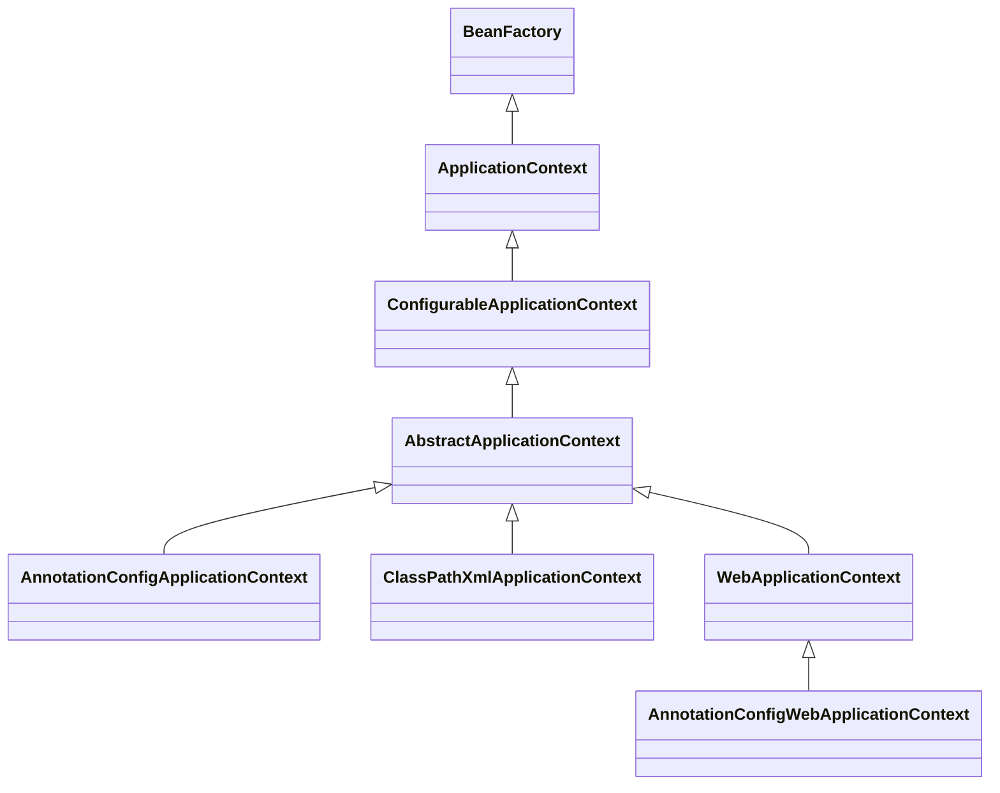
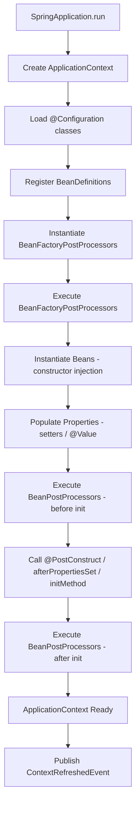
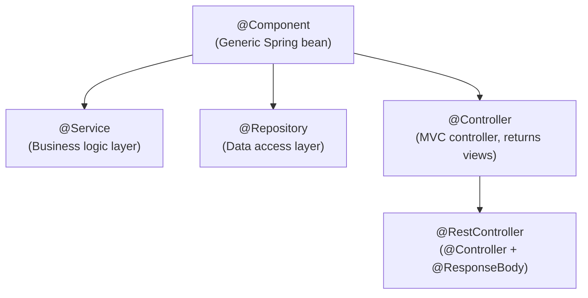
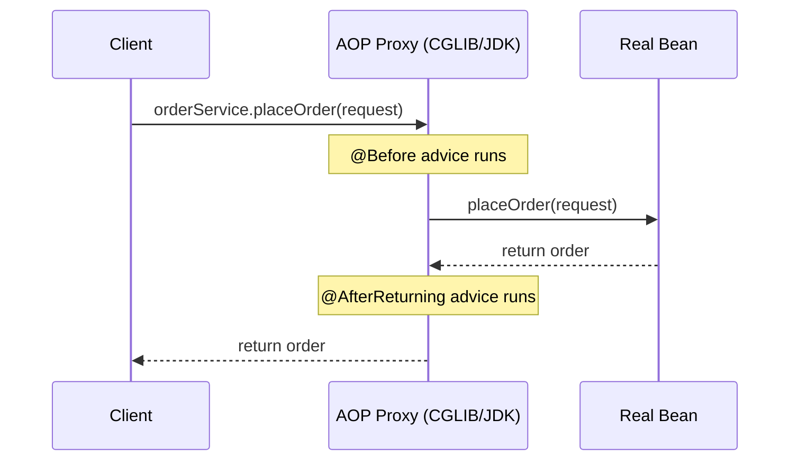

# Section 3: Spring Framework — Deep Dive

> IoC, DI, Bean Lifecycle, AOP, and all core Spring concepts with production context

---

## Table of Contents

1. [IoC — Inversion of Control](#1-ioc--inversion-of-control)
2. [Dependency Injection](#2-dependency-injection)
3. [ApplicationContext & Spring Container](#3-applicationcontext--spring-container)
4. [Bean Lifecycle](#4-bean-lifecycle)
5. [Bean Scopes](#5-bean-scopes)
6. [Core Annotations](#6-core-annotations)
7. [Spring AOP](#7-spring-aop)

---

# 1. IoC — Inversion of Control

## Definition

**Inversion of Control (IoC)** is a design principle where the **control of object creation and dependency wiring is inverted** — instead of your code creating objects, a container (Spring) creates and manages them.

## Mental Model

Think of a **restaurant (IoC container)** vs. a **vending machine (traditional code)**:
- **Vending machine:** You (the code) press buttons, you get specific outputs — you control everything.
- **Restaurant:** You state what you want (declare dependencies), and the kitchen (Spring) prepares and delivers it. You don't know how it's made; you just use it.

## Why It Exists

**Problem:** In traditional code:

```java
public class OrderService {
    private PaymentService paymentService = new StripePaymentService(); // tight coupling
    private EmailService emailService = new SendGridEmailService();     // hard to test
    
    // To test OrderService, you must use real Stripe and SendGrid!
}
```

**Solution with IoC:**

```java
public class OrderService {
    private final PaymentService paymentService;
    private final EmailService emailService;
    
    // Dependencies are INJECTED — no "new", no coupling to implementation
    public OrderService(PaymentService paymentService, EmailService emailService) {
        this.paymentService = paymentService;
        this.emailService = emailService;
    }
}
```

Now in tests, inject mocks. In production, inject real implementations. `OrderService` doesn't care.

---

# 2. Dependency Injection

## Definition

**Dependency Injection (DI)** is the mechanism Spring uses to implement IoC — the container **injects** dependencies into objects rather than objects creating their own dependencies.

## Three Types of DI

### 1. Constructor Injection (RECOMMENDED)

```java
@Service
public class OrderService {
    private final PaymentService paymentService;
    private final InventoryService inventoryService;
    
    // @Autowired is optional when there's a single constructor (Spring 4.3+)
    public OrderService(PaymentService paymentService, 
                       InventoryService inventoryService) {
        this.paymentService = paymentService;
        this.inventoryService = inventoryService;
    }
}
```

**Why Constructor Injection is best:**
- Dependencies are `final` → immutable, thread-safe
- All dependencies are visible in constructor signature
- Impossible to create an instance without required dependencies
- Works perfectly with Mockito's `@InjectMocks` / constructor injection in tests

### 2. Setter Injection (for optional dependencies)

```java
@Service
public class NotificationService {
    private EmailService emailService;
    
    @Autowired(required = false)  // optional dependency
    public void setEmailService(EmailService emailService) {
        this.emailService = emailService;
    }
}
```

### 3. Field Injection (AVOID in production)

```java
@Service
public class UserService {
    @Autowired  // hidden dependency — don't use this
    private UserRepository userRepository;
}
```

**Why field injection is bad:**
- Cannot be `final` → mutable, not thread-safe
- Hidden dependencies — not visible from outside
- Requires reflection to test (harder to mock without Spring context)
- Cannot detect circular dependencies at startup (with constructor injection, Spring detects them immediately)

## DI Comparison Table

| | Constructor | Setter | Field |
|--|-------------|--------|-------|
| Mandatory deps | Yes | No | No |
| `final` fields | Yes | No | No |
| Circular deps detected | At startup | At runtime | At runtime |
| Testability | Excellent | Good | Requires reflection |
| Lombok support | `@RequiredArgsConstructor` | Manual | None |
| Recommendation | **Preferred** | Optional deps only | **Avoid** |

## @Autowired Disambiguation

When multiple beans implement the same interface:

```java
interface PaymentGateway { ... }

@Component("stripe")
class StripeGateway implements PaymentGateway { ... }

@Component("paypal")
class PaypalGateway implements PaymentGateway { ... }

@Service
class CheckoutService {
    
    // Option 1: @Qualifier
    @Autowired
    @Qualifier("stripe")
    private PaymentGateway gateway;
    
    // Option 2: Name-based (field name matches bean name)
    @Autowired
    private PaymentGateway stripe; // matches "stripe" bean
    
    // Option 3: @Primary — mark one as default
}

@Component @Primary
class StripeGateway implements PaymentGateway { ... }  // used by default

// Option 4: Inject all implementations
@Autowired
private List<PaymentGateway> allGateways;

// Option 5: Inject as Map (bean name → bean)
@Autowired
private Map<String, PaymentGateway> gatewayMap;
// gatewayMap.get("stripe")
```

---

# 3. ApplicationContext & Spring Container

## BeanFactory vs ApplicationContext

| | BeanFactory | ApplicationContext |
|--|-------------|-------------------|
| Lazy loading | Yes (default) | No (eager by default) |
| Event publishing | No | Yes (`ApplicationEventPublisher`) |
| i18n | No | Yes (`MessageSource`) |
| AOP | Basic | Full |
| Used In | Lightweight, legacy | All modern Spring apps |

## ApplicationContext Hierarchy



## Spring Boot Context Startup Flow



---

# 4. Bean Lifecycle

## Complete Bean Lifecycle Steps

```
1. BeanDefinition loaded (scanned via @ComponentScan or declared via @Bean)
2. BeanFactoryPostProcessor runs (can modify bean definitions before instantiation)
   Example: PropertySourcesPlaceholderConfigurer resolves @Value("${...}")

3. Bean instantiated (constructor called)
4. Dependencies injected (setters, fields, @Autowired)
5. BeanNameAware.setBeanName() called
6. BeanFactoryAware.setBeanFactory() called
7. ApplicationContextAware.setApplicationContext() called

8. BeanPostProcessor.postProcessBeforeInitialization() called
   (Spring AOP proxy creation happens here)
   
9. @PostConstruct method called
10. InitializingBean.afterPropertiesSet() called
11. @Bean(initMethod = "init") method called

12. Bean is READY — in application context, used by clients

--- Application runs ---

13. ApplicationContext.close() called (shutdown)
14. @PreDestroy method called
15. DisposableBean.destroy() called
16. @Bean(destroyMethod = "cleanup") called
```

## Code Example

```java
@Component
public class DatabaseConnectionManager implements 
        BeanNameAware, ApplicationContextAware, InitializingBean, DisposableBean {
    
    private String beanName;
    private ApplicationContext context;
    private HikariDataSource dataSource;
    
    // Step 3: Constructor
    public DatabaseConnectionManager() {
        System.out.println("1. Constructor called");
    }
    
    // Step 5: BeanNameAware
    @Override
    public void setBeanName(String name) {
        this.beanName = name;
        System.out.println("2. Bean name set: " + name);
    }
    
    // Step 7: ApplicationContextAware
    @Override
    public void setApplicationContext(ApplicationContext ctx) {
        this.context = ctx;
        System.out.println("3. ApplicationContext set");
    }
    
    // Step 9: @PostConstruct
    @PostConstruct
    public void init() {
        System.out.println("4. @PostConstruct: initializing connection pool");
        this.dataSource = createDataSource();
    }
    
    // Step 10: InitializingBean
    @Override
    public void afterPropertiesSet() {
        System.out.println("5. afterPropertiesSet: validating configuration");
        validateConnection();
    }
    
    // Step 14: @PreDestroy
    @PreDestroy
    public void cleanup() {
        System.out.println("6. @PreDestroy: closing connections");
    }
    
    // Step 15: DisposableBean
    @Override
    public void destroy() {
        System.out.println("7. destroy: releasing resources");
        dataSource.close();
    }
}
```

## Key Difference: @PostConstruct vs InitializingBean vs initMethod

| | `@PostConstruct` | `InitializingBean` | `initMethod` |
|--|------------------|--------------------|--------------|
| Standard | JSR-250 (Java EE) | Spring-specific | Spring-specific |
| Coupling | None | Spring interface | None |
| Execution order | First | Second | Third |
| Recommendation | **Preferred** | Avoid (Spring coupling) | For third-party classes |

---

# 5. Bean Scopes

## Scope Types

| Scope | Description | Instances | Available In |
|-------|-------------|-----------|--------------|
| `singleton` | One instance per ApplicationContext | 1 | All |
| `prototype` | New instance per injection/request | N | All |
| `request` | One instance per HTTP request | 1/request | Web |
| `session` | One instance per HTTP session | 1/session | Web |
| `application` | One instance per ServletContext | 1 | Web |
| `websocket` | One instance per WebSocket session | 1/ws | Web |

```java
@Component
@Scope("singleton")  // default
public class ConfigurationService { }

@Component
@Scope("prototype")
public class ReportGenerator { } // new instance each time

@Component
@Scope(value = WebApplicationContext.SCOPE_REQUEST, proxyMode = ScopedProxyMode.TARGET_CLASS)
public class RequestScopedCart { } // scoped proxy for injection into singleton beans
```

## Singleton + Prototype Problem

```java
@Service // singleton
public class OrderService {
    
    @Autowired
    private ShoppingCart cart; // prototype — but same instance reused!
    
    // PROBLEM: ShoppingCart is prototype, but OrderService is singleton.
    // Spring injects the prototype ONCE at startup → same cart instance for all users!
}

// SOLUTION 1: @Lookup method injection
@Service
public class OrderService {
    @Lookup
    public ShoppingCart getCart() { return null; } // Spring overrides this
    
    public void addItem(Item item) {
        ShoppingCart cart = getCart(); // new instance each call
        cart.add(item);
    }
}

// SOLUTION 2: ApplicationContext.getBean()
@Service
public class OrderService {
    @Autowired
    private ApplicationContext ctx;
    
    public void addItem(Item item) {
        ShoppingCart cart = ctx.getBean(ShoppingCart.class); // new each time
    }
}

// SOLUTION 3: Scoped proxy (preferred for web scopes)
@Component
@Scope(value = "prototype", proxyMode = ScopedProxyMode.TARGET_CLASS)
public class ShoppingCart { }
```

---

# 6. Core Annotations

## Stereotype Annotations



| Annotation | Layer | Special Behavior |
|-----------|-------|-----------------|
| `@Component` | Any | Generic bean registration |
| `@Service` | Business logic | No extra behavior, semantic marker |
| `@Repository` | Data access | Translates `SQLException` to `DataAccessException` |
| `@Controller` | Presentation | Request mapping, returns view name |
| `@RestController` | REST API | `@Controller` + `@ResponseBody` on all methods |

## @Configuration and @Bean

```java
@Configuration  // tells Spring this class defines beans
public class AppConfig {
    
    @Bean  // return value becomes a Spring bean
    @Primary
    public DataSource primaryDataSource() {
        HikariConfig config = new HikariConfig();
        config.setJdbcUrl(env.getProperty("db.primary.url"));
        config.setMaximumPoolSize(20);
        return new HikariDataSource(config);
    }
    
    @Bean
    @Qualifier("readOnly")
    public DataSource readOnlyDataSource() {
        HikariConfig config = new HikariConfig();
        config.setJdbcUrl(env.getProperty("db.readonly.url"));
        config.setMaximumPoolSize(50);
        return new HikariDataSource(config);
    }
    
    // @Bean methods can call other @Bean methods — Spring intercepts via CGLIB
    // and returns the SAME instance (not a new one each call)
    @Bean
    public OrderRepository orderRepository() {
        return new OrderRepository(primaryDataSource()); // Spring returns cached bean
    }
}
```

## @Value and @ConfigurationProperties

```java
// @Value — single property injection
@Value("${app.jwt.secret}")
private String jwtSecret;

@Value("${app.cache.ttl:300}")  // default value 300 if not set
private int cacheTtl;

@Value("#{T(java.lang.Math).PI}")  // SpEL expression
private double pi;

// @ConfigurationProperties — bind a whole prefix (preferred for multiple properties)
@Configuration
@ConfigurationProperties(prefix = "app.payment")
@Validated
public class PaymentConfig {
    @NotNull private String stripeKey;
    @Min(1) @Max(100) private int maxRetries = 3;
    @NotBlank private String webhookSecret;
    private Duration timeout = Duration.ofSeconds(30);
    
    // getters and setters (or use Lombok @Data)
}

# application.yml
# app:
#   payment:
#     stripe-key: sk_test_xxx
#     max-retries: 5
#     webhook-secret: whsec_xxx
#     timeout: 30s
```

---

# 7. Spring AOP

## Definition

**Aspect-Oriented Programming (AOP)** allows you to **separate cross-cutting concerns** (logging, security, transactions, caching) from business logic by defining them once in an "Aspect" and applying them to many points in the code.

## Mental Model

Think of AOP as a **security checkpoint at an airport**. Every passenger (method call) must pass through the same checkpoint (aspect) regardless of their final destination (business logic). You define the checkpoint once; it applies everywhere.

## Core Concepts

| Term | Definition | Analogy |
|------|-----------|---------|
| **Aspect** | Module containing cross-cutting logic | The security checkpoint |
| **Advice** | Action taken at a join point | "Check ID and boarding pass" |
| **Join Point** | A point in program execution (method call, exception throw) | "Every gate in the airport" |
| **Pointcut** | Expression that selects specific join points | "Only international gates" |
| **Target Object** | Bean being advised | The passenger |
| **Proxy** | AOP proxy wrapping the target | The checkpoint mechanism |
| **Weaving** | Linking aspects to target objects | Installing the checkpoints |

## Advice Types

```java
@Aspect
@Component
public class LoggingAspect {
    
    private static final Logger log = LoggerFactory.getLogger(LoggingAspect.class);
    
    // POINTCUT — reusable expression
    @Pointcut("execution(* com.example.service.*.*(..))")
    public void serviceLayer() {} // empty method, just a name for the pointcut
    
    // BEFORE advice — runs before method
    @Before("serviceLayer()")
    public void logBefore(JoinPoint joinPoint) {
        log.info("Calling: {}.{}() with args: {}",
            joinPoint.getTarget().getClass().getSimpleName(),
            joinPoint.getSignature().getName(),
            Arrays.toString(joinPoint.getArgs()));
    }
    
    // AFTER RETURNING — runs after successful return
    @AfterReturning(pointcut = "serviceLayer()", returning = "result")
    public void logAfterReturn(JoinPoint joinPoint, Object result) {
        log.info("Method {} returned: {}", joinPoint.getSignature().getName(), result);
    }
    
    // AFTER THROWING — runs when exception is thrown
    @AfterThrowing(pointcut = "serviceLayer()", throwing = "exception")
    public void logException(JoinPoint joinPoint, Exception exception) {
        log.error("Exception in {}: {}", joinPoint.getSignature().getName(), exception.getMessage());
    }
    
    // AFTER (finally) — runs always
    @After("serviceLayer()")
    public void logFinally(JoinPoint joinPoint) {
        log.debug("Completed: {}", joinPoint.getSignature().getName());
    }
    
    // AROUND — most powerful, wraps method
    @Around("execution(* com.example.service.*.*(..)) && @annotation(com.example.Timed)")
    public Object measureTime(ProceedingJoinPoint pjp) throws Throwable {
        long start = System.currentTimeMillis();
        try {
            Object result = pjp.proceed(); // call the actual method
            return result;
        } finally {
            long elapsed = System.currentTimeMillis() - start;
            log.info("{} took {}ms", pjp.getSignature().getName(), elapsed);
            meterRegistry.timer("method.execution.time",
                "method", pjp.getSignature().getName())
                .record(elapsed, TimeUnit.MILLISECONDS);
        }
    }
}
```

## Pointcut Expressions

```
// Syntax: execution([modifiers] return-type [declaring-type].method-name(params) [throws])

// All public methods in service package
execution(public * com.example.service.*.*(..))

// All methods named "find*" 
execution(* find*(..))

// Methods with @Transactional annotation
@annotation(org.springframework.transaction.annotation.Transactional)

// All beans annotated with @Service
@target(org.springframework.stereotype.Service)

// Methods with first arg being a String
execution(* com.example.*.*(*String*, ..))

// In package or subpackages
execution(* com.example.service..*(..))

// Combined with &&, ||, !
execution(* com.example.service.*.*(..)) && !execution(* com.example.service.*.get*(..))
```

## How Spring AOP Works — Proxy Mechanism



## JDK Dynamic Proxy vs CGLIB

| | JDK Dynamic Proxy | CGLIB Proxy |
|--|-------------------|-------------|
| Requires | Interface | Any class |
| How | Java reflection | Subclass generation |
| Performance | Slower (reflection) | Faster (bytecode) |
| Default for | Interface-based beans | Class-based beans |
| Spring Boot default | CGLIB (since 2.x) | — |

## Production AOP Examples

### 1. Transaction Management

```java
// Under the hood of @Transactional
@Around("@annotation(transactional)")
public Object manageTransaction(ProceedingJoinPoint pjp, Transactional transactional) throws Throwable {
    TransactionStatus status = txManager.getTransaction(new DefaultTransactionDefinition());
    try {
        Object result = pjp.proceed();
        txManager.commit(status);
        return result;
    } catch (Exception e) {
        if (shouldRollback(e, transactional.rollbackFor())) {
            txManager.rollback(status);
        }
        throw e;
    }
}
```

### 2. Caching Aspect

```java
@Aspect
@Component
public class CachingAspect {
    
    @Autowired
    private RedisTemplate<String, Object> redisTemplate;
    
    @Around("@annotation(cacheable)")
    public Object cache(ProceedingJoinPoint pjp, Cacheable cacheable) throws Throwable {
        String key = buildCacheKey(pjp, cacheable);
        
        Object cached = redisTemplate.opsForValue().get(key);
        if (cached != null) return cached;
        
        Object result = pjp.proceed();
        redisTemplate.opsForValue().set(key, result, cacheable.ttl(), TimeUnit.SECONDS);
        return result;
    }
}
```

### 3. Retry Aspect

```java
@Aspect
@Component
public class RetryAspect {
    
    @Around("@annotation(retryable)")
    public Object retry(ProceedingJoinPoint pjp, Retryable retryable) throws Throwable {
        int maxAttempts = retryable.maxAttempts();
        long delay = retryable.delay();
        
        for (int attempt = 1; attempt <= maxAttempts; attempt++) {
            try {
                return pjp.proceed();
            } catch (Exception e) {
                if (attempt == maxAttempts) throw e;
                Thread.sleep(delay * attempt); // exponential backoff
                log.warn("Retry attempt {} for {}", attempt, pjp.getSignature().getName());
            }
        }
        throw new RuntimeException("Max retries exceeded");
    }
}
```

## Important AOP Limitations

```java
// PROBLEM: Self-invocation bypasses proxy!
@Service
public class OrderService {
    
    @Transactional
    public void placeOrder(Order order) {
        saveOrder(order);
        sendConfirmation(order); // calls same-class method
    }
    
    @Transactional(propagation = Propagation.REQUIRES_NEW)
    public void sendConfirmation(Order order) {
        // THIS @Transactional IS IGNORED when called from placeOrder()!
        // Because we're calling the REAL object, not the PROXY
    }
}

// SOLUTION: Inject self, or extract to another service
@Service
public class OrderService {
    @Autowired
    private OrderService self; // self-injection via proxy
    
    public void placeOrder(Order order) {
        saveOrder(order);
        self.sendConfirmation(order); // calls PROXY → @Transactional works
    }
}
```

## AOP Interview Questions

### Basic
1. What is AOP and what problem does it solve?
2. What is the difference between a Join Point and a Pointcut?
3. Name the types of Advice in Spring AOP.

### Intermediate
4. What is the difference between JDK Dynamic Proxy and CGLIB proxy?
5. When would `@Around` advice be preferred over `@Before` + `@AfterReturning`?
6. How does `@Transactional` work internally in Spring?

### Advanced
7. Why does self-invocation bypass AOP? How do you fix it?
8. Can you apply AOP to a `private` method? Why not?
9. What is AspectJ weaving and how does it differ from Spring AOP?

### Scenario-Based
10. *You want to measure the execution time of every method in your `service` package and report to Prometheus. How would you implement this?*

```java
@Aspect @Component
public class MetricsAspect {
    @Autowired private MeterRegistry meterRegistry;
    
    @Around("execution(* com.example.service.*.*(..))")
    public Object recordMetrics(ProceedingJoinPoint pjp) throws Throwable {
        String methodName = pjp.getSignature().toShortString();
        return Timer.builder("service.method.duration")
            .tag("method", methodName)
            .register(meterRegistry)
            .recordCallable(pjp::proceed);
    }
}
```

---

## Common Interview Mistakes

1. Saying `@Service` adds special behavior — it doesn't (only `@Repository` adds exception translation)
2. Not knowing that field injection prevents `final` fields
3. Forgetting that `@Transactional` on a `private` method does NOTHING (proxy can't override private)
4. Not understanding that `@Bean` methods in `@Configuration` are intercepted by CGLIB — calling them doesn't create new instances
5. Confusing `@Component` scan vs `@Bean` declaration — both register beans, but `@Bean` gives explicit control

---

## Summary — Spring Framework Cheatsheet

```
IoC: Container creates/manages objects. Your code declares what it needs.
DI: Constructor (preferred) > Setter (optional) > Field (avoid)

Bean Lifecycle:
  Constructor → Inject deps → BeanNameAware → BeanFactoryAware →
  ApplicationContextAware → BPP.beforeInit → @PostConstruct →
  afterPropertiesSet → initMethod → [READY] → @PreDestroy → destroy

Bean Scopes: singleton(default) | prototype | request | session

Annotations:
  @Component → generic bean
  @Service → business logic (semantic)
  @Repository → DAO + exception translation
  @Controller → MVC view
  @RestController → @Controller + @ResponseBody
  @Configuration + @Bean → explicit bean definition

AOP Terms:
  Aspect = cross-cutting module
  Advice = action (Before/After/Around/AfterReturning/AfterThrowing)
  Pointcut = method selection expression
  Join Point = execution point (method call)
  Proxy = CGLIB (default) or JDK Dynamic Proxy

AOP Gotcha: Self-invocation bypasses proxy → @Transactional on self-called
methods does NOT work. Fix: inject self or extract to separate bean.
```
