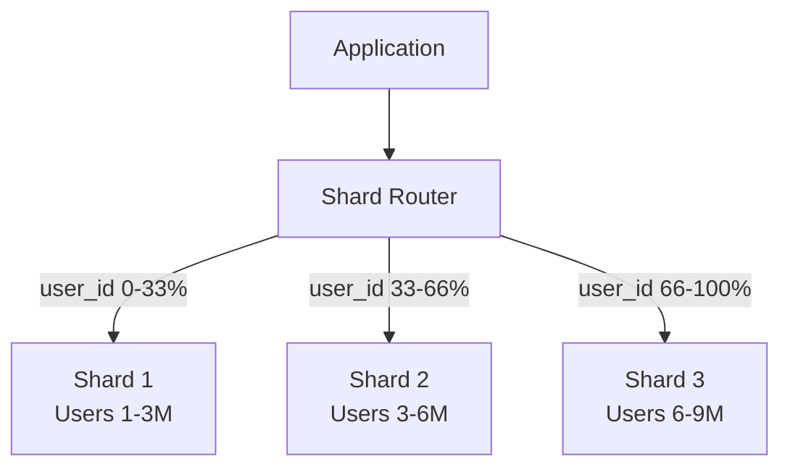
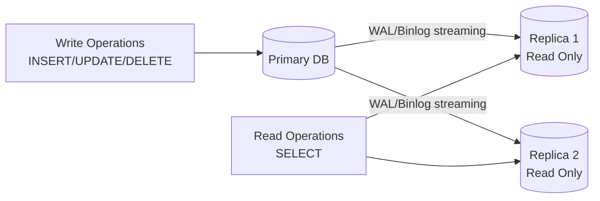

# Section 5: Databases — SQL, Indexes, Transactions, Optimization

> PostgreSQL / MySQL — everything from indexes to sharding

---

## Table of Contents

1. [Indexes — B-Tree, Hash, Composite](#1-indexes)
2. [Transactions & ACID](#2-transactions--acid)
3. [Isolation Levels](#3-isolation-levels)
4. [Deadlocks & Locking](#4-deadlocks--locking)
5. [Query Optimization](#5-query-optimization)
6. [Pagination](#6-pagination)
7. [Partitioning](#7-partitioning)
8. [Sharding](#8-sharding)
9. [Replication](#9-replication)
10. [Production Scenarios](#10-production-scenarios)

---

# 1. Indexes

## Definition

An **index** is a data structure that speeds up data retrieval by providing a fast lookup path — at the cost of additional storage and slower writes.

## Mental Model

Think of a book's **index at the back**. Instead of reading every page to find "JVM Architecture", you look up "J" in the index → page 47. The database does the same — instead of scanning every row, it uses the index to find rows quickly.

## B-Tree Index (Default)

B-Tree (Balanced Tree) is the default index type in PostgreSQL and MySQL.

```
         [50]
        /    \
    [25]      [75]
   /    \    /    \
[10][30][60][80][90]

Each node: sorted keys + pointers to children or data rows
Leaf nodes: linked list for range queries
```

### B-Tree Index Characteristics

| | Value |
|--|--|
| Structure | Balanced tree, O(log n) operations |
| Best For | Equality (`=`), range (`<`, `>`, BETWEEN), sorting, LIKE 'prefix%' |
| NOT Good For | LIKE '%suffix%', full-text, geographic |
| Height for 1M rows | ~5–6 levels |

### Creating B-Tree Indexes

```sql
-- Single column index
CREATE INDEX idx_orders_user_id ON orders(user_id);

-- Index with included columns (covering index)
CREATE INDEX idx_orders_user_status ON orders(user_id, status) INCLUDE (total_amount, created_at);

-- Partial index (only index subset of rows — faster, smaller)
CREATE INDEX idx_orders_pending ON orders(created_at) WHERE status = 'PENDING';

-- Functional index
CREATE INDEX idx_users_email_lower ON users(LOWER(email));
-- Now this query can use the index:
SELECT * FROM users WHERE LOWER(email) = 'user@example.com';
```

## Hash Index

```sql
-- PostgreSQL: Hash indexes
CREATE INDEX idx_sessions_token ON sessions USING HASH (session_token);
```

| | Hash Index | B-Tree Index |
|--|------------|--------------|
| Equality lookup | O(1) | O(log n) |
| Range queries | NOT supported | Supported |
| Sorting | NOT supported | Supported |
| Size | Smaller | Larger |
| Best For | Exact equality on large text fields | Most use cases |

## Composite Index

```sql
-- Composite index on (user_id, created_at)
CREATE INDEX idx_orders_user_date ON orders(user_id, created_at DESC);
```

### The Leftmost Prefix Rule

```sql
-- Index: (user_id, status, created_at)
-- These queries USE the index:
WHERE user_id = 123                                  -- leftmost prefix
WHERE user_id = 123 AND status = 'ACTIVE'           -- leftmost prefix
WHERE user_id = 123 AND status = 'ACTIVE' AND created_at > '2025-01-01'  -- full

-- These queries DO NOT use the index efficiently:
WHERE status = 'ACTIVE'              -- skips user_id (leftmost)
WHERE created_at > '2025-01-01'     -- skips both leftmost columns
WHERE user_id = 123 AND created_at > '2025-01-01'  -- skips 'status', partial use
```

## When Index Scans Become Table Scans

The query planner may **ignore** your index if:

```sql
-- 1. Function applied to indexed column
WHERE YEAR(created_at) = 2025   -- can't use index on created_at
-- FIX:
WHERE created_at BETWEEN '2025-01-01' AND '2025-12-31'

-- 2. Implicit type conversion
WHERE user_id = '123'   -- user_id is INTEGER, '123' is VARCHAR → type cast, index skipped
-- FIX: use correct type: WHERE user_id = 123

-- 3. LIKE with leading wildcard
WHERE name LIKE '%smith'   -- can't use B-tree
-- FIX: Use full-text search or reverse index

-- 4. Low selectivity column (gender: only 2 values) — optimizer prefers table scan
WHERE gender = 'M'  -- 50% of rows match → full scan is faster

-- 5. NULL comparisons
WHERE created_at IS NULL  -- B-tree stores NULLs, this CAN use index in PostgreSQL
```

## Index Strategies for Production

```sql
-- Query: "Get all open orders for user 123, newest first"
SELECT id, total_amount, created_at
FROM orders
WHERE user_id = 123 AND status = 'OPEN'
ORDER BY created_at DESC;

-- OPTIMAL INDEX: Composite + covering
CREATE INDEX idx_orders_user_status_date
ON orders(user_id, status, created_at DESC)
INCLUDE (id, total_amount);
-- 'INCLUDE' avoids heap fetch (covering index) — index-only scan!
```

---

# 2. Transactions & ACID

## ACID Properties

| Property | Definition | Example |
|----------|-----------|---------|
| **Atomicity** | All operations succeed or all fail — no partial state | Transfer: debit AND credit happen, or neither |
| **Consistency** | Database moves from one valid state to another | Account balance never goes negative |
| **Isolation** | Concurrent transactions don't see each other's intermediate state | Two users booking last seat — only one succeeds |
| **Durability** | Committed transactions survive system failures | Power outage doesn't lose committed data |

## How Atomicity is Implemented

```
Write-Ahead Log (WAL / Redo Log):
1. Before writing data page, write WAL record first
2. If crash mid-transaction:
   - Recovery reads WAL
   - "COMMIT" in WAL → redo the operation
   - No "COMMIT" in WAL → undo the partial changes
```

## Transaction in Spring

```java
@Service
public class BankingService {
    
    @Transactional
    public void transfer(Long fromAccountId, Long toAccountId, BigDecimal amount) {
        Account from = accountRepository.findByIdWithLock(fromAccountId); // SELECT FOR UPDATE
        Account to = accountRepository.findByIdWithLock(toAccountId);
        
        if (from.getBalance().compareTo(amount) < 0) {
            throw new InsufficientFundsException("Insufficient balance");
            // RuntimeException → triggers rollback
        }
        
        from.setBalance(from.getBalance().subtract(amount));
        to.setBalance(to.getBalance().add(amount));
        
        accountRepository.save(from);
        accountRepository.save(to);
        // Both saves happen in same transaction → atomic
    }
}
```

## @Transactional Propagation Types

| Propagation | Behavior |
|-------------|----------|
| `REQUIRED` (default) | Join existing transaction; create new if none |
| `REQUIRES_NEW` | Always create new transaction; suspend existing |
| `SUPPORTS` | Join if exists; run without transaction if none |
| `NOT_SUPPORTED` | Run without transaction; suspend existing |
| `MANDATORY` | Must have existing transaction; throw if none |
| `NEVER` | Must NOT have transaction; throw if one exists |
| `NESTED` | Nested savepoint within existing transaction |

```java
@Service
public class AuditService {
    
    // REQUIRES_NEW — audit must commit even if outer transaction rolls back
    @Transactional(propagation = Propagation.REQUIRES_NEW)
    public void logAuditEvent(AuditEvent event) {
        auditRepository.save(event);
    }
}

@Service
public class OrderService {
    @Autowired private AuditService auditService;
    
    @Transactional
    public void placeOrder(Order order) {
        orderRepository.save(order);
        auditService.logAuditEvent(new AuditEvent("ORDER_PLACED", order.getId()));
        // If audit fails, REQUIRES_NEW rolls back ONLY audit tx
        // Main transaction (order save) continues
        
        throw new RuntimeException("Payment failed");
        // Order save rolls back, BUT audit log already committed (REQUIRES_NEW)
    }
}
```

---

# 3. Isolation Levels

## Concurrency Problems

| Problem | Description | Example |
|---------|-------------|---------|
| **Dirty Read** | Read uncommitted data from another transaction | Read balance while other transaction is updating it |
| **Non-Repeatable Read** | Same query returns different results within same transaction | Read order total twice; it changed between reads |
| **Phantom Read** | Query returns different set of rows | Count orders twice; new order inserted between queries |
| **Lost Update** | Two transactions update same row; one overwrites the other | Both read balance 100, both add 50, final: 150 not 200 |

## Isolation Levels and Problems They Prevent

| Isolation Level | Dirty Read | Non-Repeatable Read | Phantom Read | Performance |
|-----------------|------------|---------------------|--------------|-------------|
| `READ UNCOMMITTED` | ❌ | ❌ | ❌ | Highest |
| `READ COMMITTED` (PG default) | ✅ | ❌ | ❌ | High |
| `REPEATABLE READ` (MySQL default) | ✅ | ✅ | ❌ (MySQL) | Medium |
| `SERIALIZABLE` | ✅ | ✅ | ✅ | Lowest |

```sql
-- Set for session
SET TRANSACTION ISOLATION LEVEL REPEATABLE READ;

-- Set for single transaction
BEGIN TRANSACTION ISOLATION LEVEL SERIALIZABLE;
```

```java
// Spring
@Transactional(isolation = Isolation.REPEATABLE_READ)
public OrderSummary processCheckout(Long orderId) {
    // Read total, read inventory — guaranteed same values if read twice
}
```

## MVCC (Multi-Version Concurrency Control)

PostgreSQL uses MVCC to implement isolation without blocking reads:

```
Row version chain:
  xmin=100, xmax=null, data="balance=500"  ← visible to tx >= 100
  xmin=50,  xmax=100,  data="balance=450"  ← visible to tx 50-99

Transaction at snapshot ID 80 reads: balance=450 (old version)
Transaction at snapshot ID 120 reads: balance=500 (new version)
No locks for readers! Writers create new versions.
```

---

# 4. Deadlocks & Locking

## What is a Deadlock?

```
Transaction A: holds lock on Account-1, waiting for Account-2
Transaction B: holds lock on Account-2, waiting for Account-1
→ Neither can proceed → deadlock
```

## Deadlock Prevention

```java
// Always acquire locks in CONSISTENT ORDER
// WRONG: Order A locks (1,2), Order B locks (2,1) → deadlock possible
public void transfer(Long fromId, Long toId, BigDecimal amount) {
    Account from = repo.findByIdWithLock(fromId);  // order depends on input
    Account to = repo.findByIdWithLock(toId);
}

// RIGHT: Always lock lower ID first
public void transfer(Long fromId, Long toId, BigDecimal amount) {
    Long firstId = Math.min(fromId, toId);
    Long secondId = Math.max(fromId, toId);
    Account first = repo.findByIdWithLock(firstId);   // consistent order!
    Account second = repo.findByIdWithLock(secondId);
    // determine which is from/to based on original IDs
}
```

## Locking Strategies

```sql
-- Pessimistic Locking: Lock row immediately
SELECT * FROM orders WHERE id = 123 FOR UPDATE;
-- Blocks other transactions from modifying this row

-- Pessimistic Shared Lock: Multiple readers allowed
SELECT * FROM orders WHERE id = 123 FOR SHARE;

-- Skip locked rows (queue-style processing)
SELECT * FROM jobs WHERE status = 'PENDING' 
ORDER BY created_at 
LIMIT 10 
FOR UPDATE SKIP LOCKED;  -- skip rows locked by other workers
```

```java
// JPA Pessimistic Locking
@Lock(LockModeType.PESSIMISTIC_WRITE)
@Query("SELECT o FROM Order o WHERE o.id = :id")
Optional<Order> findByIdWithLock(@Param("id") Long id);

// JPA Optimistic Locking — no DB lock, uses version column
@Entity
public class Order {
    @Id private Long id;
    
    @Version  // Spring/JPA auto-manages this version number
    private Long version;
    
    private BigDecimal totalAmount;
}
// If two transactions read version=1, both try to update:
// First one succeeds, increments to version=2
// Second one fails with OptimisticLockException (version mismatch)
```

## Optimistic vs Pessimistic Locking

| | Optimistic | Pessimistic |
|--|------------|-------------|
| Lock acquired | On commit, not read | On read |
| Approach | Assume no conflict, detect at save | Assume conflict, lock upfront |
| Performance | Higher concurrency | Lower concurrency |
| Failure mode | `OptimisticLockException` at commit | Waiting / deadlock |
| Best For | Low contention, read-heavy | High contention, write-heavy |
| Example | E-commerce product views | Bank transfers, seat booking |

---

# 5. Query Optimization

## EXPLAIN ANALYZE

```sql
EXPLAIN (ANALYZE, BUFFERS, FORMAT TEXT)
SELECT u.name, COUNT(o.id) as order_count
FROM users u
JOIN orders o ON o.user_id = u.id
WHERE o.created_at > '2025-01-01'
GROUP BY u.id, u.name
ORDER BY order_count DESC
LIMIT 20;

-- Read the output:
-- Seq Scan: Full table scan (bad for large tables)
-- Index Scan: Using index (good)
-- Index Only Scan: Covering index, no heap access (best)
-- Hash Join / Merge Join / Nested Loop: Join strategies
-- actual time=0.123..45.678 → actual execution time
-- rows=12345 → actual rows scanned
-- Buffers: hit=1234 miss=56 → cache hits vs disk reads
```

## Common Query Anti-Patterns

```sql
-- ANTI-PATTERN 1: SELECT * (fetches unused columns, prevents covering index)
SELECT * FROM orders WHERE user_id = 123;
-- FIX: Select only needed columns
SELECT id, status, total_amount FROM orders WHERE user_id = 123;

-- ANTI-PATTERN 2: N+1 in SQL
SELECT id FROM users WHERE active = true;  -- returns 1000 user IDs
-- Then for each user: SELECT * FROM orders WHERE user_id = ?  -- 1000 queries!
-- FIX: JOIN
SELECT u.id, u.name, o.id, o.total_amount
FROM users u
LEFT JOIN orders o ON o.user_id = u.id
WHERE u.active = true;

-- ANTI-PATTERN 3: LIKE '%substring%' (no index)
SELECT * FROM products WHERE name LIKE '%laptop%';
-- FIX: Use full-text search
SELECT * FROM products WHERE to_tsvector('english', name) @@ to_tsquery('laptop');

-- ANTI-PATTERN 4: Function on indexed column
SELECT * FROM orders WHERE DATE(created_at) = '2025-01-15';
-- FIX: Range query (uses index)
SELECT * FROM orders WHERE created_at >= '2025-01-15' AND created_at < '2025-01-16';

-- ANTI-PATTERN 5: Large IN clause
WHERE id IN (1, 2, 3, ..., 10000)  -- slow
-- FIX: Use a JOIN or temp table
JOIN (VALUES (1), (2), ...) AS ids(id) ON t.id = ids.id
```

## Query Optimization Checklist

```
□ EXPLAIN ANALYZE shows Index Scan (not Seq Scan) for large tables?
□ Covering index exists for frequently accessed column combinations?
□ No function calls on indexed columns in WHERE clause?
□ JOINs on indexed foreign key columns?
□ SELECT only required columns?
□ Pagination uses cursor-based approach for large offsets?
□ Statistics up to date? (ANALYZE the table)
□ Connection pooling configured? (HikariCP)
```

---

# 6. Pagination

## OFFSET Pagination — Simple but Slow

```sql
-- Page 1 (rows 1-20)
SELECT * FROM orders ORDER BY created_at DESC LIMIT 20 OFFSET 0;

-- Page 100 (rows 1981-2000)
SELECT * FROM orders ORDER BY created_at DESC LIMIT 20 OFFSET 1980;
-- Database STILL READS first 1980 rows and discards them!
-- At page 10000: reads 199,980 rows to return 20. O(n) with page number!
```

## Keyset (Cursor-Based) Pagination — Production Standard

```sql
-- First page
SELECT id, created_at, total_amount
FROM orders
WHERE user_id = 123
ORDER BY created_at DESC, id DESC
LIMIT 20;

-- Next page: use last row's (created_at, id) as cursor
SELECT id, created_at, total_amount
FROM orders
WHERE user_id = 123
AND (created_at, id) < ('2025-06-01 10:30:00', 9876)  -- cursor
ORDER BY created_at DESC, id DESC
LIMIT 20;
-- Always O(log n) with index!
```

```java
// Spring implementation of cursor pagination
@GetMapping("/orders")
public CursorPage<OrderResponse> getOrders(
        @RequestParam String userId,
        @RequestParam(required = false) String cursor,  // base64 encoded
        @RequestParam(defaultValue = "20") int size) {
    
    Cursor decoded = cursor != null ? Cursor.decode(cursor) : null;
    
    List<Order> orders = orderRepository.findWithCursor(userId, decoded, size + 1);
    
    boolean hasNext = orders.size() > size;
    List<Order> page = hasNext ? orders.subList(0, size) : orders;
    
    String nextCursor = hasNext ? Cursor.encode(page.get(page.size() - 1)) : null;
    
    return CursorPage.of(page.stream().map(OrderResponse::from).toList(), nextCursor, hasNext);
}
```

## Pagination Comparison

| | OFFSET | Keyset/Cursor |
|--|--------|---------------|
| Performance | O(n) — degrades at high pages | O(log n) — constant |
| Supports random access | Yes (jump to page 50) | No |
| Handles concurrent inserts | Inconsistent results | Stable |
| API style | Page number | Opaque cursor token |
| Use For | Admin dashboards, small datasets | Infinite scroll, feeds, large datasets |

---

# 7. Partitioning

## Definition

**Table partitioning** splits a large table into smaller, more manageable pieces (partitions) while maintaining a unified logical view.

## Range Partitioning (most common for time-series data)

```sql
-- Partition orders by year
CREATE TABLE orders (
    id          BIGSERIAL,
    user_id     BIGINT NOT NULL,
    created_at  TIMESTAMP NOT NULL,
    total_amount DECIMAL(15,2)
) PARTITION BY RANGE (created_at);

CREATE TABLE orders_2023 PARTITION OF orders
    FOR VALUES FROM ('2023-01-01') TO ('2024-01-01');

CREATE TABLE orders_2024 PARTITION OF orders
    FOR VALUES FROM ('2024-01-01') TO ('2025-01-01');

CREATE TABLE orders_2025 PARTITION OF orders
    FOR VALUES FROM ('2025-01-01') TO ('2026-01-01');

-- Query: database only scans relevant partitions (partition pruning)
SELECT * FROM orders WHERE created_at BETWEEN '2025-01-01' AND '2025-06-30';
-- Only scans orders_2025, not 2023 or 2024!
```

## List Partitioning (by category)

```sql
CREATE TABLE transactions PARTITION BY LIST (status);
CREATE TABLE transactions_completed PARTITION OF transactions FOR VALUES IN ('COMPLETED');
CREATE TABLE transactions_pending PARTITION OF transactions FOR VALUES IN ('PENDING', 'PROCESSING');
CREATE TABLE transactions_failed PARTITION OF transactions FOR VALUES IN ('FAILED', 'CANCELLED');
```

## Hash Partitioning (for even distribution)

```sql
CREATE TABLE users PARTITION BY HASH (id);
CREATE TABLE users_0 PARTITION OF users FOR VALUES WITH (MODULUS 4, REMAINDER 0);
CREATE TABLE users_1 PARTITION OF users FOR VALUES WITH (MODULUS 4, REMAINDER 1);
CREATE TABLE users_2 PARTITION OF users FOR VALUES WITH (MODULUS 4, REMAINDER 2);
CREATE TABLE users_3 PARTITION OF users FOR VALUES WITH (MODULUS 4, REMAINDER 3);
```

## Partitioning vs Sharding

| | Partitioning | Sharding |
|--|--------------|---------|
| Location | Same database server | Different servers |
| Transparency | Fully transparent to queries | Application must route |
| Complexity | Low | High |
| Scale | Vertical (one server) | Horizontal (multiple servers) |
| Use For | Large tables, archiving | Massive scale, can't fit on one server |

---

# 8. Sharding

## Definition

**Sharding** is horizontal scaling by distributing data across **multiple database instances**, each holding a subset of the data.



## Sharding Strategies

### 1. Hash-Based Sharding

```
shard = hash(user_id) % num_shards

user_id = 123 → hash = 9876543 → 9876543 % 3 = 0 → Shard 0
user_id = 456 → hash = 1234567 → 1234567 % 3 = 1 → Shard 1
```

**Pro:** Even distribution
**Con:** Adding shards requires re-hashing all data (use consistent hashing to minimize)

### 2. Range-Based Sharding

```
user_id 1 – 1,000,000  → Shard 1
user_id 1,000,001 – 2,000,000 → Shard 2
```

**Pro:** Easy range queries
**Con:** Hot spots if recent IDs are active (Shard 3 gets all traffic for new users)

### 3. Directory-Based Sharding

```
Lookup table: user_id → shard_id
user 123 → Shard 2
user 456 → Shard 1
```

**Pro:** Full flexibility in routing
**Con:** Lookup table is a bottleneck / single point of failure

## Cross-Shard Query Problem

```sql
-- This query works fine on single DB:
SELECT u.name, SUM(o.total) 
FROM users u JOIN orders o ON o.user_id = u.id
GROUP BY u.id;

-- With sharding: orders might be on Shard 1, user on Shard 2!
-- Solution: Co-locate related data on same shard
-- user_id-based sharding: all orders for user 123 go to same shard as user 123
```

---

# 9. Replication

## Primary-Replica (Master-Slave) Replication



## Types of Replication

| | Synchronous | Asynchronous |
|--|-------------|--------------|
| Data loss risk | Zero (confirmed before ACK) | Some lag possible |
| Performance | Slower (wait for replica confirmation) | Faster |
| Consistency | Strong | Eventual |
| PostgreSQL config | `synchronous_commit = on` | `synchronous_commit = off` |
| Use For | Financial data, high criticality | Analytics reads, reporting |

## Replication Lag — A Common Production Issue

```sql
-- Check replication lag on PostgreSQL
SELECT 
    client_addr,
    state,
    sent_lsn,
    write_lsn,
    flush_lsn,
    replay_lsn,
    write_lag,
    flush_lag,
    replay_lag
FROM pg_stat_replication;
```

**Problem:** Write to primary, immediately read from replica → stale data!

```java
// Pattern: Read-your-writes consistency
@Service
public class UserService {
    
    @Transactional  // uses primary
    public User createUser(CreateUserRequest request) {
        User user = userRepository.save(new User(request));
        return user;
    }
    
    // After creating, must read from primary (not replica) for consistency
    @Transactional(readOnly = true)
    public User getUserById(Long id) {
        return userRepository.findById(id) // Spring auto-routes readOnly to replica
            .orElseThrow(() -> new UserNotFoundException(id));
    }
}

// Route write transactions to primary, read-only to replica
@Configuration
public class RoutingDataSourceConfig {
    
    @Bean
    @Primary
    public DataSource routingDataSource(
            @Qualifier("primaryDataSource") DataSource primary,
            @Qualifier("replicaDataSource") DataSource replica) {
        
        RoutingDataSource routing = new RoutingDataSource();
        routing.setDefaultTargetDataSource(primary);
        routing.setTargetDataSources(Map.of(
            DataSourceType.PRIMARY, primary,
            DataSourceType.REPLICA, replica
        ));
        return routing;
    }
}
```

---

# 10. Production Scenarios

## Scenario 1: Slow Query Debugging

### Problem
E-commerce checkout page takes 8 seconds. `SELECT * FROM products WHERE category_id = 5 AND in_stock = true ORDER BY price ASC` running on a table with 10M rows.

### Investigation

```sql
EXPLAIN ANALYZE
SELECT * FROM products 
WHERE category_id = 5 AND in_stock = true 
ORDER BY price ASC;

-- Output shows: Seq Scan on products (rows=8000000)
-- Table full scan! No index on category_id.
```

### Fix

```sql
-- Add composite index matching the query
CREATE INDEX idx_products_category_stock_price 
ON products(category_id, in_stock, price ASC)
INCLUDE (id, name, image_url, description);

-- Check result
EXPLAIN ANALYZE ...
-- Now: Index Only Scan on products idx_products_category_stock_price
-- Time: 0.5ms instead of 8 seconds
```

---

## Scenario 2: Deadlock in Order Processing

### Problem
Error logs show `PSQLException: ERROR: deadlock detected` during peak hours.

### Root Cause

```sql
-- Transaction A (Order 1):
UPDATE inventory SET quantity = quantity - 1 WHERE product_id = 10;  -- locks row 10
UPDATE inventory SET quantity = quantity - 1 WHERE product_id = 20;  -- waits for row 20

-- Transaction B (Order 2):
UPDATE inventory SET quantity = quantity - 1 WHERE product_id = 20;  -- locks row 20
UPDATE inventory SET quantity = quantity - 1 WHERE product_id = 10;  -- waits for row 10 → DEADLOCK
```

### Fix

```java
// Sort product IDs before acquiring locks
public void reserveInventory(List<Long> productIds, List<Integer> quantities) {
    List<Long> sortedIds = productIds.stream().sorted().collect(Collectors.toList());
    for (Long productId : sortedIds) {
        inventoryRepository.decrementStock(productId, qty);  // consistent lock order
    }
}
```

---

## Interview Questions

### Basic
1. What is the difference between B-Tree and Hash index?
2. Explain ACID properties with examples.
3. What is the difference between optimistic and pessimistic locking?

### Intermediate
4. What is the leftmost prefix rule for composite indexes?
5. Explain MVCC and how PostgreSQL implements it.
6. When would you use a partial index?
7. What is the difference between OFFSET and cursor-based pagination?

### Advanced
8. Explain how sharding affects JOIN operations and how to mitigate it.
9. What is a covering index and how does it enable index-only scans?
10. How does replication lag affect application consistency? How do you handle it?
11. Design a database schema for a ride-sharing app that can handle 10M rides per day.

### Scenario-Based
12. *Your database CPU is at 95% during business hours. EXPLAIN ANALYZE shows Seq Scans. Walk me through fixing this.*
13. *Your application gets `OptimisticLockException` frequently during flash sales. How do you handle this?*

---

## Summary — Database Cheatsheet

```
Indexes:
  B-Tree: default, equality + range + sort. O(log n)
  Hash: equality only, O(1), PostgreSQL only
  Composite: leftmost prefix rule — column order matters!
  Partial: index WHERE subset → smaller, faster
  Covering: INCLUDE extra columns → index-only scan (no heap fetch)

ACID:
  Atomicity → WAL (Write-Ahead Log) enables rollback
  Isolation → MVCC (multi-version), no read locks needed
  Default: READ COMMITTED (PG) or REPEATABLE READ (MySQL)

Isolation Problems:
  READ COMMITTED prevents: dirty reads
  REPEATABLE READ prevents: + non-repeatable reads
  SERIALIZABLE prevents: + phantom reads (but slowest)

Locking:
  Pessimistic: SELECT FOR UPDATE — lock on read
  Optimistic: @Version column — detect conflict on save
  Deadlock prevention: always lock in consistent order

Pagination:
  OFFSET: O(n), avoids for large datasets
  Cursor: O(log n), production standard, use for feeds/infinite scroll

Scaling:
  Partitioning: split table on same server (by range/list/hash)
  Sharding: split across multiple servers (routing required)
  Replication: primary (write) + replicas (read) — watch replication lag!

Slow Query Debugging:
  1. EXPLAIN ANALYZE query
  2. Find Seq Scans on large tables
  3. Add appropriate index
  4. Verify with EXPLAIN ANALYZE again
```
