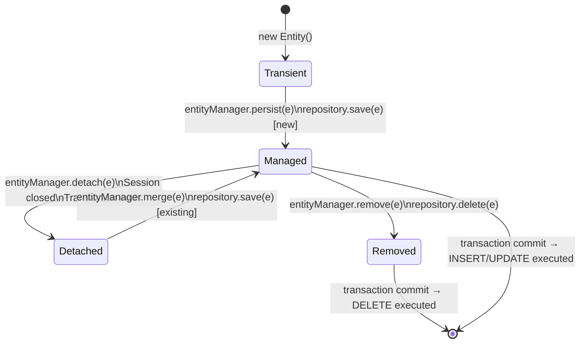

# Section 6: JPA & Hibernate — Deep Dive

> Entity Lifecycle, N+1, Lazy Loading, Caching, and Production Problems

---

## Table of Contents

1. [Entity Lifecycle & Persistence Context](#1-entity-lifecycle--persistence-context)
2. [Dirty Checking](#2-dirty-checking)
3. [Lazy vs Eager Loading](#3-lazy-vs-eager-loading)
4. [N+1 Problem — Detection & Fixes](#4-n1-problem)
5. [Batch Processing](#5-batch-processing)
6. [First Level Cache](#6-first-level-cache)
7. [Second Level Cache](#7-second-level-cache)
8. [Spring Data JPA — Query Methods](#8-spring-data-jpa)
9. [Production Problems & Solutions](#9-production-problems)
10. [Interview Questions](#10-interview-questions)

---

# 1. Entity Lifecycle & Persistence Context

## Entity States



## State Definitions

| State | Description | Tracked by PC? | DB Changes Tracked? |
|-------|-------------|----------------|---------------------|
| **Transient** | `new` object, not associated with any session | No | No |
| **Managed** | Inside persistence context (open session) | Yes | Yes (dirty checking) |
| **Detached** | Was managed, session closed | No | No |
| **Removed** | Scheduled for deletion | Yes (marked) | DELETE on commit |

## Persistence Context

The **Persistence Context** is a first-level cache and change tracker — a "unit of work" tied to the current transaction.

```java
@Service
public class OrderService {
    
    @Autowired
    private EntityManager em;
    
    @Transactional
    public void demonstrateLifecycle() {
        
        // TRANSIENT — not yet managed
        Order order = new Order();
        order.setTotalAmount(new BigDecimal("99.99"));
        
        // MANAGED — now tracked by persistence context
        em.persist(order);  // INSERT scheduled (but not executed yet!)
        
        // Modify managed entity — dirty checking will detect this change
        order.setStatus("CONFIRMED");  // UPDATE will be added to batch
        
        // Query — returns SAME object from cache (not DB!)
        Order sameOrder = em.find(Order.class, order.getId());  // cache hit
        System.out.println(order == sameOrder);  // TRUE — identity guarantee
        
    }  // TRANSACTION COMMITS HERE → INSERT + UPDATE executed as batch
    
    @Transactional
    public void detachedExample(Long orderId) {
        Order order = orderRepository.findById(orderId).orElseThrow();
        // order is MANAGED inside this transaction
        
        order.setStatus("SHIPPED");  // will be detected by dirty checking
    }  // TRANSACTION COMMITS → UPDATE executed automatically — no save() needed!
}
```

---

# 2. Dirty Checking

## Definition

**Dirty Checking** is Hibernate's mechanism to automatically detect changes to managed entities and generate UPDATE statements — **without you calling `save()`**.

## How It Works

```
1. When entity is loaded → Hibernate takes a SNAPSHOT of its state
2. At transaction commit → Hibernate compares current state with snapshot
3. For each changed field → generates UPDATE statement
4. Only changed fields are updated (if optimized, can be configured)
```

```java
@Entity
public class Product {
    @Id private Long id;
    private String name;
    private BigDecimal price;
    private int stockQuantity;
}

@Service
public class ProductService {
    
    @Transactional
    public void updatePrice(Long productId, BigDecimal newPrice) {
        Product product = productRepository.findById(productId).orElseThrow();
        // product is MANAGED — Hibernate has a snapshot: {name="Laptop", price=999.99, stock=50}
        
        product.setPrice(newPrice);
        // NO save() call needed!
        
    }  // Hibernate detects price changed → executes:
       // UPDATE products SET price = ? WHERE id = ?
       // (name and stockQuantity NOT included — only changed fields)
```

## @DynamicUpdate

```java
@Entity
@DynamicUpdate  // only UPDATE changed columns (default: update all columns)
public class Product {
    @Id private Long id;
    private String name;
    private BigDecimal price;
    private int stockQuantity;
}

// Without @DynamicUpdate: UPDATE products SET name=?, price=?, stock_quantity=? WHERE id=?
// With @DynamicUpdate: UPDATE products SET price=? WHERE id=?
// Use @DynamicUpdate for entities with many columns and concurrent updates
```

---

# 3. Lazy vs Eager Loading

## Loading Strategies

| | Lazy Loading | Eager Loading |
|--|--------------|---------------|
| When loaded | On first access | Immediately with parent |
| Default for | `@OneToMany`, `@ManyToMany` | `@ManyToOne`, `@OneToOne` |
| SQL count | N+1 risk | JOIN in initial query |
| Memory | Better (load what you need) | May load unused data |
| Session requirement | Must be open when accessed | No requirement |

```java
@Entity
public class Order {
    @Id private Long id;
    
    // LAZY: items not loaded until accessed (DEFAULT for @OneToMany)
    @OneToMany(mappedBy = "order", fetch = FetchType.LAZY)
    private List<OrderItem> items;
    
    // EAGER: user loaded immediately with order (DEFAULT for @ManyToOne)
    @ManyToOne(fetch = FetchType.EAGER)
    @JoinColumn(name = "user_id")
    private User user;
}
```

## LazyInitializationException — The Most Common Hibernate Error

```java
// WRONG — session closes after transaction, then access lazy collection
@Transactional
public Order getOrder(Long id) {
    return orderRepository.findById(id).orElseThrow();
}  // TRANSACTION ENDS → persistence context closed

// In controller:
Order order = orderService.getOrder(1L);
order.getItems().size();  // LazyInitializationException! Session is closed!
```

### Fix 1: `JOIN FETCH` — Load in same query

```java
@Repository
public interface OrderRepository extends JpaRepository<Order, Long> {
    
    @Query("SELECT o FROM Order o JOIN FETCH o.items WHERE o.id = :id")
    Optional<Order> findByIdWithItems(@Param("id") Long id);
    
    // For multiple collections — use subselect or separate queries
    @Query("SELECT DISTINCT o FROM Order o LEFT JOIN FETCH o.items WHERE o.user.id = :userId")
    List<Order> findByUserIdWithItems(@Param("userId") Long userId);
}
```

### Fix 2: `@EntityGraph` — Declarative fetch plan

```java
@Repository
public interface OrderRepository extends JpaRepository<Order, Long> {
    
    @EntityGraph(attributePaths = {"items", "items.product", "user"})
    Optional<Order> findWithDetailsById(Long id);
    
    // Named entity graph
    @EntityGraph(value = "Order.withItemsAndUser")
    List<Order> findByUserId(Long userId);
}

@Entity
@NamedEntityGraph(name = "Order.withItemsAndUser",
    attributeNodes = {
        @NamedAttributeNode("user"),
        @NamedAttributeNode(value = "items", subgraph = "items.product")
    },
    subgraphs = {
        @NamedSubgraph(name = "items.product", attributeNodes = @NamedAttributeNode("product"))
    }
)
public class Order { ... }
```

### Fix 3: DTO Projection — Most Efficient

```java
// Don't even load the entity — project directly to DTO
public interface OrderSummary {
    Long getId();
    String getStatus();
    BigDecimal getTotalAmount();
    
    @Value("#{target.user.name}")
    String getUserName();
}

@Repository
public interface OrderRepository extends JpaRepository<Order, Long> {
    List<OrderSummary> findByUserId(Long userId);  // no entity loaded!
}
```

---

# 4. N+1 Problem

## Definition

**N+1 Problem** occurs when loading N parent entities triggers N additional queries — one for each parent's lazy collection.

## Classic N+1 Example

```java
// Load 100 orders
List<Order> orders = orderRepository.findAll();  // 1 query

// Access each order's items — TRIGGERS 100 MORE QUERIES!
for (Order order : orders) {
    System.out.println(order.getItems().size()); // 1 query per order
}
// Total: 1 + 100 = 101 queries!
```

## Detecting N+1

```yaml
# application.yml — log SQL queries
spring:
  jpa:
    show-sql: true
    properties:
      hibernate:
        format_sql: true
        generate_statistics: true

logging:
  level:
    org.hibernate.stat: DEBUG
    org.hibernate.SQL: DEBUG
    org.hibernate.type.descriptor.sql: TRACE
```

Or use Hypersistence Optimizer or `p6spy` to detect N+1 automatically.

## N+1 Solutions

### Solution 1: JOIN FETCH

```java
// Repository
@Query("SELECT DISTINCT o FROM Order o LEFT JOIN FETCH o.items i LEFT JOIN FETCH i.product " +
       "WHERE o.status = :status")
List<Order> findByStatusWithItems(@Param("status") String status);
```

### Solution 2: @EntityGraph

```java
@EntityGraph(attributePaths = {"items", "items.product"})
List<Order> findByStatus(String status);
```

### Solution 3: @BatchSize (for secondary loading)

```java
@Entity
public class Order {
    @OneToMany(mappedBy = "order", fetch = FetchType.LAZY)
    @BatchSize(size = 50)  // loads items in batches of 50 instead of 1-by-1
    private List<OrderItem> items;
}
// Instead of 1 + N queries → 1 + ceil(N/50) queries
```

### Solution 4: @Fetch(FetchMode.SUBSELECT)

```java
@Entity
public class Order {
    @OneToMany(mappedBy = "order")
    @Fetch(FetchMode.SUBSELECT)
    private List<OrderItem> items;
}
// 2 queries total:
// Query 1: SELECT * FROM orders WHERE ...
// Query 2: SELECT * FROM order_items WHERE order_id IN (SELECT id FROM orders WHERE ...)
```

## Multiple Collection N+1 — The MultipleBagFetchException

```java
// WRONG — fetching two collections with JOIN FETCH
@Query("SELECT o FROM Order o LEFT JOIN FETCH o.items LEFT JOIN FETCH o.payments")
List<Order> findAll();
// Throws: org.hibernate.loader.MultipleBagFetchException: cannot simultaneously fetch multiple bags

// FIX: Use DISTINCT + one collection per query, or use Set instead of List
@Entity
public class Order {
    @OneToMany(mappedBy = "order")
    private Set<OrderItem> items;  // Set, not List → avoids MultipleBagFetchException
    
    @OneToMany(mappedBy = "order")
    private Set<Payment> payments;
}
```

Or use separate queries + in-memory join:

```java
@Transactional(readOnly = true)
public List<Order> findOrdersWithDetails(Long userId) {
    // Query 1: orders with items
    List<Order> orders = em.createQuery(
        "SELECT DISTINCT o FROM Order o LEFT JOIN FETCH o.items WHERE o.user.id = :userId", Order.class)
        .setParameter("userId", userId)
        .getResultList();
    
    // Query 2: load payments separately — Hibernate identity map merges them
    em.createQuery(
        "SELECT DISTINCT o FROM Order o LEFT JOIN FETCH o.payments WHERE o.user.id = :userId", Order.class)
        .setParameter("userId", userId)
        .getResultList();
    
    return orders; // orders now have both items and payments loaded
}
```

---

# 5. Batch Processing

## Problem

```java
// WRONG: 100,000 individual INSERT statements
for (int i = 0; i < 100000; i++) {
    Product product = new Product("Product " + i, new BigDecimal(i));
    productRepository.save(product); // 100,000 round-trips!
}
```

## Solution: JDBC Batch + Hibernate Batch Size

```yaml
spring:
  jpa:
    properties:
      hibernate:
        jdbc:
          batch_size: 100        # batch 100 rows per SQL statement
          order_inserts: true    # group inserts of same type
          order_updates: true
        cache:
          use_second_level_cache: false  # disable during bulk ops
```

```java
// Hibernate batch insert
@Service
public class BulkImportService {
    
    @Autowired
    private EntityManager em;
    
    @Transactional
    public void importProducts(List<ProductDTO> products) {
        for (int i = 0; i < products.size(); i++) {
            Product product = new Product(products.get(i));
            em.persist(product);
            
            if (i % 100 == 0) {  // flush and clear every 100 entities
                em.flush();   // executes batched SQL
                em.clear();   // clears persistence context to avoid OOM
            }
        }
    }
}
```

## JDBC Template for Maximum Performance

```java
// For bulk inserts, bypass Hibernate entirely
@Repository
public class ProductJdbcRepository {
    
    @Autowired
    private JdbcTemplate jdbcTemplate;
    
    public void bulkInsert(List<ProductDTO> products) {
        String sql = "INSERT INTO products (name, price, category_id) VALUES (?, ?, ?)";
        
        jdbcTemplate.batchUpdate(sql, new BatchPreparedStatementSetter() {
            @Override
            public void setValues(PreparedStatement ps, int i) throws SQLException {
                ProductDTO p = products.get(i);
                ps.setString(1, p.getName());
                ps.setBigDecimal(2, p.getPrice());
                ps.setLong(3, p.getCategoryId());
            }
            
            @Override
            public int getBatchSize() { return products.size(); }
        });
    }
}
```

---

# 6. First Level Cache

## Definition

The **First Level Cache** is the persistence context itself — a per-transaction cache that stores every entity loaded during that transaction.

```java
@Transactional
public void demonstrate() {
    // Query 1: SELECT * FROM orders WHERE id = 1 → DB hit
    Order order1 = orderRepository.findById(1L).orElseThrow();
    
    // Query 2: SAME id → returns from L1 cache, NO DB query!
    Order order2 = orderRepository.findById(1L).orElseThrow();
    
    System.out.println(order1 == order2); // TRUE — same object reference
    
    // But JPQL bypasses L1 cache:
    Order order3 = em.createQuery("SELECT o FROM Order o WHERE o.id = 1", Order.class)
        .getSingleResult();  // hits DB! then merges with L1 cache
}
```

## L1 Cache Scope

- **Per transaction** / per EntityManager session
- Automatically cleared when transaction ends
- Cannot be disabled
- Can be manually cleared: `em.clear()` or `em.evict(entity)`

---

# 7. Second Level Cache

## Definition

The **Second Level Cache (L2 Cache)** is an optional, **cross-session** cache. Shared across all sessions/transactions for the same `SessionFactory`.

```
L1 Cache:  Session 1 → cache
           Session 2 → separate cache
           
L2 Cache:  Session 1 → writes to shared L2
           Session 2 → reads from shared L2 (cache hit!)
           Shared across all sessions in the application
```

## Setup with Ehcache / Redis

```xml
<dependency>
    <groupId>org.hibernate</groupId>
    <artifactId>hibernate-jcache</artifactId>
</dependency>
<dependency>
    <groupId>org.ehcache</groupId>
    <artifactId>ehcache</artifactId>
</dependency>
```

```yaml
spring:
  jpa:
    properties:
      hibernate:
        cache:
          use_second_level_cache: true
          use_query_cache: true
          region:
            factory_class: org.hibernate.cache.jcache.JCacheRegionFactory
```

```java
@Entity
@Cacheable
@Cache(usage = CacheConcurrencyStrategy.READ_WRITE)
public class Product {
    @Id private Long id;
    private String name;
    private BigDecimal price;
    
    // Cache collection too
    @OneToMany(mappedBy = "product")
    @Cache(usage = CacheConcurrencyStrategy.READ_ONLY)
    private List<Category> categories;
}
```

## Cache Concurrency Strategies

| Strategy | Description | Use For |
|----------|-------------|---------|
| `READ_ONLY` | Never updated after insert | Reference data (countries, categories) |
| `NONSTRICT_READ_WRITE` | Rare updates, brief inconsistency ok | Low-concurrency updates |
| `READ_WRITE` | Consistent, uses soft locks | Concurrent updates |
| `TRANSACTIONAL` | Full transactional caching | JTA environments |

---

# 8. Spring Data JPA

## Query Derivation

```java
public interface OrderRepository extends JpaRepository<Order, Long> {
    
    // Derived queries — Spring generates JPQL automatically
    List<Order> findByUserId(Long userId);
    List<Order> findByStatusIn(List<String> statuses);
    List<Order> findByCreatedAtBetween(LocalDateTime start, LocalDateTime end);
    List<Order> findByUserIdAndStatusOrderByCreatedAtDesc(Long userId, String status);
    Optional<Order> findTopByUserIdOrderByCreatedAtDesc(Long userId);
    long countByStatus(String status);
    boolean existsByIdAndUserId(Long id, Long userId);
    
    // Delete queries
    @Modifying
    void deleteByStatusAndCreatedAtBefore(String status, LocalDateTime cutoff);
}
```

## Custom JPQL Queries

```java
@Repository
public interface OrderRepository extends JpaRepository<Order, Long> {
    
    @Query("SELECT o FROM Order o WHERE o.user.id = :userId AND o.total > :minAmount")
    List<Order> findLargeOrdersByUser(@Param("userId") Long userId,
                                      @Param("minAmount") BigDecimal minAmount);
    
    // Native SQL query
    @Query(value = "SELECT * FROM orders WHERE status = :status AND EXTRACT(YEAR FROM created_at) = :year",
           nativeQuery = true)
    List<Order> findByStatusAndYear(@Param("status") String status, @Param("year") int year);
    
    // Pagination
    @Query("SELECT o FROM Order o WHERE o.user.id = :userId")
    Page<Order> findPageByUserId(@Param("userId") Long userId, Pageable pageable);
    
    // Update query
    @Modifying
    @Transactional
    @Query("UPDATE Order o SET o.status = :newStatus WHERE o.id IN :ids")
    int updateStatusBatch(@Param("ids") List<Long> ids, @Param("newStatus") String newStatus);
    
    // Count with criteria
    @Query("SELECT COUNT(o) FROM Order o WHERE o.status = :status AND o.createdAt > :since")
    long countRecentByStatus(@Param("status") String status, @Param("since") LocalDateTime since);
}
```

## Specifications (Dynamic Queries)

```java
public class OrderSpecifications {
    
    public static Specification<Order> hasUserId(Long userId) {
        return (root, query, cb) -> userId == null ? null : cb.equal(root.get("userId"), userId);
    }
    
    public static Specification<Order> hasStatus(String status) {
        return (root, query, cb) -> status == null ? null : cb.equal(root.get("status"), status);
    }
    
    public static Specification<Order> createdAfter(LocalDateTime date) {
        return (root, query, cb) -> date == null ? null : cb.greaterThan(root.get("createdAt"), date);
    }
    
    public static Specification<Order> totalBetween(BigDecimal min, BigDecimal max) {
        return (root, query, cb) -> {
            if (min == null && max == null) return null;
            if (min == null) return cb.lessThanOrEqualTo(root.get("totalAmount"), max);
            if (max == null) return cb.greaterThanOrEqualTo(root.get("totalAmount"), min);
            return cb.between(root.get("totalAmount"), min, max);
        };
    }
}

// Usage
public Page<Order> searchOrders(OrderSearchCriteria criteria, Pageable pageable) {
    Specification<Order> spec = Specification
        .where(hasUserId(criteria.getUserId()))
        .and(hasStatus(criteria.getStatus()))
        .and(createdAfter(criteria.getFromDate()))
        .and(totalBetween(criteria.getMinAmount(), criteria.getMaxAmount()));
    
    return orderRepository.findAll(spec, pageable);
}
```

---

# 9. Production Problems

## Problem 1: Open Session in View (OSIV)

```yaml
# Spring Boot enables OSIV by default!
spring:
  jpa:
    open-in-view: true  # DEFAULT — DANGEROUS in production!
```

**Problem with OSIV enabled:**
- Persistence context stays open for entire HTTP request (including view rendering)
- Lazy collections can be accidentally loaded in the view layer
- Long-lived sessions hold DB connections from connection pool

**Production Fix:**

```yaml
spring:
  jpa:
    open-in-view: false  # ALWAYS disable in production!
```

Then fix `LazyInitializationException` properly using `JOIN FETCH` or `@EntityGraph`.

---

## Problem 2: Excessive Query Count

### Symptom
`p6spy` shows 500+ queries for a single API request.

### Root Cause
N+1 loading of lazy associations in a list endpoint.

### Fix

```java
// Before (N+1):
@GetMapping("/orders")
public List<OrderDTO> getOrders(@RequestParam Long userId) {
    return orderRepository.findByUserId(userId).stream()
        .map(order -> {
            // Each map call triggers lazy load of order.getItems() → N queries!
            return OrderDTO.from(order, order.getItems());
        })
        .collect(Collectors.toList());
}

// After (1 query):
@GetMapping("/orders")
public List<OrderDTO> getOrders(@RequestParam Long userId) {
    return orderRepository.findByUserIdWithItems(userId).stream()  // JOIN FETCH
        .map(OrderDTO::from)
        .collect(Collectors.toList());
}
```

---

## Problem 3: Memory Leak in Bulk Processing

### Symptom
`OutOfMemoryError` when processing 1M records.

### Root Cause
All entities accumulate in persistence context (L1 cache) — never cleared.

### Fix

```java
@Transactional
public void processBulkOrders(Long batchId) {
    int page = 0;
    int pageSize = 1000;
    
    while (true) {
        // Use Pageable to process in chunks
        Page<Order> batch = orderRepository.findByBatchId(batchId, 
            PageRequest.of(page, pageSize));
        
        if (!batch.hasContent()) break;
        
        batch.getContent().forEach(this::processOrder);
        
        em.flush();   // write to DB
        em.clear();   // CRITICAL: clear L1 cache to free memory
        
        page++;
    }
}
```

---

# 10. Interview Questions

### Basic
1. What are the four entity states in JPA?
2. What is dirty checking?
3. What is the default fetch type for `@OneToMany`?

### Intermediate
4. Explain the N+1 problem and give three ways to solve it.
5. What is `LazyInitializationException` and how do you fix it?
6. What is the difference between L1 and L2 cache?
7. What does `@Transactional(readOnly = true)` do?

### Advanced
8. How does Hibernate implement dirty checking (snapshot comparison)?
9. Explain `MultipleBagFetchException` and how to resolve it.
10. How would you implement audit logging using Hibernate Envers?
11. What is the Persistence Context and why is the identity guarantee important?
12. Explain `@DynamicUpdate` and when to use it.

### Scenario-Based
13. *Your application shows 300 SQL queries for a single page load. Walk me through finding and fixing the cause.*
14. *You disabled OSIV but now get `LazyInitializationException` everywhere. What's your systematic approach to fix this?*

---

## Common Interview Mistakes

1. Saying you need to call `save()` after modifying a managed entity — **you don't** (dirty checking handles it)
2. Not knowing that `@Transactional(readOnly = true)` hints Hibernate to skip dirty checking (performance benefit)
3. Confusing L1 cache (per-session) with L2 cache (shared across sessions)
4. Not knowing OSIV is enabled by default in Spring Boot — and why it's bad
5. Fixing N+1 with `FetchType.EAGER` (making it worse — now everything always loads)

---

## Summary — JPA & Hibernate Cheatsheet

```
Entity States:
  Transient → Managed (persist/save) → Detached (tx end) → [Removed (delete)]
  
Dirty Checking:
  Hibernate snapshots entity on load
  At tx commit: compares snapshot vs current → auto-generates UPDATE
  @DynamicUpdate → only update changed columns

Fetch Types:
  @ManyToOne / @OneToOne: EAGER by default
  @OneToMany / @ManyToMany: LAZY by default (ALWAYS use LAZY)

N+1 Solutions (in order of preference):
  1. JOIN FETCH / @EntityGraph → single query
  2. @BatchSize → batched loading
  3. DTO projection → skip entity loading entirely

LazyInitializationException:
  → Session closed before lazy collection accessed
  Fix: JOIN FETCH, @EntityGraph, or @Transactional scope

Cache:
  L1: Per-session, automatic, always on
  L2: Cross-session, optional, configure per entity
  
OSIV: ALWAYS disable in production (open-in-view: false)
  → Prevents accidental lazy loading in view layer
  → Releases DB connections faster

Batch Processing:
  flush() + clear() every N entities to prevent OOM
  Or use JdbcTemplate.batchUpdate() for maximum performance
```
