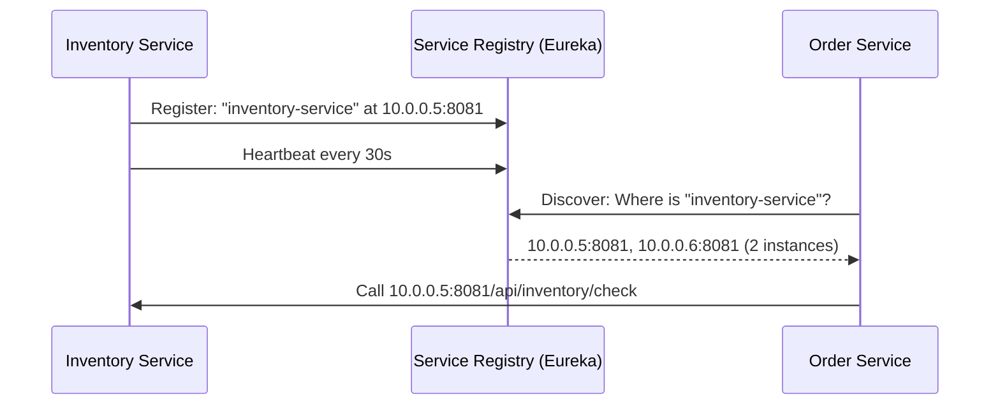
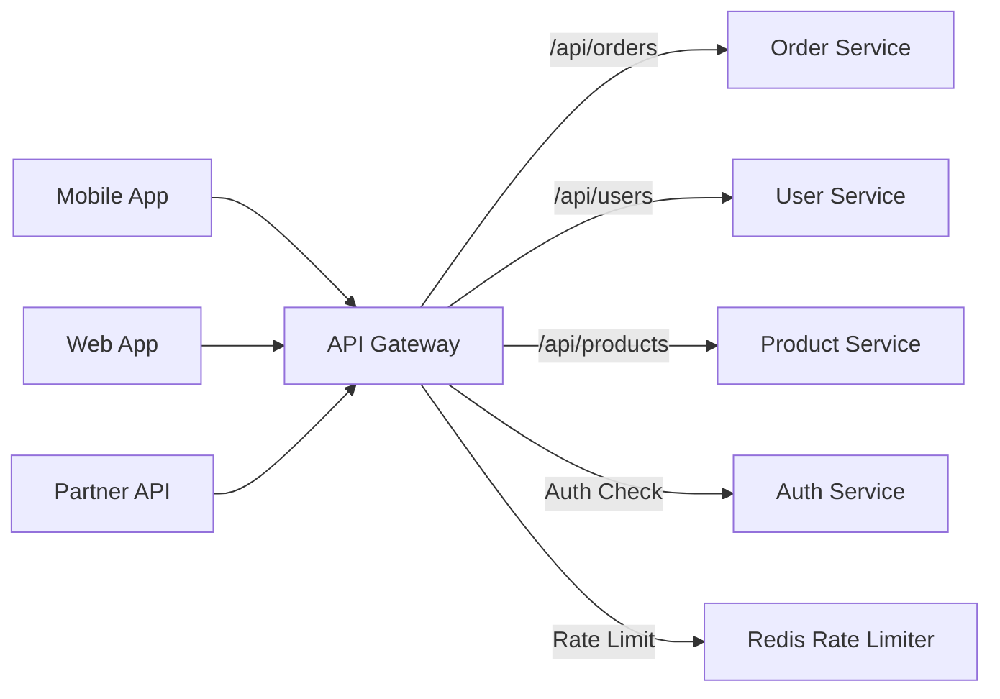
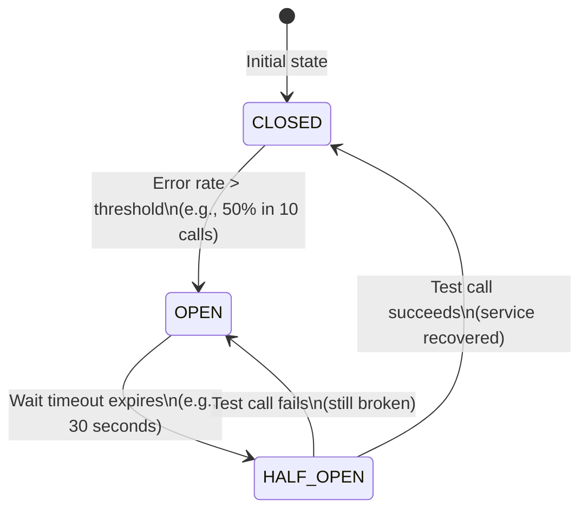
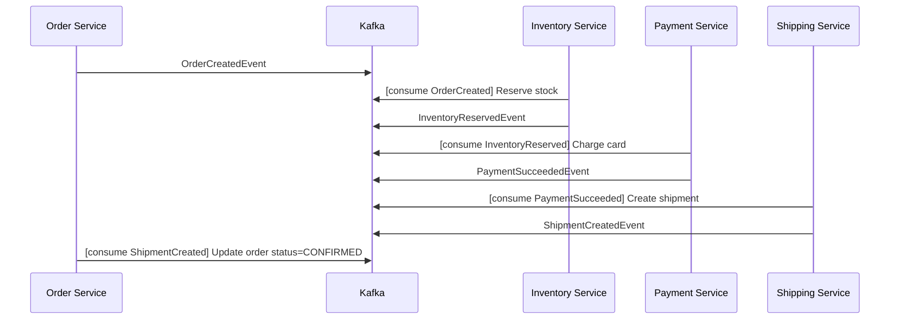
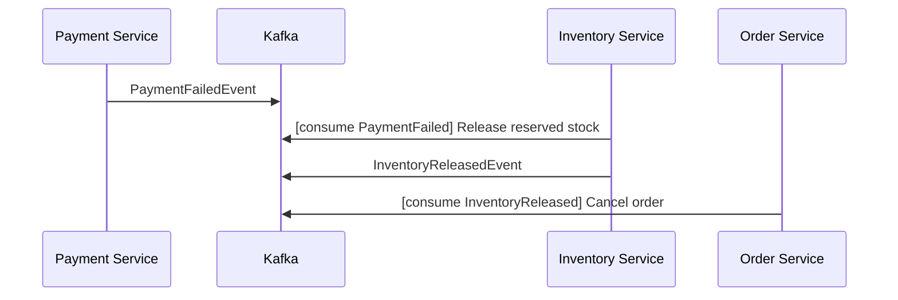
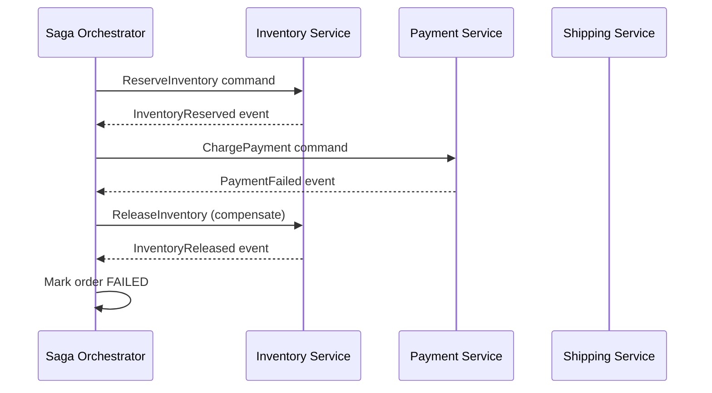
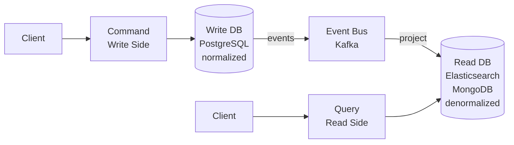
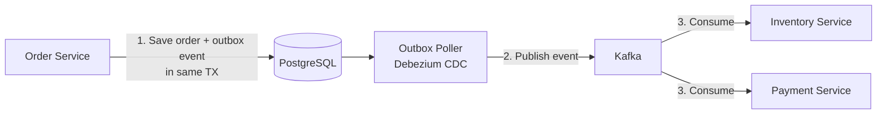

# Section 7: Microservices — Patterns, Communication, and Production

> Architecture patterns, distributed systems challenges, and real-world solutions

---

## Table of Contents

1. [Monolith vs Microservices](#1-monolith-vs-microservices)
2. [Service Discovery](#2-service-discovery)
3. [API Gateway](#3-api-gateway)
4. [Load Balancing](#4-load-balancing)
5. [Circuit Breaker](#5-circuit-breaker)
6. [Bulkhead Pattern](#6-bulkhead-pattern)
7. [Retry Pattern](#7-retry-pattern)
8. [Saga Pattern](#8-saga-pattern)
9. [CQRS](#9-cqrs)
10. [Event Sourcing](#10-event-sourcing)
11. [Outbox Pattern](#11-outbox-pattern)
12. [Database Per Service](#12-database-per-service)
13. [Service Communication](#13-service-communication)
14. [Production Incidents](#14-production-incidents)

---

# 1. Monolith vs Microservices

## Monolith Architecture

```
┌─────────────────────────────────┐
│         MONOLITH APP            │
│  ┌──────────┐  ┌─────────────┐  │
│  │  Orders  │  │  Inventory  │  │
│  │  Module  │  │   Module    │  │
│  └──────────┘  └─────────────┘  │
│  ┌──────────┐  ┌─────────────┐  │
│  │  Users   │  │  Payments   │  │
│  │  Module  │  │   Module    │  │
│  └──────────┘  └─────────────┘  │
│                                  │
│  Single database, single deploy  │
└─────────────────────────────────┘
```

## Microservices Architecture

```
┌──────────┐  ┌──────────────┐  ┌─────────────┐
│  Orders  │  │  Inventory   │  │   Users     │
│ Service  │  │   Service    │  │   Service   │
│  DB:PG   │  │  DB:MySQL    │  │  DB:PG      │
└──────────┘  └──────────────┘  └─────────────┘
     │               │                │
     └───────────────┼────────────────┘
                     │
              ┌──────▼──────┐
              │  API Gateway │
              └──────────────┘
                     │
              ┌──────▼──────┐
              │   Clients    │
              └──────────────┘
```

## Comparison Table

| Dimension | Monolith | Microservices |
|-----------|----------|---------------|
| **Deployment** | Single unit, simple | Independent per service, complex |
| **Scaling** | Scale whole app | Scale individual services |
| **Technology** | Single stack | Polyglot (each service chooses) |
| **Team** | One large team | Small, autonomous teams |
| **Latency** | In-process calls (fast) | Network calls (slower) |
| **Transactions** | Simple (ACID) | Complex (Saga, eventual consistency) |
| **Testing** | Simpler | Complex (contract testing, integration) |
| **Failure isolation** | One failure = all down | Service failures isolated |
| **Data consistency** | Strong (shared DB) | Eventual (distributed) |
| **Complexity** | Low initially | High (distributed systems) |

## When to Use Microservices

**Use Microservices when:**
- Different parts need independent scaling (payment processing vs product catalog)
- Multiple teams with clear ownership boundaries
- Different parts have different reliability requirements
- You need technology diversity

**Stick with Monolith when:**
- Small team (< 10 engineers)
- Early-stage product (requirements unclear)
- Simple domain
- Limited operational maturity

> **Martin Fowler:** "Don't start with microservices. Start with a monolith and extract services when you have clear boundaries."

---

# 2. Service Discovery

## Problem

In microservices, services scale up/down dynamically. Hard-coding IPs is impossible.

```
Order Service needs to call Inventory Service.
But Inventory Service runs on 5 pods with changing IPs.
How does Order Service know which IP to use?
```

## Solution: Service Registry



## Client-Side vs Server-Side Discovery

| | Client-Side (Eureka + Ribbon) | Server-Side (AWS ALB, Nginx) |
|--|-------------------------------|------------------------------|
| Who decides routing | Client looks up registry | Infrastructure router |
| Client awareness | Must integrate with registry | Transparent |
| Flexibility | High | Limited |
| Complexity | Client library required | Simpler client |
| Examples | Netflix Eureka + Ribbon | AWS ALB, Kubernetes Service |

---

# 3. API Gateway

## Definition

An **API Gateway** is the single entry point for all clients. It handles routing, authentication, rate limiting, load balancing, and more.



## API Gateway Responsibilities

| Responsibility | Description |
|----------------|-------------|
| **Routing** | Route `/api/orders` to Order Service |
| **Authentication** | Validate JWT before forwarding |
| **Rate Limiting** | Limit to 100 req/sec per user |
| **Load Balancing** | Distribute to healthy instances |
| **SSL Termination** | HTTPS at gateway, HTTP internally |
| **Request Transformation** | Add headers, modify request |
| **Circuit Breaking** | Stop forwarding to failing services |
| **Caching** | Cache GET responses |
| **Logging & Metrics** | Centralized observability |

## Spring Cloud Gateway Configuration

```java
@Configuration
public class GatewayConfig {
    
    @Bean
    public RouteLocator routes(RouteLocatorBuilder builder) {
        return builder.routes()
            .route("order-service", r -> r
                .path("/api/orders/**")
                .filters(f -> f
                    .addRequestHeader("X-Service-Name", "order-service")
                    .circuitBreaker(c -> c
                        .setName("orderServiceCB")
                        .setFallbackUri("forward:/fallback/orders"))
                    .retry(config -> config
                        .setRetries(3)
                        .setStatuses(HttpStatus.SERVICE_UNAVAILABLE))
                    .requestRateLimiter(r2 -> r2
                        .setRateLimiter(redisRateLimiter())
                        .setKeyResolver(ipKeyResolver()))
                )
                .uri("lb://order-service"))  // lb:// = load-balanced via service discovery
            .build();
    }
}
```

---

# 4. Load Balancing

## Algorithms

| Algorithm | Description | Use When |
|-----------|-------------|----------|
| **Round Robin** | Request 1→Server1, 2→Server2, 3→Server1 | Homogeneous servers |
| **Weighted Round Robin** | Servers with more capacity get more requests | Heterogeneous servers |
| **Least Connections** | Route to server with fewest active connections | Long-lived connections |
| **IP Hash** | Same client → same server | Session affinity needed |
| **Random** | Random server selection | Simple, low-overhead |
| **Health-Based** | Skip unhealthy servers | All production |

---

# 5. Circuit Breaker

## Definition

A **Circuit Breaker** monitors calls to a service and "opens" the circuit when failures exceed a threshold — failing fast instead of waiting for timeouts.

## Mental Model

Like an electrical circuit breaker: when current (requests) exceeds safe limits (error rate), the breaker trips (opens) to prevent damage (cascading failure). After a cooldown, it tries again (half-open).

## Circuit States



## Resilience4j Implementation

```java
// Configuration
@Bean
public CircuitBreakerConfig circuitBreakerConfig() {
    return CircuitBreakerConfig.custom()
        .failureRateThreshold(50)           // open if 50% of calls fail
        .waitDurationInOpenState(Duration.ofSeconds(30))
        .slidingWindowType(SlidingWindowType.COUNT_BASED)
        .slidingWindowSize(10)              // last 10 calls
        .minimumNumberOfCalls(5)            // need at least 5 calls to calculate rate
        .permittedNumberOfCallsInHalfOpenState(3)
        .automaticTransitionFromOpenToHalfOpenEnabled(true)
        .recordExceptions(IOException.class, TimeoutException.class)
        .ignoreExceptions(BusinessException.class)  // don't count business exceptions as failures
        .build();
}

// Usage
@Service
public class PaymentService {
    
    private final CircuitBreaker cb = CircuitBreaker.of("payment-gateway", cbConfig);
    
    public PaymentResult chargeCard(PaymentRequest request) {
        return cb.executeSupplier(() -> paymentGatewayClient.charge(request));
    }
    
    // With annotation
    @CircuitBreaker(name = "paymentGateway", fallbackMethod = "chargeFallback")
    public PaymentResult chargeCardWithFallback(PaymentRequest request) {
        return paymentGatewayClient.charge(request);
    }
    
    public PaymentResult chargeFallback(PaymentRequest request, Exception e) {
        log.warn("Payment gateway unavailable, queuing for retry: {}", e.getMessage());
        retryQueue.enqueue(request);
        return PaymentResult.pending("Payment queued for processing");
    }
}
```

---

# 6. Bulkhead Pattern

## Definition

**Bulkhead** isolates resources (thread pools, connections) per service to prevent one slow service from consuming all resources and affecting others.

## Mental Model

Ship bulkheads: watertight compartments ensure a hole in one section doesn't sink the whole ship.

```java
// WITHOUT Bulkhead: All services share same thread pool
// If PaymentService hangs → thread pool exhausted → OrderService also fails!

// WITH Bulkhead: Separate thread pools
@Configuration
public class BulkheadConfig {
    
    @Bean("paymentExecutor")
    public ThreadPoolBulkhead paymentBulkhead() {
        return ThreadPoolBulkhead.of("payment", ThreadPoolBulkheadConfig.custom()
            .maxThreadPoolSize(10)
            .coreThreadPoolSize(5)
            .queueCapacity(20)
            .build());
    }
    
    @Bean("inventoryExecutor")
    public ThreadPoolBulkhead inventoryBulkhead() {
        return ThreadPoolBulkhead.of("inventory", ThreadPoolBulkheadConfig.custom()
            .maxThreadPoolSize(20)
            .coreThreadPoolSize(10)
            .queueCapacity(50)
            .build());
    }
}

// If payment service hangs → only its 10 threads are exhausted
// Inventory service threads unaffected → inventory APIs still work
```

---

# 7. Retry Pattern

```java
RetryConfig retryConfig = RetryConfig.custom()
    .maxAttempts(3)
    .waitDuration(Duration.ofMillis(500))
    .retryExceptions(IOException.class, TimeoutException.class)
    .ignoreExceptions(BusinessException.class, ValidationException.class)
    .build();

@Retry(name = "inventoryService", fallbackMethod = "checkInventoryFallback")
public InventoryStatus checkInventory(String productId) {
    return inventoryClient.check(productId);
}
```

## Exponential Backoff with Jitter

```java
RetryConfig retryConfig = RetryConfig.custom()
    .maxAttempts(5)
    .intervalFunction(IntervalFunction.ofExponentialRandomBackoff(
        Duration.ofMillis(100),  // base delay
        2.0,                      // multiplier
        Duration.ofSeconds(10)   // max delay
    ))
    // Delays: ~100ms, ~200ms, ~400ms, ~800ms, ~1600ms (with ±25% jitter)
    // Jitter prevents "thundering herd" when all retries fire simultaneously
    .build();
```

---

# 8. Saga Pattern

## Definition

**Saga** is a pattern for managing distributed transactions across multiple microservices using a sequence of local transactions, with compensating transactions for rollback.

## Why Needed

```
Traditional (Monolith): BEGIN TRANSACTION; INSERT + INSERT + UPDATE; COMMIT
Microservices: 3 different services, 3 different databases — can't use ACID!
```

## Two Saga Implementation Approaches

### Choreography-Based Saga (Event-Driven)



**Compensating transactions (rollback flow):**



### Orchestration-Based Saga (Conductor/Temporal)



## Choreography vs Orchestration

| | Choreography | Orchestration |
|--|--------------|---------------|
| Coordinator | None (event-driven) | Central orchestrator |
| Coupling | Low (events) | Orchestrator knows all services |
| Visibility | Hard to trace | Easy to trace (one place) |
| Complexity | Each service knows saga logic | Centralized, clearer |
| Failure handling | Complex (each service handles) | Orchestrator handles |
| Tools | Kafka events | Temporal, Conductor, AWS Step Functions |
| Best For | Simple, well-defined flows | Complex flows with many steps |

---

# 9. CQRS

## Definition

**CQRS (Command Query Responsibility Segregation)** separates the model used for updating state (**Command**) from the model used for reading state (**Query**).



## Benefits

- **Write side:** Optimized for consistency and integrity (normalized, transactional)
- **Read side:** Optimized for query performance (denormalized, indexed, cached)
- Read and write sides can **scale independently**
- Read models can be **rebuilt** by replaying events

## When to Use CQRS

**Use CQRS when:**
- Read and write workloads scale differently (10:1 read:write ratio is common)
- Complex queries on write model hurt performance
- Multiple read models needed for different use cases

**Don't use CQRS when:**
- Simple CRUD app — too much complexity
- Read and write volumes are similar
- Team unfamiliar with eventual consistency

---

# 10. Event Sourcing

## Definition

Instead of storing **current state**, store the **sequence of events** that led to that state.

```
Traditional: table 'orders' stores current status = "SHIPPED"

Event Sourcing: events table stores:
  1. OrderCreated {userId: 1, amount: 99}
  2. PaymentProcessed {method: "VISA", amount: 99}
  3. OrderShipped {trackingId: "TRK123"}

Current state = replay all events in order
```

## Benefits

- Complete audit history
- Time travel: reconstruct state at any point
- Enables CQRS
- Event log is the single source of truth

## Tradeoffs

| Benefit | Cost |
|---------|------|
| Full audit trail | Event schema evolution is hard |
| Replay and rebuild | Eventually consistent read models |
| Decoupled consumers | Eventual consistency can confuse users |
| Debug by replaying | Snapshots needed for large event streams |

---

# 11. Outbox Pattern

## Problem: Dual-Write Inconsistency

```java
@Transactional
public void placeOrder(Order order) {
    orderRepository.save(order);      // Step 1: Save to DB ✅
    kafkaTemplate.send("orders", event); // Step 2: Publish to Kafka
    // What if Kafka is down? Step 1 committed, Step 2 failed → INCONSISTENCY!
}
```

## Solution: Outbox Pattern

```java
@Transactional
public void placeOrder(Order order) {
    orderRepository.save(order);
    
    // Write event to SAME database, SAME transaction
    OutboxEvent outbox = OutboxEvent.builder()
        .aggregateType("ORDER")
        .aggregateId(order.getId().toString())
        .eventType("ORDER_PLACED")
        .payload(objectMapper.writeValueAsString(order))
        .createdAt(Instant.now())
        .build();
    
    outboxRepository.save(outbox);
    // BOTH saves in same ACID transaction — atomically written
}
// Separate polling service reads outbox table and publishes to Kafka
// On success: mark outbox event as processed
// On failure: retry (event stays in outbox)
```



## Debezium (Change Data Capture)

Instead of polling, use CDC to stream database changes directly to Kafka:

```yaml
# Debezium PostgreSQL connector config
{
  "name": "order-outbox-connector",
  "config": {
    "connector.class": "io.debezium.connector.postgresql.PostgresConnector",
    "database.hostname": "postgres",
    "database.dbname": "orderdb",
    "table.include.list": "public.outbox_events",
    "transforms": "outbox",
    "transforms.outbox.type": "io.debezium.transforms.outbox.EventRouter",
    "transforms.outbox.table.field.event.type": "event_type",
    "transforms.outbox.route.by.field": "aggregate_type"
  }
}
```

---

# 12. Database Per Service

## Pattern

Each microservice has its **own dedicated database** — no sharing.

```
Order Service     → PostgreSQL (orderdb)
User Service      → PostgreSQL (userdb)
Product Service   → MongoDB (products)
Session Service   → Redis (sessions)
Search Service    → Elasticsearch (search-index)
```

## Why No Shared Database?

| Shared DB | DB Per Service |
|-----------|---------------|
| Tight coupling (schema changes break all services) | Loose coupling (own schema) |
| Single point of failure | Independent failure domains |
| Can't polyglot | Each service picks best DB |
| Hard to scale independently | Independent scaling |
| Cross-service JOINs easy | JOINs not possible (use events/APIs) |

## API Composition (Replacing JOINs)

```java
// Replacing a SQL JOIN across services
@Service
public class OrderQueryService {
    
    // Instead of: SELECT o.*, u.name FROM orders o JOIN users u ON u.id = o.user_id
    public OrderWithUserDTO getOrderWithUser(Long orderId) {
        // Parallel calls to avoid sequential latency
        CompletableFuture<Order> orderFuture = CompletableFuture
            .supplyAsync(() -> orderService.findById(orderId));
        
        CompletableFuture<User> userFuture = orderFuture
            .thenCompose(order -> CompletableFuture
                .supplyAsync(() -> userService.findById(order.getUserId())));
        
        CompletableFuture.allOf(orderFuture, userFuture).join();
        
        return new OrderWithUserDTO(orderFuture.join(), userFuture.join());
    }
}
```

---

# 13. Service Communication

## REST vs gRPC vs Kafka

| | REST/HTTP | gRPC | Kafka |
|--|-----------|------|-------|
| Protocol | HTTP/1.1 or HTTP/2 | HTTP/2 + Protobuf | Binary TCP |
| Payload | JSON (verbose) | Protobuf (compact, typed) | Bytes (any format) |
| Communication | Request-Response | Request-Response + Streaming | Async, decoupled |
| Latency | Higher | Lower | Higher (async) |
| Contract | OpenAPI (optional) | `.proto` file (mandatory) | Schema Registry (optional) |
| Coupling | Loose | Moderate (proto contract) | Very loose |
| Ease of use | High | Medium | Medium |
| Load balancing | HTTP LB | gRPC LB (complex) | Partition-based |
| Use for | Public APIs, external | Internal high-perf RPC | Async events, queuing |

## gRPC Example

```protobuf
// inventory.proto
syntax = "proto3";
package inventory;

service InventoryService {
    rpc CheckStock (StockRequest) returns (StockResponse);
    rpc UpdateStock (UpdateStockRequest) returns (UpdateStockResponse);
    rpc StreamInventoryUpdates (StreamRequest) returns (stream InventoryUpdate);
}

message StockRequest {
    string product_id = 1;
    int32 quantity_needed = 2;
}

message StockResponse {
    bool available = 1;
    int32 current_stock = 2;
}
```

```java
// Spring Boot gRPC server
@GrpcService
public class InventoryGrpcService extends InventoryServiceGrpc.InventoryServiceImplBase {
    
    @Override
    public void checkStock(StockRequest request, StreamObserver<StockResponse> responseObserver) {
        int stock = inventoryService.getStock(request.getProductId());
        StockResponse response = StockResponse.newBuilder()
            .setAvailable(stock >= request.getQuantityNeeded())
            .setCurrentStock(stock)
            .build();
        responseObserver.onNext(response);
        responseObserver.onCompleted();
    }
}
```

---

# 14. Production Incidents

## Incident 1: Cascading Failure — The Christmas Crash

### Scenario
Black Friday: Payment service is slow (3rd party gateway issue). Order service calls payment service synchronously. Payment timeouts propagate to order service, which propagates to API gateway. Site goes down for 2 hours.

### Root Cause
No circuit breaker. When payment service became slow:
1. Order service threads blocked waiting for payment response
2. Thread pool exhausted in Order service
3. API gateway's requests to Order service timed out
4. API gateway thread pool exhausted
5. Entire site unresponsive

### Solution
1. Added Resilience4j circuit breaker on payment gateway client
2. Added bulkhead (separate thread pool) for payment calls
3. Added fallback: queue payment, show "payment processing" to user
4. Added timeout: max 2s per payment gateway call

### Prevention
```java
@CircuitBreaker(name = "paymentGateway", fallbackMethod = "queuePayment")
@TimeLimiter(name = "paymentGateway")  // 2s timeout
@Bulkhead(name = "paymentGateway")    // isolated thread pool
public CompletableFuture<PaymentResult> chargeCard(PaymentRequest req) {
    return CompletableFuture.supplyAsync(() -> gateway.charge(req));
}
```

---

## Incident 2: Duplicate Orders — The Lost ACK Problem

### Scenario
Kafka consumer processes order creation event and saves to DB, but crashes before committing Kafka offset. On restart, event is reprocessed → duplicate orders.

### Root Cause
Lack of idempotency in the consumer.

### Solution

```java
@KafkaListener(topics = "order-events")
public void processOrderEvent(OrderEvent event) {
    // Idempotency check: has this event been processed?
    if (eventProcessingRepository.existsByEventId(event.getId())) {
        log.info("Skipping duplicate event: {}", event.getId());
        return;
    }
    
    try {
        orderService.createOrder(event);
        eventProcessingRepository.save(new ProcessedEvent(event.getId()));
    } catch (DuplicateKeyException e) {
        // Another instance processed it simultaneously — that's fine
        log.info("Concurrent duplicate event handled: {}", event.getId());
    }
}
```

---

## Interview Questions

### Basic
1. What is a microservice?
2. What is the difference between REST and gRPC?
3. What is the Circuit Breaker pattern?

### Intermediate
4. Explain the Saga pattern. What are the two approaches?
5. What is the Outbox Pattern and why is it needed?
6. What is CQRS and when would you use it?

### Advanced
7. How does the Bulkhead pattern prevent cascading failures?
8. Compare Choreography vs Orchestration Saga. When would you choose each?
9. How does Event Sourcing enable time-travel debugging?
10. Design a distributed transaction for an e-commerce checkout.

### Scenario-Based
11. *Your Order Service calls Inventory, Payment, and Shipping services. Inventory is having issues. How do you prevent this from affecting payment and shipping?*
12. *How would you handle duplicate event processing in a Kafka consumer?*
13. *Design the data model for a CQRS-based order management system.*

---

## Summary — Microservices Cheatsheet

```
Monolith → Microservices Trade-offs:
  + Independent scaling, deployment, tech choice
  - Network latency, distributed transactions, complexity

Communication:
  REST: public APIs, ease of use
  gRPC: high-performance internal, typed contracts
  Kafka: async events, decoupling, resilience

Resilience Patterns:
  Circuit Breaker: fail-fast, prevent cascading failures
  Bulkhead: isolate thread pools per service
  Retry + Backoff + Jitter: handle transient failures

Data Patterns:
  Database Per Service: independent scaling, no coupling
  Outbox Pattern: atomic write + event publish
  Saga: distributed transaction without 2PC
    Choreography: event-driven, decoupled
    Orchestration: central coordinator, visible
  CQRS: separate read and write models
  Event Sourcing: store events, not state

Service Discovery: Eureka, Consul, Kubernetes DNS
API Gateway: single entry, auth, rate limiting, routing
```
