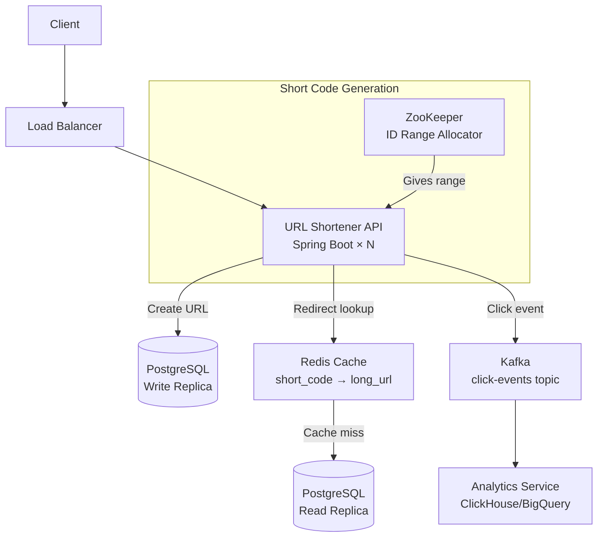
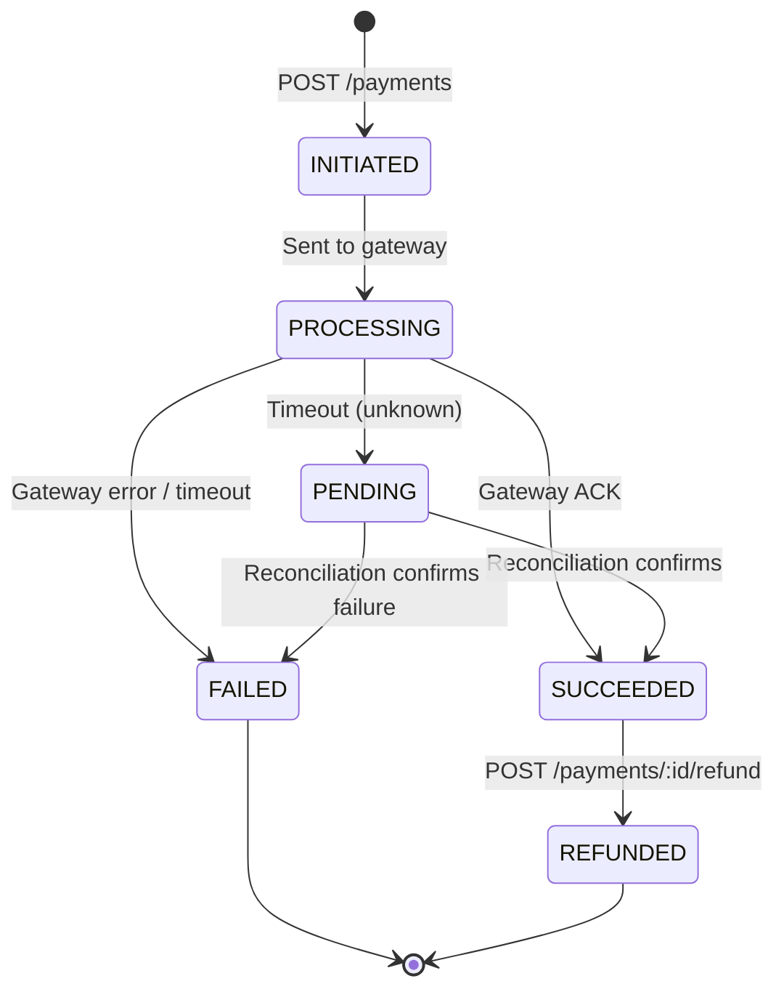
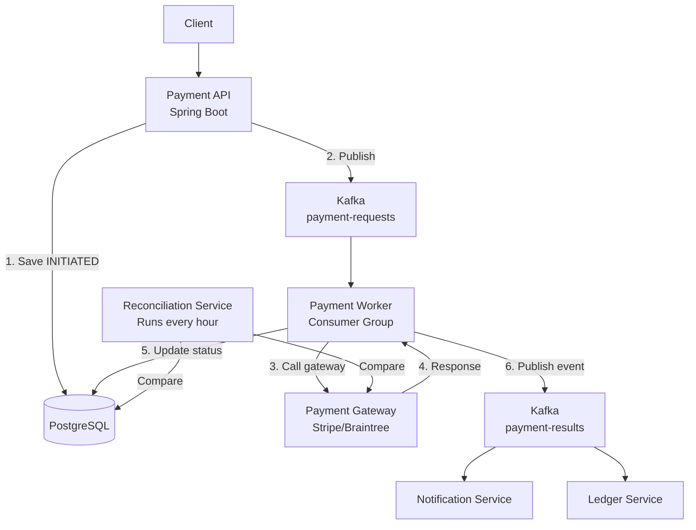
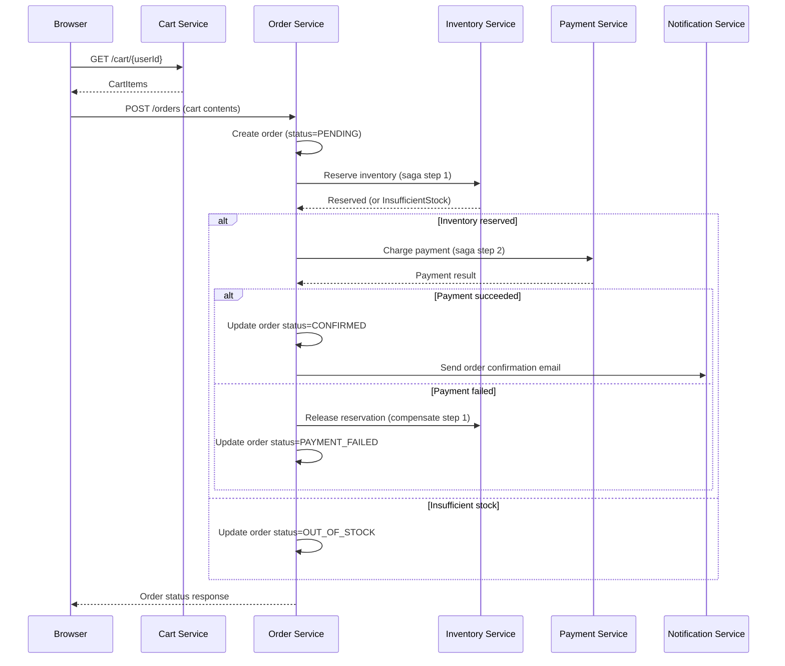
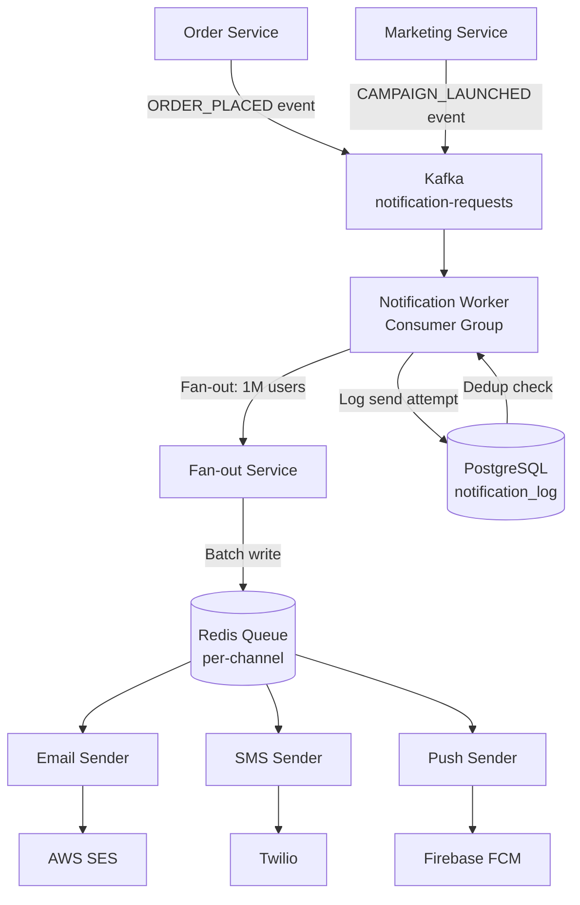

# Section 11: System Design — Practical Patterns

> URL Shortener, Payment System, E-commerce Checkout, Notification Service

---

## Table of Contents

1. [System Design Process](#1-system-design-process)
2. [URL Shortener](#2-url-shortener)
3. [Payment System](#3-payment-system)
4. [E-commerce Checkout](#4-e-commerce-checkout)
5. [Notification Service](#5-notification-service)
6. [Key Design Principles](#6-key-design-principles)
7. [Capacity Estimation Cheatsheet](#7-capacity-estimation-cheatsheet)

---

## 1. System Design Process

### Interview Framework (Use This Every Time)

```
Step 1: Clarify Requirements (5 min)
  - Functional: what features must the system support?
  - Non-functional: scale, latency, availability requirements
  - Out of scope: what are you explicitly NOT building?

Step 2: Estimate Scale (3 min)
  - DAU (daily active users)
  - QPS (queries per second) — reads and writes
  - Storage: data per day × retention period
  - Bandwidth: data in/out per second

Step 3: API Design (3 min)
  - Core REST endpoints
  - Request/response payloads

Step 4: Database Schema (5 min)
  - Tables, columns, indexes
  - SQL vs NoSQL choice with reason

Step 5: High-Level Architecture (10 min)
  - Components: API servers, DB, cache, queue, CDN
  - Data flow diagram

Step 6: Deep Dive (15 min)
  - Pick 1-2 critical components and explain thoroughly
  - Handle edge cases and bottlenecks

Step 7: Scale & Reliability (5 min)
  - Horizontal scaling
  - Caching strategy
  - Failure modes and mitigations
```

---

## 2. URL Shortener

### Functional Requirements

- Given a long URL, create a short URL (e.g., `bit.ly/abc123`)
- Redirect `short.ly/abc123` to original long URL
- (Optional) Custom aliases, analytics, expiration

### Non-Functional Requirements

- 100 million URLs created per day
- 10:1 read-to-write ratio (1 billion redirects per day)
- High availability (100ms redirect latency P99)
- Unique short codes (no collisions)

### Capacity Estimation

```
Write QPS: 100M / 86400 ≈ 1,200 writes/sec
Read QPS:  1B / 86400 ≈ 11,600 reads/sec

Storage per URL: 500 bytes (long URL + metadata)
Daily storage: 100M × 500B = 50 GB/day
5-year storage: 50GB × 365 × 5 ≈ 90 TB

Cache (top 20% URLs = 80% traffic):
  1B reads/day × 20% = 200M unique URLs accessed
  200M × 500B = 100 GB cache
```

### API Design

```
POST /api/v1/urls
  Request: { "longUrl": "https://...", "customAlias": "mylink", "expiresAt": "2025-01-01" }
  Response: { "shortUrl": "https://short.ly/abc123", "shortCode": "abc123" }

GET /:shortCode
  → 302 Redirect to longUrl
  → 404 if not found
  → 410 Gone if expired

GET /api/v1/urls/:shortCode/stats
  Response: { "clicks": 45821, "countries": {...}, "devices": {...} }
```

### Database Schema

```sql
CREATE TABLE urls (
    id          BIGINT PRIMARY KEY,           -- internal ID
    short_code  VARCHAR(10) UNIQUE NOT NULL,  -- indexed
    long_url    TEXT NOT NULL,
    user_id     BIGINT,
    created_at  TIMESTAMP DEFAULT NOW(),
    expires_at  TIMESTAMP,
    is_active   BOOLEAN DEFAULT TRUE
);
CREATE INDEX idx_urls_short_code ON urls(short_code);

-- For analytics (write-heavy, use separate service/DB)
CREATE TABLE clicks (
    id          BIGINT PRIMARY KEY,
    short_code  VARCHAR(10),
    clicked_at  TIMESTAMP,
    country     VARCHAR(2),
    device_type VARCHAR(20),
    referer     TEXT
);
-- Use ClickHouse or Cassandra for analytics (append-only, high write throughput)
```

### Architecture



### Short Code Generation

**Option 1: Hash + Collision Handling**

```java
public String generateShortCode(String longUrl) {
    // MD5 hash first 6 chars
    String hash = DigestUtils.md5Hex(longUrl + System.currentTimeMillis());
    String code = hash.substring(0, 7);  // 7 chars = 62^7 = 3.5 trillion combinations

    // Check collision
    while (urlRepository.existsByShortCode(code)) {
        code = hash.substring(random.nextInt(25), random.nextInt(25) + 7);
    }
    return code;
}
```

**Option 2: Base62 Encoding of Auto-Increment ID (Preferred)**

```java
private static final String BASE62 = "0123456789ABCDEFGHIJKLMNOPQRSTUVWXYZabcdefghijklmnopqrstuvwxyz";

public String encodeToBase62(long id) {
    StringBuilder sb = new StringBuilder();
    while (id > 0) {
        sb.append(BASE62.charAt((int)(id % 62)));
        id /= 62;
    }
    return sb.reverse().toString();
}
// ID 1000000 → "4c92"
// Guaranteed unique, no collisions
```

**Problem:** Single DB auto-increment is a bottleneck at scale.

**Solution:** Snowflake ID or ZooKeeper-allocated ID ranges.

```
ZooKeeper range allocation:
  Server 1 gets IDs: 1 - 1,000,000
  Server 2 gets IDs: 1,000,001 - 2,000,000
  (No coordination needed between servers until range exhausted)
```

### Caching Strategy

```java
// Cache short_code → long_url in Redis (read-heavy workload)
@Service
public class UrlRedirectService {

    @Cacheable(value = "short-codes", key = "#shortCode", unless = "#result == null")
    public String getLongUrl(String shortCode) {
        return urlRepository.findByShortCode(shortCode)
            .filter(Url::isActive)
            .filter(u -> u.getExpiresAt() == null || u.getExpiresAt().isAfter(Instant.now()))
            .map(Url::getLongUrl)
            .orElse(null);
    }
}
```

---

## 3. Payment System

### Functional Requirements

- Process payments (credit/debit cards)
- Idempotent: duplicate payment requests must not double-charge
- Audit trail: every payment event recorded
- Reconciliation: identify discrepancies with payment gateway

### Non-Functional Requirements

- 1000 TPS peak
- 99.99% availability (< 1 hour downtime/year)
- Payment data encrypted at rest
- PCI-DSS compliance

### Core Problem: Idempotency

```
User clicks "Pay" → network timeout → user clicks "Pay" again
→ Must NOT charge twice!
```

```java
// Client generates idempotency key before sending request
UUID idempotencyKey = UUID.randomUUID();  // generated by client

// Payment API
@PostMapping("/api/v1/payments")
public ResponseEntity<PaymentResponse> processPayment(
        @RequestHeader("X-Idempotency-Key") String idempotencyKey,
        @RequestBody PaymentRequest request) {

    // Check if already processed
    Optional<PaymentResponse> existing = idempotencyStore.get(idempotencyKey);
    if (existing.isPresent()) {
        return ResponseEntity.ok(existing.get());  // return same response
    }

    try {
        PaymentResponse response = paymentService.charge(request);
        idempotencyStore.set(idempotencyKey, response, Duration.ofDays(7));
        return ResponseEntity.ok(response);
    } catch (Exception e) {
        // Don't store on failure — allow client to retry
        throw e;
    }
}
```

### Payment State Machine



### Database Schema

```sql
CREATE TABLE payments (
    id              UUID PRIMARY KEY DEFAULT gen_random_uuid(),
    idempotency_key UUID UNIQUE NOT NULL,
    user_id         UUID NOT NULL,
    amount          DECIMAL(12,2) NOT NULL,
    currency        VARCHAR(3) NOT NULL,
    status          VARCHAR(20) NOT NULL DEFAULT 'INITIATED',
    gateway_ref     VARCHAR(100),       -- external payment gateway reference
    failure_reason  TEXT,
    created_at      TIMESTAMP DEFAULT NOW(),
    updated_at      TIMESTAMP DEFAULT NOW()
);

-- Event sourcing: append-only audit log
CREATE TABLE payment_events (
    id              BIGSERIAL PRIMARY KEY,
    payment_id      UUID NOT NULL REFERENCES payments(id),
    event_type      VARCHAR(50) NOT NULL,  -- INITIATED, PROCESSING, SUCCEEDED, FAILED
    event_data      JSONB,
    occurred_at     TIMESTAMP DEFAULT NOW()
);
CREATE INDEX idx_payment_events_payment_id ON payment_events(payment_id);
```

### Architecture



### Reconciliation

```java
@Scheduled(cron = "0 0 * * * *")  // every hour
public void reconcile() {
    // Find payments stuck in PENDING for > 30 minutes
    List<Payment> pendingPayments = paymentRepository
        .findByStatusAndCreatedAtBefore("PENDING", Instant.now().minus(Duration.ofMinutes(30)));

    for (Payment payment : pendingPayments) {
        try {
            // Query gateway for actual status
            GatewayStatus gwStatus = gateway.getStatus(payment.getGatewayRef());

            if (gwStatus.isSucceeded()) {
                payment.setStatus("SUCCEEDED");
                eventPublisher.publish(new PaymentSucceededEvent(payment));
            } else if (gwStatus.isFailed()) {
                payment.setStatus("FAILED");
                payment.setFailureReason(gwStatus.getFailureReason());
            }

            paymentRepository.save(payment);
        } catch (Exception e) {
            log.error("Reconciliation failed for payment {}: {}", payment.getId(), e.getMessage());
        }
    }
}
```

---

## 4. E-commerce Checkout

### Flow: Order Placement with Saga



### Inventory Reservation: Race Condition Prevention

```sql
-- Atomic stock reservation using SELECT FOR UPDATE
BEGIN;

SELECT stock FROM inventory WHERE product_id = 1001 FOR UPDATE;
-- 10 units available

UPDATE inventory SET stock = stock - 2 WHERE product_id = 1001 AND stock >= 2;
-- Only decrements if enough stock (optimistic check in SQL)

INSERT INTO reservations (order_id, product_id, quantity) VALUES (5001, 1001, 2);

COMMIT;
```

```java
@Transactional
public ReservationResult reserve(Long productId, int quantity) {
    // SELECT FOR UPDATE prevents concurrent reservations
    Product product = productRepository.findByIdWithLock(productId);

    if (product.getStock() < quantity) {
        throw new InsufficientStockException(productId, quantity, product.getStock());
    }

    product.setStock(product.getStock() - quantity);
    productRepository.save(product);

    Reservation reservation = new Reservation(productId, quantity);
    return reservationRepository.save(reservation);
}
```

---

## 5. Notification Service

### Requirements

- Send notifications via Email, SMS, Push
- Fan-out: one trigger event → N notifications (e.g., marketing blast to 1M users)
- Deduplication: don't send same notification twice
- Rate limiting: don't spam users
- Multi-channel fallback: email failed → try SMS

### Architecture



### Deduplication

```java
@KafkaListener(topics = "notification-requests")
public void handleNotification(NotificationRequest request) {
    // Idempotency: check if this notification was already sent
    String dedupKey = String.format("%s:%s:%s",
        request.getUserId(), request.getType(), request.getEventId());

    if (redisTemplate.opsForValue().setIfAbsent(
            "notif_sent:" + dedupKey, "1", Duration.ofDays(7))) {
        // Not sent yet — proceed
        sendNotification(request);
    } else {
        log.info("Skipping duplicate notification: {}", dedupKey);
    }
}
```

### Fan-out for Large Campaigns

```java
// Marketing blast: 1M subscribers
// Bad: process all 1M in one consumer → timeout, OOM

// Good: fan-out by batching
@KafkaListener(topics = "campaign-events")
public void handleCampaign(CampaignEvent event) {
    // Get all subscribers in batches
    int batchSize = 1000;
    int offset = 0;

    while (true) {
        List<String> userIds = subscriberService.getSubscribersBatch(
            event.getTargetSegment(), offset, batchSize);

        if (userIds.isEmpty()) break;

        // Publish batch notifications to Kafka (workers will process in parallel)
        for (String userId : userIds) {
            kafkaTemplate.send("notification-tasks", userId,
                NotificationTask.from(event, userId));
        }

        offset += batchSize;
    }
}
// N Kafka partitions → N parallel notification workers
// Each worker processes independent batches
```

---

## 6. Key Design Principles

### CAP Theorem

```
In a distributed system, you can only guarantee 2 of 3:
  C — Consistency: all nodes see same data at same time
  A — Availability: every request gets a response
  P — Partition Tolerance: system works even if network partition

In practice: P is mandatory (networks do partition)
So choose: CP or AP

CP (Consistency over Availability):
  PostgreSQL, HBase, ZooKeeper
  Example: banking — better to return error than show stale balance

AP (Availability over Consistency):
  Cassandra, DynamoDB, CouchDB
  Example: product catalog — showing slightly stale data is OK
```

### PACELC

```
Extension of CAP that considers latency:
  If Partition: choose Availability vs Consistency (AP/CP)
  Else (normal operation): choose Low Latency vs Consistency (EL/EC)

DynamoDB: PA/EL (available during partition, low latency otherwise)
PostgreSQL: PC/EC (consistent during partition, consistent with higher latency)
```

### Back-of-Envelope Calculation Reference

```
Time:
  1 millisecond = 10^-3 seconds
  1 microsecond = 10^-6 seconds (µs)
  1 nanosecond  = 10^-9 seconds (ns)

Memory:
  1 KB = 10^3 bytes = 1,000 bytes
  1 MB = 10^6 bytes
  1 GB = 10^9 bytes
  1 TB = 10^12 bytes

Latency reference numbers (Jeff Dean):
  L1 cache hit: 0.5 ns
  L2 cache hit: 7 ns
  RAM read: 100 ns
  SSD read: 150 µs
  HDD read: 10 ms
  LAN packet round trip: 0.5 ms
  Cross-datacenter: 150 ms

Throughput reference:
  PostgreSQL read: ~10K QPS single node
  Redis: ~100K QPS single node
  Kafka: ~1M messages/sec per broker
```

---

## 7. Capacity Estimation Cheatsheet

```
DAU to QPS:
  1M DAU → ~12 requests/user/day → 12M requests/day
  12M / 86400 seconds ≈ 140 QPS average
  Peak = 3-5x average ≈ 500-700 QPS

Storage:
  1 user profile: ~1 KB
  1 tweet/post: ~500 B
  1 photo: ~200 KB
  1 minute video: ~10 MB

  100M users × 1KB = 100 GB (user data)

Read:Write ratios (typical):
  Twitter: 1000:1 reads to writes
  Facebook: 10:1
  Payment: 1:1

Replication factor: 3 (standard)
Cache hit rate target: >90%

CDN: for static assets, offload 80-90% of content traffic
```

---

### Interview Questions

#### System Design Patterns

1. How would you design a URL shortener that handles 10 billion redirects/day?
2. Design an idempotent payment processing system.
3. How would you send notifications to 100 million users without sending duplicates?

#### Deeper Dives

4. Explain CAP theorem with examples.
5. How does sharding work in a URL shortener?
6. What is the difference between vertical scaling and horizontal scaling?

#### Trade-offs

7. When would you choose NoSQL over SQL for a system?
8. How would you handle the fan-out problem in Twitter's timeline?
9. How do you ensure exactly-once payment processing across service failures?

---

### Summary Cheatsheet

```
System Design Steps:
  1. Clarify requirements (functional + non-functional)
  2. Estimate scale (DAU → QPS, storage)
  3. API design
  4. Database schema
  5. Architecture diagram
  6. Deep dive on critical components
  7. Scalability and reliability

Common Components:
  Load Balancer: distribute traffic, health checks
  CDN: static assets, geographic caching
  API Gateway: auth, rate limiting, routing
  Cache (Redis): reduce DB load (aim for >90% hit rate)
  Message Queue (Kafka): decouple services, async processing
  Object Storage (S3): binary files, images, videos

Key Patterns:
  Idempotency: client-generated key, server-side dedup
  Rate Limiting: token bucket in Redis
  Deduplication: Redis SET NX with event ID
  Fan-out: batch + Kafka for large-scale notifications
  Saga: distributed transactions with compensating actions
```
