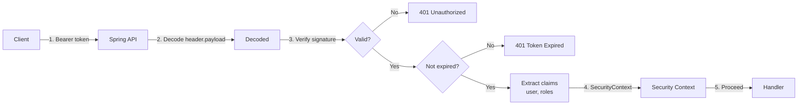
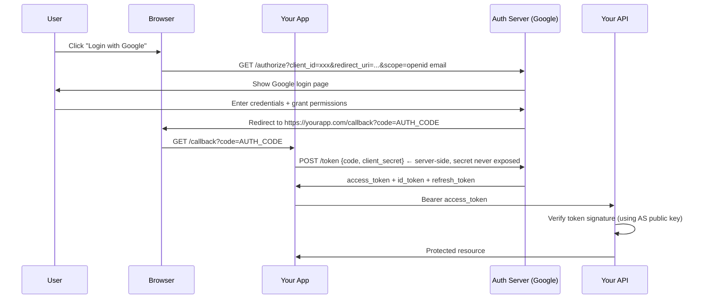

# Section 13: Security — JWT, OAuth2, Spring Security & OWASP

> Authentication, authorization, and securing Spring Boot APIs against OWASP Top 10

---

## Table of Contents

1. [JWT — JSON Web Tokens](#1-jwt--json-web-tokens)
2. [OAuth2 & OpenID Connect](#2-oauth2--openid-connect)
3. [Spring Security Architecture](#3-spring-security-architecture)
4. [JWT + Spring Security Implementation](#4-jwt--spring-security-implementation)
5. [CORS & CSRF](#5-cors--csrf)
6. [OWASP Top 10 for Backend Engineers](#6-owasp-top-10-for-backend-engineers)
7. [Production Security Checklist](#7-production-security-checklist)
8. [Interview Questions](#8-interview-questions)

---

## 1. JWT — JSON Web Tokens

### Structure

```
eyJhbGciOiJIUzI1NiIsInR5cCI6IkpXVCJ9.
eyJzdWIiOiJ1c2VyMTIzIiwibmFtZSI6IkFsaWNlIiwicm9sZXMiOlsiVVNFUiJdLCJpYXQiOjE3MDAwMDAwMDAsImV4cCI6MTcwMDAwMzYwMH0.
SflKxwRJSMeKKF2QT4fwpMeJf36POk6yJV_adQssw5c

Header.Payload.Signature
```

```json
// Header (base64 decoded)
{
  "alg": "HS256",
  "typ": "JWT"
}

// Payload (base64 decoded) - NOT encrypted, only encoded!
{
  "sub": "user123",
  "name": "Alice",
  "roles": ["USER"],
  "iat": 1700000000,   // issued at
  "exp": 1700003600    // expires at (1 hour)
}

// Signature
HMACSHA256(base64UrlEncode(header) + "." + base64UrlEncode(payload), secretKey)
```

### JWT Validation Flow



### Access Token vs Refresh Token

```
Access Token:
  - Short-lived (15 min - 1 hour)
  - Included in every API request (Authorization: Bearer <token>)
  - Stateless: server doesn't store it (validated by signature)

Refresh Token:
  - Long-lived (7 days - 30 days)
  - Used ONLY to get a new access token
  - Stored in DB (can be revoked)
  - Sent via HttpOnly cookie (not JS-accessible, XSS protection)
```

### Token Refresh Flow

```java
@PostMapping("/auth/refresh")
public ResponseEntity<TokenResponse> refresh(
        @CookieValue("refresh_token") String refreshToken) {

    // 1. Validate refresh token exists in DB (not revoked)
    RefreshToken stored = refreshTokenRepository.findByToken(refreshToken)
        .orElseThrow(() -> new InvalidTokenException("Refresh token not found"));

    // 2. Check not expired
    if (stored.getExpiresAt().isBefore(Instant.now())) {
        refreshTokenRepository.delete(stored);
        throw new TokenExpiredException("Refresh token expired");
    }

    // 3. Rotate refresh token (prevent replay attacks)
    refreshTokenRepository.delete(stored);
    String newRefreshToken = generateRefreshToken(stored.getUserId());

    // 4. Issue new access token
    String accessToken = jwtService.generateAccessToken(stored.getUserId());

    // 5. New refresh token in HttpOnly cookie
    ResponseCookie refreshCookie = ResponseCookie.from("refresh_token", newRefreshToken)
        .httpOnly(true)
        .secure(true)
        .path("/auth")
        .maxAge(Duration.ofDays(7))
        .sameSite("Strict")
        .build();

    return ResponseEntity.ok()
        .header(HttpHeaders.SET_COOKIE, refreshCookie.toString())
        .body(new TokenResponse(accessToken));
}
```

### JWT Revocation (Blacklist)

```java
// Problem: JWT is stateless — once issued, valid until expiry
// Even if user logs out, token still works!

// Solution: Redis blacklist for logout
@PostMapping("/auth/logout")
public ResponseEntity<Void> logout(
        @RequestHeader("Authorization") String authHeader) {

    String token = authHeader.substring("Bearer ".length());
    Claims claims = jwtService.extractClaims(token);

    // Add to blacklist with TTL = remaining token lifetime
    long remainingTtlMs = claims.getExpiration().getTime() - System.currentTimeMillis();

    if (remainingTtlMs > 0) {
        redisTemplate.opsForValue().set(
            "blacklisted_token:" + token,
            "revoked",
            Duration.ofMillis(remainingTtlMs)
        );
    }

    // Revoke refresh token
    refreshTokenRepository.deleteByUserId(claims.getSubject());

    return ResponseEntity.noContent().build();
}

// Check in JWT filter
public boolean isTokenBlacklisted(String token) {
    return redisTemplate.hasKey("blacklisted_token:" + token);
}
```

---

## 2. OAuth2 & OpenID Connect

### OAuth2 Roles

```
Resource Owner: User (Alice)
Client: Your App (wants to access Alice's data)
Authorization Server: Identity Provider (Google, Okta, Keycloak)
Resource Server: API protecting Alice's data (your backend)
```

### Authorization Code Flow (Most Secure — for Web Apps)



### Client Credentials Flow (Service-to-Service)

```java
// When microservice A needs to call microservice B (no user involved)
@Bean
public WebClient inventoryWebClient(OAuth2AuthorizedClientManager clientManager) {
    ServletOAuth2AuthorizedClientExchangeFilterFunction oauth2 =
        new ServletOAuth2AuthorizedClientExchangeFilterFunction(clientManager);
    oauth2.setDefaultClientRegistrationId("inventory-service");

    return WebClient.builder()
        .apply(oauth2.oauth2Configuration())
        .baseUrl("http://inventory-service")
        .build();
}

# application.yml
spring:
  security:
    oauth2:
      client:
        registration:
          inventory-service:
            client-id: order-service
            client-secret: ${ORDER_SERVICE_SECRET}
            authorization-grant-type: client_credentials
            scope: inventory:read,inventory:write
        provider:
          keycloak:
            token-uri: http://keycloak:8080/realms/myapp/protocol/openid-connect/token
```

---

## 3. Spring Security Architecture

### Filter Chain

```
HTTP Request
    ↓
SecurityFilterChain (ordered list of filters)
    ↓
UsernamePasswordAuthenticationFilter (for form login)
JwtAuthenticationFilter (custom, for API auth)
BasicAuthenticationFilter (for HTTP Basic)
    ↓
ExceptionTranslationFilter (catch AuthenticationException/AccessDeniedException)
    ↓
FilterSecurityInterceptor (check authorization)
    ↓
DispatcherServlet → Controller
```

### SecurityFilterChain Configuration

```java
@Configuration
@EnableWebSecurity
@EnableMethodSecurity  // enables @PreAuthorize, @PostAuthorize
public class SecurityConfig {

    @Bean
    public SecurityFilterChain securityFilterChain(
            HttpSecurity http,
            JwtAuthFilter jwtAuthFilter) throws Exception {

        return http
            .csrf(csrf -> csrf.disable())   // disable CSRF for stateless REST APIs (using JWT)
            .sessionManagement(session -> session
                .sessionCreationPolicy(SessionCreationPolicy.STATELESS))  // no HTTP sessions
            .authorizeHttpRequests(auth -> auth
                // Public endpoints
                .requestMatchers("/auth/**", "/actuator/health").permitAll()
                .requestMatchers(HttpMethod.GET, "/api/products/**").permitAll()
                // Admin only
                .requestMatchers("/api/admin/**").hasRole("ADMIN")
                // Authenticated users
                .anyRequest().authenticated()
            )
            .addFilterBefore(jwtAuthFilter, UsernamePasswordAuthenticationFilter.class)
            .exceptionHandling(ex -> ex
                .authenticationEntryPoint((request, response, authEx) -> {
                    response.setStatus(401);
                    response.getWriter().write("{\"error\": \"Unauthorized\"}");
                })
                .accessDeniedHandler((request, response, accessDeniedEx) -> {
                    response.setStatus(403);
                    response.getWriter().write("{\"error\": \"Forbidden\"}");
                })
            )
            .build();
    }

    @Bean
    public PasswordEncoder passwordEncoder() {
        return new BCryptPasswordEncoder(12);  // strength 12 (2^12 iterations)
    }
}
```

### Method-Level Security

```java
@RestController
@RequestMapping("/api/orders")
public class OrderController {

    @GetMapping
    @PreAuthorize("hasRole('ADMIN') or hasRole('USER')")
    public List<Order> getOrders() { ... }

    @GetMapping("/{userId}/orders")
    @PreAuthorize("#userId == authentication.principal.id or hasRole('ADMIN')")
    public List<Order> getUserOrders(@PathVariable Long userId) { ... }

    @DeleteMapping("/{orderId}")
    @PreAuthorize("hasRole('ADMIN')")
    public void deleteOrder(@PathVariable Long orderId) { ... }

    // PostAuthorize: check AFTER method executes (use when you need return value)
    @GetMapping("/{orderId}")
    @PostAuthorize("returnObject.userId == authentication.principal.id or hasRole('ADMIN')")
    public Order getOrder(@PathVariable Long orderId) { ... }
}
```

---

## 4. JWT + Spring Security Implementation

### JWT Service

```java
@Service
public class JwtService {

    @Value("${jwt.secret}")
    private String secret;

    @Value("${jwt.access-token-expiry:3600}")  // 1 hour
    private long accessTokenExpirySeconds;

    private Key getSigningKey() {
        byte[] keyBytes = Decoders.BASE64.decode(secret);
        return Keys.hmacShaKeyFor(keyBytes);
    }

    public String generateAccessToken(UserDetails user) {
        return Jwts.builder()
            .subject(user.getUsername())
            .claim("roles", user.getAuthorities().stream()
                .map(GrantedAuthority::getAuthority)
                .collect(Collectors.toList()))
            .issuedAt(new Date())
            .expiration(new Date(System.currentTimeMillis() + accessTokenExpirySeconds * 1000))
            .signWith(getSigningKey(), SignatureAlgorithm.HS256)
            .compact();
    }

    public Claims extractAllClaims(String token) {
        return Jwts.parser()
            .verifyWith((SecretKey) getSigningKey())
            .build()
            .parseSignedClaims(token)
            .getPayload();
    }

    public String extractUsername(String token) {
        return extractAllClaims(token).getSubject();
    }

    public boolean isTokenValid(String token, UserDetails userDetails) {
        final String username = extractUsername(token);
        return username.equals(userDetails.getUsername()) && !isTokenExpired(token);
    }

    private boolean isTokenExpired(String token) {
        return extractAllClaims(token).getExpiration().before(new Date());
    }
}
```

### JWT Authentication Filter

```java
@Component
public class JwtAuthFilter extends OncePerRequestFilter {

    @Autowired
    private JwtService jwtService;

    @Autowired
    private UserDetailsService userDetailsService;

    @Autowired
    private StringRedisTemplate redisTemplate;

    @Override
    protected void doFilterInternal(
            HttpServletRequest request,
            HttpServletResponse response,
            FilterChain filterChain) throws ServletException, IOException {

        // Skip if no Authorization header
        String authHeader = request.getHeader(HttpHeaders.AUTHORIZATION);
        if (authHeader == null || !authHeader.startsWith("Bearer ")) {
            filterChain.doFilter(request, response);
            return;
        }

        String token = authHeader.substring(7);

        try {
            // Check blacklist
            if (Boolean.TRUE.equals(redisTemplate.hasKey("blacklisted_token:" + token))) {
                response.setStatus(HttpServletResponse.SC_UNAUTHORIZED);
                return;
            }

            String username = jwtService.extractUsername(token);

            // Only authenticate if not already authenticated
            if (username != null && SecurityContextHolder.getContext().getAuthentication() == null) {
                UserDetails userDetails = userDetailsService.loadUserByUsername(username);

                if (jwtService.isTokenValid(token, userDetails)) {
                    UsernamePasswordAuthenticationToken authToken =
                        new UsernamePasswordAuthenticationToken(
                            userDetails, null, userDetails.getAuthorities());
                    authToken.setDetails(new WebAuthenticationDetailsSource().buildDetails(request));
                    SecurityContextHolder.getContext().setAuthentication(authToken);
                }
            }
        } catch (JwtException e) {
            // Invalid token — don't set authentication, let security chain reject
            log.debug("JWT validation failed: {}", e.getMessage());
        }

        filterChain.doFilter(request, response);
    }
}
```

---

## 5. CORS & CSRF

### CORS (Cross-Origin Resource Sharing)

```java
@Configuration
public class WebMvcConfig implements WebMvcConfigurer {

    @Override
    public void addCorsMappings(CorsRegistry registry) {
        registry.addMapping("/api/**")
            .allowedOrigins(
                "https://app.yourcompany.com",
                "https://staging.yourcompany.com"
            )
            .allowedMethods("GET", "POST", "PUT", "DELETE", "OPTIONS")
            .allowedHeaders("Authorization", "Content-Type", "X-Correlation-ID")
            .allowCredentials(true)  // needed for cookies
            .maxAge(3600);  // preflight cache duration
    }
}
```

### CSRF

```
CSRF (Cross-Site Request Forgery): attacker's site tricks browser into making
a request to your site using the user's existing cookies.

Example:
  User logged into bank.com
  Visits evil.com which has: 
  Browser sends request with bank.com cookies → transfer executes!

Defense: CSRF tokens (synchronizer token pattern)
  Server generates random token, stored in session
  All state-changing requests must include this token
  Attacker can't read the token (same-origin policy)

For REST APIs with JWT (stateless, no cookies for auth):
  CSRF is NOT a concern → disable CSRF protection
  (JWT in Authorization header cannot be sent by evil.com scripts)

For APIs with session cookies:
  Keep CSRF protection enabled!
```

---

## 6. OWASP Top 10 for Backend Engineers

### A01: Broken Access Control

**Attack:** Access other users' data by changing ID in URL.

```
GET /api/orders/5001         → Your order ✓
GET /api/orders/5002         → Another user's order! ✗ (IDOR — Insecure Direct Object Reference)
```

**Fix:**

```java
@GetMapping("/orders/{orderId}")
@PreAuthorize("authentication.principal.id == @orderService.getOrder(#orderId).userId or hasRole('ADMIN')")
public Order getOrder(@PathVariable Long orderId) {
    return orderService.getOrder(orderId);
}

// Or in service layer
public Order getOrder(Long orderId, Long currentUserId) {
    Order order = orderRepository.findById(orderId).orElseThrow();
    if (!order.getUserId().equals(currentUserId) && !isAdmin(currentUserId)) {
        throw new AccessDeniedException("Cannot access order " + orderId);
    }
    return order;
}
```

### A02: Cryptographic Failures

**Issues:** Weak algorithms, storing passwords in plain text, transmitting sensitive data over HTTP.

**Fix:**

```java
// BAD: MD5 or SHA-1 for passwords
String hash = DigestUtils.md5Hex(password); // NEVER DO THIS

// GOOD: BCrypt with high cost factor
PasswordEncoder encoder = new BCryptPasswordEncoder(12);
String hash = encoder.encode(password);
boolean valid = encoder.matches(rawPassword, storedHash);

// Encrypt PII at application level
@Converter
public class EncryptedStringConverter implements AttributeConverter<String, String> {
    public String convertToDatabaseColumn(String attribute) {
        return aesEncrypt(attribute);
    }
    public String convertToEntityAttribute(String dbData) {
        return aesDecrypt(dbData);
    }
}

@Entity
public class User {
    @Convert(converter = EncryptedStringConverter.class)
    private String ssn;  // stored encrypted in DB
}
```

### A03: SQL Injection

**Attack:**

```
GET /users?name=Alice' OR '1'='1
SELECT * FROM users WHERE name = 'Alice' OR '1'='1'  → returns ALL users!

POST /login  {username: "admin'--", password: "anything"}
SELECT * FROM users WHERE username='admin'--' AND password='anything'
→ -- comments out password check → login as admin without password!
```

**Fix:**

```java
// BAD: String concatenation in queries
String query = "SELECT * FROM users WHERE email = '" + email + "'";

// GOOD: Parameterized queries (Spring Data JPA)
@Query("SELECT u FROM User u WHERE u.email = :email")
Optional<User> findByEmail(@Param("email") String email);

// GOOD: Native query — still parameterized
@Query(value = "SELECT * FROM users WHERE email = :email", nativeQuery = true)
Optional<User> findByEmailNative(@Param("email") String email);

// GOOD: JdbcTemplate
jdbcTemplate.queryForObject(
    "SELECT * FROM users WHERE email = ?",
    userRowMapper, email);  // ? is parameterized — never concatenate!
```

### A04: Insecure Design

**Fix:** Threat modeling, secure defaults, principle of least privilege.

```java
// Principle of least privilege: don't give more access than needed
@GetMapping("/admin/reports")
@PreAuthorize("hasRole('REPORT_VIEWER')")  // not 'ADMIN' — specific permission
public Report getReport() { ... }

// Secure default: API keys should expire
public ApiKey generateApiKey(Long userId) {
    return ApiKey.builder()
        .key(generateSecureRandom())
        .userId(userId)
        .expiresAt(Instant.now().plus(Duration.ofDays(90)))  // must expire
        .build();
}
```

### A05: Security Misconfiguration

**Common issues:** Default credentials, unnecessary features enabled, verbose error messages.

```java
// BAD: Exposing stack traces
@ExceptionHandler(Exception.class)
public ResponseEntity<Map<String, String>> handleException(Exception e) {
    return ResponseEntity.status(500).body(Map.of(
        "error", e.getMessage(),
        "stackTrace", Arrays.toString(e.getStackTrace())  // NEVER!
    ));
}

// GOOD: Generic error messages to client, full details in logs
@ExceptionHandler(Exception.class)
public ResponseEntity<ErrorResponse> handleException(Exception e, HttpServletRequest request) {
    String errorId = UUID.randomUUID().toString();
    log.error("Unhandled exception [errorId={}]: {}", errorId, e.getMessage(), e);
    return ResponseEntity.status(500).body(
        new ErrorResponse("An internal error occurred", errorId));
    // Client gets error ID for support, not stack trace
}

# application.yml — disable unnecessary Actuator endpoints
management:
  endpoints:
    web:
      exposure:
        include: health,info,prometheus  # NOT env, beans, heapdump!
  endpoint:
    health:
      show-details: never  # never expose health details publicly
```

### A06: Vulnerable and Outdated Components

```bash
# Check for known vulnerabilities in dependencies
mvn dependency-check:check  # OWASP Dependency Check plugin

# Or use Snyk
snyk test

# Enable in CI/CD pipeline
mvn verify -Powasp-dependency-check
```

### A07: Authentication and Identification Failures

**Fix:**

```java
// Brute force protection
@Service
public class LoginAttemptService {
    private static final int MAX_ATTEMPTS = 5;
    private static final Duration LOCK_DURATION = Duration.ofMinutes(15);

    @Autowired
    private RedisTemplate<String, Integer> redisTemplate;

    public void recordFailedLogin(String username) {
        String key = "login_attempts:" + username;
        Long count = redisTemplate.opsForValue().increment(key);
        if (count == 1) {
            redisTemplate.expire(key, LOCK_DURATION);
        }
    }

    public boolean isBlocked(String username) {
        Integer attempts = redisTemplate.opsForValue().get("login_attempts:" + username);
        return attempts != null && attempts >= MAX_ATTEMPTS;
    }

    public void resetAttempts(String username) {
        redisTemplate.delete("login_attempts:" + username);
    }
}
```

### A08: Software and Data Integrity Failures

**Fix:** Verify external dependencies, use trusted sources.

```xml
<!-- Verify Maven dependency checksums -->
<plugin>
    <groupId>net.nicoulaj.maven.plugins</groupId>
    <artifactId>checksum-maven-plugin</artifactId>
</plugin>
```

### A09: Security Logging and Monitoring Failures

```java
// Log security events — authentication, authorization, failures
@Component
public class SecurityAuditLogger {

    private static final Logger securityLog = LoggerFactory.getLogger("SECURITY");

    public void logLoginSuccess(String username, String ipAddress) {
        securityLog.info("LOGIN_SUCCESS user={} ip={}", username, ipAddress);
    }

    public void logLoginFailure(String username, String ipAddress, String reason) {
        securityLog.warn("LOGIN_FAILURE user={} ip={} reason={}", username, ipAddress, reason);
    }

    public void logAccessDenied(String username, String resource, String method) {
        securityLog.warn("ACCESS_DENIED user={} resource={} method={}", username, resource, method);
    }

    public void logPrivilegedAction(String username, String action, String target) {
        securityLog.info("PRIVILEGED_ACTION user={} action={} target={}", username, action, target);
    }
}
```

### A10: Server-Side Request Forgery (SSRF)

**Attack:** Attacker tricks your server into making requests to internal services.

```
POST /api/webhooks  { "url": "http://internal-admin-panel/delete-all-users" }
Your server fetches this URL → internal service executes!
```

**Fix:**

```java
@Service
public class WebhookService {

    private static final List<String> BLOCKED_HOSTS =
        List.of("169.254.", "10.", "172.16.", "192.168.", "localhost", "127.0.0.1");

    public void validateWebhookUrl(String url) {
        URI uri;
        try {
            uri = new URI(url);
        } catch (URISyntaxException e) {
            throw new ValidationException("Invalid URL");
        }

        // Must be HTTPS
        if (!"https".equals(uri.getScheme())) {
            throw new ValidationException("Only HTTPS webhooks allowed");
        }

        String host = uri.getHost().toLowerCase();

        // Block internal network access
        for (String blocked : BLOCKED_HOSTS) {
            if (host.startsWith(blocked) || host.equals(blocked)) {
                throw new ValidationException("Cannot access internal resources");
            }
        }

        // Resolve DNS and check again (DNS rebinding protection)
        try {
            InetAddress address = InetAddress.getByName(host);
            String resolvedIp = address.getHostAddress();
            if (resolvedIp.startsWith("10.") || resolvedIp.startsWith("192.168.")) {
                throw new ValidationException("Resolved to internal IP");
            }
        } catch (UnknownHostException e) {
            throw new ValidationException("Cannot resolve host");
        }
    }
}
```

---

## 7. Production Security Checklist

```
Authentication:
  ✅ Passwords hashed with BCrypt (cost ≥ 12)
  ✅ JWT tokens have short expiry (≤ 1 hour for access tokens)
  ✅ Refresh tokens stored in DB (revocable)
  ✅ Refresh tokens in HttpOnly, Secure, SameSite cookies
  ✅ Brute force protection (rate limit on /auth/login)
  ✅ MFA for admin accounts

Authorization:
  ✅ Principle of least privilege
  ✅ Check authorization in service layer (not just controller)
  ✅ All endpoints explicitly authorized (no implicit allow)

Transport:
  ✅ HTTPS everywhere (redirect HTTP to HTTPS)
  ✅ HSTS header: Strict-Transport-Security: max-age=31536000; includeSubDomains
  ✅ TLS 1.2+ only

Headers:
  ✅ Content-Security-Policy
  ✅ X-Content-Type-Options: nosniff
  ✅ X-Frame-Options: DENY (clickjacking)
  ✅ Referrer-Policy: no-referrer

Data:
  ✅ PII encrypted at rest
  ✅ Parameterized queries (no SQL concatenation)
  ✅ Input validation on all user inputs
  ✅ Output encoding to prevent XSS

Configuration:
  ✅ No secrets in code (use secrets manager / Vault)
  ✅ Production logs don't contain sensitive data (PII, passwords, tokens)
  ✅ Actuator endpoints not publicly exposed
  ✅ Stack traces not returned to clients

Dependencies:
  ✅ Dependency vulnerability scan in CI/CD (OWASP, Snyk)
  ✅ Base Docker image regularly updated
  ✅ No known CVEs in production
```

---

## 8. Interview Questions

#### Basic

1. What is JWT and how does it work?
2. What is the difference between authentication and authorization?
3. What is BCrypt and why is it better than MD5 for passwords?

#### Intermediate

4. Explain OAuth2 Authorization Code Flow step by step.
5. How do you implement JWT logout without a blacklist?
6. What is CSRF and when should you disable CSRF protection?

#### Advanced

7. How do you revoke JWT tokens without making the API stateful?
8. What is the difference between `@PreAuthorize` and checking permissions in the service layer?
9. Describe the Spring Security filter chain execution order.
10. How would you implement row-level security (users only see their own data)?

#### Scenario-Based

11. _A JWT was stolen from a user's machine. The attacker is using it. You need to invalidate it immediately. How?_

    - Add to Redis blacklist (key = token hash, TTL = remaining expiry time)

12. _You're building an API that calls an external webhook URL provided by customers. How do you prevent SSRF?_
    - URL allowlist/validation, block private IP ranges, DNS rebinding check

---

### Summary — Security Cheatsheet

```
JWT:
  Structure: header.payload.signature (base64 encoded, not encrypted!)
  Access token: short-lived (1h), stateless
  Refresh token: long-lived (7d), stored in DB + HttpOnly cookie
  Logout: Redis blacklist + delete refresh token

Spring Security:
  SecurityFilterChain: configure auth, CSRF, session, matchers
  JwtAuthFilter: OncePerRequestFilter, extract + validate + set SecurityContext
  @PreAuthorize: method-level, SpEL expressions
  SessionCreationPolicy.STATELESS: no HTTP sessions (for JWT APIs)

OAuth2 Flows:
  Authorization Code: for web/mobile apps (user involved)
  Client Credentials: for service-to-service (no user)

OWASP Top 10:
  A01 Broken Access Control: check ownership before returning/modifying
  A02 Crypto Failures: BCrypt(12) for passwords, TLS everywhere
  A03 SQL Injection: ALWAYS use parameterized queries
  A05 Misconfiguration: no stack traces, no dev endpoints in prod
  A07 Auth Failures: brute force protection, account lockout
  A10 SSRF: validate and restrict webhook/callback URLs

Headers to Set:
  HSTS: enforce HTTPS for 1 year
  X-Frame-Options: DENY (prevent clickjacking)
  X-Content-Type-Options: nosniff
  Content-Security-Policy: restrict sources
```
